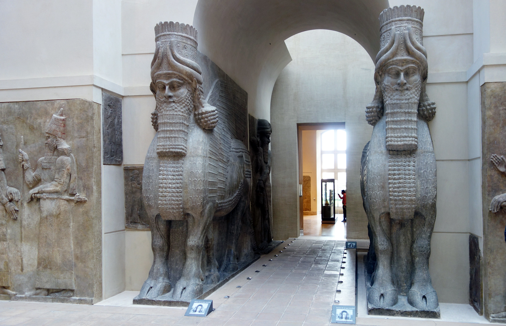
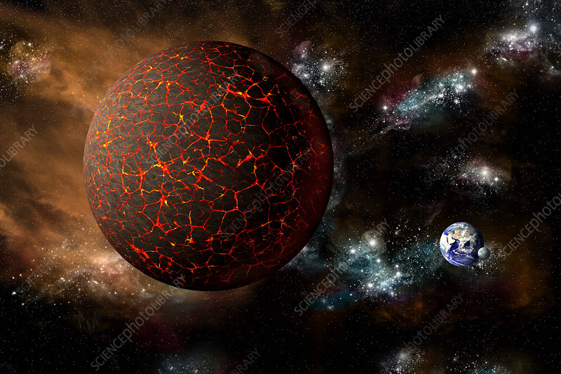
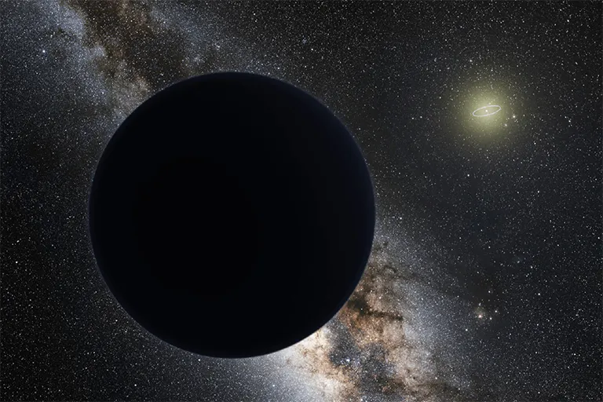
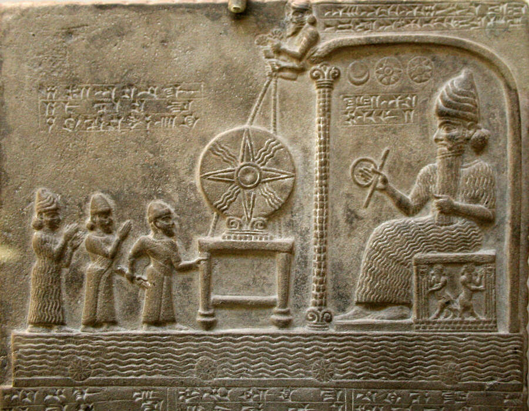

> Nếu những phiến đá Sumer không chỉ là thần thoại, mà là ký ức bị mã hóa của một nền văn minh từng biết nhiều hơn chúng ta tưởng, thì câu hỏi về nguồn gốc loài người sẽ không còn nằm gọn trong sách giáo khoa.

### Nền văn minh đầu tiên và sự im lặng của lịch sử

Bạn đã bao giờ tự hỏi tại sao trường học lại dạy rất ít, hoặc gần như không dạy gì về nền văn minh tiên tiến đầu tiên của thế giới?

Đặc biệt là khi họ đã giới thiệu cho chúng ta quá nhiều thứ mà chúng ta vẫn sử dụng ngày nay.

Bí ẩn này liên quan đến vị trí của họ tại Lưỡng Hà, Mesopotamia, nay là Iraq.

Nền văn minh Sumer đã để lại cho nhân loại lịch hiện đại dựa trên chu kỳ mặt trăng, hệ thống đếm cơ số 60 dùng trong hình học và đo thời gian, bánh xe, lưỡi cày, hệ thống thủy lợi, thuyền buồm, và quan trọng nhất là bằng chứng về chữ viết đầu tiên được ghi lại.

Vậy tại sao chúng ta không nói nhiều hơn về họ?

Nếu kết nối các dữ kiện, bạn sẽ thấy sự bỏ sót này có thể là cố ý.

Người Sumer đã cực kỳ chính xác trong việc tạo ra các hệ thống tiên tiến, nhưng giới khoa học chính thống thường gạt bỏ lịch sử của họ như một loại "thần thoại".

Nếu chúng ta dành cho các ghi chép của họ sự tin tưởng tương tự như các phát minh của họ, chúng ta sẽ phải dạy một phiên bản hoàn toàn khác về nguồn gốc loài người.

### Những phiến đá thay đổi thế giới quan

Vào năm 1851, nhà khảo cổ học Jules Oppert đã phát hiện ra 14 phiến đá bằng tiếng Sumer.

Đây là những văn bản cổ nhất được biết đến, có niên đại từ thế kỷ 24 trước Công nguyên.

Trong khi chia sẻ nhiều điểm chung với các tôn giáo khác, các phiến đá này đưa ra một góc nhìn hoàn toàn mới: những "đấng sáng tạo" trong sách Sáng Thế, Vườn Địa Đàng, hay Adam và Eva thực chất là những vị thần đa thần, những sinh vật đến từ thế giới khác, hay đơn giản là người ngoài hành tinh.

Các phiến đá giải thích rằng loài người không tiến hóa ngẫu nhiên mà là kết quả của sự thao túng di truyền bởi các sinh vật gọi là Anunnaki, nghĩa là "những kẻ từ trời xuống đất".

### Hành tinh Nibiru và nhiệm vụ khai thác vàng

Theo các phiến đá Sumer, cách đây 445.000 năm, các Anunnaki đã đến Trái Đất.

Họ cư ngụ trên một hành tinh xa xôi tên là Nibiru, hành tinh này đi vào hệ mặt trời của chúng ta mỗi 3.600 năm.

Nibiru được mô tả là rất lớn, giàu oxit sắt khiến sông ngòi của nó có màu đỏ.

Khi bầu khí quyển của Nibiru bắt đầu suy thoái, họ cần một yếu tố quan trọng để phục hồi: vàng.

Ngày nay, khoa học cũng thừa nhận các hạt nano vàng có thể dùng để sửa chữa tầng ozone và bảo vệ khỏi bức xạ.

Các Anunnaki đã thành lập thành phố khai thác mỏ đầu tiên mang tên Eridu ở vùng Vịnh Ba Tư.

### Sự phản loạn của Igigi và việc tạo ra Adamo

Ban đầu, các Anunnaki đưa theo một chủng tộc ngoài hành tinh khác gọi là Igigi để làm nô lệ khai thác vàng.

Tuy nhiên, sau nhiều thế kỷ làm việc khổ sai, các Igigi đã nổi loạn.

Để giải quyết vấn đề thiếu hụt nhân công, Anu, người cai trị Nibiru, đã ra lệnh cho con trai mình là Enki sử dụng kỹ thuật di truyền để tạo ra một chủng tộc nô lệ mới: thông minh hơn nhưng vẫn phải phục tùng.

Kết quả của những thí nghiệm này là một sinh vật lai: Homo sapiens, con người đầu tiên.

Các phiến đá gọi người đầu tiên là "Adamo", trong tiếng Do Thái có nghĩa là "người".

Mục đích chính của con người lúc đó là phục vụ các vị thần sáng tạo.

### Vườn Địa Đàng và Trận đại hồng thủy

Vì loài người sinh sản quá nhanh dẫn đến quá tải, nhiều người đã bị đuổi khỏi các thành phố an toàn của họ. Đây chính là nguồn gốc của câu chuyện "Vườn Địa Đàng".

Các thủ lĩnh Anunnaki thậm chí đã ăn nằm với phụ nữ loài người, tạo ra giống dân lai khổng lồ gọi là Nephilim.

Trong một chu kỳ 3.600 năm của Nibiru, hành tinh này đi ngang qua Trái Đất gây ra những biến động khủng khiếp: từ trường yếu đi, nhiệt độ tăng và băng tan.

Enlil, một thủ lĩnh Anunnaki, đã coi đây là cơ hội để xóa sổ loài người mà ông cho là không xứng đáng.

Tuy nhiên, Enki vì lòng trắc ẩn đã bí mật hướng dẫn Ziusudra, được biết đến là Noé hoặc Noah, đóng thuyền để bảo tồn sự sống.

Sau trận lụt, các Anunnaki đã chịu trách nhiệm tái thiết và xây dựng các công trình như Kim tự tháp theo vị trí của các vì sao để làm cột mốc dẫn đường.

Trước khi rời khỏi Trái Đất, họ đã thiết lập các triều đại quân chủ, nơi các vị vua đóng vai trò là sứ giả của Anunnaki, cai trị theo các nguyên tắc cổ xưa.

Những dòng máu hoàng tộc này được cho là đã bị thao túng di truyền để duy trì quyền kiểm soát loài người cho đến tận ngày nay.

Nếu coi toàn bộ câu chuyện này chỉ là thần thoại, nó vẫn là một thần thoại kỳ lạ: quá chi tiết, quá nhất quán và quá gần với nhiều câu hỏi chưa được giải đáp về sự xuất hiện đột ngột của trí tuệ, văn minh và quyền lực trên Trái Đất.
