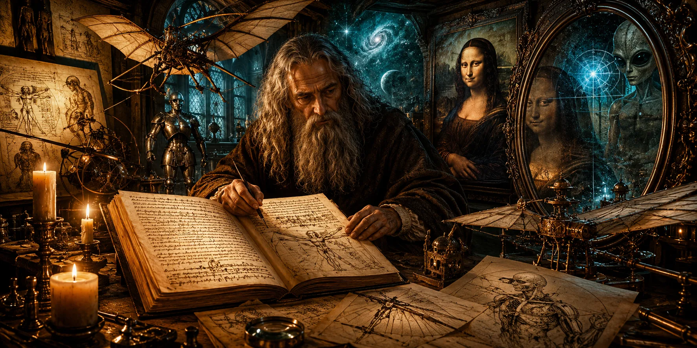
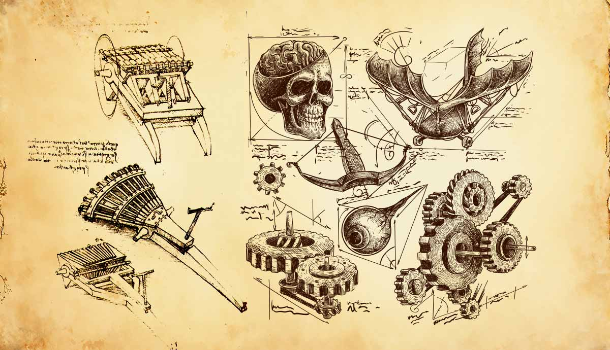
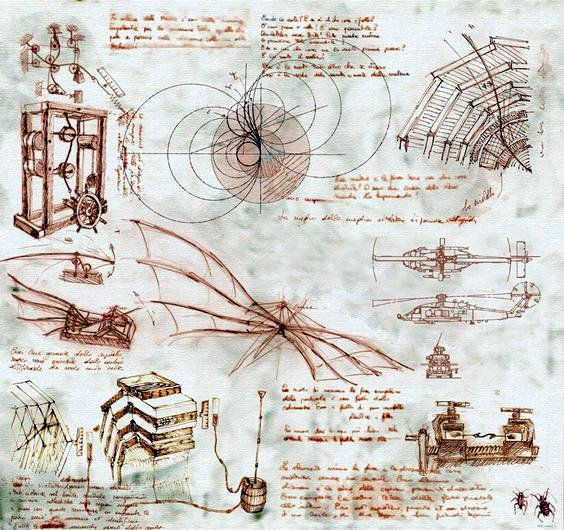
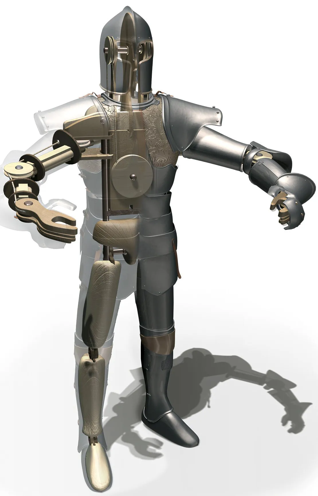
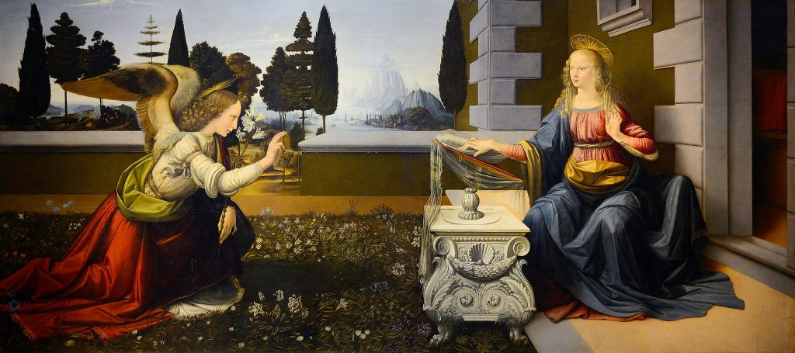
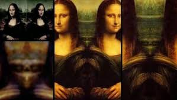
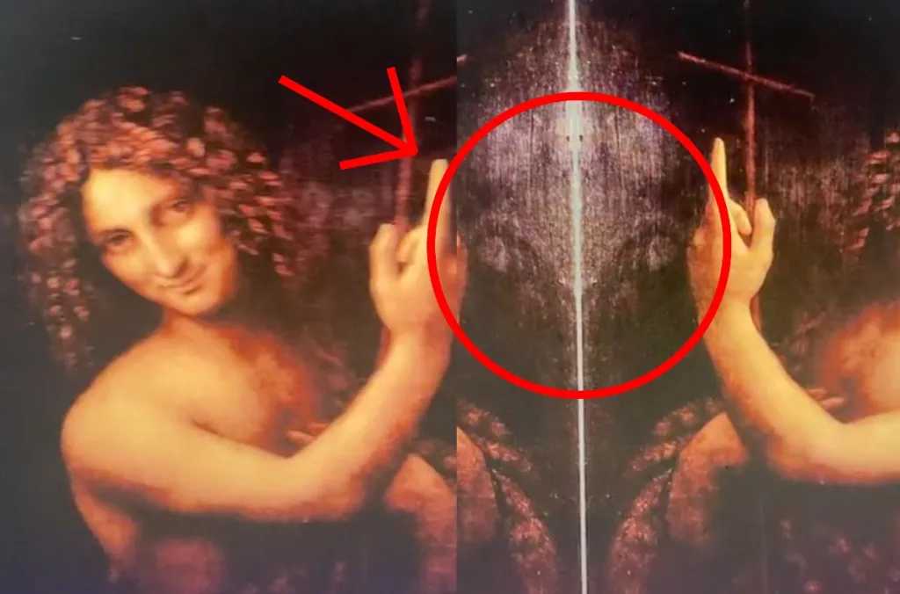
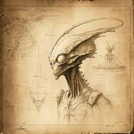
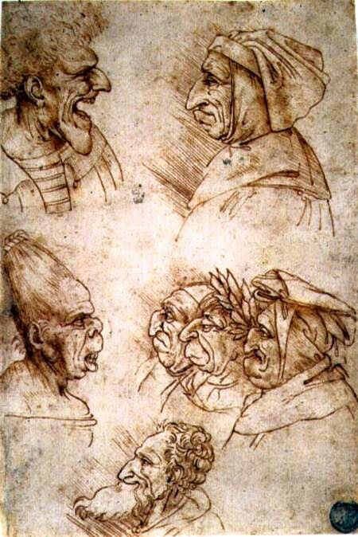

> Có những thiên tài khiến lịch sử khâm phục. Nhưng cũng có những thiên tài khiến lịch sử bối rối, vì năng lực của họ dường như không chỉ vượt trước thời đại, mà còn vượt khỏi chính khuôn khổ hiểu biết của thời đại đó.

### Thiên tài hay người được khai mở?

Leonardo da Vinci được xem là một trong những bộ óc vĩ đại nhất lịch sử nhân loại.

Ông không chỉ là họa sĩ.

Ông là nhà điêu khắc, nhạc sĩ, kiến trúc sư, kỹ sư, nhà phát minh, nhà giải phẫu học, nhà bản đồ học, nhà quan sát tự nhiên và một trong những biểu tượng lớn nhất của thời Phục hưng.

Ở Leonardo, nghệ thuật và khoa học không tách rời nhau.

Đường nét của cơ thể người dẫn đến giải phẫu.

Chuyển động của cánh chim dẫn đến máy bay.

Dòng nước dẫn đến thủy lực.

Ánh sáng dẫn đến quang học.

Khuôn mặt người dẫn đến tâm lý, biểu tượng và bí mật của nhận thức.

Theo cách nhìn chính thống, Leonardo là kết quả hiếm hoi của một trí tuệ phi thường, môi trường Phục hưng, sự tò mò vô hạn và khả năng quan sát vượt trội.

Đó là cách giải thích hợp lý.

Nhưng với *Te lo ocultaron*, câu hỏi không dừng lại ở đó.

Nếu một người xuất hiện trong lịch sử với khả năng quá rộng, quá sâu và quá sớm so với thời đại, liệu có thể tồn tại một nguồn tri thức khác đứng sau?

Không nhất thiết phải hiểu "nguồn tri thức khác" theo nghĩa đơn giản là người ngoài hành tinh đưa cho ông bản vẽ.

Nó có thể là một dòng truyền thừa bị che giấu.

Một lớp kiến thức cổ đại được phục hồi.

Một trải nghiệm bí ẩn làm thay đổi nhận thức.

Hoặc trong cách diễn giải táo bạo nhất: một hình thức tiếp xúc với các trí tuệ không thuộc về thế giới thông thường.

Điều khiến Leonardo trở thành đối tượng hoàn hảo của các giả thuyết này là ông không chỉ tạo ra nghệ thuật đẹp.

Ông để lại các bản vẽ, phát minh và ký hiệu như thể đang ghi chép lại một ngôn ngữ tương lai.

### Những phát minh đi trước thời đại

Một trong những điều gây kinh ngạc nhất ở Leonardo là số lượng ý tưởng kỹ thuật đi trước thời đại hàng trăm năm.

Ông phác thảo máy bay.

Ông nghiên cứu cơ chế bay của chim.

Ông vẽ các mô hình thiết bị thở dưới nước.

Ông tưởng tượng xe chiến đấu bọc thép.

Ông thiết kế cơ cấu truyền động, bánh răng, hệ thống cơ khí, cầu xoay, máy nâng, máy bơm và nhiều thiết bị mà thời của ông gần như không có điều kiện để hiện thực hóa đầy đủ.

Trong lịch sử kỹ thuật, có một kiểu thiên tài có thể cải tiến thứ đã tồn tại.

Leonardo thuộc kiểu khác: ông dường như nhìn thấy các nguyên lý trước khi xã hội có hạ tầng để dùng chúng.

Điều này đặt ra câu hỏi: ông đang phát minh từ quan sát tự nhiên, hay đang giải mã một tầng tri thức sâu hơn?

Trong nhiều bản thảo, Leonardo không chỉ vẽ máy móc như vật thể.

Ông vẽ chúng như cơ thể sống.

Các bánh răng, dây kéo, khớp nối, lực căng và trục xoay được tổ chức như hệ cơ xương nhân tạo.

Ông nhìn cơ khí bằng con mắt của nhà giải phẫu.

Ông nhìn cơ thể bằng con mắt của kỹ sư.

Và chính sự giao thoa ấy khiến các bản vẽ của ông có cảm giác kỳ lạ: không hoàn toàn là máy móc, cũng không hoàn toàn là sinh học.

Nó giống như một thứ công nghệ đang đứng giữa cơ thể và thiết bị.

### Giấc mơ bay và ký ức bầu trời

Trong thời đại của Leonardo, con người chưa có máy bay, chưa có động cơ hiện đại, chưa có khí động học theo nghĩa khoa học phát triển.

Nhưng Leonardo bị ám ảnh bởi bay.

Ông quan sát chim, cánh dơi, dòng khí, lực nâng và chuyển động của cơ thể trong không gian.

Các bản vẽ máy bay của ông không phải đồ chơi tưởng tượng đơn giản.

Chúng thể hiện một cố gắng nghiêm túc nhằm hiểu cách một vật thể nặng có thể rời mặt đất.

Trong mạch giả thuyết ngoài dòng chính, điều này thường được diễn giải như dấu hiệu của một ký ức hoặc sự gợi mở từ "bầu trời".

Tại sao một người sống trong thế kỷ XV lại bị cuốn hút mạnh như vậy bởi các cơ chế bay?

Tại sao ông có thể hình dung những nguyên lý mà nhân loại phải mất nhiều thế kỷ nữa mới thực sự biến thành công nghệ?

Tất nhiên, câu trả lời chính thống vẫn rất mạnh: Leonardo là người quan sát tự nhiên xuất chúng. Ông nhìn chim bay và cố gắng mô phỏng cơ chế đó.

Nhưng câu trả lời ấy không làm mất đi sự kỳ bí.

Vì giữa quan sát chim và vẽ ra các cấu trúc máy bay, vẫn có một bước nhảy tưởng tượng rất lớn.

Một bước nhảy mà rất ít người cùng thời có thể thực hiện.

Đối với *Te lo ocultaron*, các bản vẽ bay của Leonardo không chỉ là ước mơ kỹ thuật.

Chúng là biểu tượng của một trí tuệ luôn hướng lên trời, như thể ông biết rằng nguồn gốc của nhiều câu trả lời không nằm dưới đất.

### Robot thời Phục hưng

Một trong những khía cạnh ít được công chúng phổ thông chú ý là Leonardo từng thiết kế các mô hình cơ khí hình người.

Robot hiệp sĩ của Leonardo, thường được gọi là *Leonardo's robot* hoặc *mechanical knight*, là một ví dụ nổi bật.

Nó được cho là có thể ngồi, đứng, cử động tay, cổ và hàm thông qua hệ thống dây cáp, ròng rọc và bánh răng.

Với thời đại ngày nay, robot hình người đã trở thành một lĩnh vực công nghệ quen thuộc.

Nhưng đặt ý tưởng này vào thời Phục hưng, nó trở nên đáng kinh ngạc.

Leonardo không chỉ quan tâm đến việc máy móc chuyển động.

Ông quan tâm đến việc máy móc mô phỏng cơ thể sống.

Muốn làm điều đó, ông phải hiểu cơ bắp, khớp xương, tỉ lệ thân thể, chuyển động học và cách lực truyền qua cấu trúc.

Đây là tư duy hệ thống rất hiện đại.

Trong các diễn giải ngoài dòng chính, robot của Leonardo được xem như dấu hiệu ông tiếp cận một loại tri thức về sinh học cơ khí vượt xa thời đại.

Không cần khẳng định rằng ông được trao bản thiết kế từ một nền văn minh khác.

Chỉ cần nhìn nhận rằng ông đang đặt ra những câu hỏi mà nhân loại hiện đại vẫn đang theo đuổi: làm thế nào để tái tạo chuyển động sống bằng vật liệu nhân tạo?

Làm thế nào để máy móc mô phỏng cơ thể?

Và liệu cơ thể sinh học có phải cũng là một dạng máy móc tinh vi hơn nhiều so với ta tưởng?

### Hai năm mất tích bí ẩn

Một chi tiết thường được nhắc đến trong các giả thuyết về Leonardo là khoảng thời gian 1476 đến 1478.

Theo một số diễn giải, đây là giai đoạn có rất ít dấu vết rõ ràng về hoạt động của ông.

Leonardo gần như biến mất khỏi các hồ sơ quen thuộc, rồi sau đó trở lại với một năng lực sáng tạo ngày càng vượt trội.

Trong lịch sử chính thống, các khoảng trống tư liệu không phải điều quá hiếm.

Hồ sơ thất lạc, đời sống cá nhân ít được ghi chép hoặc nhân vật chưa đạt đến đỉnh cao danh tiếng đều có thể tạo ra những vùng im lặng.

Nhưng với Leonardo, vùng im lặng ấy trở thành nhiên liệu cho giả thuyết.

Ông đã đi đâu?

Ông gặp ai?

Ông học điều gì?

Ông có trải nghiệm nào làm thay đổi nhận thức?

Trong mạch ngoài dòng chính, hai năm này đôi khi được xem như giai đoạn "huấn luyện" hoặc "khai mở".

Một khoảng thời gian mà Leonardo có thể đã tiếp xúc với một nguồn tri thức đặc biệt, rồi trở lại với tầm nhìn mới về cơ thể, máy móc, thiên nhiên và cấu trúc của thực tại.

Không có bằng chứng chắc chắn để khẳng định điều đó.

Nhưng sự tồn tại của khoảng trống vẫn khiến câu chuyện Leonardo thêm bí ẩn.

Lịch sử đôi khi không chỉ được tạo nên bởi những gì ghi lại.

Nó cũng được tạo nên bởi những gì im lặng.

### Bức Truyền tin và lớp ẩn dưới tia X

Một ví dụ thường được nhắc đến trong nội dung gốc là bức *The Annunciation* - *Truyền tin*.

Theo cách kể ngoài dòng chính, khi bức tranh được phân tích bằng tia X, hình ảnh thiên sứ do Leonardo thực hiện có những đặc điểm bất thường so với các phần còn lại, như thể ông đã sử dụng chất liệu hoặc kỹ thuật khác thường.

Các nghiên cứu kỹ thuật về tranh cổ cho thấy phân tích tia X, hồng ngoại và các phương pháp quang phổ có thể hé lộ nhiều lớp sửa đổi, phác thảo, chất liệu, bố cục ban đầu và khác biệt giữa các bàn tay họa sĩ.

Điều này hoàn toàn có thật trong ngành bảo tồn nghệ thuật.

Nhưng từ đó đi đến kết luận rằng Leonardo dùng công nghệ "không thuộc thời đại" là một bước suy luận lớn.

Điểm thú vị nằm ở chỗ: ngay cả khi không cần nhảy đến kết luận ngoài hành tinh, kỹ thuật của Leonardo vẫn rất khác biệt.

Ông hiểu ánh sáng.

Ông hiểu chiều sâu.

Ông hiểu giải phẫu.

Ông hiểu cách làm cho hình ảnh có vẻ sống.

Ông làm việc với lớp màu, chuyển sắc và không khí bằng một cảm thức vượt xa nhiều họa sĩ cùng thời.

Đó là lý do các tác phẩm của ông luôn tạo cảm giác có một lớp ẩn.

Không chỉ lớp sơn.

Mà là lớp ý thức bên dưới hình ảnh.

### Kỹ thuật đối gương

Leonardo nổi tiếng với thói quen viết ngược, tức *mirror writing*.

Nhiều trang ghi chép của ông chỉ có thể đọc dễ dàng khi soi qua gương.

Cách giải thích phổ biến là ông thuận tay trái, việc viết ngược giúp tránh lem mực hoặc thuận tiện hơn cho chuyển động bàn tay.

Một số người khác cho rằng đây là cách ông che giấu ghi chép khỏi người đọc bình thường.

Trong mạch giả thuyết, câu hỏi tiếp theo được đặt ra: nếu Leonardo dùng đối gương trong chữ viết, liệu ông có dùng nguyên lý tương tự trong hình ảnh?

Khi các tác phẩm như *Mona Lisa*, *The Virgin and Child with Saint Anne* hoặc *Virgin of the Rocks* được xử lý bằng kỹ thuật đối xứng gương hiện đại, một số người cho rằng họ nhìn thấy các hình dạng giống khuôn mặt sinh vật lạ, đầu người ngoài hành tinh hoặc các thực thể kỳ dị ẩn trong bố cục.

Ở đây cần rất thận trọng.

Bộ não con người có xu hướng nhận diện khuôn mặt trong các hình ảnh ngẫu nhiên. Hiện tượng này gọi là *pareidolia*.

Ta có thể thấy khuôn mặt trong mây, đá, vân gỗ, khói hoặc các hình đối xứng.

Vì vậy, không thể chỉ dựa vào một hình dạng lạ sau khi đối gương để kết luận rằng Leonardo cố ý vẽ người ngoài hành tinh.

Nhưng điều đó không làm mất đi sự hấp dẫn của câu hỏi.

Leonardo là bậc thầy của bố cục, ánh sáng, biểu tượng và những lớp nghĩa ẩn.

Nếu có một họa sĩ đủ khả năng cài thông điệp vào hình ảnh mà người xem nhiều thế kỷ sau mới phát hiện, đó có thể là Leonardo.

### Những khuôn mặt không thuộc về người

Khi nói về hình ảnh đối gương trong tranh Leonardo, người ta thường tập trung vào các vùng giao nhau giữa bóng tối, nếp vải, bàn tay, tóc, nền đá và các đường chuyển sắc mềm.

Ở đó, khi phản chiếu và ghép lại, các hình dạng lạ xuất hiện.

Có người nhìn thấy mặt nạ.

Có người nhìn thấy sinh vật hình người.

Có người nhìn thấy khuôn mặt giống mô tả phổ biến về người ngoài hành tinh: đầu lớn, mắt sâu, cằm nhỏ, cổ hẹp.

Trong các tác phẩm tôn giáo, điều này càng gây tranh cãi.

Nếu một hình ảnh lạ xuất hiện trong bức tranh về Đức Mẹ, hài nhi, thiên sứ hoặc thánh nhân, nó dễ bị diễn giải như dấu hiệu của một tầng thông điệp bí truyền.

Có thể đó chỉ là hiệu ứng thị giác.

Có thể đó là trò chơi bố cục.

Có thể đó là kết quả của tâm trí hiện đại áp đặt hình ảnh người ngoài hành tinh lên tranh cổ.

Nhưng cũng có thể Leonardo cố ý để lại các lớp hình ảnh mở, nơi người xem ở các thời đại khác nhau sẽ thấy những thứ khác nhau.

Đó là điểm mạnh của nghệ thuật biểu tượng.

Nó không đóng lại ý nghĩa.

Nó biến người xem thành người giải mã.

Với *Te lo ocultaron*, điều đáng chú ý không phải là chứng minh bằng mọi giá rằng tranh Leonardo có người ngoài hành tinh.

Điều đáng chú ý là các tác phẩm ấy vẫn đủ bí ẩn để khiến chúng ta phải hỏi: Leonardo thật sự đang vẽ điều gì?

### Hang động trong rừng

Leonardo hầu như không để lại một nhật ký cá nhân đầy đủ về đời sống nội tâm của mình.

Nhưng có một đoạn ghi chép nổi tiếng về trải nghiệm khi ông tìm thấy một hang động.

Ông mô tả cảm giác bị kéo giữa hai lực: sợ hãi và khao khát.

Sợ bóng tối bên trong hang.

Nhưng cũng khao khát biết điều gì ẩn ở đó.

Đây là hình ảnh rất Leonardo.

Đứng trước bí ẩn, ông không quay đi.

Ông sợ, nhưng vẫn muốn biết.

Trong các diễn giải ngoài dòng chính, hang động này đôi khi được xem như một khoảnh khắc khai mở.

Leonardo đã thấy gì?

Một cấu trúc cổ?

Một hiện vật?

Một trải nghiệm tâm linh?

Một sinh vật?

Hay chỉ đơn giản là sự đối diện với bóng tối của tự nhiên, đủ mạnh để đánh thức trong ông cảm giác về những tầng thực tại ẩn sâu?

Sau những trải nghiệm như vậy, việc Leonardo phác thảo các khuôn mặt kỳ dị, các đầu người méo mó, các hình nhân kỳ lạ và các dạng sinh học khác thường càng khiến giả thuyết trở nên hấp dẫn.

Những phác thảo đó có thể chỉ là nghiên cứu biểu cảm, dị tật, tuổi tác và cấu trúc khuôn mặt.

Nhưng trong mắt người đọc ngoài dòng chính, chúng giống như bản ghi chép về các dạng sống không hoàn toàn thuộc về loài người.

### Những gương mặt kỳ dị

Leonardo có nhiều phác thảo đầu người với hình dạng phóng đại: mũi lớn, cằm nhô, sọ biến dạng, mắt sâu, nét mặt dị thường.

Trong nghệ thuật, đây có thể là nghiên cứu về tính cách, tuổi tác, bệnh lý, sự xấu xí, hài hước và sự đa dạng của khuôn mặt người.

Nhưng nhìn từ góc độ biểu tượng, các gương mặt ấy cũng giống như một cuộc khảo sát ranh giới của hình người.

Đâu là con người?

Đâu là biến dạng?

Đâu là sinh vật khác?

Và liệu hình dạng bên ngoài có phản ánh một tầng bản chất bên trong?

Leonardo bị ám ảnh bởi cơ thể vì ông hiểu rằng cơ thể là cánh cửa vào bí mật của sự sống.

Nhưng ông cũng bị ám ảnh bởi biến thể của cơ thể, bởi những gì nằm ngoài tỉ lệ hài hòa thông thường.

Trong mạch giả thuyết, điều này khiến ông giống một người đã thấy nhiều dạng sống hơn những gì xã hội của ông chấp nhận.

Không nhất thiết theo nghĩa ông gặp người ngoài hành tinh.

Có thể ông đã hiểu rằng hình người chỉ là một mô hình trong số nhiều mô hình mà sự sống có thể mang.

Và một khi ý nghĩ ấy xuất hiện, nghệ thuật không còn chỉ là tái hiện con người.

Nó trở thành cách thăm dò các khả năng của sự sống.

### Da Vinci để lại điều gì?

Không cần biến Leonardo da Vinci thành một nhân vật được người ngoài hành tinh điều khiển để thấy ông là một bí ẩn.

Bản thân ông đã là bí ẩn.

Một con người sống trong thời Phục hưng nhưng nghĩ như kỹ sư tương lai.

Một họa sĩ nhưng mổ xẻ cơ thể như nhà khoa học.

Một nhà phát minh nhưng quan sát thiên nhiên như nhà huyền học.

Một người viết ngược, vẽ nhiều lớp, thiết kế máy bay, robot, thiết bị lặn, cơ cấu chiến tranh và những hình ảnh vẫn còn khiến hậu thế tranh luận.

Có thể Leonardo chỉ là thiên tài hiếm có của nhân loại.

Có thể ông đã tiếp cận những dòng tri thức cổ bị thất truyền.

Có thể ông có những trải nghiệm làm thay đổi triệt để nhận thức.

Và cũng có thể, như các giả thuyết táo bạo nhất, ông từng chạm đến một nguồn hiểu biết không hoàn toàn thuộc về nền văn minh đương thời.

Điều quan trọng không phải là chọn ngay một đáp án.

Điều quan trọng là nhận ra một sự thật: lịch sử thường làm phẳng những con người quá lớn.

Nó biến họ thành tượng đài, rồi cắt bỏ các phần kỳ lạ, khó hiểu, gây bất tiện.

Nhưng chính các phần kỳ lạ ấy mới khiến họ sống.

Leonardo không chỉ để lại tranh.

Ông để lại câu hỏi.

Và mỗi lần chúng ta soi gương vào các tác phẩm của ông, có thể thứ hiện ra không chỉ là một khuôn mặt ẩn trong bố cục.

Có thể đó là chính câu hỏi mà ông muốn hậu thế đối diện: con người thật sự biết được bao nhiêu về nguồn gốc trí tuệ của mình?
