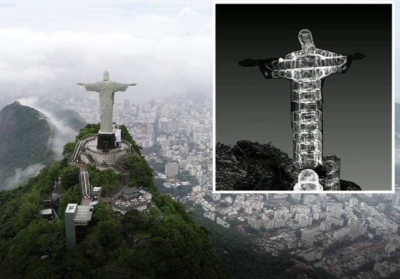
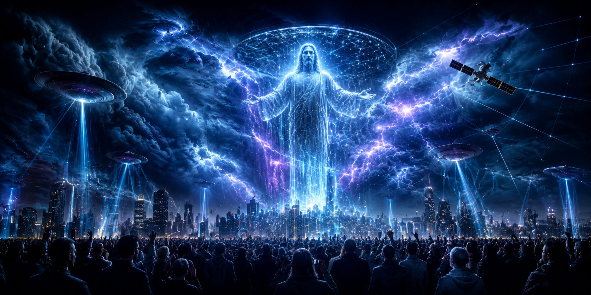
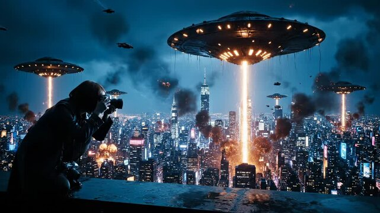

> Nếu đức tin là nơi sâu nhất trong tâm trí con người, thì một hệ thống muốn cai trị toàn cầu sẽ không chỉ kiểm soát tiền tệ, luật pháp hay truyền thông. Nó sẽ tìm cách chạm vào hình ảnh thiêng liêng nhất mà con người sẵn sàng quỳ xuống trước mặt.

### Một tôn giáo duy nhất

Trong các chương trước của *Te lo ocultaron*, Trật tự Thế giới Mới thường được mô tả qua một số trụ cột cốt lõi: một xã hội toàn cầu, một hệ thống tài chính chung, một trung tâm quyền lực duy nhất và một khuôn khổ niềm tin thống nhất.

Nếu con người còn khác biệt sâu sắc về tôn giáo, bản sắc, truyền thống và cách hiểu về linh hồn, việc gom toàn bộ nhân loại vào một mô hình quản trị duy nhất sẽ luôn gặp lực cản.

Chính vì vậy, trong nhiều diễn giải ngoài dòng chính, mục tiêu cuối cùng không chỉ là kiểm soát chính trị.

Nó là kiểm soát tâm linh.

Không phải bằng cách cấm mọi tôn giáo ngay lập tức, mà bằng cách tái cấu trúc niềm tin.

Khi một hệ thống có thể khiến con người tin rằng một quyền lực siêu nhiên mới đã xuất hiện, mọi phản kháng lý trí có thể bị vô hiệu hóa.

Vì con người có thể tranh luận với chính phủ.

Con người có thể nghi ngờ ngân hàng.

Con người có thể bất mãn với truyền thông.

Nhưng nếu họ tin rằng một thông điệp đến trực tiếp từ "Đấng cứu thế", từ "Chúa", từ "các vị thần" hoặc từ một nền văn minh ngoài Trái Đất cao hơn, họ có thể tự nguyện phục tùng.

Đó là cốt lõi của giả thuyết Project Blue Beam.

Dự án này không được xem như một công nghệ đơn lẻ.

Nó được mô tả như một kịch bản thao túng tâm lý quy mô toàn cầu, sử dụng công nghệ hình ảnh, âm thanh, truyền thông, khủng hoảng và niềm tin tôn giáo để tạo ra một cú sốc nhận thức lớn nhất trong lịch sử nhân loại.

Theo những người tin vào giả thuyết này, mục tiêu không phải là làm con người bỏ đức tin.

Mục tiêu là chiếm lấy đức tin.

Biến đức tin thành đường dẫn để thiết lập một trật tự mới.

### Blue Beam là gì?

Project Blue Beam, hay Dự án Tia Sáng Xanh, thường được gắn với tên tuổi của nhà báo người Canada Serge Monast.

Trong thập niên 1990, Monast công bố một giả thuyết gây chấn động: ông cho rằng NASA và các tổ chức quyền lực khác đang chuẩn bị một kế hoạch nhằm dàn dựng sự xuất hiện giả của một vị cứu thế toàn cầu.

Theo cách kể này, công nghệ hologram khổng lồ sẽ được dùng để chiếu các hình ảnh tôn giáo lên bầu trời.

Ở một khu vực, người dân có thể nhìn thấy hình tượng Chúa Giê-su.

Ở nơi khác, một cộng đồng khác có thể nhìn thấy vị thần phù hợp với truyền thống của họ.

Sau đó, các hình tượng ấy sẽ dần hợp nhất thành một "Đấng cứu thế duy nhất", tuyên bố sự ra đời của một trật tự tôn giáo toàn cầu.

Điểm đáng sợ của kịch bản không chỉ nằm ở hình ảnh.

Nó nằm ở sự kết hợp nhiều tầng.

Hình ảnh trên bầu trời.

Âm thanh phát ra từ không gian.

Thông điệp được truyền bằng nhiều ngôn ngữ.

Khủng hoảng thiên nhiên diễn ra cùng thời điểm.

Truyền thông toàn cầu đồng loạt diễn giải sự kiện.

Tâm lý sợ hãi, kinh ngạc và phục tùng lan truyền với tốc độ cực nhanh.

Nếu một sự kiện như vậy thật sự xảy ra, phần lớn con người sẽ khó có thời gian kiểm chứng.

Họ sẽ phản ứng trước.

Họ sẽ khóc, cầu nguyện, hoảng loạn, chia sẻ video, tìm lời giải thích, nghe chỉ thị từ các kênh truyền thông và nhìn xung quanh để xem số đông đang tin điều gì.

Trong khoảnh khắc ấy, ai kiểm soát câu chuyện sẽ kiểm soát thực tại.

Và nếu câu chuyện được đóng khung là "sự kiện thiêng liêng", mọi nghi ngờ có thể bị xem là báng bổ.

### Đức tin và cái bẫy tâm lý

Điểm then chốt của giả thuyết Blue Beam là niềm tin tôn giáo có thể bị lợi dụng nếu con người đánh mất khả năng phân biệt giữa trải nghiệm tâm linh thật và sự kiện được dàn dựng.

Tôn giáo, ở tầng sâu nhất, là nhu cầu kết nối với ý nghĩa, nguồn gốc, đạo đức và điều thiêng liêng.

Nó có thể giúp con người vượt qua đau khổ.

Nó có thể giữ gia đình và cộng đồng đứng vững.

Nó có thể nhắc con người rằng đời sống không chỉ là vật chất, tiền bạc và quyền lực.

Nhưng khi niềm tin biến thành sự mù quáng, nó cũng có thể trở thành điểm yếu lớn nhất.

Một người không còn đặt câu hỏi sẽ dễ bị dẫn dắt.

Một cộng đồng tin rằng mình đang nghe lệnh từ trời cao sẽ dễ bỏ qua kiểm chứng.

Một xã hội bị đặt vào trạng thái sợ hãi tôn giáo sẽ rất dễ chấp nhận các quyền lực khẩn cấp.

Đó là lý do Blue Beam, nếu được hiểu như một ẩn dụ, vẫn rất đáng suy ngẫm.

Nó cảnh báo rằng công nghệ không cần phá hủy tôn giáo.

Công nghệ có thể giả lập tôn giáo.

Nó có thể tạo ra hình ảnh thiêng liêng.

Nó có thể tạo ra âm thanh từ hư không.

Nó có thể dựng video, làm giả giọng nói, mô phỏng khuôn mặt, tạo nhân vật AI và khuếch đại cảm xúc bằng thuật toán.

Trong thời đại deepfake, thực tế tăng cường, màn hình khổng lồ, drone, laser và mô phỏng âm thanh không gian, câu hỏi không còn là "liệu con người có thể bị đánh lừa bởi hình ảnh hay không".

Câu hỏi đúng hơn là: khi hình ảnh đủ lớn, âm thanh đủ thật và khủng hoảng đủ mạnh, bao nhiêu người còn giữ được bình tĩnh để hỏi: ai đang dựng cảnh này?

### HAARP và bối cảnh khủng hoảng

Trong nội dung gốc, HAARP được xem như một mảnh ghép bổ trợ của Blue Beam.

Theo cách diễn giải ngoài dòng chính, nếu công nghệ có thể tác động lên khí quyển, thời tiết hoặc các hiện tượng điện từ, nó có thể tạo ra bối cảnh hoàn hảo cho một sự kiện "thần thánh" giả tạo.

Hãy tưởng tượng một thời điểm mà trên bầu trời xuất hiện hình ảnh khổng lồ.

Cùng lúc đó, mưa lớn bất thường, sấm sét, động đất, mất điện, tín hiệu nhiễu loạn hoặc các hiện tượng khí quyển kỳ lạ xảy ra.

Người dân đang hoảng loạn.

Truyền thông đang phát sóng trực tiếp.

Các mạng xã hội ngập trong video.

Các chuyên gia được mời lên giải thích.

Các nhà lãnh đạo kêu gọi bình tĩnh và đoàn kết.

Rồi một thông điệp xuất hiện: nhân loại phải thống nhất để vượt qua biến cố.

Với người tin vào Blue Beam, đó chính là công thức của kiểm soát tâm lý quy mô lớn: không chỉ cho người dân thấy một hình ảnh, mà đặt hình ảnh ấy vào giữa một cơn khủng hoảng có thật hoặc được khuếch đại.

Khủng hoảng khiến con người tìm nơi nương tựa.

Hình tượng thiêng liêng cung cấp nơi nương tựa đó.

Quyền lực đứng sau hình tượng đưa ra chỉ thị.

Và đám đông, trong trạng thái sợ hãi, có thể tự nguyện đi theo.

Điểm cần nhấn mạnh là không có bằng chứng công khai chắc chắn cho thấy một kế hoạch như vậy đang tồn tại theo đúng nghĩa đen.

Nhưng như một kịch bản tư duy, nó đặt ra một câu hỏi rất hiện đại: trong thế giới nơi công nghệ có thể làm giả gần như mọi thứ, con người sẽ bảo vệ đức tin và nhận thức của mình bằng cách nào?

### Serge Monast và lời cảnh báo

Serge Monast là nhân vật trung tâm trong câu chuyện Project Blue Beam.

Năm 1994, ông công bố những nội dung cáo buộc NASA, Liên Hợp Quốc và các lực lượng quyền lực đang chuẩn bị một tôn giáo thời đại mới để phục vụ Trật tự Thế giới Mới.

Những tuyên bố của ông nhanh chóng lan truyền trong các cộng đồng nghiên cứu ngoài dòng chính.

Hai năm sau, Monast qua đời vì một cơn đau tim.

Những người hoài nghi xem đây là một cái chết tự nhiên bị giới âm mưu diễn giải quá mức.

Những người tin vào ông cho rằng cái chết này quá đúng thời điểm, nhất là khi ông từng bị bắt giữ một thời gian ngắn trước đó.

Sự thật cụ thể về cái chết của Monast vẫn là một chủ đề tranh cãi.

Nhưng di sản của ông không chỉ nằm ở việc ông đúng hay sai từng chi tiết.

Di sản ấy nằm ở cảnh báo: các hệ thống quyền lực có thể dùng công nghệ để tạo ra trải nghiệm tôn giáo nhân tạo.

Ở thập niên 1990, điều đó nghe như khoa học viễn tưởng.

Ngày nay, nó không còn quá xa lạ.

Chúng ta đã sống trong thế giới của thực tế ảo, thực tế tăng cường, hình ảnh AI, giọng nói tổng hợp, video deepfake, chiến tranh thông tin, drone trình diễn, màn hình bầu trời và các chiến dịch thao túng tâm lý qua dữ liệu.

Điều Monast gọi là Blue Beam có thể không cần xảy ra theo đúng từng dòng ông mô tả.

Nhưng nguy cơ mà ông cảnh báo đang trở nên rất thực: khả năng sản xuất một "thực tại tập thể" bằng công nghệ.

### Bốn giai đoạn của Blue Beam

Theo Serge Monast, Project Blue Beam gồm bốn giai đoạn chính.

Giai đoạn đầu tiên là **xóa bỏ đức tin cũ**.

Trong kịch bản này, hệ thống sẽ sử dụng các biến cố địa chất, khảo cổ hoặc thiên tai để "phát hiện" ra những bằng chứng mới, từ đó làm lung lay các giáo lý tôn giáo truyền thống.

Những bằng chứng ấy có thể là thật, giả hoặc được diễn giải có chủ đích.

Mục tiêu là khiến các cộng đồng tôn giáo mất nền tảng cũ, trở nên bối rối và sẵn sàng chấp nhận một lời giải thích mới.

Giai đoạn thứ hai là **trình chiếu hình ảnh khổng lồ**.

Các hình tượng tôn giáo sẽ xuất hiện trên bầu trời, tương ứng với niềm tin của từng khu vực.

Sau đó, chúng hợp nhất thành một hình tượng chung, tuyên bố rằng mọi tôn giáo cũ đều chỉ là mảnh vỡ của một chân lý toàn cầu mới.

Giai đoạn thứ ba là **giao tiếp thần giao cách cảm điện tử**.

Theo giả thuyết, sóng tần số thấp hoặc công nghệ truyền tín hiệu trực tiếp vào hệ thần kinh có thể khiến con người tin rằng họ đang nghe một giọng nói thiêng liêng trong tâm trí.

Đây là phần gây tranh cãi nhất, vì nó liên quan đến công nghệ điều khiển nhận thức, vi mạch, công nghệ nano và các giả thuyết về tiêm chủng.

Không có bằng chứng đại chúng chắc chắn để xác nhận những cáo buộc ấy.

Nhưng sự tồn tại của nghiên cứu thần kinh, giao diện não - máy tính, kích thích điện từ và công nghệ thao túng chú ý khiến câu hỏi về quyền riêng tư tâm trí không còn là chuyện viễn tưởng hoàn toàn.

Giai đoạn thứ tư là **kịch bản tận thế giả**.

Một cuộc xâm lược ngoài hành tinh, một cuộc khải huyền nhân tạo hoặc một biến cố toàn cầu được dàn dựng có thể được dùng để buộc các quốc gia giao quyền cho một cơ chế quản trị chung.

Khi nỗi sợ đủ lớn, người dân có thể chấp nhận những điều họ từng từ chối: giám sát toàn diện, giải giáp, định danh bắt buộc, giới hạn di chuyển, tiền tệ tập trung và một quyền lực siêu quốc gia.

### Người ngoài hành tinh và lập trình dự báo

Một phần quan trọng trong giả thuyết Blue Beam là khái niệm "lập trình dự báo".

Theo cách hiểu này, phim ảnh, truyền hình, trò chơi điện tử và truyền thông đại chúng liên tục đưa vào tâm trí công chúng những hình ảnh về người ngoài hành tinh, tận thế, xâm lược, siêu anh hùng, cổng trời, thần linh ngoài không gian và các nền văn minh cao hơn.

Khi một ý tưởng được lặp lại đủ nhiều trong giải trí, nó trở nên quen thuộc.

Khi nó trở nên quen thuộc, con người ít phản kháng hơn nếu một phiên bản của nó xuất hiện ngoài đời thật.

Điều này không có nghĩa mọi bộ phim về UFO đều là tuyên truyền có chủ đích.

Nhưng truyền thông chắc chắn có khả năng định hình kho hình ảnh bên trong tâm trí tập thể.

Nếu một ngày bầu trời xuất hiện những hình ảnh kỳ lạ, đám đông sẽ không diễn giải chúng từ con số không.

Họ sẽ dùng những gì đã được thấy trong phim.

Họ sẽ nhớ đến các câu chuyện đã nghe.

Họ sẽ gắn sự kiện thật hoặc giả vào những mô hình quen thuộc đã được cài trong trí tưởng tượng.

Và đó chính là sức mạnh của lập trình dự báo: không bắt con người tin ngay lập tức, mà chuẩn bị cho họ một bộ khung để tin khi thời điểm đến.

Trong mạch này, Blue Beam không chỉ là một kế hoạch công nghệ.

Nó là một kế hoạch kể chuyện.

Ai kể được câu chuyện lớn nhất trong khoảnh khắc hỗn loạn, người đó có thể dẫn dắt đám đông.

### Cảnh báo cuối cùng

Kinh Thánh, trong Ma-thi-ơ 24, từng có lời cảnh báo về những kẻ mạo danh, những dấu lạ và những người tự xưng là Đấng Christ để lừa dối nhiều người.

Với người có đức tin, lời cảnh báo này mang ý nghĩa tâm linh rất rõ: không phải mọi hiện tượng kỳ lạ đều đến từ điều thiêng liêng.

Với người không theo tôn giáo, nó vẫn có giá trị như một nguyên tắc nhận thức: đừng để sự choáng ngợp thay thế khả năng phán đoán.

Thế giới đang bước vào thời đại mà hình ảnh có thể được làm giả.

Giọng nói có thể được làm giả.

Khuôn mặt có thể được làm giả.

Sự kiện có thể được dựng cảnh.

Đám đông có thể được điều hướng bằng thuật toán.

Và cảm xúc có thể bị khai thác nhanh hơn lý trí kịp phản ứng.

Vì vậy, nếu một ngày nhân loại chứng kiến một hiện tượng "vĩ đại" trên bầu trời, câu hỏi đầu tiên không nên là: tôi phải tin ai?

Câu hỏi đầu tiên nên là: ai đang yêu cầu tôi phục tùng?

Đức tin thật không cần bị điều khiển bằng màn hình khổng lồ.

Chân lý thật không cần đến chiến dịch truyền thông toàn cầu.

Và điều thiêng liêng thật sự, nếu tồn tại, sẽ không cần biến con người thành một đám đông hoảng loạn để được công nhận.

Trong một thời đại mà công nghệ có thể giả lập phép màu, tỉnh thức không phải là tin vào mọi lời cảnh báo.

Tỉnh thức là giữ được sự im lặng bên trong đủ lâu để không quỳ xuống trước một ảo ảnh.
