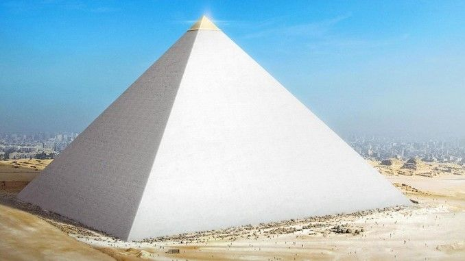
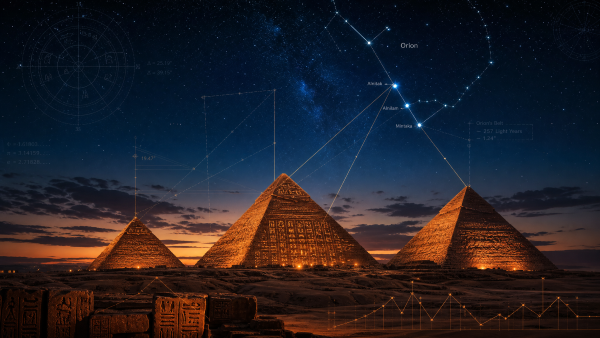
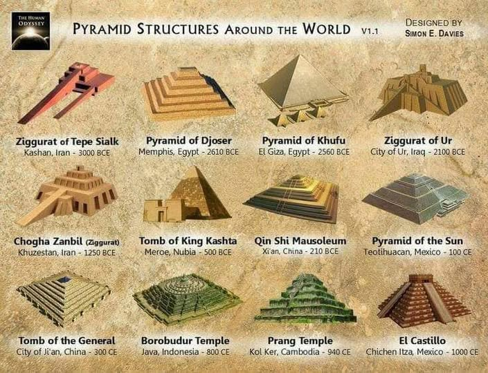
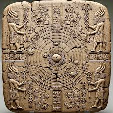

> Nếu một công trình cổ đại vượt quá những gì ta nghĩ tổ tiên có thể làm được, phản ứng dễ nhất là gọi nó là kỳ quan. Nhưng phản ứng khó hơn là đặt câu hỏi: liệu lịch sử đã kể đủ câu chuyện về những người đã xây nó hay chưa?

### Thách thức đối với kỹ thuật nhân loại

Lý thuyết cho rằng những sinh vật tiên tiến từ các hành tinh khác từng hỗ trợ xây dựng Đại kim tự tháp Giza không phải là điều mới.

Trong văn hóa đại chúng, nó thường bị xếp ngay vào nhóm "phi hành gia cổ đại", một nhánh giả thuyết gây tranh cãi nhưng vẫn tồn tại dai dẳng qua nhiều thập kỷ.

Lý do khiến giả thuyết ấy không biến mất rất đơn giản: Giza vẫn là một công trình quá khó giải thích bằng trực giác thông thường.

Ngay cả khi chấp nhận toàn bộ lời giải thích chính thống rằng người Ai Cập cổ đại đã xây dựng kim tự tháp bằng lao động tổ chức, kỹ năng kỹ thuật, dốc kéo, đòn bẩy, quy hoạch và tri thức thiên văn, quy mô của công trình vẫn khiến người hiện đại phải lặng đi.

Hàng triệu khối đá.

Khối lượng tổng thể hơn 6 triệu tấn.

Những khối granite nặng hàng chục tấn.

Các hành lang, phòng bên trong, trục thông khí, góc nghiêng, phương vị và độ chính xác hình học đáng kinh ngạc.

Điều khiến Giza trở thành một câu hỏi lớn không chỉ là kích thước.

Nếu chỉ lớn, nó có thể được giải thích bằng sức người và thời gian.

Điều làm nó khó hiểu là sự kết hợp giữa kích thước, độ chính xác, vị trí địa lý, liên hệ thiên văn và sự thiếu vắng những ghi chép trực tiếp về quá trình xây dựng.

Làm thế nào một nền văn minh cách chúng ta hàng nghìn năm có thể cắt, vận chuyển, nâng, đặt và căn chỉnh các khối đá với độ chính xác như vậy?

Họ dùng công nghệ nào?

Họ dùng hệ thống tổ chức nào?

Và quan trọng hơn: họ đã kế thừa tri thức ấy từ đâu?

### Bản đồ sao trong đá

Một trong những chi tiết khiến kim tự tháp Giza luôn được gắn với bầu trời là các liên hệ thiên văn.

Nhiều nhà nghiên cứu ngoài dòng chính cho rằng ba kim tự tháp chính tại Giza phản chiếu vị trí ba ngôi sao trong vành đai Orion.

Ngoài ra, các trục bên trong Đại kim tự tháp thường được diễn giải là có liên hệ với Sirius, Draco và một số vùng trời quan trọng trong tín ngưỡng Ai Cập cổ đại.

Theo cách hiểu chính thống, người Ai Cập cổ đại có hệ thống thiên văn, tôn giáo và nghi lễ rất phát triển. Bầu trời đêm không chỉ là cảnh quan tự nhiên, mà là bản đồ linh thiêng của thế giới bên kia, của các vị thần và hành trình của linh hồn.

Vì vậy, việc các công trình lớn được căn chỉnh theo thiên văn không phải điều quá bất thường.

Nhưng câu hỏi nằm ở độ chính xác và mục đích.

Nếu Giza chỉ là lăng mộ, tại sao nó lại mang quá nhiều dấu vết của một mô hình vũ trụ?

Nếu nó chỉ phục vụ một vị vua, tại sao cấu trúc lại có vẻ như được thiết kế cho một chức năng biểu tượng, năng lượng hoặc thiên văn rộng hơn rất nhiều?

Trong các giả thuyết ngoài dòng chính, kim tự tháp không đơn giản là nơi chôn cất.

Nó có thể là một thiết bị cộng hưởng.

Một bản đồ sao.

Một trạm năng lượng.

Một đài quan sát.

Một cột mốc của tri thức cổ đại.

Hoặc một cấu trúc được xây dựng để lưu giữ thông điệp vượt qua thời gian.

Điểm chung của các cách diễn giải này là chúng đều xem Giza không phải là công trình chết.

Nó là một hệ thống.

Một hệ thống bằng đá, nhưng được viết bằng toán học, thiên văn và biểu tượng.

### Niên đại và khoảng trống lịch sử

Theo lịch sử chính thống, Đại kim tự tháp Giza thường được gắn với Pharaoh Khufu và có niên đại khoảng hơn 4.000 năm.

Đây là cách hiểu được giảng dạy rộng rãi trong khảo cổ học và Ai Cập học.

Tuy nhiên, nhiều nhà nghiên cứu ngoài dòng chính đặt câu hỏi liệu công trình có thể cổ hơn nhiều hay không.

Một số tranh luận dựa trên điều kiện địa chất, dấu vết xói mòn, truyền thuyết về các nền văn minh tiền sử và sự tồn tại của các chu kỳ thiên văn dài.

Nếu một số cấu trúc tại Giza hoặc quanh cao nguyên Giza thật sự có nguồn gốc từ thời kỳ xa hơn, chẳng hạn gần thời điểm cuối Kỷ Băng hà, thì toàn bộ câu chuyện về lịch sử văn minh sẽ phải được viết lại.

Khi đó, Giza có thể không phải thành tựu đột ngột của Ai Cập cổ đại, mà là di sản của một nền văn minh trước đó.

Một nền văn minh đã biến mất.

Một nền văn minh để lại đá thay vì giấy.

Một nền văn minh có thể đã được người Ai Cập kế thừa, tái sử dụng, thần thoại hóa hoặc gán lại cho các triều đại của mình.

Điểm khiến giả thuyết này có sức hút là sự im lặng kỳ lạ của tư liệu.

Người Ai Cập để lại rất nhiều ghi chép về nghi lễ, vua chúa, chiến tranh, thương mại, tôn giáo và đời sống.

Nhưng không có một bản mô tả chi tiết, rõ ràng, đầy đủ về quá trình xây dựng Đại kim tự tháp theo quy mô mà công trình đòi hỏi.

Với một công trình lớn đến mức ấy, sự vắng mặt của câu chuyện xây dựng khiến nhiều người cảm thấy khó chấp nhận.

Hoặc hồ sơ đã mất.

Hoặc nó chưa từng thuộc về giai đoạn mà ta gán cho nó.

Hoặc người xây dựng thật sự không phải nhóm mà lịch sử chính thống đang gọi tên.

### Kim tự tháp trên toàn cầu

Một lý do khác khiến chủ đề Giza trở nên rộng hơn Ai Cập là hình dạng kim tự tháp xuất hiện ở nhiều nơi trên thế giới.

Ai Cập có Giza.

Mesoamerica có các kim tự tháp Maya và Aztec.

Trung Quốc có các gò mộ dạng kim tự tháp.

Sudan có kim tự tháp Nubia.

Indonesia, Bosnia, Peru và nhiều khu vực khác cũng thường được nhắc đến trong các tranh luận về công trình dạng kim tự tháp.

Theo quan điểm chính thống, hình dạng kim tự tháp xuất hiện lặp lại vì nó là giải pháp kiến trúc tự nhiên cho các công trình lớn.

Một đáy rộng, đỉnh hẹp, trọng lượng phân bổ ổn định và dễ xây dựng bằng vật liệu xếp chồng.

Cách giải thích này hợp lý ở tầng kỹ thuật.

Nhưng các giả thuyết ngoài dòng chính đặt câu hỏi khác: tại sao nhiều nền văn minh cách xa nhau lại gắn công trình dạng kim tự tháp với thiên văn, thần linh, nghi lễ, quyền lực và chuyển tiếp linh hồn?

Có phải đây chỉ là sự trùng hợp chức năng?

Hay có một ký ức chung cổ xưa hơn?

Một tri thức từng được phân tán sau một thảm họa toàn cầu?

Một mạng lưới công trình năng lượng?

Hoặc một mô hình kiến trúc được truyền lại từ những "người thầy" mà các nền văn minh cổ gọi bằng nhiều tên khác nhau: thần, bán thần, người từ trời xuống, người khổng lồ, tổ tiên sao trời?

Không cần vội chọn một câu trả lời.

Chỉ riêng việc mô-típ kim tự tháp xuất hiện rộng như vậy đã đủ để đặt ra câu hỏi về khả năng các nền văn minh cổ có liên hệ sâu hơn ta tưởng.

### Sự hoàn hảo khó sao chép

Những người hoài nghi cách giải thích chính thống thường nhấn mạnh đến độ chính xác của Đại kim tự tháp.

Theo nhiều tài liệu phổ biến, công trình có độ căn chỉnh cực kỳ gần với các hướng chính.

Các cạnh, góc, tỷ lệ và mặt phẳng thể hiện một trình độ đo đạc đáng nể.

Dù một số con số thường được trích dẫn trong cộng đồng ngoài dòng chính có thể bị phóng đại hoặc cần kiểm chứng lại, điều cốt lõi vẫn còn nguyên: đây là công trình đòi hỏi năng lực tổ chức và kỹ thuật phi thường.

Vấn đề không chỉ là cắt đá.

Vấn đề là cắt hàng triệu khối đá.

Không chỉ vận chuyển đá.

Mà vận chuyển các khối lớn trong điều kiện hạ tầng cổ đại.

Không chỉ xếp đá.

Mà xếp theo một hình học ổn định, chính xác và bền vững qua hàng thiên niên kỷ.

Nếu công trình được xây trong khoảng thời gian tương đối ngắn như một dự án hoàng gia, yêu cầu hậu cần sẽ khổng lồ.

Nếu kéo dài quá lâu, nó lại mâu thuẫn với mục tiêu phục vụ một vị vua cụ thể.

Câu hỏi vì vậy không chỉ là "người Ai Cập có thể xây hay không".

Câu hỏi sâu hơn là: ta đã hiểu đúng công nghệ, thời gian, mục đích và bối cảnh của công trình chưa?

Lịch sử đôi khi không sai vì thiếu dữ kiện.

Lịch sử sai vì dữ kiện bị đặt vào một khung diễn giải quá hẹp.

Nếu khung đã sai, càng thêm chi tiết vào khung ấy chỉ khiến bức tranh trông có vẻ đầy đủ hơn, nhưng không nhất thiết đúng hơn.

### Mật mã từ Sumer

Trong mạch *Te lo ocultaron*, câu chuyện Giza thường được nối với Sumer và Anunnaki.

Người Sumer, một trong những nền văn minh có chữ viết sớm nhất mà ta biết, để lại nhiều văn bản về các vị thần từ trời xuống, gọi là Anunnaki.

Theo cách hiểu chính thống, đây là thần thoại, tôn giáo và biểu tượng quyền lực của vùng Lưỡng Hà cổ đại.

Theo giả thuyết phi hành gia cổ đại, các câu chuyện ấy có thể là ký ức bị thần thoại hóa về những thực thể tiên tiến từng tiếp xúc với nhân loại.

Trong nội dung gốc của chương này, các văn bản Sumer được diễn giải như nguồn mô tả việc những thực thể này sử dụng "công cụ sức mạnh" để cắt, nâng và đặt các khối đá.

Một số nhân vật như Ningishzidda, về sau được liên hệ với Thoth trong truyền thống Ai Cập, được xem như cầu nối giữa tri thức Sumer và Ai Cập.

Đây là vùng tranh luận rất rộng.

Không thể coi mọi liên hệ biểu tượng là bằng chứng lịch sử trực tiếp.

Nhưng điều đáng chú ý là nhiều nền văn minh cổ đều kể về những nhân vật mang tri thức từ trời xuống: dạy con người đo đạc, viết chữ, xây dựng, canh tác, quan sát sao trời và tổ chức xã hội.

Nếu chỉ xem tất cả là thần thoại, ta có một cách đọc an toàn.

Nếu xem chúng như ký ức mã hóa của các cuộc tiếp xúc cổ đại, ta có một cách đọc táo bạo hơn.

Điều quan trọng là không đánh mất câu hỏi: vì sao các nền văn minh đầu tiên dường như đã có những bước nhảy tri thức quá lớn?

### Cydonia và khuôn mặt trên sao Hỏa

Năm 1976, tàu Viking 1 của NASA chụp được hình ảnh một cấu trúc ở vùng Cydonia trên sao Hỏa trông giống một khuôn mặt người.

Hình ảnh này nhanh chóng trở thành một trong những biểu tượng lớn nhất của các giả thuyết về sự sống cổ đại trên sao Hỏa.

Về sau, các ảnh có độ phân giải cao hơn cho thấy "khuôn mặt" có thể là một dạng địa hình tự nhiên bị ánh sáng và bóng đổ khiến trông giống mặt người.

Đây là cách giải thích chính thống.

Tuy nhiên, trong văn hóa ngoài dòng chính, Cydonia không chỉ có "khuôn mặt".

Khu vực này còn được nhắc đến với các cấu trúc dạng kim tự tháp, mô hình hình học và các liên hệ giả định với Giza.

Một số nhà nghiên cứu độc lập cho rằng nếu Giza và Cydonia có những tương đồng hình học hoặc tọa độ bất thường, ta cần đặt câu hỏi về khả năng tồn tại của một nền văn minh liên hành tinh cổ đại.

Theo giả thuyết ấy, kim tự tháp trên Trái Đất và các cấu trúc trên sao Hỏa có thể là một phần của mạng lưới công trình, cột mốc hoặc trạm năng lượng được xây bởi một nền văn minh từng hoạt động trong hệ Mặt Trời.

Đây là một giả thuyết rất xa khỏi đồng thuận khoa học.

Nhưng sức hấp dẫn của nó đến từ cảm giác rằng Giza không giống một công trình đơn độc.

Nó giống một mảnh ghép.

Một điểm neo trên bản đồ lớn hơn.

Một tín hiệu từ thời gian sâu.

Hoặc một lời nhắc rằng lịch sử nhân loại có thể không bắt đầu và kết thúc trong phạm vi mà sách giáo khoa đã vẽ.

### Công trình, thiết bị hay thông điệp?

Điều khiến Đại kim tự tháp Giza tiếp tục ám ảnh nhân loại là nó không chịu nằm yên trong một định nghĩa.

Nếu gọi nó là lăng mộ, vẫn còn quá nhiều câu hỏi.

Nếu gọi nó là đền thờ, vẫn chưa đủ.

Nếu gọi nó là đài thiên văn, nó lại quá đồ sộ.

Nếu gọi nó là thiết bị năng lượng, ta cần bằng chứng kỹ thuật mạnh hơn.

Nếu gọi nó là công trình ngoài hành tinh, ta bước vào vùng suy đoán chưa thể kiểm chứng.

Có lẽ cách tiếp cận tốt nhất là nhìn Giza như một lớp giao nhau của nhiều chức năng: chính trị, tôn giáo, thiên văn, toán học, biểu tượng và có thể cả những chức năng mà ta chưa hiểu.

Những công trình vĩ đại của cổ đại thường không chỉ có một nghĩa.

Chúng là sách đá.

Chúng là bản đồ.

Chúng là nghi lễ đóng băng.

Chúng là tuyên ngôn quyền lực.

Chúng là công cụ để nối đất với trời.

Và đôi khi, chúng là những câu hỏi được xây lớn đến mức hàng nghìn năm sau con người vẫn phải quay lại để hỏi tiếp.

Giza có thể không chứng minh rằng người ngoài hành tinh đã xây kim tự tháp.

Nhưng Giza chắc chắn chứng minh rằng chúng ta chưa hiểu hết quá khứ.

Và khi một công trình cổ đại vẫn khiến nền văn minh hiện đại bối rối, điều khiêm tốn nhất ta có thể làm không phải là vội vàng đóng hồ sơ.

Mà là tiếp tục đọc những viên đá như thể chúng vẫn đang nói.
