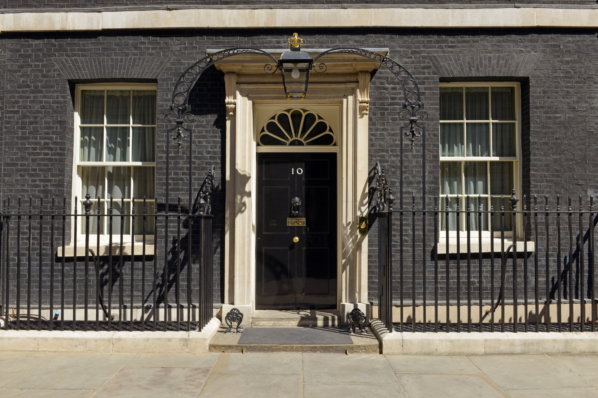
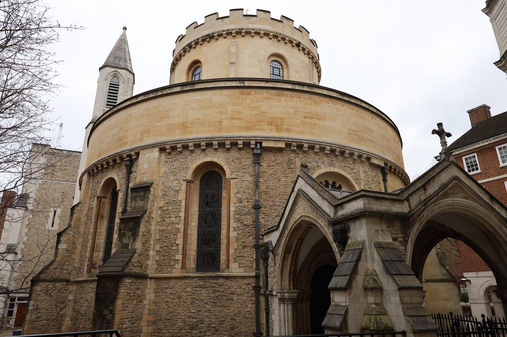
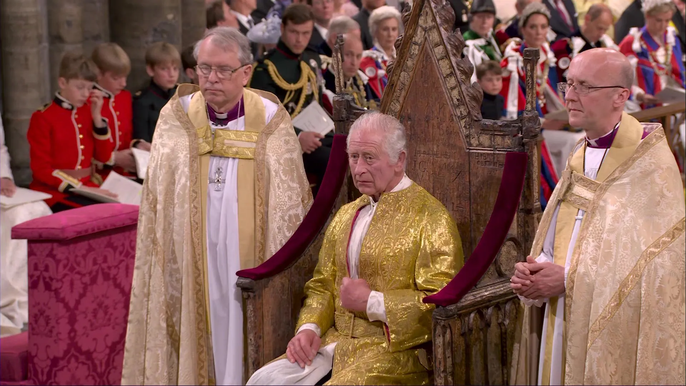

> Nếu quyền lực mạnh nhất không cần phải xuất hiện như một chính phủ, thì một chiếc vương miện có thể không chỉ là biểu tượng nghi lễ, mà là dấu hiệu của một cấu trúc pháp lý, tài chính và tinh thần sâu hơn nhiều.

### Biểu tượng hay quyền lực thực tế?

Thật mỉa mai khi cả thế giới từng bàn tán rất nhiều về Nữ hoàng Elizabeth II, nhưng rất ít người thực sự đặt câu hỏi về phạm vi quyền lực mà bà đại diện.

Truyền thông thường mô tả Hoàng gia Anh qua nghi lễ, lễ kỷ niệm, cung điện, thời trang, đời sống gia đình hoặc các kịch bản kế vị như *London Bridge*.

Trong khung nhìn ấy, nữ hoàng chỉ là một biểu tượng văn hóa.

Một gương mặt đại diện cho truyền thống, không can thiệp sâu vào chính trị hiện đại.

Nhưng trong các giả thuyết ngoài dòng chính, hình ảnh đó chỉ là lớp vỏ mềm bên ngoài một cấu trúc quyền lực lâu đời hơn nhiều.

Nữ hoàng, hay rộng hơn là *The Crown*, không đơn giản là một cá nhân ngồi trên ngai vàng.

Nó được xem như một thực thể pháp lý, tài chính và biểu tượng, vận hành xuyên qua nhiều thế hệ, nhiều quốc gia và nhiều hệ thống luật.

Nếu nhìn theo hướng này, câu hỏi không còn là "Hoàng gia còn quyền lực hay không".

Câu hỏi đúng hơn là: quyền lực ấy đã được chuyển hóa thành hình thức nào để công chúng không còn nhận ra nó?

### Thực phẩm và quyền kiểm soát giống loài

Một trong những luận điểm gây tranh cãi trong các diễn giải về quyền lực Hoàng gia là mối liên hệ giữa tài sản đầu tư, công nghệ sinh học và quyền kiểm soát thực phẩm.

Theo các nguồn ngoài dòng chính, Nữ hoàng từng được cho là có liên quan đến các khoản đầu tư trong Delta & Pine Land Company, công ty nổi tiếng với các công nghệ giống cây trồng gây tranh luận.

Công ty này từng gắn với khái niệm "hạt giống hủy diệt", tức các giống cây biến đổi khiến nông dân không thể tái sử dụng hạt giống theo cách truyền thống.

Sau đó, Delta & Pine Land được Monsanto mua lại với giá khoảng 1,5 tỷ USD.

Monsanto, trước khi bị Bayer thâu tóm, từ lâu đã là cái tên gây tranh cãi trong lĩnh vực hạt giống biến đổi gen, thuốc diệt cỏ và quyền kiểm soát chuỗi cung ứng nông nghiệp.

Ở cấp bề mặt, đây là câu chuyện doanh nghiệp, sở hữu trí tuệ và công nghệ sinh học.

Nhưng ở tầng sâu hơn, nó chạm đến một câu hỏi rất căn bản: ai kiểm soát hạt giống thì người đó kiểm soát thức ăn.

Và ai kiểm soát thức ăn thì có thể kiểm soát xã hội mà không cần một đội quân nào xuất hiện trên đường phố.

Trong chuỗi giả thuyết của *Te lo ocultaron*, quyền lực thật sự thường không nằm ở nơi người dân nhìn thấy.

Nó nằm trong quyền sở hữu, hợp đồng, giấy phép, tiêu chuẩn, luật lệ và các chuỗi cung ứng mà đa số con người buộc phải phụ thuộc mỗi ngày.

### Quyền hạn phía sau nghi lễ

Trái với niềm tin phổ biến rằng quân chủ Anh chỉ còn mang tính hình thức, hệ thống pháp lý vẫn lưu giữ nhiều dấu vết cho thấy quyền lực của Vương quyền chưa bao giờ hoàn toàn biến mất.

Theo cách hiểu chính thống, nhiều quyền này hiện được thực thi theo quy ước, thông qua chính phủ dân cử và không được dùng tùy tiện.

Nhưng trong cách diễn giải của các nhà nghiên cứu ngoài dòng chính, chính việc quyền lực được giấu trong "quy ước" mới khiến nó nguy hiểm.

Một số quyền lực được gắn với Vương quyền bao gồm việc bổ nhiệm Thủ tướng, giải tán Quốc hội, phê chuẩn luật, ân xá, tuyên bố tình trạng khẩn cấp và giữ vai trò tối cao trong quân đội.

Tại các quốc gia thuộc Khối Thịnh vượng chung, vị quân chủ Anh từng là nguyên thủ nhà nước thông qua các đại diện như Toàn quyền.

Điều này khiến nhiều người đặt câu hỏi: nếu quyền lực chỉ là nghi lễ, tại sao nghi lễ ấy vẫn cần được bảo tồn trong cấu trúc pháp lý cao nhất?

Vì sao chính phủ, quân đội, tòa án, nghị viện và các thiết chế công quyền vẫn phải hoạt động trong ngôn ngữ của Vương quyền?

Nếu mọi thứ chỉ là biểu tượng, tại sao biểu tượng đó lại đứng ở vị trí trung tâm của lời thề, sắc lệnh và quyền lực nhà nước?

Một biểu tượng vô hại thường có thể bị thay thế dễ dàng.

Nhưng một biểu tượng không thể bị thay thế có thể không còn là biểu tượng đơn thuần.

Nó có thể là chiếc chìa khóa của cả hệ thống.

### The Crown và City of London

Khi nhắc đến *The Crown*, phần lớn mọi người nghĩ ngay đến nhà vua hoặc nữ hoàng.

Nhưng trong các diễn giải pháp lý ngoài dòng chính, *The Crown* còn được hiểu như một thực thể pháp nhân, có liên hệ sâu với hệ thống luật, tài chính và các thiết chế cổ xưa tại London.

Một điểm thường được nhắc tới là khu Temple của London, nơi gắn với các truyền thống luật pháp lâu đời và các hội luật sư lớn như Inner Temple, Middle Temple, Lincoln's Inn và Gray's Inn.

Các tổ chức này đã đào tạo, quản lý và truyền thừa giới luật sư trong hệ thống common law qua nhiều thế kỷ.

Theo giả thuyết cực đoan hơn, nhiều hệ thống đoàn luật sư trên thế giới hoạt động như các nhánh, hay "nhượng quyền", của cấu trúc pháp lý gốc này.

Luật sư có thể không ý thức đầy đủ về điều đó, nhưng để hành nghề, họ bước vào một hệ thống lời thề, quy chuẩn và quyền hạn vốn không hoàn toàn thuộc về người dân.

Kế bên đó là *The City of London*, hay Square Mile.

Đây không chỉ là trung tâm tài chính.

Nó còn là một thực thể đặc biệt trong lòng London, có lịch sử, nghi lễ, đặc quyền và cơ chế quản trị riêng.

The City là nơi tập trung hàng trăm ngân hàng, tổ chức tài chính, quỹ đầu tư, công ty bảo hiểm và các thiết chế quyền lực kinh tế toàn cầu.

Trong cách nhìn ngoài dòng chính, chính phủ Anh có thể xuất hiện như trung tâm chính trị, nhưng quyền lực tài chính thật sự lại chảy qua The City.

Và nếu The City phục vụ Vương quyền, còn Vương quyền liên kết với các cấu trúc tôn giáo, pháp lý và tài chính lâu đời hơn, thì bản đồ quyền lực thế giới trở nên phức tạp hơn rất nhiều so với hình ảnh dân chủ nghị viện thông thường.

### Lời thề trung thành

Một trong những dấu vết rõ nhất của quyền lực biểu tượng là lời thề.

Trong hệ thống quân chủ, nhiều quan chức, nghị sĩ, thẩm phán, quân nhân, cảnh sát, giám mục và thành viên của các thiết chế công quyền phải tuyên thệ trung thành với vị quân chủ.

Nếu không tuyên thệ, họ có thể không được phép đảm nhiệm chức vụ, ngay cả khi đã được bầu hoặc được bổ nhiệm theo quy trình hiện đại.

Các thẩm phán Anh từng tuyên thệ phục vụ trung thành với Nữ vương.

Các giám mục trong hệ thống giáo hội cũng có các công thức thừa nhận quyền lực của quân chủ trong lĩnh vực giáo hội, tinh thần và thế gian.

Với người bình thường, đây chỉ là nghi thức truyền thống.

Nhưng với những người nghiên cứu quyền lực biểu tượng, lời thề không bao giờ là chuyện nhỏ.

Lời thề xác định bạn phục vụ ai.

Nó nói lên nguồn gốc tối hậu của thẩm quyền.

Nếu một nghị sĩ được dân bầu nhưng vẫn phải tuyên thệ với Vương quyền, thì chủ quyền thực sự nằm ở đâu?

Nếu một thẩm phán nhân danh công lý nhưng lời thề đầu tiên thuộc về quân chủ, thì tòa án phục vụ người dân, luật pháp, hay một cấu trúc quyền lực cũ hơn?

Đây là lý do chủ đề Hoàng gia Anh trong *Te lo ocultaron* không chỉ là chuyện gia phả hay nghi lễ.

Nó là câu chuyện về cách quyền lực có thể tồn tại qua nhiều thế kỷ bằng cách biến mình thành truyền thống.

Khi mọi người nhìn Elizabeth II như một nữ hoàng trị vì 70 năm, họ có thể đang nhìn vào phần dễ thấy nhất của một dòng chảy dài hơn.

Dòng chảy ấy không chỉ đi qua cung điện, mà còn qua ngân hàng, tòa án, lời thề, biểu tượng, giáo hội, luật sư, hiệp ước và những trung tâm tài chính vận hành gần như bên ngoài sự chú ý của công chúng.

Nếu quyền lực thật sự muốn tồn tại lâu dài, nó không cần phải luôn ra lệnh bằng tiếng súng.

Nó chỉ cần khiến con người tin rằng chiếc vương miện chỉ là trang sức.
