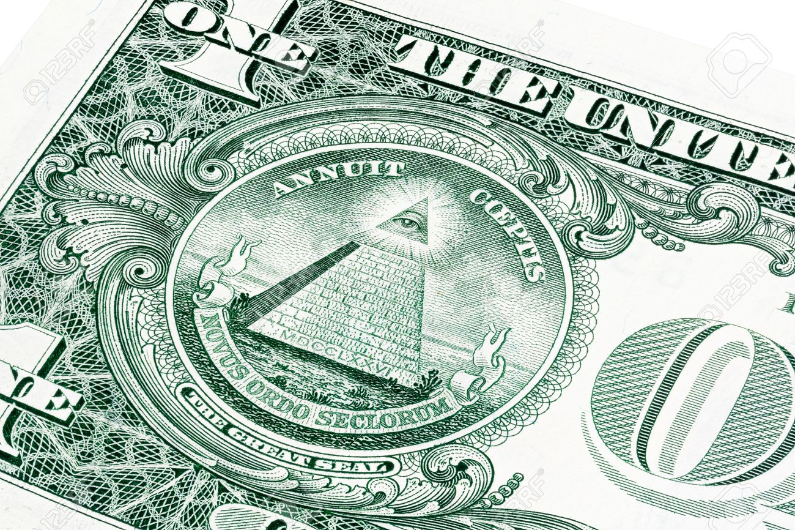
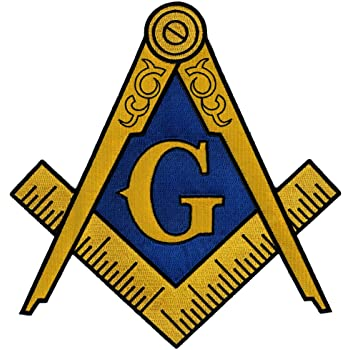
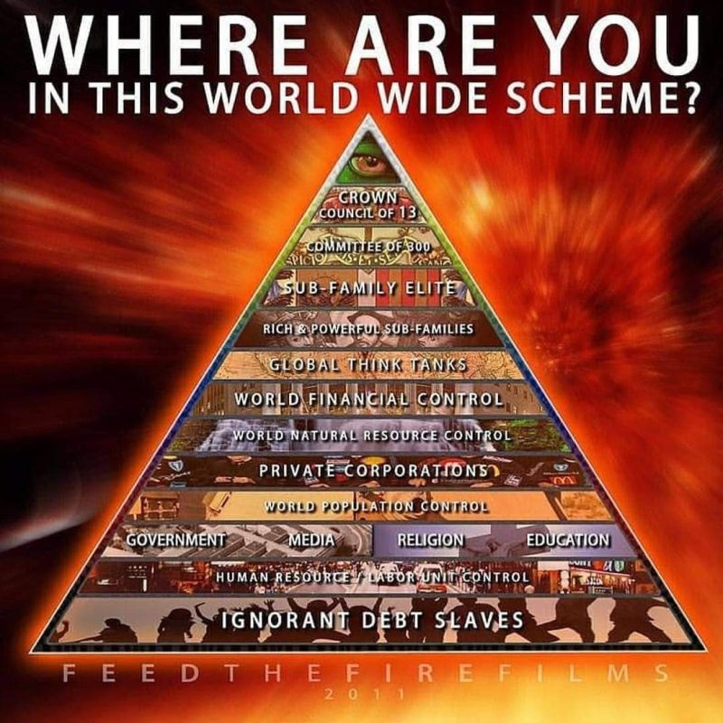
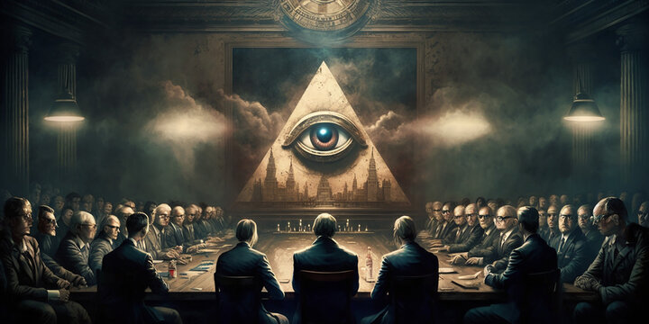

> Nếu quyền lực lớn nhất không cần xuất hiện công khai, nó sẽ không vận hành bằng biểu ngữ, khẩu hiệu hay những lời tuyên bố ồn ào. Nó sẽ vận hành bằng giáo dục, tài chính, biểu tượng, luật lệ, truyền thông và những thói quen mà con người tưởng rằng mình tự lựa chọn.

### Bản chất của các thuyết âm mưu

Rất nhiều người nhắc đến Illuminati như một biểu tượng quen thuộc của văn hóa đại chúng.

Nó xuất hiện trong video ca nhạc, phim ảnh, trò đùa trên mạng, các bài phân tích biểu tượng, những câu chuyện về giới tinh hoa và vô số giả thuyết về quyền lực ẩn sau thế giới hiện đại.

Nhưng chính vì bị nhắc đến quá nhiều, chủ đề này thường trở nên mơ hồ.

Một số người biến nó thành trò giải trí.

Một số người biến nó thành kinh doanh.

Một số người dùng nó để giải thích mọi biến cố theo cách quá dễ dãi.

Điều nguy hiểm của quá trình ấy là khái niệm "thức tỉnh" có thể bị biến thành sản phẩm tiêu dùng. Khi thông tin bị đóng gói để bán, nó rất dễ bị cắt ghép, phóng đại hoặc làm rỗng ý nghĩa ban đầu.

Muốn nhìn vấn đề tỉnh táo hơn, cần phân biệt hai cách đọc lịch sử.

Cách thứ nhất là **lịch sử ngẫu nhiên**.

Theo cách nhìn này, chiến tranh, khủng hoảng kinh tế, lạm phát, dịch bệnh, biến động xã hội và các cú sốc chính trị chủ yếu là kết quả của tai nạn, sai lầm, tham vọng cá nhân hoặc những chuỗi sự kiện không ai kiểm soát hoàn toàn.

Cách thứ hai là **lịch sử có cấu trúc**.

Theo cách nhìn này, những biến cố lớn hiếm khi chỉ là ngẫu nhiên tuyệt đối. Chúng thường có người hưởng lợi, có kế hoạch, có nguồn tài chính, có chiến lược truyền thông và có một kiến trúc quyền lực đứng phía sau.

Từ "âm mưu" thường khiến nhiều người lập tức phòng thủ.

Nhưng bản thân xã hội hiện đại đã vận hành bằng các cấu trúc phân tầng: chính phủ, ngân hàng, tập đoàn, quân đội, trường học, tổ chức quốc tế, quỹ đầu tư, nền tảng công nghệ và truyền thông.

Nếu xã hội là một kim tự tháp, thì việc đặt câu hỏi ai đang đứng ở tầng trên cùng không phải là hoang tưởng.

Đó là một câu hỏi chính trị, lịch sử và nhận thức.

### Adam Weishaupt và Illuminati

Khi nói đến các hội kín phương Tây, cái tên thường được nhắc đến đầu tiên là Illuminati.

Theo ghi chép lịch sử, tổ chức Bavarian Illuminati được Adam Weishaupt thành lập vào ngày 1 tháng 5 năm 1776 tại Bavaria.

Weishaupt là một giáo sư luật giáo hội, sống trong bối cảnh châu Âu đang chuyển động mạnh bởi Khai sáng, xung đột tôn giáo, quyền lực quân chủ và những tư tưởng chính trị mới.

Ở bề mặt chính thống, Illuminati thường được mô tả như một hội kín theo tinh thần Khai sáng, phản đối mê tín, quyền lực giáo hội và chế độ quân chủ chuyên chế.

Nhưng trong các diễn giải ngoài dòng chính, câu chuyện không dừng ở đó.

Illuminati được xem như một mô hình quyền lực bí mật: một tổ chức không cần thống trị bằng quân đội công khai, mà bằng việc xâm nhập vào tư duy, giáo dục, hành chính, tài chính và các thiết chế định hình xã hội.

Một trong những nguyên tắc quan trọng của mô hình này là **ẩn mình**.

Không dùng tên thật.

Không để lộ cấu trúc thật.

Không để tầng dưới biết toàn bộ mục tiêu của tầng trên.

Không đối đầu trực diện với xã hội, mà thâm nhập vào chính những cơ quan xã hội tin tưởng nhất.

Trong mạch diễn giải này, giáo dục được xem là chiến trường đầu tiên.

Nếu một hệ thống có thể định hình cách trẻ em hiểu về lịch sử, đạo đức, kinh tế, khoa học, quyền lực và bản thân con người, nó không cần kiểm soát mọi hành động sau này.

Nó chỉ cần kiểm soát khung suy nghĩ ban đầu.

Con người trưởng thành sẽ tự bảo vệ chiếc lồng nhận thức mà họ được dạy từ nhỏ, đồng thời gọi nó là lý trí, văn minh hoặc tiến bộ.

Đó là điểm khiến chủ đề Illuminati vẫn còn sức nặng: không phải vì một cái tên cụ thể, mà vì mô hình kiểm soát mềm mà nó đại diện.

### Tam điểm và lớp vỏ tổ chức

Một trong những nhân vật thường được nhắc đến khi nói về sự lan rộng của Illuminati là John Robison.

Robison là một nhà khoa học Scotland và từng là thành viên Hội Tam điểm. Ông nổi tiếng với cuốn *Proofs of a Conspiracy*, trong đó ông cho rằng Illuminati đã âm thầm xâm nhập vào một số nhánh của Tam điểm để sử dụng cấu trúc cấp bậc, nghi lễ và mạng lưới xã hội sẵn có.

Điểm đáng chú ý ở đây không nhất thiết nằm ở việc mọi chi tiết trong các cáo buộc ấy đúng hay sai.

Điểm đáng chú ý là cơ chế.

Một tổ chức bí mật hiệu quả thường không cần tạo ra toàn bộ hệ thống từ con số không.

Nó có thể sử dụng các tổ chức đã tồn tại.

Nó có thể dùng các cấp bậc thấp làm lớp vỏ hợp pháp, trong khi mục tiêu thật chỉ được tiết lộ cho một số ít người ở tầng cao hơn.

Nó có thể biến khát vọng thăng tiến, cảm giác đặc biệt và nhu cầu thuộc về một nhóm ưu tú thành công cụ tuyển chọn.

Người ở tầng dưới tin rằng mình đang tham gia một hội huynh đệ, một câu lạc bộ đạo đức, một mạng lưới nghề nghiệp hoặc một không gian tri thức.

Người ở tầng trên có thể nhìn thấy một bức tranh khác.

Trong mô hình này, bí mật không chỉ là việc giấu thông tin.

Bí mật là phương pháp quản trị.

Khi mỗi tầng chỉ biết một phần, không ai ở tầng dưới có đủ dữ kiện để phản kháng toàn bộ hệ thống. Họ chỉ có thể bảo vệ phần mà họ được phép nhìn thấy.

Đây cũng là lý do nhiều giả thuyết về quyền lực ẩn thường xoay quanh hình ảnh kim tự tháp.

Không phải vì bản thân kim tự tháp là bằng chứng.

Mà vì nó là hình ảnh trực quan nhất của quyền lực phân tầng: đông người ở đáy, ít người ở đỉnh, và mỗi tầng chỉ tiếp xúc trực tiếp với tầng ngay trên mình.

### Kim tự tháp quyền lực

Trong văn hóa đại chúng, Illuminati thường bị giản lược thành vài biểu tượng: con mắt toàn tri, kim tự tháp, bàn tay che mắt, ngôi sao năm cánh hoặc những dấu hiệu xuất hiện trong sân khấu giải trí.

Nhưng nếu chỉ dừng ở biểu tượng, người đọc rất dễ lạc hướng.

Biểu tượng có thể quan trọng, nhưng biểu tượng không phải là toàn bộ vấn đề.

Vấn đề thật sự nằm ở cấu trúc quyền lực.

Một xã hội có thể được điều khiển bằng bạo lực, nhưng đó là cách thô sơ và tốn kém.

Một xã hội cũng có thể được điều khiển bằng nợ, giáo dục, tiêu chuẩn đạo đức, truyền thông, thuật toán, thị trường lao động, kiểm soát dữ liệu và các khủng hoảng được quản trị liên tục.

Khi đó, con người không cảm thấy mình bị cai trị.

Họ cảm thấy mình đang lựa chọn.

Họ chọn trường học.

Họ chọn nghề nghiệp.

Họ chọn tiêu dùng.

Họ chọn quan điểm chính trị.

Họ chọn nội dung để xem.

Nhưng mọi lựa chọn ấy đều nằm trong một hành lang đã được thiết kế sẵn: nền tảng nào được phép phân phối thông tin, loại kiến thức nào được công nhận, dạng tiền tệ nào được chấp nhận, tiêu chuẩn xã hội nào được thưởng, ý kiến nào bị gắn nhãn cực đoan, và hành vi nào bị thuật toán làm cho vô hình.

Trong các giả thuyết về Illuminati, giới tinh hoa không nhất thiết cần ra lệnh trực tiếp cho từng cá nhân.

Họ chỉ cần kiểm soát môi trường nơi các cá nhân đưa ra quyết định.

Khi môi trường bị kiểm soát, hành vi số đông sẽ tự chảy theo hướng có lợi cho hệ thống.

Đó là quyền lực tinh vi hơn nhiều so với roi vọt.

### Năm mục tiêu của Trật tự Thế giới Mới

Khi nói về "Trật tự Thế giới Mới", các diễn giải ngoài dòng chính thường không nói về một sự kiện đơn lẻ.

Chúng nói về một tiến trình dài hạn: tập trung quyền lực từ quốc gia sang các thiết chế siêu quốc gia, từ tiền mặt sang tiền số, từ sở hữu cá nhân sang thuê bao, từ tự do di chuyển sang giấy phép, từ quyền riêng tư sang giám sát liên tục.

Trong nội dung gốc của phần này, năm mục tiêu thường được nhắc đến gồm:

1. Xóa bỏ hoặc làm rỗng quyền lực của các chính phủ quốc gia.

2. Làm suy yếu quyền sở hữu tư nhân.

3. Phá vỡ cấu trúc gia đình truyền thống.

4. Làm suy giảm vai trò của các tôn giáo hiện hữu.

5. Thiết lập kiểm soát tập trung đối với nền kinh tế.

Nếu nhìn một cách cực đoan, các mục tiêu này nghe như một kịch bản phản địa đàng.

Nhưng nếu nhìn như một quá trình quản trị hiện đại, ta có thể thấy những mảnh ghép của nó xuất hiện dưới nhiều tên gọi mềm hơn: hội nhập toàn cầu, tiêu chuẩn quốc tế, chuyển đổi số, kinh tế chia sẻ, phát triển bền vững, an ninh y tế, tín chỉ carbon, chống thông tin sai lệch, nhận dạng số và tiền kỹ thuật số.

Không phải mọi chương trình toàn cầu đều xấu.

Không phải mọi công nghệ mới đều là công cụ nô dịch.

Nhưng vấn đề nằm ở chỗ: khi quyền lực ngày càng tập trung, người dân bình thường có còn cơ chế nào để từ chối hay không?

Nếu mọi giao dịch cần tài khoản số, mọi di chuyển cần định danh, mọi phát ngôn bị thuật toán chấm điểm, mọi dữ liệu sức khỏe, tài chính, hành vi và quan điểm đều được gom vào một hồ sơ, thì tự do không còn bị tước đoạt bằng một sắc lệnh.

Nó bị thay thế bằng điều khoản sử dụng.

Nó bị nén vào nút "Tôi đồng ý".

Nó bị khóa sau những hệ thống mà người dân buộc phải dùng để tồn tại trong xã hội hiện đại.

### Công nghệ như chiếc lồng mềm

Điểm khác biệt lớn giữa thời đại hiện nay và các mô hình kiểm soát trong quá khứ là công nghệ.

Một nhà nước cổ đại cần quân lính, mật thám, giấy tờ và biên giới vật lý.

Một hệ thống hiện đại cần nền tảng số, cảm biến, dữ liệu, trí tuệ nhân tạo và sự nghiện ngập tự nguyện của người dùng.

Điện thoại di động là ví dụ rõ nhất.

Nó là công cụ liên lạc.

Nó là ví tiền.

Nó là bản đồ.

Nó là nhật ký hành vi.

Nó là thiết bị giải trí.

Nó là máy ảnh.

Nó là định danh.

Nó là cổng vào thế giới xã hội.

Và vì con người tự nguyện mang nó theo bên mình, hệ thống không cần cài đặt thiết bị giám sát trong nhà từng người. Mỗi người đã tự cầm theo một chiếc cổng dữ liệu cá nhân.

Trong mạch diễn giải của *Te lo ocultaron*, đây là hình thức kiểm soát nguy hiểm nhất: kiểm soát bằng tiện ích.

Khi một công cụ đủ tiện, con người sẽ không còn hỏi nó lấy gì từ mình.

Họ chỉ quan tâm nó giúp mình tiết kiệm bao nhiêu thời gian, giải trí nhanh đến đâu và làm cuộc sống trông hiện đại hơn thế nào.

Trật tự Thế giới Mới, nếu tồn tại như một tiến trình, có thể không đến bằng xe tăng.

Nó có thể đến bằng ứng dụng.

### Câu hỏi còn lại

Illuminati có thể là một tổ chức lịch sử cụ thể.

Nó cũng có thể là một biểu tượng đã được phóng đại qua nhiều thế hệ.

Nhưng điều quan trọng hơn cái tên là mô hình mà cái tên ấy gợi ra: một cấu trúc quyền lực không xuất hiện hoàn toàn trước công chúng, nhưng có khả năng định hình cách công chúng học, nghĩ, làm việc, tiêu tiền, tin tưởng và phản ứng trước khủng hoảng.

Nếu chỉ chế giễu mọi câu hỏi về quyền lực ẩn là "thuyết âm mưu", ta có thể bỏ qua một thực tế đơn giản: lịch sử nhân loại luôn đầy rẫy những nhóm nhỏ lập kế hoạch phía sau cánh cửa đóng kín.

Nếu lại tin mọi lời đồn là sự thật tuyệt đối, ta cũng rơi vào một chiếc bẫy khác: đánh mất khả năng phân biệt giữa bằng chứng, suy luận và tưởng tượng.

Con đường tỉnh táo nằm ở giữa.

Không sợ đặt câu hỏi.

Không vội tin câu trả lời.

Không thần tượng hệ thống.

Không thần tượng người chống hệ thống.

Và luôn nhớ rằng quyền lực nguy hiểm nhất thường không cần ép buộc con người tin vào nó.

Nó chỉ cần khiến con người tin rằng họ đang tự do, trong khi mọi lựa chọn quan trọng đã được đặt sẵn trên bàn.
