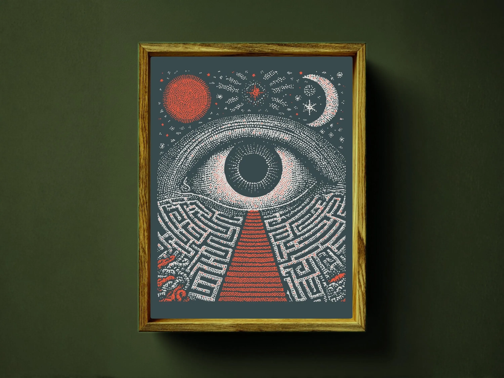
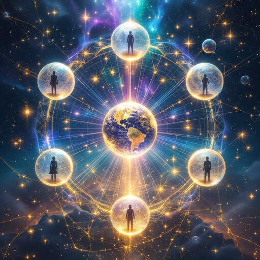

> Thức tỉnh không phải là khoảnh khắc ta tuyên bố mình đã biết hết. Thức tỉnh là giây phút ta đủ trung thực để nhận ra rằng những gì mình biết vẫn còn quá ít.

### Chúng ta đang thức tỉnh khỏi điều gì?

Sai lầm lớn nhất của người tìm kiếm sự thật là tin rằng sẽ có một ngày mình hiểu hết mọi thứ.

Rằng chỉ cần đọc đủ tài liệu, xem đủ bằng chứng, nghe đủ lời giải thích, ta sẽ chạm đến điểm cuối cùng của nhận thức.

Nhưng thực tế không vận hành như vậy.

Chúng ta không thức tỉnh một lần rồi xong.

Chúng ta thức tỉnh theo từng lớp.

Từng lớp niềm tin rơi xuống.

Từng lớp sợ hãi bị nhìn thẳng.

Từng lớp lập trình xã hội được nhận diện.

Từng lớp ảo tưởng về bản thân, thế giới và lịch sử được bóc tách.

Socrates từng nói đại ý rằng trí tuệ thật sự bắt đầu khi con người nhận ra mức độ thiếu hiểu biết của chính mình.

Đó không phải là sự tự hạ thấp.

Đó là nền móng của tự do.

Vì chỉ khi biết mình chưa biết hết, ta mới còn đủ khiêm tốn để tiếp tục quan sát.

Chỉ khi không bám chặt vào kết luận cuối cùng, ta mới còn khả năng nhìn thấy những mảnh ghép mới.

Hành trình của *Te lo ocultaron* bắt đầu từ cảm giác rất quen thuộc với nhiều người: cảm giác rằng thế giới này không hoàn toàn giống như những gì ta được bảo.

Từ nhỏ, có những người đã cảm thấy có điều gì đó sai lệch.

Không nhất thiết họ có bằng chứng rõ ràng.

Không nhất thiết họ biết gọi tên cảm giác đó.

Nhưng bên trong luôn có một câu hỏi lặng lẽ: nếu đây là sự thật, tại sao nó lại có nhiều vết nứt đến vậy?

Nhiều năm quan sát thế giới có thể dẫn ta đến một kết luận ban đầu: các sự kiện lớn không phải lúc nào cũng tự phát.

Nhiều thứ được quyết định trong các phòng kín.

Nhiều phản ứng của đám đông được dẫn dắt.

Nhiều cuộc khủng hoảng được tận dụng.

Nhiều biểu tượng, câu chuyện và nỗi sợ được cài đặt để điều khiển hành vi tập thể.

Nhưng càng đi sâu, câu hỏi càng mở rộng.

Nếu chỉ có chính trị, tiền bạc và quyền lực bề mặt thì bức tranh vẫn chưa đủ.

Phía sau các cấu trúc hữu hình có thể còn những tầng sâu hơn của nhận thức, năng lượng, biểu tượng và lập trình tâm trí.

### Từ thức tỉnh cá nhân đến Ma trận tâm trí

Có những giai đoạn trong đời, con người buộc phải quay lại với câu hỏi lớn nhất: mình đang sống cuộc đời của mình, hay đang sống trong một chương trình đã được viết sẵn?

Một chương trình có thể đến từ gia đình.

Từ trường học.

Từ tôn giáo.

Từ truyền thông.

Từ thuật toán.

Từ lịch sử chính thống.

Từ những nỗi sợ mà ta tưởng là của mình, nhưng thực ra đã được gieo vào từ lâu.

Trong nội dung gốc của phần kết này, tác giả gọi trải nghiệm đó là một cuộc “tái thức tỉnh”.

Không phải lần đầu tiên mở mắt.

Mà là khoảnh khắc nhận ra mình từng nhìn thấy vài mảnh ghép, nhưng đã phủ nhận chúng vì sợ bị xem là kỳ lạ, cực đoan hoặc điên rồ.

Đây là điều rất phổ biến.

Nhiều người từng cảm thấy có gì đó không ổn.

Nhưng họ tự dập tắt cảm giác đó.

Vì không muốn bị tách khỏi đám đông.

Vì không muốn mất cảm giác an toàn.

Vì không muốn đối diện với khả năng rằng rất nhiều điều mình tin từ nhỏ có thể chỉ là một lớp lập trình.

Theo cách diễn giải của *Te lo ocultaron*, thế giới công khai chỉ là mặt tiền.

Phía sau chính trị gia, nghệ sĩ, người nổi tiếng, tổ chức toàn cầu và các hình ảnh quyền lực là một mạng lưới phức tạp hơn.

Nó không nhất thiết luôn hiện ra dưới dạng một nhóm người ngồi trong căn phòng tối.

Đôi khi nó vận hành như hệ tư tưởng.

Như biểu tượng.

Như lợi ích tài chính.

Như cấu trúc dữ liệu.

Như sự lặp lại liên tục của một câu chuyện cho đến khi xã hội xem nó là điều hiển nhiên.

Tác giả dùng khái niệm “Ma trận” để mô tả hệ thống đó.

Không chỉ là Ma trận công nghệ.

Mà là Ma trận tâm trí.

Một mạng lưới khiến con người phản ứng theo những mẫu được lập trình, tiêu thụ những nỗi sợ được cung cấp, tranh cãi trong những khuôn khổ được cho phép và hiếm khi đặt câu hỏi về chính khuôn khổ đó.

Trong những diễn giải tâm linh mạnh hơn, Ma trận này còn được gắn với các tầng thấp của chiều không gian thứ tư, nơi các thực thể hoặc trường ý thức hỗn loạn hấp thụ năng lượng từ sợ hãi, thù ghét và tuyệt vọng của con người.

Đây là một cách nhìn siêu hình, không phải kết luận khoa học.

Nhưng nếu tạm gạt ngôn ngữ huyền học sang một bên, điểm cốt lõi vẫn đáng suy ngẫm: nỗi sợ là nhiên liệu cực mạnh của kiểm soát.

Khi con người sợ hãi, họ dễ trao quyền.

Khi con người bị chia rẽ, họ dễ bị dẫn dắt.

Khi con người mất kết nối với trực giác, họ dễ tin rằng mọi tiếng nói bên ngoài đều đáng tin hơn tiếng nói bên trong mình.

### Primado Negativo và sự thật bị biến thành trò đùa

Một trong những khái niệm đáng chú ý nhất trong phần cuối là **Primado Negativo**, có thể hiểu gần với “lập trình ngược” hoặc “negative priming”.

Ý tưởng này cho rằng một sự thật có thể bị vô hiệu hóa bằng cách đưa nó vào hư cấu trước.

Phim ảnh.

Truyện tranh.

Hài kịch.

Thuyết âm mưu bị chế giễu.

Các nhân vật điên rồ nói ra điều thật.

Các biểu tượng nghiêm trọng bị biến thành trò đùa.

Sau đó, khi một người gặp lại cùng ý tưởng đó trong đời thực, tiềm thức sẽ tự động gắn nó với giải trí, hoang tưởng hoặc chuyện bịa.

Não không cần phân tích nữa.

Nó chỉ cần phản xạ: “Cái này nghe giống phim.”

Và thế là cánh cửa nhận thức đóng lại.

Đây là một kỹ thuật rất tinh vi nếu nhìn dưới góc độ truyền thông.

Không cần cấm một sự thật.

Chỉ cần làm cho nó trở nên lố bịch trước khi người ta kịp xem xét nghiêm túc.

Không cần đốt sách.

Chỉ cần biến người đọc sách thành đối tượng bị chế giễu.

Không cần khóa miệng mọi người.

Chỉ cần tạo ra một môi trường xã hội nơi ai đặt câu hỏi cũng sợ bị gọi là ngu ngốc, mê tín hoặc nguy hiểm.

Từ đó, hệ thống không chỉ kiểm soát thông tin.

Nó kiểm soát phản ứng cảm xúc của con người trước thông tin.

Đây mới là tầng sâu hơn.

Không phải bạn không được nghe.

Mà là bạn đã được huấn luyện để tự từ chối trước khi kịp nghe hết.

Và khi ai đó hỏi: “Tại sao bạn tin điều này?”

Câu trả lời thường không đến từ trải nghiệm trực tiếp.

Nó đến từ những câu như: “Vì thầy giáo dạy thế.”

“Vì tivi nói vậy.”

“Vì mọi người đều biết như vậy.”

Nhưng câu hỏi tiếp theo mới quan trọng hơn:

Ai đã lập trình cho những người lập trình chúng ta?

### Lời cuối: hãy bắt đầu hành trình của riêng bạn

Mục tiêu của cuốn sách này không phải là buộc người đọc tin toàn bộ mọi giả thuyết.

Điều đó sẽ chỉ thay thế một hệ niềm tin bằng một hệ niềm tin khác.

Nếu bạn rời khỏi một chiếc lồng chỉ để bước vào chiếc lồng mới có màu sắc hấp dẫn hơn, đó chưa phải là tự do.

Mục tiêu thật sự là khơi lại phần tò mò từng bị dập tắt.

Phần bên trong bạn từng biết đặt câu hỏi.

Phần không thỏa mãn với câu trả lời quá dễ.

Phần cảm thấy rằng lịch sử, thực tại, tâm linh, khoa học, công nghệ và quyền lực có thể đang liên kết với nhau theo những cách sâu hơn các giáo trình từng trình bày.

Đừng chỉ tin những gì tác giả viết.

Cũng đừng chỉ tin những gì hệ thống dạy.

Hãy tự nghiên cứu.

Hãy kiểm tra.

Hãy so sánh.

Hãy quan sát phản ứng của chính mình khi gặp một thông tin làm bạn khó chịu.

Đôi khi sự khó chịu không xuất hiện vì thông tin đó sai.

Nó xuất hiện vì thông tin đó đụng vào một bức tường niềm tin đã tồn tại quá lâu.

Sự thật không phải lúc nào cũng đến như một tiếng sét.

Nhiều khi nó đến như một mảnh ghép nhỏ.

Một chi tiết lặp lại.

Một biểu tượng xuất hiện ở quá nhiều nơi.

Một câu hỏi không chịu biến mất.

Một cảm giác rằng phía sau lớp màn này còn một lớp màn khác.

Rồi đến một thời điểm, các mảnh ghép bắt đầu kết nối.

Không ai có thể đi thay hành trình đó cho bạn.

Mỗi người có nhịp thức tỉnh riêng.

Có người bắt đầu bằng lịch sử cổ đại.

Có người bắt đầu bằng công nghệ.

Có người bắt đầu bằng một biến cố cá nhân.

Có người bắt đầu bằng nỗi đau.

Có người bắt đầu bằng một câu hỏi tưởng như vô nghĩa khi còn nhỏ.

Nhưng một khi câu hỏi thật sự được đánh thức, nó rất khó ngủ lại.

Đó là lý do sự thức tỉnh, theo nghĩa sâu nhất, là không thể tránh khỏi.

Không phải vì tất cả mọi người sẽ cùng tin vào một hệ thống mới.

Mà vì ngày càng nhiều người bắt đầu nhận ra rằng họ không còn muốn sống như những phản ứng tự động trong một chương trình được viết sẵn.

Họ muốn nhìn.

Muốn hiểu.

Muốn tự kiểm chứng.

Muốn lấy lại quyền sở hữu tâm trí, năng lượng và lựa chọn của chính mình.

Nếu có một lời kết cho *Te lo ocultaron*, thì có lẽ nó không phải là một kết luận.

Mà là một lời mời.

Hãy tiếp tục đặt câu hỏi.

Hãy tiếp tục quan sát.

Hãy giữ sự khiêm tốn trước điều chưa biết.

Hãy đủ tỉnh táo để không bị kéo vào sợ hãi, nhưng cũng đủ can đảm để không quay lưng trước những vết nứt của thực tại.

Và trên hết, hãy nhớ rằng hành trình thức tỉnh không kết thúc ở trang cuối cùng của một cuốn sách.

Nó bắt đầu ngay tại khoảnh khắc bạn quyết định không còn để người khác suy nghĩ thay mình.
