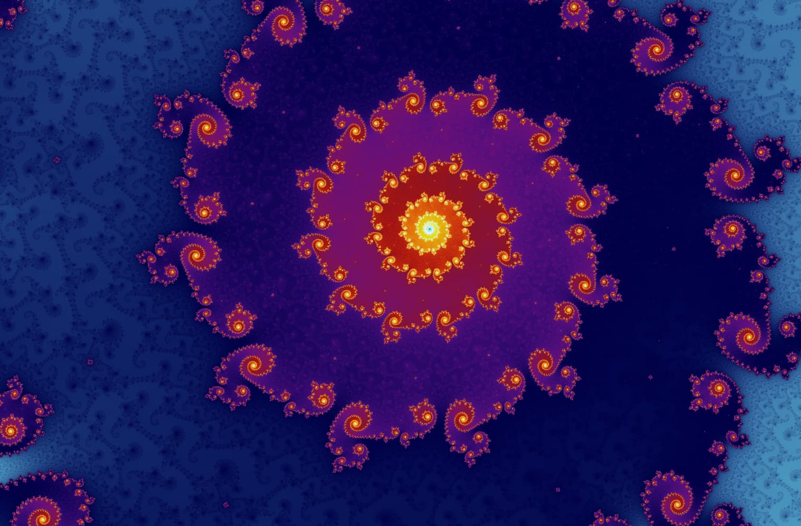
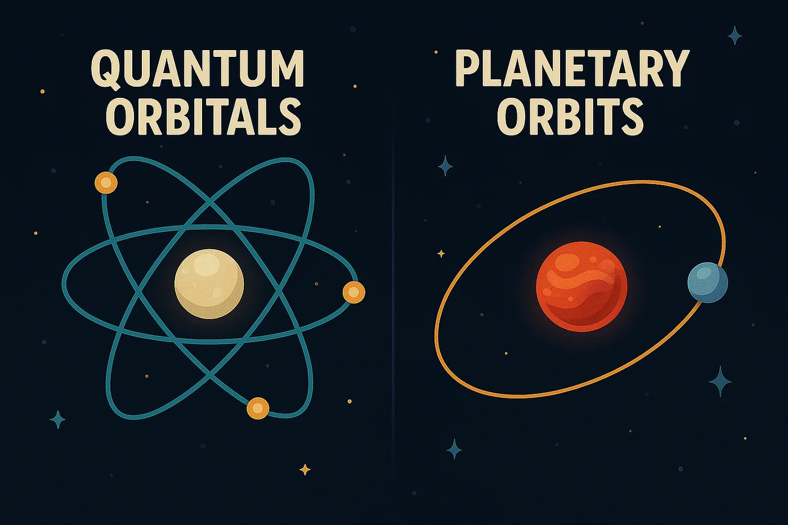
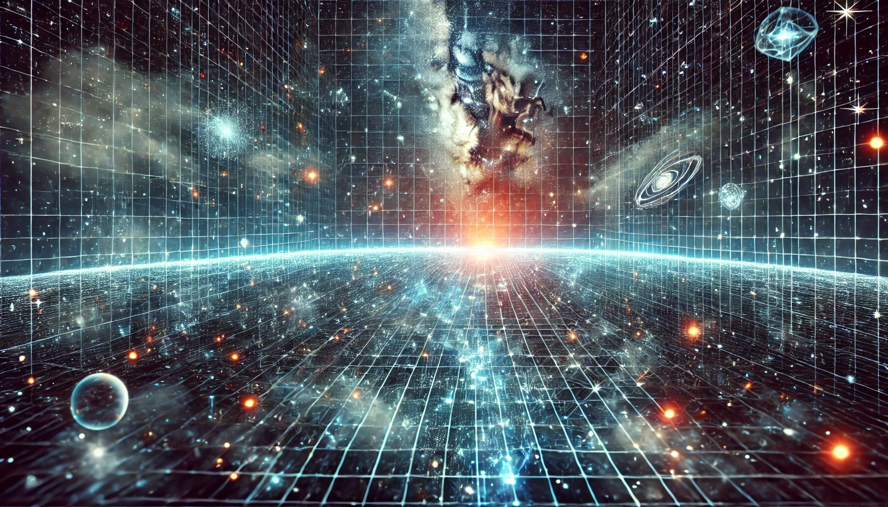
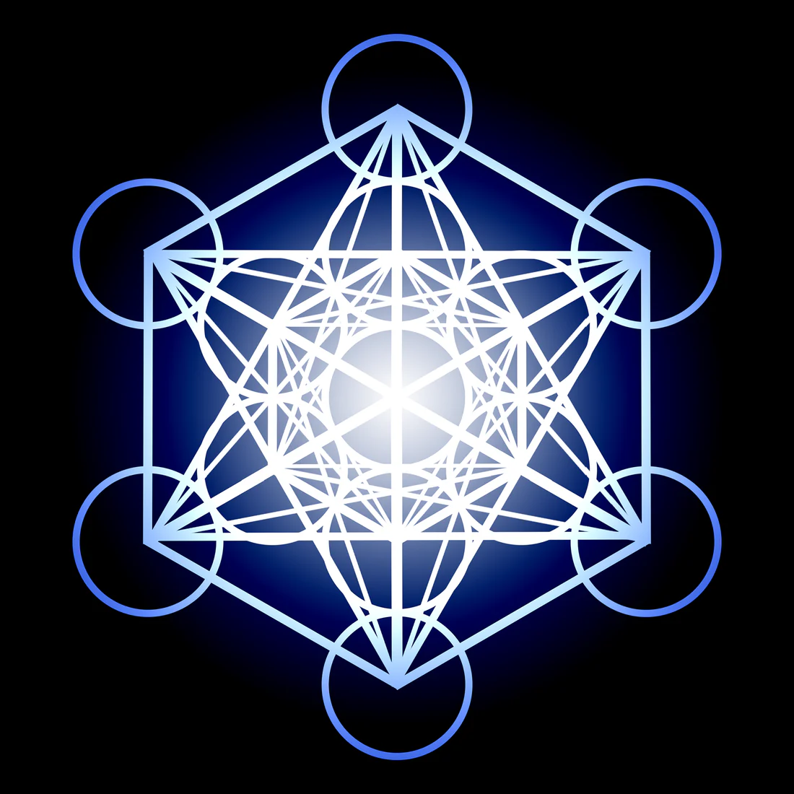
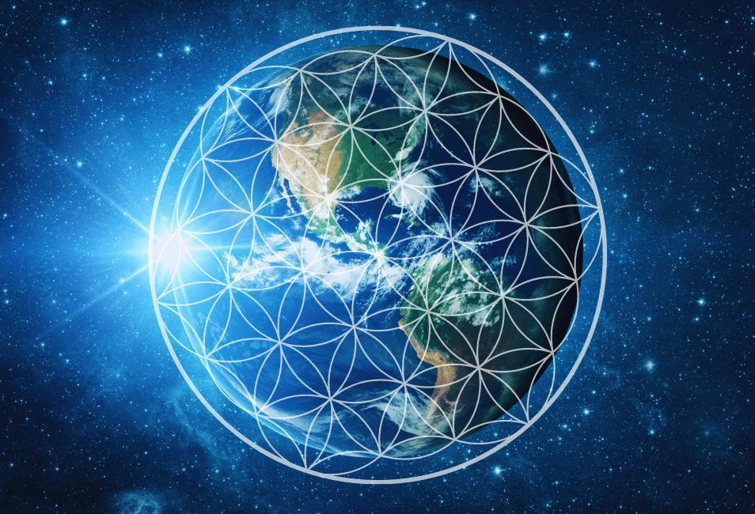

> Nếu thực tại là một trường thông tin khổng lồ, thì Fractal và Hình học thiêng liêng có thể là những dấu vết cho thấy vũ trụ không vận hành ngẫu nhiên, mà được tổ chức bằng các mô thức lặp lại ở nhiều tầng quy mô.

### Mật mã Fractal: Ngôn ngữ lập trình của vạn vật

Tương tự như cách năng lượng từ một kênh truyền hình được chuyển hóa thành thông tin hiển thị trên màn hình tivi, máy tính hay máy tính bảng, năng lượng bao quanh chúng ta chính là một đại dương thông tin sống động. Từ những dãy núi hùng vĩ, những khối đá kiên cố, cây cối, hoa lá cho đến chính bạn và tôi – vạn vật trong thế giới này đều được cấu thành từ thông tin.

Để dòng chảy thông tin khổng lồ này có thể duy trì sự ổn định và tiếp diễn qua hàng tỷ năm, cần có một cơ chế vận hành đặc biệt: một mã nguồn tự cung tự cấp và tự sao chép. Mã nguồn đó chính là Fractal.

Fractal là một mô thức lặp đi lặp lại vô tận, có tính tự tương đồng ở mọi quy mô. Bạn có thể bắt gặp cùng một khuôn mẫu cấu trúc từ cấp độ vi mô nhất của nguyên tử, nơi các electron chuyển động quanh hạt nhân, cho đến cấp độ vĩ mô của một hành tinh với các mặt trăng, một hệ mặt trời với các hành tinh quay quanh mặt trời, hay thậm chí là cấu trúc của các thiên hà.

Vẻ đẹp và sức mạnh của Fractal nằm ở chỗ: chỉ cần hiểu được cách thức vận hành của năng lượng ở quy mô nhỏ nhất, chúng ta có thể thấu hiểu được những gì đang diễn ra ở quy mô lớn lao hơn.

Dù một Fractal trông có vẻ phức tạp đến đâu, chúng đều được tạo ra từ một công thức cực kỳ đơn giản gọi là mã đệ quy – nơi kết quả của một phép tính trở thành đầu vào cho phép tính tiếp theo, giúp phương trình tự duy trì sự tồn tại.

Khi đã nhận diện được mật mã này, bạn sẽ thấy nó hiện diện ở khắp mọi nơi: trong các cành cây, mạng lưới sông ngòi, các mạch máu trong cơ thể và cả cách thức các tế bào tái sản xuất.

### Vũ trụ Ảnh ảo và Chiếc máy chiếu liên chiều

Chúng ta đang trải nghiệm một thực tại mà các nhà tiên phong trong lĩnh vực này khẳng định rằng: chỉ trong vài năm nữa, con người sẽ không thể phân biệt được đâu là thật và đâu là ảo do chính mình tạo ra.

Hãy suy nghĩ về một vũ trụ ảnh ảo, hay Holographic Universe. Trong công nghệ ảnh ảo, người ta sử dụng tia laser để tạo ra các mô thức giao thoa và phóng chiếu một bản sao hoàn hảo của vật thể bằng ánh sáng.

Có một điểm mấu chốt trong toán học ảnh ảo: chiếc máy chiếu không thể nằm cùng phòng với hình ảnh mà nó tạo ra.

Nếu chúng ta coi vũ trụ này giống như một công viên giải trí khổng lồ của các ảnh ảo, thì phải có một chiếc máy chiếu hoạt động bằng ánh sáng và laser, phóng chiếu một thế giới trông có vẻ rất thật đối với tâm trí chúng ta.

Vậy, ai là kẻ đã tạo ra nó? Có thể chiếc máy chiếu tạo nên thực tại này nằm ở một chiều không gian khác. Chiều không gian đó là gì? Và kẻ nào đang thực sự kiểm soát chiếc máy chiếu đó?

### Hình học thiêng liêng: Hệ thống lưới của Ma trận

Thời gian thực chất chỉ là một ảo ảnh, một phát minh của con người để định vị thực tại. Vũ trụ là một ảnh ảo của ý thức. Thực tại vật lý mà chúng ta thấy chỉ là những ảo ảnh được phóng chiếu bên trong một cấu trúc ảnh ảo khổng lồ.

"Ma trận" của chúng ta được cấu thành từ những mạng lưới được tạo ra bởi một ý thức nguồn, đưa vào nhận thức thông qua năng lượng điện từ.

Mạng lưới ảnh ảo này được liên kết chặt chẽ thông qua các mô thức của Hình học thiêng liêng.

Các nhà khoa học đã bắt đầu nhận thấy rằng những lý thuyết về trường lượng tử có thể giải thích hầu hết các quan sát vũ trụ học về thuở sơ khai.

Khái niệm về vũ trụ ảnh ảo có tiềm năng hòa hợp giữa thuyết tương đối tổng quát của Einstein, vốn giải thích thế giới vĩ mô, và cơ học lượng tử, vốn giải thích thế giới vi mô – điều mà khoa học chính thống đã nỗ lực thực hiện trong nhiều thập kỷ nhưng chưa thể hoàn thiện.
