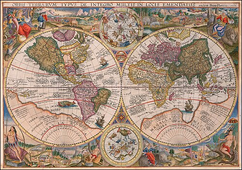
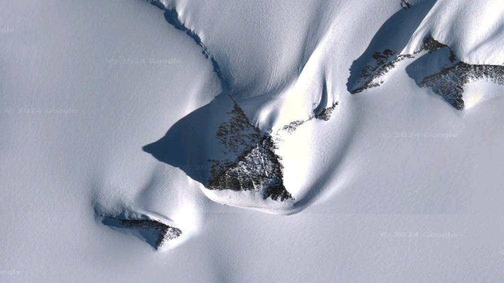
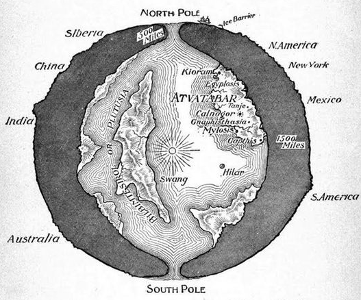

> Nếu Nam Cực chỉ là một vùng băng giá để nghiên cứu khoa học, tại sao nơi này lại bị bao quanh bởi quá nhiều điều ước quốc tế, căn cứ quân sự, chuyến đi bí ẩn và những câu chuyện chưa bao giờ được giải thích thỏa đáng?

### Lục địa bị phong tỏa

Chúng ta đang sống trong một thời đại mà thông tin sai lệch, truyền thông định hướng và những cuộc tranh luận có chủ đích đã khiến công chúng ngày càng khó phân biệt đâu là sự thật, đâu là lớp màn che phủ.

Nam Cực nằm ở trung tâm của nhiều bí ẩn kiểu đó.

Đây là lục địa lớn thứ ba thế giới, lớn gấp khoảng một lần rưỡi diện tích Hoa Kỳ, nắm giữ gần 90% lượng băng và khoảng 70% lượng nước ngọt của Trái Đất.

Về mặt chính thức, Nam Cực được quản lý bởi Hiệp ước Nam Cực, với sự tham gia của nhiều quốc gia như Hoa Kỳ, Anh, Nga, Trung Quốc, Nhật Bản và nhiều bên khác.

Theo tuyên bố công khai, mục đích của hệ thống này là bảo vệ môi trường, duy trì hòa bình và phục vụ nghiên cứu khoa học.

Nhưng trong cách nhìn của các giả thuyết ngoài dòng chính, chính mô hình "bảo vệ" ấy lại khiến Nam Cực trở thành một vùng đất gần như bị phong tỏa khỏi người dân bình thường.

Các căn cứ nghiên cứu được vận hành liên tục, nhiều khu vực bị hạn chế tiếp cận, việc thám hiểm tự do gần như không thể diễn ra, và mọi câu chuyện vượt khỏi khuôn khổ khoa học chính thống đều nhanh chóng bị gạt sang bên lề.

Câu hỏi vì vậy không chỉ là: Nam Cực có gì?

Câu hỏi sâu hơn là: điều gì ở Nam Cực khiến các cường quốc đồng thuận kiểm soát nó chặt chẽ đến vậy?

### Chiến dịch Highjump

Cuối năm 1946, Đô đốc Richard E. Byrd dẫn đầu một lực lượng lớn tiến về Nam Cực.

Chiến dịch này được biết đến với tên gọi *Operation Highjump*, bao gồm khoảng 4.700 binh sĩ, 13 tàu chiến và 33 máy bay.

Theo mô tả chính thức, đó là một chiến dịch huấn luyện và thám hiểm trong điều kiện băng giá.

Nhưng quy mô quân sự khổng lồ của nó khiến nhiều người đặt câu hỏi: tại sao một nhiệm vụ "thám hiểm" lại cần đến lực lượng gần giống một chiến dịch tấn công?

Theo các giả thuyết liên quan đến lịch sử bí mật sau Thế chiến II, một phần tàn dư của Đức Quốc Xã có thể đã tháo chạy xuống các căn cứ ngầm tại Nam Cực.

Những người theo hướng nghiên cứu này cho rằng Đức Quốc Xã từng tiếp cận một số công nghệ vượt xa thời đại, bao gồm các thiết bị bay dạng đĩa hoặc dạng chuông, liên quan đến các hội kín như Thule và Vril.

Chiến dịch Highjump, trong cách diễn giải đó, không đơn thuần là thám hiểm.

Nó có thể là một nỗ lực quân sự nhằm kiểm tra, truy quét hoặc vô hiệu hóa những căn cứ còn sót lại sau chiến tranh.

Điều khiến câu chuyện càng trở nên kỳ lạ là chiến dịch này kết thúc sớm hơn dự kiến.

Một số lời kể ngoài dòng chính cho rằng lực lượng của Byrd đã gặp phải sự kháng cự bất thường và phải rút lui với tổn thất đáng kể.

Trong một cuộc phỏng vấn được nhắc lại nhiều lần, Byrd được cho là đã cảnh báo về nhu cầu phòng thủ trước những vật thể có khả năng bay từ vùng cực này sang vùng cực khác với tốc độ rất cao.

Dù chi tiết lịch sử còn gây tranh cãi, chính sự mơ hồ quanh Highjump đã biến nó thành một trong những tâm điểm lớn nhất của huyền thoại Nam Cực.

### Công nghệ bị che giấu

Trong các hồ sơ và giả thuyết về công nghệ bí mật của Đức Quốc Xã, *Die Glocke*, hay "Chiếc Chuông", là một biểu tượng đặc biệt.

Nó thường được mô tả như một thiết bị thử nghiệm liên quan đến phản trọng lực, trường năng lượng hoặc các nguyên lý vật lý chưa được công khai.

Không có bằng chứng chính thống đủ mạnh để khẳng định Die Glocke từng hoạt động đúng như truyền thuyết.

Tuy nhiên, điều đáng chú ý là câu chuyện về nó luôn xuất hiện cùng một cụm chủ đề: công nghệ bay bí mật, căn cứ ngầm, Nam Cực, các hội kín và sự chuyển giao công nghệ sau Thế chiến II.

Nếu nhìn theo dòng lịch sử chính thống, nhiều nhà khoa học Đức đã được đưa sang Hoa Kỳ và Liên Xô sau chiến tranh thông qua các chương trình đặc biệt.

Nếu nhìn theo dòng giả thuyết bí mật, một phần tri thức khác có thể đã không đi theo con đường công khai đó.

Nó có thể đã biến mất cùng những đoàn tàu, tàu ngầm, căn cứ bí mật và những vùng đất bị khóa khỏi bản đồ dân sự.

Nam Cực vì thế không chỉ là băng.

Nó trở thành biểu tượng của một kho lưu trữ bị che giấu: nơi những công nghệ cũ, những dự án bị xóa tên và những câu chuyện không được phép bước vào sách giáo khoa có thể vẫn còn nằm dưới lớp tuyết trắng.

### Kim tự tháp dưới băng

Trong những năm gần đây, Nam Cực tiếp tục thu hút sự chú ý khi nhiều nhân vật tầm cỡ từng ghé thăm nơi này trong các hoàn cảnh khiến công chúng đặt câu hỏi.

Cùng lúc đó, hình ảnh vệ tinh và Google Earth liên tục làm dấy lên tranh luận về các cấu trúc có hình dáng giống kim tự tháp bị chôn dưới lớp băng.

Khoa học chính thống thường giải thích chúng là núi, đỉnh đá hoặc cấu trúc địa chất tự nhiên bị băng và ánh sáng tạo hiệu ứng thị giác.

Nhưng với những người theo giả thuyết lịch sử bị che giấu, các hình khối quá đối xứng ấy gợi ra khả năng khác: Nam Cực có thể từng là nơi tồn tại một nền văn minh cổ.

Dữ liệu địa chất cho thấy Nam Cực không phải lúc nào cũng là vùng đất băng giá.

Trong quá khứ xa xôi, lục địa này từng có khí hậu ấm hơn, có thảm thực vật và có thể từng là môi trường sống phù hợp hơn nhiều so với hiện nay.

Một số bản đồ cổ, nổi tiếng nhất là bản đồ Piri Reis, được cho là mô tả đường bờ biển Nam Cực trước khi lục địa này được khám phá chính thức.

Dù cách giải thích còn gây tranh luận, nó vẫn đặt ra một câu hỏi lớn: ai đã có khả năng khảo sát địa cầu với độ chính xác đáng kinh ngạc vào thời điểm mà lịch sử chính thống cho rằng con người chưa thể làm được điều đó?

Nếu Nam Cực từng xanh tươi, từng có dân cư, từng có công trình và từng lưu giữ tri thức cổ, thì lớp băng ngày nay không chỉ là băng.

Nó có thể là một chiếc nắp khổng lồ đậy lên một chương lịch sử chưa được phép mở ra.

### Giả thuyết Trái Đất rỗng

Một trong những lý thuyết gây chấn động nhất liên quan đến Đô đốc Byrd là câu chuyện ông từng phát hiện lối vào thế giới bên trong Trái Đất.

Theo những ghi chép được cho là trích từ nhật ký bí mật của Byrd, trong một chuyến bay qua vùng cực, ông đã đi vào một khu vực kỳ lạ dẫn tới thung lũng xanh tươi, sông hồ, khí hậu ôn hòa và một nền văn minh phát triển cao.

Thế giới bên trong này được mô tả như một vùng đất ẩn, nơi cư dân sở hữu công nghệ tiên tiến, đặc biệt là các phương tiện bay vượt xa máy bay thông thường.

Trong câu chuyện ấy, Byrd được tiếp đón và nhận một thông điệp cảnh báo nhân loại về việc sử dụng năng lượng hạt nhân, chiến tranh và sự tự hủy diệt.

Với người hoài nghi, đây chỉ là huyền thoại hoặc tài liệu ngụy tạo.

Với người theo giả thuyết Trái Đất rỗng, nó là một mảnh ghép quan trọng cho thấy cấu trúc hành tinh có thể phức tạp hơn rất nhiều so với mô hình được dạy trong sách giáo khoa.

Điểm đáng chú ý không nằm ở việc ta phải tin toàn bộ câu chuyện theo nghĩa đen.

Điểm đáng chú ý là các huyền thoại về thế giới ngầm, Agartha, Shambhala, các chủng tộc sống dưới lòng đất và những cánh cổng ở vùng cực xuất hiện trong rất nhiều truyền thống khác nhau.

Khi nhiều nền văn hóa cùng nhắc đến một mô-típ, ta có quyền đặt câu hỏi: đó chỉ là trí tưởng tượng tập thể, hay là ký ức đã bị biến dạng qua thời gian?

Nam Cực hiện vẫn là một trong những vùng đất được kiểm soát nghiêm ngặt nhất thế giới.

Việc thám hiểm tự do bị hạn chế dưới danh nghĩa bảo vệ môi trường và an toàn cá nhân.

Nhưng nếu nhìn từ chuỗi giả thuyết của *Te lo ocultaron*, có thể điều được bảo vệ không chỉ là hệ sinh thái.

Có thể đó là các công nghệ cổ xưa, các cấu trúc bị chôn vùi, các căn cứ ngầm, hoặc thậm chí những cổng kết nối với một tầng thực tại khác.

Nam Cực vì vậy không chỉ là "mái nhà băng giá" của thế giới.

Nó là một khoảng trắng lớn trên bản đồ nhận thức của nhân loại, nơi mọi câu hỏi bị đóng băng lại trước khi kịp được trả lời.
