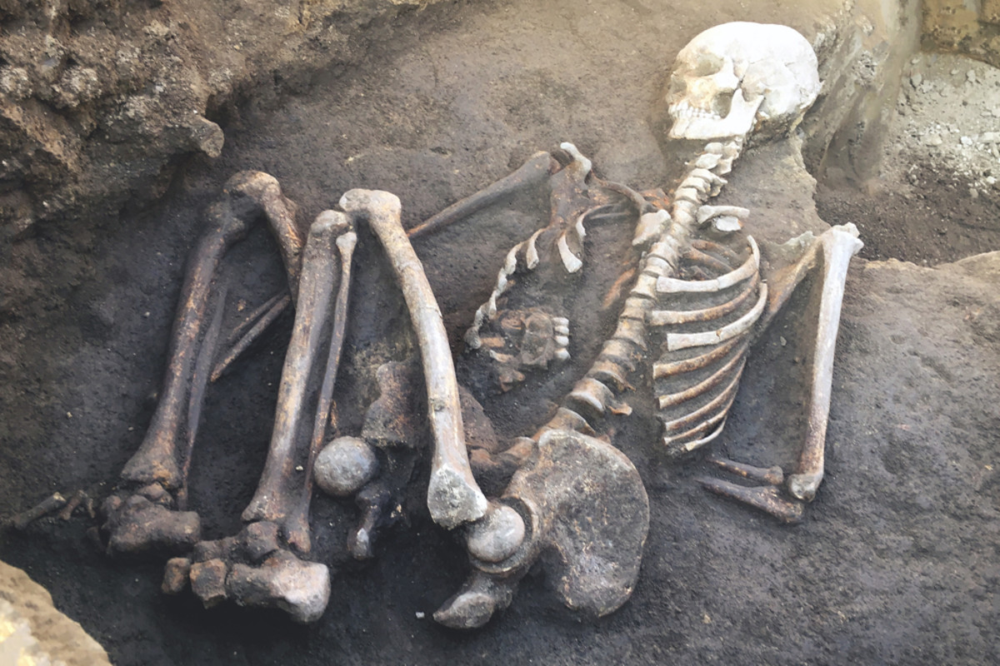
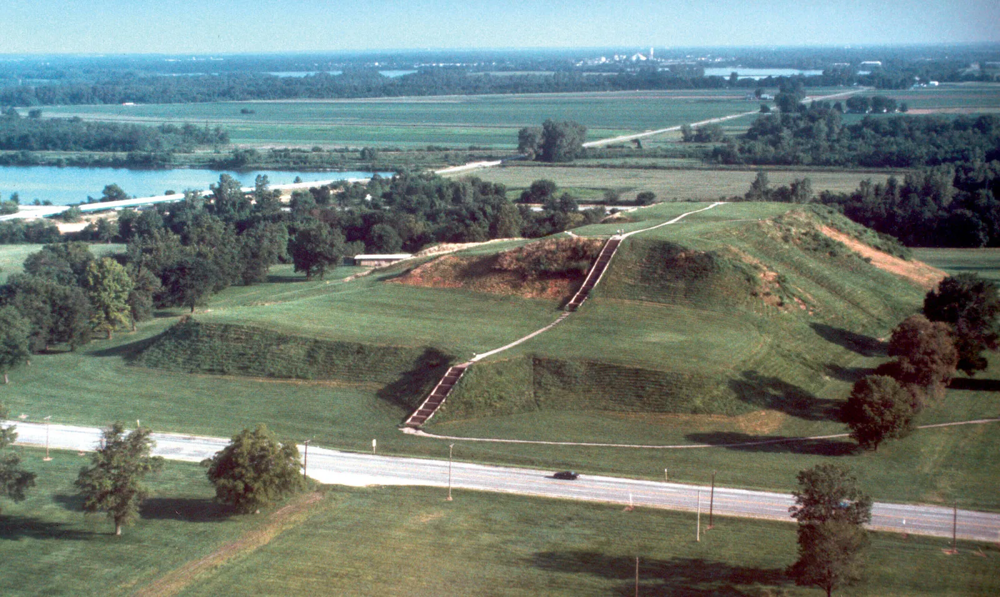
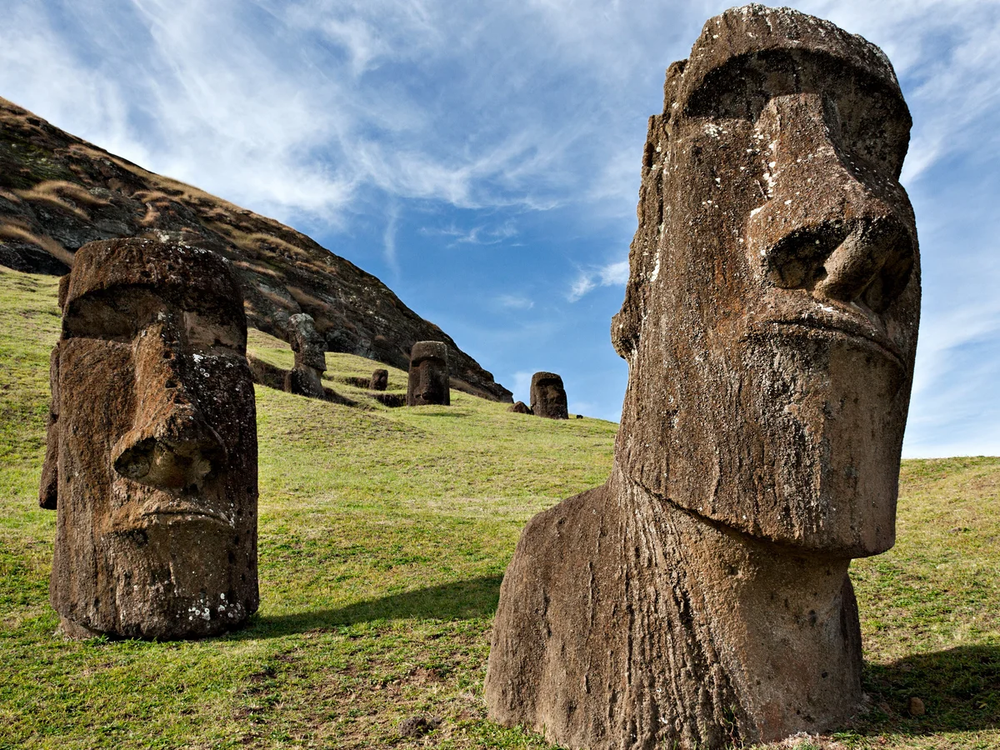
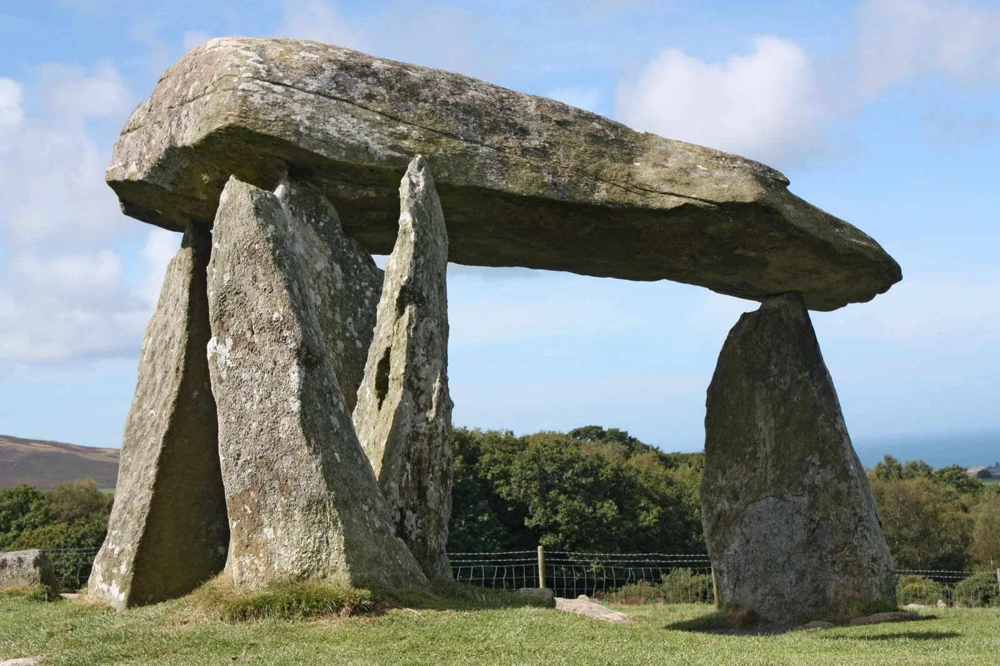
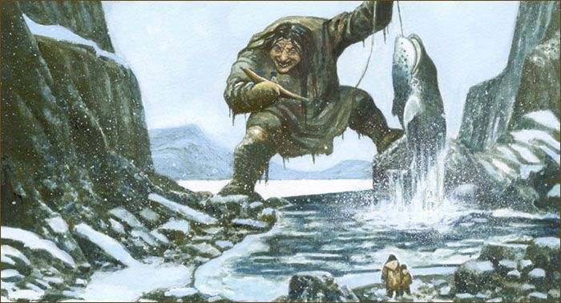
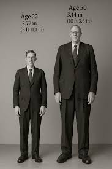
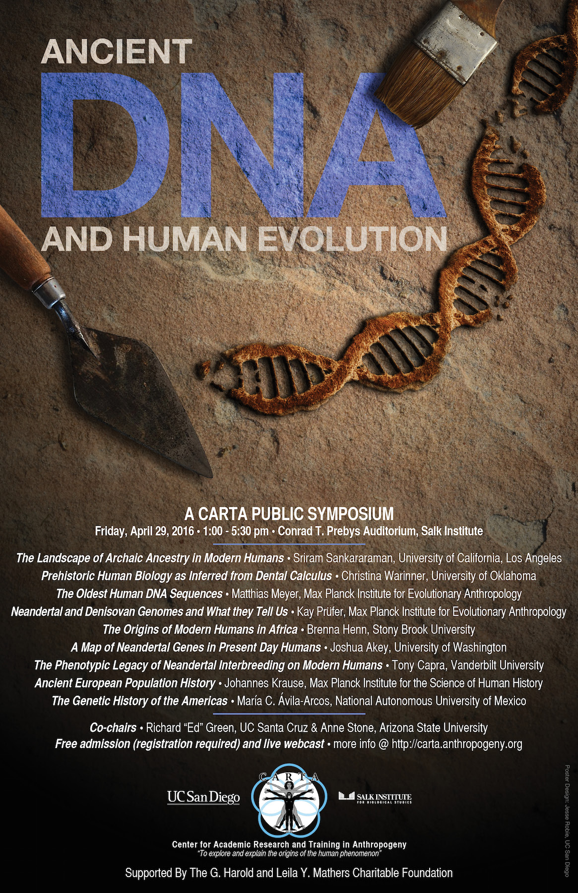
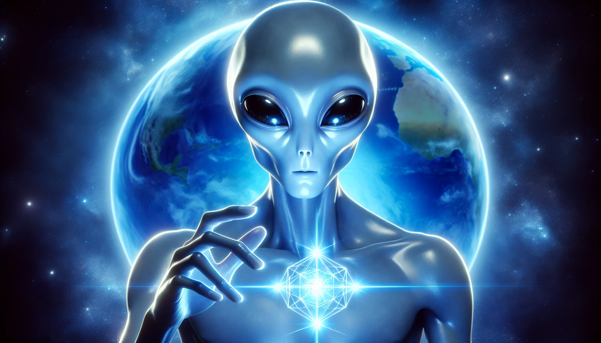

> Nếu người khổng lồ chỉ là truyền thuyết, tại sao câu chuyện về họ lại xuất hiện trong quá nhiều nền văn hóa, tôn giáo và ghi chép cổ đại? Và nếu họ từng tồn tại, điều gì đã khiến bằng chứng về họ biến mất khỏi ký ức chính thống của nhân loại?

### Những dấu vết khổng lồ bị lãng quên

Trong văn hóa dân gian, thần thoại và các ghi chép lịch sử của nhiều nền văn hóa trên thế giới, những câu chuyện về người khổng lồ thời cổ đại thường xuyên xuất hiện.

Khái niệm này cũng hiện diện rõ nét trong các văn bản tôn giáo, đặc biệt là Kinh Thánh.

Các Nephilim được nhắc đến trong sách Sáng Thế như là hậu duệ của "các con trai của Đức Chúa Trời", còn được gọi là Những Người Canh Gác, và "con gái loài người".

Trên thực tế, có rất nhiều khám phá khảo cổ học về những vũ khí lớn bất thường.

Ví dụ thường được nhắc đến gồm chiếc rìu đôi khổng lồ tại Bảo tàng Khảo cổ Heraklion ở Hy Lạp, thanh kiếm Odachi Norimitsu dài hơn 3 mét ở Nhật Bản, các bộ công cụ khổng lồ ở Đan Mạch và Ma-rốc, cùng vô số hài cốt có kích thước không tưởng.

Những dấu vết ấy tạo ra một câu hỏi khó chịu: nếu các câu chuyện này chỉ là tưởng tượng, vì sao chúng lại xuất hiện dai dẳng và lặp lại ở nhiều vùng đất không hề liên hệ trực tiếp với nhau?

### Bí ẩn tại Cahokia và sự biến mất của các hài cốt

Vào cuối mùa hè năm 1908, tại Collinsville, Illinois, gần khu phức hợp gò đất Cahokia, các công nhân xây dựng đã vô tình đào được một ngôi mộ đá chứa nhiều thi thể khổng lồ.

Theo lời kể, mỗi thi thể cao hơn 3,5 mét.

Tuy nhiên, ngay sau khi được phát hiện, các thi thể này đã nhanh chóng biến mất.

Điều này làm tăng thêm sự bí ẩn xung quanh giả thuyết về một chủng tộc người cao lớn từng cư ngụ tại lục địa Mỹ.

Các nhà nghiên cứu cho rằng những gò đất này là chìa khóa để hiểu về các thực thể tổ tiên đã bị lãng quên.

Có hơn 2.000 gò đất hình kim tự tháp ở Bắc Mỹ và Mexico, được cho là đã được xây dựng để tôn vinh những người khổng lồ từng cai trị hoặc hướng dẫn cộng đồng cổ đại.

Điều thú vị là các ghi chép của những nhà thám hiểm đầu tiên đến đảo Phục Sinh cũng xác nhận rằng từng có một chủng tộc khổng lồ thuộc tầng lớp linh mục giám sát việc xây dựng các bức tượng Moai.

Những bức tượng đá khổng lồ này vì thế không chỉ là công trình nghệ thuật, mà còn có thể là dấu tích của một trật tự xã hội cổ đại, nơi kích thước cơ thể, quyền lực tâm linh và tri thức xây dựng cự thạch từng gắn chặt với nhau.

### Viện Smithsonian và cuộc thanh trừng bằng chứng

Trong suốt 200 năm qua, hàng trăm bộ xương lớn, cao từ 2,15 mét đến 2,30 mét, đã được tìm thấy trong các gò đất và nghĩa trang của người bản địa Mỹ.

Nhiều bộ xương trong số đó đã được các nhà khảo cổ liên kết với Viện Smithsonian thu thập để phân tích.

Tuy nhiên, theo các giả thuyết ngoài dòng chính, hầu hết các bộ xương này sau đó đã biến mất khỏi các bảo tàng và tổ chức công cộng dưới chiêu bài "trao trả hài cốt cho thổ dân".

Việc không còn bằng chứng vật lý để nghiên cứu trực tiếp khiến câu chuyện về người khổng lồ bị đẩy vào vùng mờ giữa truyền thuyết và lịch sử bị kiểm soát.

Một khi mẫu vật biến mất, câu chuyện cũng mất đi điểm tựa.

Và khi câu chuyện mất điểm tựa, hệ thống chính thống có thể dễ dàng gọi nó là mê tín, thêu dệt hoặc hiểu nhầm khảo cổ.

### Robert Wadlow và mật mã di truyền ngủ say

Năm 1918, một đứa trẻ tên Robert Wadlow ra đời và trở thành người cao nhất thế giới với chiều cao 2,72 mét.

Dù y học chẩn đoán ông bị phì đại tuyến yên, các nhà di truyền học vẫn đặt ra một câu hỏi khác: liệu đây có phải là sự thức tỉnh của một đoạn gen khổng lồ vốn bị "tắt" đi trong DNA của con người hiện đại?

Các nhà khoa học gợi ý rằng trong bộ gen người có một kho dự trữ lớn các biến thể di truyền đang ở trạng thái không hoạt động.

Khi những phân đoạn này được biểu hiện theo một cách khác, chúng có thể tạo ra những thay đổi đáng kể về kích thước cơ thể con người.

Robert Wadlow có thể là một ví dụ thực tế về khả năng tồn tại của những gen này.

Nếu vậy, câu chuyện về người khổng lồ không nhất thiết chỉ nằm ở khảo cổ học.

Nó có thể còn nằm trong chính mã di truyền của chúng ta, như một chương cũ đã bị khóa lại.

### Những Người canh giữ trí tuệ trên toàn cầu

Người khổng lồ không chỉ được mô tả như những chiến binh.

Theo nhiều văn bản cổ, họ còn là những "Người canh giữ trí tuệ", sở hữu kiến thức vượt bậc.

Họ dạy con người cách xây dựng các cấu trúc cự thạch, cách canh tác nông nghiệp, hiểu về các chu kỳ thiên thể và sử dụng nhiều ngôn ngữ.

Tại Trung Quốc, các nhà thám hiểm như Marco Polo vào thế kỷ 16 và 17 từng ghi chép về sự kinh ngạc khi thấy những người khổng lồ cao tới 4,5 mét làm lính gác trong Cung điện Hoàng gia.

Trong các ấn triện hình trụ của Sumer và phù điêu Ai Cập cổ đại, như ở Đền Dendera, chúng ta thường thấy hình ảnh các vị thần khổng lồ ngồi trên ngai vàng, trong khi con người đứng bên cạnh chỉ nhỏ bé đến đầu gối của họ.

Nếu những hình ảnh này chỉ là ẩn dụ, chúng vẫn phản ánh một sự thật tâm lý: nhân loại cổ đại từng tin rằng có những thực thể vượt trội hơn hẳn con người về kích thước, quyền lực và tri thức.

Nếu chúng không phải ẩn dụ, thì lịch sử chính thống đang thiếu một mảnh ghép rất lớn.

### Những lời kể từ chiều không gian khác và vùng núi Himalaya

Nhà vật lý Gregg Braden kể lại rằng trong các chuyến thám hiểm Tây Tạng, ông đã được các tu sĩ cho xem những phần hài cốt như hộp sọ và cánh tay khổng lồ được tìm thấy trong các hang động hẻo lánh trên dãy Himalaya.

Những sinh vật này được cho là vẫn còn sống ở đó, sống cô độc và không có ngôn ngữ nói như chúng ta.

Trong khi đó, những người có khả năng ghi nhớ tiền kiếp như Matías de Stefano mô tả về hai dòng máu khổng lồ:

- **Nemnir:** Cao lớn, tóc đỏ, sống trong hang động vùng lạnh giá để ghi chép thông tin vào băng.
- **Aessir:** Được liên hệ với các Anunnaki.

Trái với các sinh vật ngoài hành tinh khác vốn chỉ làm việc với thông tin khô khan, người khổng lồ được mô tả là có cảm xúc giống con người.

Họ biết buồn, vui, yêu, thậm chí trầm cảm.

Chính sự tương đồng về cảm xúc này đã khiến nhân loại cổ xưa tin rằng họ có thể trở nên quyền năng như các vị thần, từ đó dẫn đến những câu chuyện về Zeus, Poseidon và nhiều vị thần khổng lồ khác trong thần thoại.

Việc giải mã bí ẩn về người khổng lồ có thể dẫn nhân loại đến việc hiểu rõ hơn về chính mình và những thế lực đã thực sự nhào nặn nên lịch sử thế giới.

Nếu các phần trước nói về Anunnaki, Watchers và những kho tri thức bị thiêu rụi, thì câu chuyện Nephilim đặt ra một câu hỏi trực diện hơn: liệu có một lịch sử của các giống loài lai, các dòng máu đặc biệt và những người canh giữ trí tuệ đã bị cố tình xóa khỏi ký ức nhân loại?
