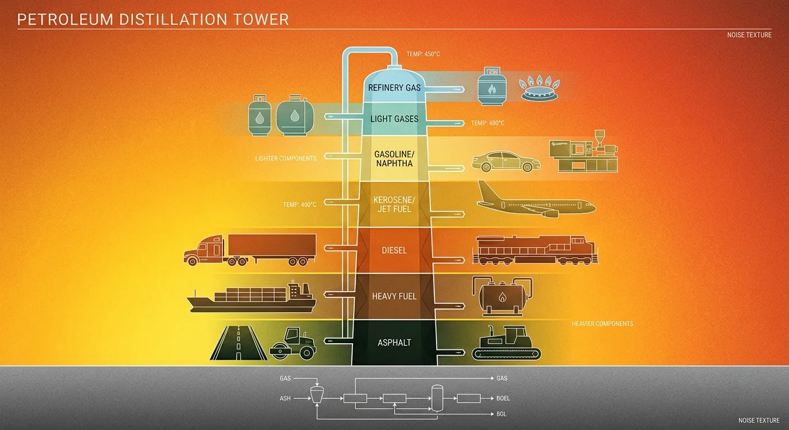
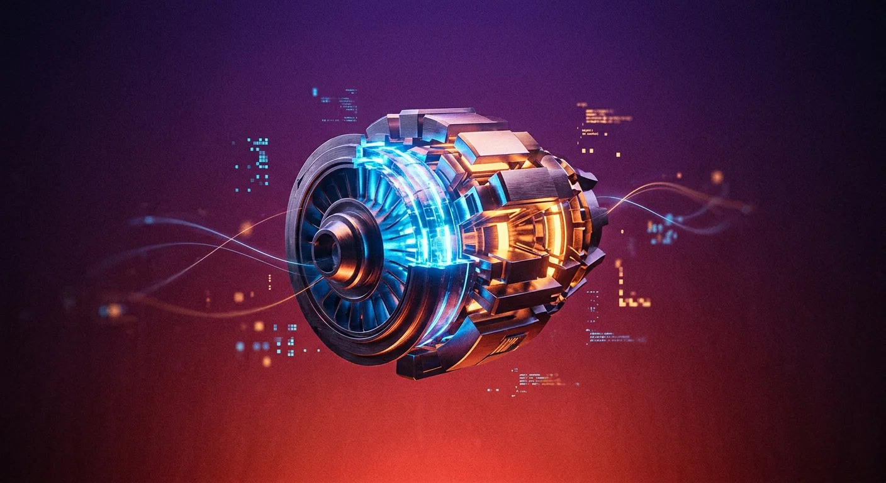
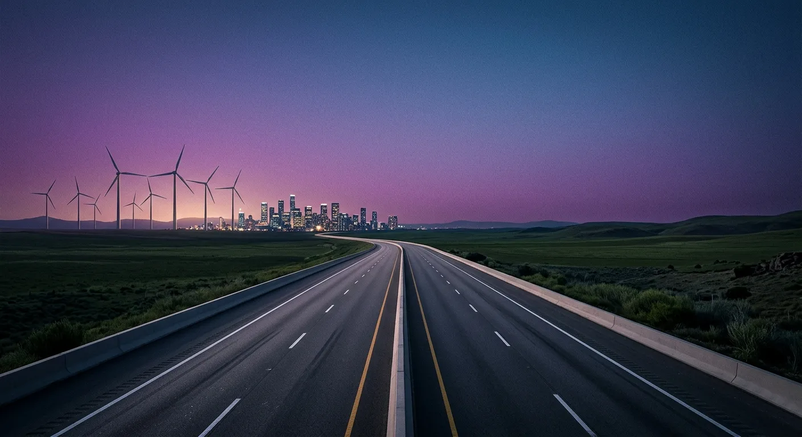
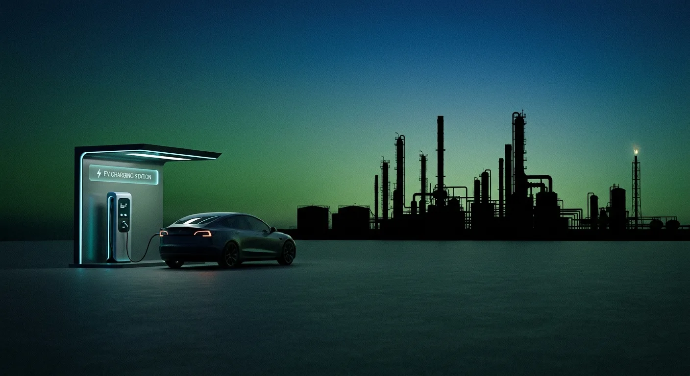

### KỶ NGUYÊN CHUYỂN ĐỔI NĂNG LƯỢNG
**NGHỊCH LÝ XE ĐIỆN VÀ SỰ TIẾN HÓA TẤT YẾU CỦA ĐỘNG CƠ ĐỐT TRONG** 
Trong các cuộc thảo luận về biến đổi khí hậu, viễn cảnh thế giới xóa sổ hoàn toàn xe động cơ đốt trong (ICE) để thay thế bằng 100% xe thuần điện (BEV) thường được vẽ lên như một **thiên đường sinh thái**. Tuy nhiên, nếu chúng ta "chụp X-quang" nền tảng vận hành của nền văn minh hiện đại, sự thật lại phức tạp và khắc nghiệt hơn nhiều. Đó không đơn thuần là sự thay đổi loại nhiên liệu, mà là một cú sốc có thể làm đứt gãy chuỗi cung ứng và gây ra thảm họa lạm phát vật liệu toàn cầu.

### THÁP CHƯNG CẤT DẦU MỎ
**QUY LUẬT VẬT LÝ KHÔNG THỂ ĐẢO NGƯỢC** 
Để hiểu tại sao chúng ta không thể đơn giản là "tắt máy" xe xăng, ta phải hiểu về "trái tim" của ngành công nghiệp hóa dầu: **Tháp chưng cất**.
Dầu thô không chỉ là nhiên liệu; nó là nguyên liệu gốc tạo ra mọi thứ. Khi dầu thô được đun nóng đến khoảng 400°C, nó phân tách thành các tầng sản phẩm cố định dựa trên nhiệt độ ngưng tụ. Dù bạn đi xe điện, cuộc sống của bạn vẫn đang bị "trói chặt" vào hệ thống 10 tầng này với các tỷ lệ vật lý gần như không thể thay đổi theo ý muốn: 
**- Tầng Naphtha (Chén thánh của vật liệu):** Chiếm khoảng 10% sản lượng. Đây là nguyên liệu để sản xuất nhựa, sợi nilon và vật liệu tổng hợp. Từ lốp xe, táp lô, cho đến chính lớp vỏ nhựa bọc khối pin xe điện của bạn đều từ đây mà ra. 
**- Tầng Diesel (Mạch máu của kinh tế):** Chiếm khoảng 30%. Đây là nguồn năng lượng không thể thay thế cho vận tải hạng nặng và máy móc công nghiệp. Điều trớ trêu là các máy xúc, máy ủi khai thác quặng Lithium hay Nickel để làm pin xe điện đều phải "uống" dầu Diesel để vận hành. 
**- Tầng Nhựa đường (Nền tảng hạ tầng):** Nằm dưới đáy tháp, chiếm khoảng 8%. Không có tầng "cặn bã" này, những chiếc xe điện hiện đại nhất cũng chỉ có thể di chuyển trên đường bùn đất thay vì cao tốc hay đường băng sân bay.

### NGHỊCH LÝ 20% XĂNG
**KHI "PHẾ PHẨM" TRỞ THÀNH THẢM HỌA KINH TẾ** 
Xăng chỉ chiếm khoảng **20% sản lượng** của một tháp chưng cất. Đây chính là mắt xích gây tranh cãi nhất trong chiến lược điện hóa toàn cầu.
Hãy giả định kịch bản 100% xe điện xảy ra: nhu cầu xăng bằng không. Tuy nhiên, thế giới vẫn cần Naphtha để làm linh kiện, cần Diesel để khai thác khoáng sản và cần nhựa đường để xây cơ sở hạ tầng. Điều này buộc các nhà máy lọc dầu vẫn phải hoạt động. Khi đó, 20% lượng xăng tự động sinh ra từ quá trình chưng cất sẽ trở thành **rác thải nguy hại dễ cháy nổ**, không có chỗ lưu trữ và không ai tiêu thụ.
Để không phá sản, các nhà máy lọc dầu chỉ còn cách cộng dồn khoản lỗ từ 20% xăng "bỏ đi" này vào giá thành của các sản phẩm còn lại. Hệ lụy tất yếu là: 
**- Chi phí** làm đường cao tốc sẽ tăng vọt lên mức không tưởng. 
**- Giá** lốp xe, đồ nhựa và thiết bị y tế tăng phi mã. 
**- Giá thành** sản xuất chính những chiếc xe điện sẽ bị đẩy lên ngưỡng không thể tiếp cận, khiến thế giới xanh sụp đổ vì lạm phát vật liệu cơ bản

### KHOẢN NỢ CARBON TỪ THƯỢNG NGUỒN
**PHÂN TÍCH VÒNG ĐỜI (LCA)** 
Một sai lầm phổ biến là coi xe điện là "phát thải bằng không". Thực tế, xe điện mang trên mình một *"khoản nợ carbon"* rất lớn ngay từ khi rời nhà máy.
Việc sản xuất bộ pin Lithium-ion tiêu tốn năng lượng gấp nhiều lần so với một động cơ truyền thống. Khai thác khoáng sản như Nickel tại các quốc gia như Indonesia đang để lại những "vết sẹo" môi trường lớn do việc luyện kim vẫn phụ thuộc nặng nề vào điện than. Ước tính, lượng phát thải để chế tạo một chiếc xe điện cao hơn xe xăng từ 40% đến 100% tùy quy mô pin. 
*Điểm hòa vốn carbon* của xe điện phụ thuộc hoàn toàn vào "độ sạch" của lưới điện: 
***- Tại các quốc gia dùng năng lượng tái tạo*** (như Na Uy hay Thụy Điển), xe điện chỉ cần chạy khoảng 15.000 - 25.000 km để bù đắp lượng phát thải khi sản xuất. 
***- Tại những nơi lưới điện vẫn phụ thuộc vào than đá***, quãng đường này có thể kéo dài lên tới hơn 100.000 km. 
Ngoài ra, do trọng lượng xe điện nặng hơn (trung bình 10-30%), lượng bụi mịn (PM2.5) từ sự mài mòn lốp xe và mặt đường của xe điện có thể cao hơn so với xe truyền thống, tạo ra một thách thức mới cho sức khỏe đô thị.

### SỰ CỘNG SINH HOÀN HẢO
**LỜI GIẢI MANG TÍNH TIẾN HÓA** 
Lời giải cho bài toán này không nằm ở việc xóa sổ mà là **"tiến hóa"**. Động cơ đốt trong sẽ không chết, nó chỉ thay đổi vai trò.
Thay vì trực tiếp kéo bánh xe một cách lãng phí trong các đô thị tắc nghẽn, động cơ đốt trong đang lùi về sau để trở thành một máy phát điện hiệu suất cao. Đây là nền tảng của các dòng xe PHEV (xe lai cắm điện) và EREV (xe điện tăng tầm).
Khi chỉ làm nhiệm vụ phát điện, động cơ đốt trong có thể vận hành ổn định tại một dải vòng tua tối ưu nhất (điểm ngọt), giúp đạt được hiệu suất nhiệt lên tới 46% – một con số vượt xa các động cơ truyền thống. Mô hình này cho phép: 
**1. Tiêu thụ vừa đủ 20% lượng** xăng tất yếu sinh ra từ tháp chưng cất, giữ cho chuỗi cung ứng vật liệu hóa dầu ổn định và ngăn chặn lạm phát. 
**2. Tối ưu hóa hiệu suất:** Động cơ tiêu thụ cực ít nhiên liệu nhưng vẫn cung cấp năng lượng dồi dào cho mô-tơ điện, loại bỏ hoàn toàn "nỗi lo quãng đường" của xe thuần điện. 
**3. Hạ cánh an toàn:** Giảm thiểu tối đa khí thải trong khi vẫn duy trì an ninh năng lượng và sự cân bằng của nền kinh tế toàn cầu. 
### KẾT LUẬN
Xăng và điện không phải là kẻ thù; chúng là hai thực thể bắt buộc phải cõng nhau mà sống trong kỷ nguyên chuyển đổi này. Tương lai không thuộc về một phe duy nhất, mà thuộc về sự cộng sinh hoàn hảo. Một cái nhìn thực tế và mô phạm từ góc độ công nghiệp cho thấy: Động cơ đốt trong thế hệ mới chính là mảnh ghép quan trọng nhất để nền văn minh hóa dầu của nhân loại có thể "hạ cánh an toàn" trong một thế giới xanh hơn.
