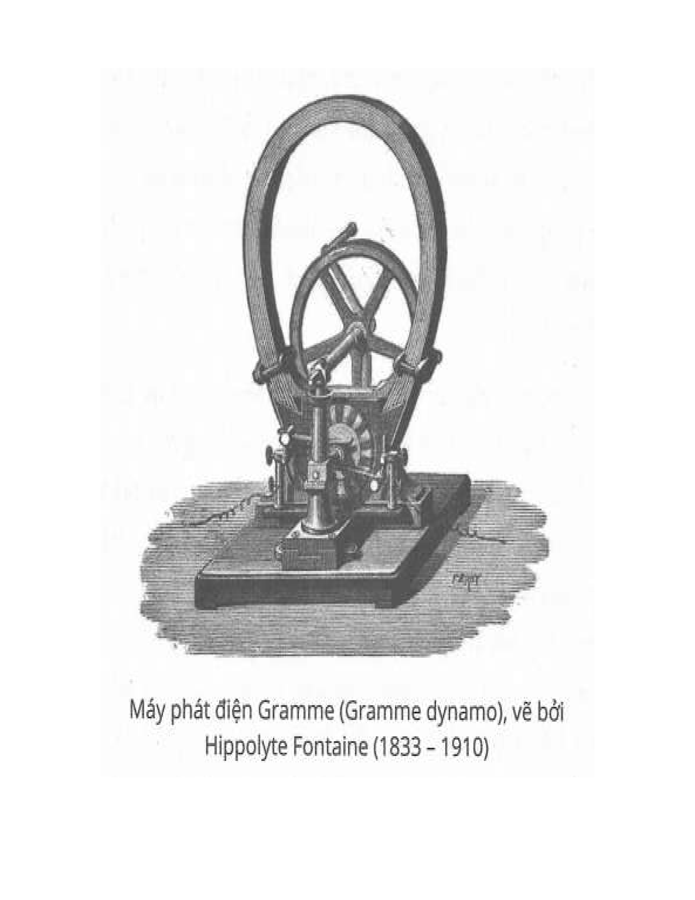

### Chương 3: Từ trường xung 

Lúc 10 tuổi tôi bước chân vào trường cấp hai, một học viện mới và được trang bị khá tốt. Trong khoa vật lý có rất nhiều mô hình điện cơ cổ điển. Thỉnh thoảng các giáo viên tiến hành thí nghiệm mẫu. Những cuộc thí nghiệm này cuốn hút tôi hoàn toàn. Chắc chắn đó là động lực mạnh mẽ nhất đưa đẩy chúng tôi đến với thế giới của những phát minh. Tôi cũng đã nghiên cứu toán học rất say mê, và thường được các thầy khen ngợi nhờ tính toán nhanh nhạy. Cái này là nhờ tôi có khả năng hình dung và thực hiện phép tính trong đầu không theo cách bình thường. Dần dần, việc viết ký hiệu toán học trên bảng hay hình dung trong đầu đối với tôi là như nhau. Chỉ có môn vẽ tay là tôi không khoái nổi. Thật lạ, vì cả nhà tôi đều xuất sắc món này. Có lẽ tôi thấy ác cảm với việc vẽ ra, vì đơn giản là tôi thích hình dung trong đầu hơn, vậy nhanh hơn, dễ hơn, mà chẳng sợ ai quấy rầy. Nếu không kể mấy đứa siêu ngu, mấy đứa lên lớp ngồi cho có, thì môn này tôi đứng chót lớp. Đây là một nhược điểm khá nghiêm trọng, vì theo chế độ giáo dục bấy giờ, môn vẽ là bắt buộc. Khiếm khuyết này đe dọa hủy hoại toàn bộ sự nghiệp của tôi. Cha tôi đã gặp không ít khó khăn khi phải kéo ông con đi từ lớp này sang lớp khác.  
Trong năm học thứ hai, tôi bắt đầu bị ám ảnh bởi ý tưởng tạo ra chuyển động liên tục qua áp suất không khí ổn định. Sự cố máy bơm tôi đã kể ở chương 2 làm cháy lên trí tưởng tượng trẻ trung trong đầu cậu thiếu niên Tesla. Từ ngày đó, tôi dần bị ấn tượng với khả năng vô biên của môi trường chân không. Tôi phát điên lên vì ước muốn khai thác năng lượng vô tận này, nhưng một thời gian dài tôi chỉ biết mò mẫm trong bóng tối. Tuy nhiên, cuối cùng những nỗ lực của tôi đã kết tinh trong một phát minh cho phép tôi đạt được những thành tựu mà không một con người nào khác có thể so sánh được. Hãy tưởng tượng một xi lanh trượt tự do trên hai máng trượt và bao quanh một phần bởi một máng hình chữ nhật vừa khít. Bên mở của máng được bao bọc bởi một phân vùng để phân khúc hình trụ bên trong chia ống bao ngoài này thành hai ngăn hoàn toàn tách rời nhau bởi các khớp trượt ngăn không khí không vào được. Một trong hai ngăn này được đóng kín và khi cả ngăn bên này chỉ còn chân không, ngăn kia vẫn mở. Và cơ cấu này sẽ tạo ra một xi lanh chuyển động vĩnh cửu. Ừ thì ít nhất là hồi đó tôi nghĩ vậy.  
Tôi cẩn thận làm một mô hình bằng gỗ. Khi tôi sử dụng máy bơm ở một bên và qua thực tế quan sát thấy rằng nó có xu hướng chuyển động, tôi vui đến mê sảng. Bay cơ học là mơ ước từ nhỏ của tôi, dù là vẫn còn nhớ rõ bài học về cú ngã đau đớn hồi nhỏ. Khi ấy, tôi thử bay bằng cách cầm ô nhảy từ nóc nhà xuống. Thuở ấu thơ tôi đã mơ ước có thể bay trên không trung đến những vùng xa, nhưng chưa biết phải làm sao. Giờ thì tôi đã có một cái gì đó cụ thể, một chiếc máy bay, dù chiếc máy bay này chỉ là một cái trục gắn thêm đôi cánh. Và một vùng chân không với năng lượng vô biên nữa! Kể từ ngày đó, tôi đã có “những cuộc phiêu lưu” hàng ngày trên bầu trời cao trong một chiếc máy bay tiện nghi và sang trọng như dành riêng cho vua Solomon vậy. Phải mất nhiều năm tôi mới hiểu rằng áp suất khí quyển hoạt động vuông góc với bề mặt xi lanh và hiện tượng xi lanh dịch chuyển nhẹ mà tôi quan sát được chỉ là do cái máy tôi thiết kế bị… rò hơi! Tuy là hiểu biết về sai lầm này đến từ từ và nhẹ nhàng thôi, nhưng tôi vẫn cảm thấy sốc như bị ai đó bóp nát con tim.  
Ngay khi tốt nghiệp trường cấp hai, tôi bị một căn bệnh nguy hiểm-hay đúng hơn là nhiều căn bệnh gộp lại-dập cho liệt giường. Bệnh nặng đến nỗi các bác sĩ cũng bó tay không thể chữa khỏi hẳn. Trong thời gian này, tôi được đọc sách thường xuyên. Tôi được giao cho phân loại và sắp xếp sách ở thư viện công cộng. Thế là tôi có thể đọc vì ở chỗ đó chả mấy ai thèm ngó ngàng tới.  
Một ngày kia, tôi được trao cho vài quyển sách văn học mới không giống thứ gì mà tôi đã từng đọc cả, và nó hay đến độ làm tôi quên hẳn trạng thái tuyệt vọng của mình. Đó là những tác phẩm đầu tay của Mark Twain. Có thể nhờ vậy mà tôi đã hồi phục một cách thần kỳ sau đó. 25 năm sau, khi tôi gặp ông Clemens và trở thành bạn bè, tôi đã kể với ông chuyện này. Thật ngạc nhiên khi thấy con người của tiếng cười bật khóc trong hạnh phúc…  
Tôi tiếp tục học cấp ba ở Carlstadt, Croatia, vì một trong số các cô của tôi sống ở đó. Cô là một phụ nữ nổi bật, vợ một đại tá - một người dày dạn kinh nghiệm đã từng tham gia nhiều trận đánh. Tôi không bao giờ có thể quên được ba năm ở tại nhà họ. Không một khu quân sự thời chiến nào có kỷ luật cứng rắn hơn thế. Tôi được nuôi như một con chim hoàng yến. Tất cả các bữa ăn đều có chất lượng cao, nhưng số lượng thì thiếu hụt dữ dội. Cô tôi cắt thịt giăm bông mỏng như tờ giấy, ăn không khéo thì đứt cả lưỡi. Khi ông chú đại tá gắp một món gì đó to to vào đĩa cho ông cháu, thì cô giật lại và nói ngay: “Đừng làm vậy chứ anh, Niko nó tinh tế lắm đấy!” Khổ cái là tôi rất phàm ăn nhưng không dám nói, nên phải chịu đựng như vua Tantalus.* Thật là cám treo heo đói!  
Được cái trong thời gian này, tôi được sống trong một bầu không khí tinh tế và đậm chất nghệ thuật, khá bất thường trong thời đó. Vùng đất chỗ tôi ở thì thấp và sình lầy, sốt rét thì bám riết tôi dù tôi đã nốc hàng tạ thuốc ký ninh. Có lúc nước sông dâng lên, xua cả một đội quân chuột vào các tòa nhà, ngấu nghiến tất cả mọi thứ, ngay cả những bó ớt paprika cay xé lưỡi tụi nó cũng không chừa. Lũ chuột đã chỉ cho tôi một hướng đi thú vị khác. Tôi làm tiêu hao lực lượng của chúng bằng mọi phương tiện và trở thành nhà vô địch bắt chuột trong cộng đồng.  
Cuối cùng thì khóa học của tôi cũng được hoàn thành, khổ đau kết thúc, tôi nhận được giấy chứng nhận trưởng thành. Tờ giấy ấy đã đưa tôi đến trước lối rẽ cuộc đời.  
Suốt những năm đó cha mẹ tôi luôn quyết tâm cho ông con theo con đường giáo sĩ. Chỉ nghĩ đến thôi là tôi đã hãi lắm rồi. Tôi thì ngày càng quan tâm đến điện do ảnh hưởng từ thầy dạy vật lý, một con người khéo léo hay thể hiện các nguyên lý bằng máy móc do chính ông phát minh. Trong số này tôi nhớ lại một thiết bị giống bóng đèn xoay tự do, với một lớp phủ giấy thiếc. Khi nối với máy cố định nó sẽ quay tít. Tôi không thể nào diễn tả được đầy đủ cảm xúc mãnh liệt trong lòng mình khi chứng kiến những cuộc thí nghiệm biểu diễn các hiện tượng kỳ bí của thầy. Mỗi ấn tượng tạo ra ngàn tiếng vọng trong tâm trí tôi. Tôi muốn biết nhiều hơn về sức mạnh diệu kỳ này, tôi khao khát thử nghiệm và kiểm tra, chấp nhận đối mặt với nỗi đau thất bại.  
Ngay khi tôi chuẩn bị về nhà thì nhận được tin cha muốn tôi tham gia một chuyến đi săn. Đó là một yêu cầu kỳ lạ, vì ông luôn kịch liệt phản đối loại hình thể thao này. Vài ngày sau, tôi biết được rằng dịch tả đang hoành hành trong vùng đó. Lợi dụng thời cơ, tôi trở về Gospic bất chấp ý muốn của cha mẹ.  
Thật khó tin nổi người ta hoàn toàn chẳng biết gì về các nguyên nhân gây bệnh, dù cứ mười lăm hay hai mươi năm nó lại đến thăm đất nước này một lần. Họ nghĩ rằng các tác nhân gây chết người được truyền qua không khí, có mùi hăng và trông như khói. Trong khi đó, họ cứ uống nước nhiễm khuẩn rồi lăn quay ra chết như rạ. Tôi đã dính phải căn bệnh chết người này vào chính ngày tôi về đến Gospic. Dù rằng vẫn qua cơn bạo bệnh, nhưng tôi đã phải nằm liệt giường suốt chín tháng trời, hầu như không thể cử động được. Năng lượng của tôi hoàn toàn cạn kiệt. Đó là lần thứ hai tôi thấy mình đang ở trước ngưỡng cửa Tử Thần.  
Trong thời gian này, có một lần tôi bị dịch tả hành gần chết. Cha vội vã chạy vào phòng. Tôi thấy khuôn mặt xanh xao của ông đang cố làm tôi vui, dù rằng giọng không có chút tự tin nào. Tôi nói:  
– Có khi con sẽ khỏe lại nếu cha cho con học kỹ thuật.  
– Con sẽ đi học tại học viện kỹ thuật tốt nhất thế giới.  
Ông trịnh trọng trả lời, và tôi biết là ông nói nghiêm túc. Một gánh nặng đã được dỡ bỏ khỏi tâm trí tôi, nhưng sự nhẹ nhõm đó chắc cũng chả ích gì nếu không có sức mạnh của chén thuốc đắng làm từ một loại hạt đặc biệt. Từ ngày đó, tôi dần khỏe lại như vừa ngâm mình trong hồ nước thần. Mọi người vừa mừng vừa sửng sốt.  
Khi sức khỏe tôi đã ổn định, cha bảo rằng tôi nên bỏ ra một năm tập thể dục lành mạnh ngoài trời. Tôi miễn cưỡng đồng ý.  
Hầu hết thời gian này tôi đi lang thang trên núi, đem theo bộ đồ thợ săn và một mớ sách. Cuộc sống giữa thiên nhiên làm tôi mạnh mẽ hơn về thể xác cũng như tinh thần. Trong thời gian này, tôi suy nghĩ, lên kế hoạch và hình thành nhiều ý tưởng. Tuy vậy, đa số đều là sai lầm. Tầm nhìn thì khá rõ ràng, nhưng kiến thức về các nguyên lý thì rất hạn chế.  
Trong số các “phát minh” của tôi trong thời kỳ này có một ý tưởng như sau: Tôi đề nghị chuyển tải thư, bưu kiện qua biển, bằng một ống ngầm, trong các thùng chứa hình cầu đủ mạnh để chịu được áp suất của nước. Nhà máy bơm đẩy nước qua đường ống. Dĩ nhiên là mọi thứ được tính và thiết kế chính xác; tất cả các bộ phận đặc biệt đều được thực hiện một cách cẩn thận. Chỉ có một chi tiết có vẻ nhỏ và không quan trọng là tôi không chú ý tới. Tôi tự cho vận tốc nước một giá trị, rồi tự ý cho giá trị này cao thật là cao, rồi từ đó tính toán thật chính xác. Kết quả là hệ thống lý thuyết này có hiệu quả cực cao. Thế nhưng, sau khi tính tiếp thì tôi thấy với lực chảy này, đường ống sẽ không chịu nổi. Cuối cùng, tôi quyết định tặng luôn phát minh này cho nhân loại và để thế hệ sau nghiên cứu tiếp.  
Một dự án khác của tôi là xây dựng một vòng đai quanh xích đạo. Tất nhiên, nó sẽ trôi nổi tự do và có thể bị hãm đà quay một chút do các lực cản. Như vậy, theo tính toán (dĩ nhiên là lý thuyết) thì nó có thể đi với tốc độ khoảng một ngàn dặm một giờ, nhanh hơn đường sắt biết bao nhiêu. Này, bạn đọc đừng cười nhé. Kế hoạch này hơi… bất khả thi thật, nhưng cũng đâu có thua kém ý tưởng của một ông giáo sư New York gần đây chứ. Ông còn muốn bơm không khí từ nhiệt đới sang ôn đới kia, dù rằng trên thực tế Chúa trời đã cung cấp sẵn một chiếc máy khổng lồ cho mục đích này.*  
Còn một đề án khác nữa, quan trọng và hấp dẫn hơn nhiều, là thu điện năng từ năng lượng quay của thiên nhiên trên mặt đất. Tôi đã phát hiện rằng sự quay hằng ngày của địa cầu làm một số vật thể trên bề mặt trái đất chuyển động tịnh tiến luân phiên cùng hoặc nghịch hướng quay. Như vậy, ta có thể có phương pháp đơn giản cung cấp động năng cho bất kỳ khu vực nào có thể sinh sống được của trái đất. Tôi không thể tìm ra từ ngữ để mô tả sự thất vọng của mình khi phát hiện ra rằng mình đang đối mặt với một tình thế nan giải chẳng khác gì ông Archimedes đòi phải có điểm tựa trong vũ trụ để nâng bổng trái đất lên.*  
Khi kết thúc kỳ nghỉ, tôi được gửi đến trường Bách khoa Kỹ thuật ở Graz, Styria (Áo). Cha đã chọn một trong những học viện lâu đời và danh tiếng nhất. Đó là giây phút tôi háo hức chờ đợi; tôi bắt đầu nghiên cứu dưới sự bảo trợ tốt và quyết tâm thành công. Sự luyện tập trước đây của tôi đạt mức trên trung bình, nhờ sự chỉ giáo của cha và cơ hội có sẵn. Tôi đã có được kiến thức về một số ngôn ngữ và đã hụp lặn với những cuốn sách ở thư viện. Nói chung, tôi đã có cơ hội tiếp cận các kiến thức ít nhiều hữu ích. Và giờ đây, tôi có thể chọn môn học tôi thích, còn môn vẽ tay sẽ không thể làm phiền tôi được nữa.  
Tôi quyết tâm làm cho cha mẹ ngạc nhiên nên trong suốt năm đầu tiên, tôi thường bắt đầu công việc lúc 3 giờ sáng và tiếp tục cho đến 11 giờ đêm, không có nghỉ Chủ nhật hay nghỉ lễ gì hết. Vì hầu hết các bạn học của tôi ít chịu học, lẽ tự nhiên tôi đã làm lu mờ tất cả các kỷ lục ở trường. Trong năm đầu, tôi thanh toán xong 9 môn. Các thầy nghĩ rằng tôi xứng đáng nhận điểm cao hơn cả điểm tối đa. Hí hửng cầm bảng điểm, giấy chứng nhận cùng lời ngợi khen từ các thầy, tôi về quê chơi một thời gian ngắn, lòng khấp khởi chờ thời khắc ca khúc khải hoàn, vinh quy bái tổ. Nhưng thật xấu hổ, cha chẳng coi mấy thành tựu vượt bậc này ra củ khoai tây gì cả. Chuyện này làm tôi gần như mất hết tham vọng. Thế nhưng sau này, khi cha qua đời, tôi đau đớn tìm thấy một xấp thư mà các giáo sư đã viết cho ông, đại khái là nếu ông không đưa tôi đi khỏi trường, tôi sẽ chết vì làm việc quá sức.  
Sau đó, tôi đã hiến thân mình chủ yếu cho ngành vật lý, cơ học và nghiên cứu toán học, dành nhiều giờ giải trí trong thư viện. Tôi có xu hướng luôn muốn kết thúc bất cứ thứ gì mình đã bắt đầu, và thói quen đó thường đưa tôi vào thế khó. Có một lần tôi bắt đầu đọc công trình của Voltaire. Sau đó tôi mới kinh hãi khi phát hiện ra rằng ông quái nhân này có đến gần 100 tập dày in chữ siêu nhỏ, thành quả của việc vừa viết vừa uống 72 tách cà phê đen mỗi ngày. Lỡ đọc thì phải đọc cho hết. Khi thanh toán xong quyển cuối cùng, tôi mừng muốn chết, lòng tự nhủ: “Không có lần sau nữa đâu nhé ông Voltaire!”  
Nhờ năm đầu thể hiện bản lĩnh nên tôi đã được nhiều thầy yêu mến, trong đó có thầy Rogner dạy số học và hình học, thầy Poeschl môn vật lý lý thuyết và thực hành, thầy Alle dạy tích phân và vị phân. Thầy Alle là một nhà khoa học, và cũng là giảng viên xuất sắc nhất mà tôi từng nghe giảng. Ông quan tâm đặc biệt sự tiến bộ của tôi và thường xuyên ở lại một hai giờ trong giảng đường, ra cho tôi những bài toán để giải. Tôi vừa thích vừa mừng. Tôi đã trình bày với thầy mô hình chiếc máy bay mà tôi ấp ủ từ lâu. Đó không phải là một phát minh ảo tưởng, mà dựa trên các nguyên lý khoa học vững chắc. Nó đã trở thành hiện thực qua tua-bin tôi thiết kế và sẽ sớm được trình làng.  
Thầy Rogner và thầy Poeschl đều là những người tò mò. Thầy Rogner có những cách diễn tả rất đặc biệt. Mỗi lần ông diễn tả là cứ như đang có một cuộc nổi loạn, theo sau là một quãng yên lặng ngập ngừng lúng túng kéo dài. Thầy Poeschl là một người Đức có phương pháp và nền tảng toàn diện. Ông có đôi bàn chân khổng lồ, còn đôi bàn tay thì như vuốt gấu, thế nhưng tất cả các thí nghiệm của ông đều được thực hiện khéo léo, chính xác như đồng hồ, không một chút sai sót nào.  

Vào năm học thứ hai, chúng tôi nhận được một bộ Gramme dynamo từ Paris, gồm một nam châm từ phủ chất dẻo hình móng ngựa, một cái lõi đồng và một bộ chuyển mạch. Chúng tôi lắp vào để quan sát các hiệu ứng của dòng điện. Trong khi thầy Poeschl đang minh họa chạy cái mô tơ điện thì phần quét của mô tơ đánh lửa xẹt xẹt tung tóe nhìn rất gớm. Tôi quan sát và tuyên bố rằng có thể vận hành động cơ mà không cần bộ phận này. Thầy Poeschl bảo là không được, và khi kết thúc bài giảng, ông còn nói thêm rằng “anh Tesla có thể làm được những điều tuyệt vời, nhưng về vụ này thì chắc chắn là phải bó tay.” Theo thầy thì ý tưởng của tôi cơ bản là chuyển lực kéo ổn định (ví dụ như lực hút trái đất) thành chuyển động quay. Đó là một hệ chuyển động vĩnh cửu, một ý tưởng bất khả thi. Tuy nhiên, bản năng là cái gì đó ưu việt hơn kiến thức. Không nghi ngờ gì nữa, trong mỗi chúng ta luôn có những kẻ nói dối vô hại cho phép bản thân mình cảm nhận được chân lý khi sự suy diễn logic và các hoạt động não có ý thức đưa con người đến ngõ cụt tư duy.  
Một thời gian tôi tin vào thầy, nghĩ rằng các thầy luôn đúng. Tuy nhiên, tôi sớm phát hiện ra rằng có những lúc mình đúng, và bắt đầu tự tìm hiểu để thực hiện ý tưởng với tất cả nhiệt huyết và sự tự tin vô biên của tuổi trẻ. Tôi bắt đầu bằng cách hình dung trong tâm trí một chiếc máy phát điện một chiều, vận hành nó và theo dõi cách dòng điện thay đổi trong bộ phận lõi. Sau đó, tôi tưởng tượng thêm một bộ phận xoay chiều và kiểm tra các thay đổi trong hệ thống. Tiếp theo, tôi hình dung hệ thống bao gồm động cơ và máy phát điện rồi thử vận hành theo những cách khác nhau. Các hình ảnh tôi thấy đối với tôi hoàn toàn thực như đang ở ngay trước mắt tôi vậy.  
Tôi bỏ hết thời gian ở Gratz để nghiên cứu cái máy này, dù rất căng thẳng nhưng không có kết quả. Tôi gần như bỏ cuộc và kết luận rằng đúng là ý tưởng này không thể dùng được. Năm 1880 tôi đến Prague, Bohemia học đại học theo ước muốn của cha. Chính tại thành phố đó tôi đã có một cải tiến mang tính quyết định: Tôi tách bộ chuyển mạch khỏi máy và nghiên cứu theo phương diện mới. Tuy vậy, vẫn không thành công. Trong năm tiếp theo, bỗng dưng tôi có một sự thay đổi đột ngột trong quan điểm sống.  
Tôi chợt nhận ra rằng cha mẹ đã hy sinh cho mình quá lớn. Tôi quyết tâm giúp cha mẹ thoát khỏi gánh nặng đó.* Làn sóng điện thoại Mỹ vừa đến lục địa châu Âu và hệ thống đã được thiết đặt tại Budapest, Hungary. Đó có vẻ như là một cơ hội lý tưởng, thậm chí còn lý tưởng hơn khi một người bạn của gia đình chúng tôi là chủ công ty điện thoại. Chính ở đây tôi phải chịu đựng sự suy sụp thần kinh hoàn toàn mà tôi đã đề cập ở phần trước. Căn bệnh đã hành tôi đến độ không tưởng tượng nổi. Thị giác và thính giác của tôi luôn luôn khác thường. Tôi có thể nhận ra rõ ràng các đối tượng ở đằng xa khi những người khác không nhìn thấy gì cả. Nhiều lần trong thời niên thiếu, tôi đã cứu nhà hàng xóm khỏi bị cháy nhờ nghe tiếng lách tách nho nhỏ và kêu cứu, trong khi hàng xóm ngủ chẳng hề hay biết. Năm 1899, khi tôi đã hơn 40 và đang tiến hành các thí nghiệm ở Colorado, tôi có thể nghe rõ tiếng sấm rền ở khoảng cách 550 dặm. Tai tôi nhạy cảm hơn người thường 13 lần. Tuy nhiên hồi đó, trong trạng thái bình thường, thính giác của tôi kém hẳn - nếu không muốn nói là điếc đặc - so với thính giác trong trạng thái căng thẳng thần kinh.  
Khi trong trạng thái căng thẳng ở Budapest, tôi có thể nghe tiếng tích tắc của một chiếc đồng hồ cách tôi 3 căn phòng. Một con ruồi đậu xuống bàn trong phòng cũng gây ra một tiếng động nặng nề trong tai tôi. Một cỗ xe đi qua ở khoảng cách vài dặm làm lắc lư toàn thân tôi. Tiếng còi của một đầu máy cách xa 20 hay 30 dặm cũng làm bàn ghế tôi ngồi rung mạnh, đầu đau không chịu nổi. Mặt đất dưới chân tôi rung lên liên tục. Tôi phải kê giường trên đệm cao su để có thể nghỉ ngơi đôi chút. Những tiếng động ầm ầm gần xa hiện rõ thành lời nói trong não tôi, khiến tôi sợ muốn chết cho tới khi phân tách được các âm thanh này ra riêng. Những tia nắng mặt trời lúc ẩn lúc hiện thường tác động mạnh vào bộ não làm tôi choáng váng. Tôi đã phải triệu tập tất cả sức mạnh ý chí của mình để đi qua bóng râm dưới cây cầu hay các vật thể tương tự, bởi sự thay đổi ánh sáng làm hộp sọ tôi như bị đá đè vậy. Trong bóng tối tôi có giác quan của một con dơi, và có thể phát hiện sự hiện diện của một đối tượng ở khoảng cách gần 4 mét bởi một cảm giác rờn rợn đặc biệt ở trên trán. Mạch đập của tôi thay đổi từ một vài nhịp đến 260 nhịp và tất cả các mô của cơ thể tôi có những cơn co giật và run, có lẽ trạng thái này là khó chịu nhất. Một bác sĩ nổi tiếng cho tôi một liều kali bromide nặng và nói rằng bệnh của tôi trước nay ông chưa hề thấy và có lẽ là sẽ không thể chữa khỏi.  Điều tôi mãi hối tiếc chính là lúc đó không được các chuyên gia sinh lý và tâm lý học quan sát. Tôi tuyệt vọng bám lấy cuộc sống, không hề mong ngày hồi phục. Ai có thể tin rằng một người bị khiếm khuyết về thể xác, vô vọng như vậy lại có ngày biến thành người có sức mạnh và sự kiên trì kỳ lạ, với khả năng làm việc 38 năm hầu như không nghỉ một ngày, và thấy mình vẫn mạnh mẽ và tươi tỉnh cả thể xác lẫn trí tuệ chứ? Đó là trường hợp của tôi. Khát khao sống và tiếp tục công việc, cộng thêm sự giúp đỡ từ một người bạn tận tâm - một vận động viên-đã tạo nên điều kỳ diệu. Sức khỏe của tôi dần phục hồi và cùng với nó là sức sống của trí tuệ khi trở lại giải quyết các vấn đề khó khăn. Phải nói là tôi hơi tiếc vì cuộc chiến kết thúc sớm quá. Tôi còn rất nhiều năng lượng dự phòng. Khi tôi hiểu mình phải chiến đấu với thần chết, thì tôi không xem đó là một thứ cần quyết tâm như bình thường. Với tôi đó là một lời thề thiêng liêng, một câu hỏi của sự sống và cái chết. Tôi biết rằng mình sẽ chết nếu thất bại. Bây giờ tôi cảm thấy rằng mình đã thắng. Giải pháp chiến thắng thần chết nằm sâu trong não bộ, nhưng tôi chưa tìm ra cách thể hiện được nó ra ngoài.  
Có một buổi chiều luôn hiện diện trong ký ức của tôi. Lúc đó tôi đang vừa đi dạo với một người bạn trong công viên thành phố vừa đọc thơ. Ở tuổi đó, tôi thuộc lòng từng chữ các cuốn sách. Một trong số đó là bài thơ Faust của Goethe. Mặt trời đang lặn, gợi tôi nhớ đến đoạn thơ huy hoàng này:  
> Sie rückt und weicht, der Tag ist überlebt,  
Dort eilt sie hin und fördert neues Leben.  
O daß kein Flügel mich vom Boden hebt  
Thr nach und immer nach zu streben!  
Ein schöner Traum, indessen sie entweicht.  
Ach! zu des Geistes Flügeln wird so leicht  
Kein körperlicher Flügel sich gesellen.  
* Tạm dịch:  
Mặt trời dần tắt, ngày dần qua  
Một thế giới khác trước mắt ta  
Hiện thân trong ánh chiều tà  
Người nâng tôi đến vùng xa huy hoàng!  
Trong giấc mơ, bóng người mất dạng  
Than ôi, đôi cánh phàm trần  
Sao thay thế được hiện thân thiên thần. 

Khi tôi thốt ra những câu thơ đầy cảm hứng ấy thì ý tưởng đến như một tia chớp. Trong chính khoảnh khắc đó chân lý được tiết lộ. Tôi dùng gậy vẽ trên cát, sơ đồ này được thể hiện sáu năm sau đó trong bài nói chuyện của tôi trước Viện Kỹ sư điện Mỹ, và người bạn đồng hành của tôi hiểu ý tưởng hoàn toàn. Các hình ảnh tôi thấy sắc nét, rõ ràng một cách tuyệt vời, vững vàng như sắt thép và đá tảng. Tôi đã nói với người bạn của mình rằng: “Xem động cơ của tôi đây; xem tôi chuyển hướng nó nhé.” Tôi không biết mô tả cảm xúc của tôi từ đầu. Nhà điêu khắc Pygmalion khi thấy bức tượng của mình sống dậy thành người cũng không thể xúc động hơn thế.* Dù có thể tình cờ phát hiện được ngàn vạn bí mật của thiên nhiên, tôi cũng vẫn sẵn sàng đổi lấy chỉ một bí mật này, bí mật mà tôi đã phải vật lộn một quãng thời gian dài, bất chấp nguy hiểm để mà khám phá ra…
