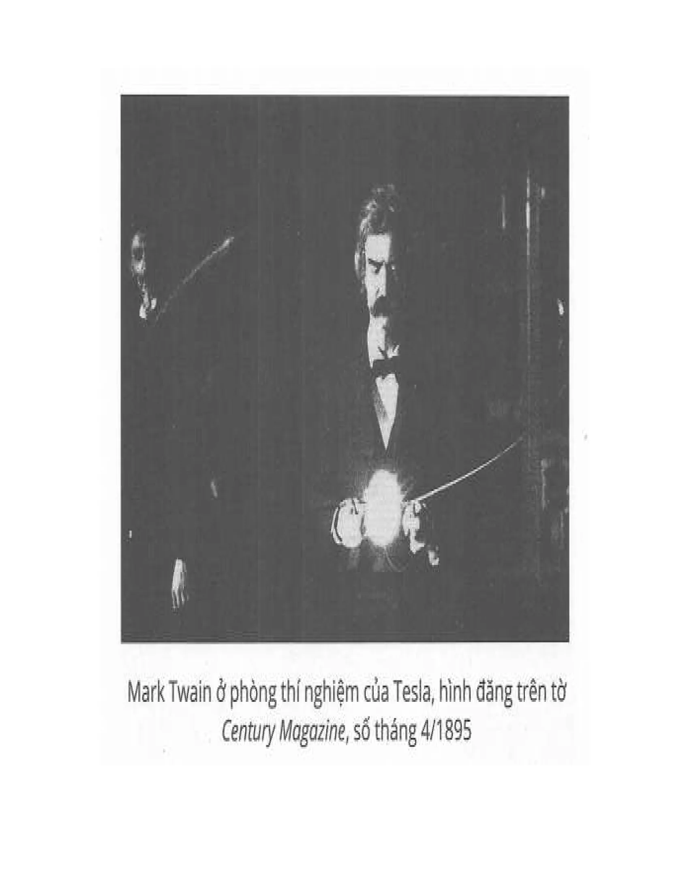
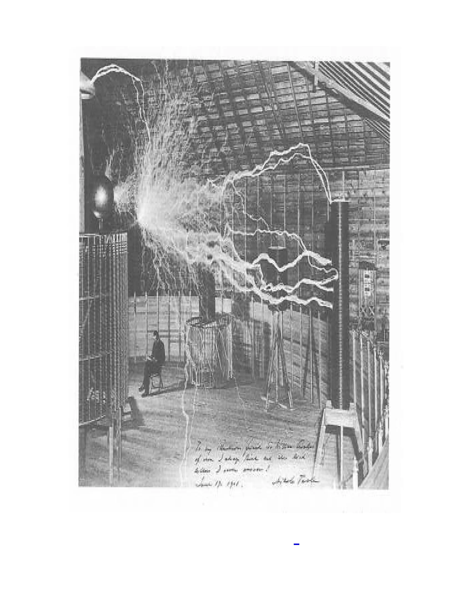

### Chương 5: Định mệnh thành hình 

Khi nghĩ lại về các sự kiện đã qua trong đời, tôi chợt nhận ra luôn có những luồng ảnh hưởng định hình định mệnh của mỗi người. Có thể lấy một sự kiện thời trẻ của tôi làm ví dụ.  
Một ngày đông nọ, tôi leo lên một đỉnh núi khá dốc với mấy đứa bạn. Lúc đó tuyết khá dày, trời lại có gió nam ấm áp, nên mọi thứ đều thuận lợi. Cả đám chơi ném bóng tuyết. Những quả bóng tuyết nhỏ lớn dần theo quãng đường lăn. Trò này hóa thành một môn thể thao. Đứa nào cũng cố gắng làm bóng của mình càng to càng tốt. Bất chợt có một quả bóng tuyết vượt khỏi tầm kiểm soát, dần lớn bằng cả cái nhà rồi rơi xuống thung lũng phía dưới. Khi nó chạm đất, cả ngọn núi như rung chuyển. Tôi nhìn trân trân quả bóng tuyết, không thể hiểu chuyện gì đã xảy ra. Cả mấy tuần sau, hình ảnh này vẫn cứ tái hiện trước mắt tôi. Tôi không thể hiểu vì sao một thứ nhỏ nhoi có thể trở nên to lớn đến như vậy.  
Kể từ ngày đó, tôi bắt đầu quan tâm đến việc phóng đại những thứ nhỏ nhoi. Nhiều năm sau, khi nghiên cứu cộng hưởng cơ điện, tôi đã rất hứng thú ngay từ đầu. Có thể nói, nếu không nhờ ấn tượng về quả bóng tuyết, tôi đã chẳng đủ kiên nhẫn dõi theo những tia lửa nhỏ xuất hiện trong cái lõi của mình. Tôi sẽ chẳng bao giờ có phát minh tuyệt vời như vậy. Quả bóng tuyết đó là một phần quan trọng của lịch sử. Nhiều người học kỹ thuật dù rất giỏi, nhưng lại có tâm thế tư duy cứng nhắc theo khuôn mẫu, tầm nhìn ngắn hạn. Họ bảo rằng động cơ điện không đồng bộ (induction motor) của tôi chẳng dùng được vào việc gì cả. Thật là một sai lầm đáng tiếc. Không nên đánh giá một ý tưởng mới bằng kết quả tức thời.* Hệ thống truyền điện xoay chiều của tôi được ra đời ở một thời đặc biệt, và nó là kết quả của những nỗ lực không ngừng nghỉ tìm kiếm câu trả lời cho các câu hỏi khó của ngành. Rõ ràng, dù nhiều người phản đối, cuối cùng hệ thống này vẫn vượt qua mọi đối thủ với lợi ích trái ngược. Việc dòng điện xoay chiều được đưa vào khai thác thương mại đã trở thành hiện thực.  
Bây giờ ta hãy dùng cách tư duy này để suy xét các tua-bin của tôi. Người ta có thể nghĩ rằng phát minh này thật đơn giản và hoàn mỹ. Nó là động cơ chuẩn, nên sử dụng ngay (và dĩ nhiên đúng là vậy). Thế nhưng, vấn đề hiện tại của từ trường xoay không phải là tạo ra ngay các loại máy vô dụng. Ngược lại, vấn đề quan trọng nhất hiện tại là tìm cách tăng thêm giá trị của từ trường xoay. Hệ thống hiện tại hỗ trợ cho các phát kiến phát triển cái cũ. Tuy nhiên, tua-bin của tôi hoàn toàn khác: Nếu nó thành công, nghĩa là toàn bộ các động cơ thiết kế theo kiểu hiện tại–thứ đã được đổ cả tỉ đô la vào đầu tư—sẽ bị loại bỏ. Do vậy, tiến trình phát triển động cơ mới sẽ chậm và gặp nhiều trắc trở do các chuyên gia về động cơ truyền thống sẽ tìm cách ngăn trở một cách có tổ chức.  
Ngày nọ, tôi gặp một chuyện khá nản lòng. Lần đó, tôi gặp Charles F. Scott,* bạn và trợ lý cũ của tôi. Giờ anh đang là giáo sư cơ điện ở Yale. Cũng lâu rồi tôi không gặp anh, và rất mừng khi có cơ hội nói chuyện với anh ở ngay văn phòng mình. Cuộc tán gẫu chuyển sang chủ đề tua-bin, và tôi rất hào hứng.  
Tôi nói, đôi mắt bừng ánh hào quang của tương lai: “Scott à, tua-bin của tôi sẽ làm các động cơ nhiệt thành sắt vụn hết!”  
Scott vuốt cằm, nhìn xa xăm vẻ tính toán lắm. Sau đó, anh nói: “Vậy thì cả thế giới này thành bãi sắt vụn hết rồi.”  
Thế rồi anh bỏ đi không nói thêm lời nào.  
Tuy vậy, phát minh này và nhiều phát minh khác của tôi chỉ đơn giản là bước tiến nhỏ theo một hướng nào đó mà thôi. Khi phát triển ý tưởng, tôi đơn giản chỉ làm theo bản năng: Tôi chỉ muốn cải tiến các loại máy hiện tại chứ không hề nghĩ tới các ứng dụng to lớn xa vời. Để chiếc máy phóng điện cao thế (Magnifying Transmitter) thành hình với ứng dụng như hiện tại cần mấy năm trời làm việc để nó từ một chiếc máy giải quyết vấn đề nhỏ trở thành một giải pháp cho các vấn đề quan trọng của nhân loại. Về cơ bản, nó không còn chỉ là một cải tiến công nghiệp nữa rồi.  
Nếu tôi nhớ không nhầm, thì vào tháng 11/1890 tôi đã thực hiện một thí nghiệm cho kết quả kỳ lạ và hoành tráng nhất nhì lịch sử khoa học. Khi đang nghiên cứu điện cao tần, tôi đã phát hiện ra rằng một điện trường cường độ cao có thể được tạo ra trong phòng để thắp sáng các điện cực chân không. Thế là tôi làm một cái biến áp để kiểm định. Ngay lần thử đầu tiên, kết quả rất tuyệt vời. Ở thời điểm đó, thật khó để giải thích được hiện tượng lạ này có ý nghĩa như thế nào. Người ta thường tìm kiếm những thứ mới lạ, nhưng rồi những thứ ấy nhanh chóng trở thành bình thường trong mắt họ. Kỳ quan ngày hôm qua sẽ chóng trở thành cái tầm thường ngày hôm nay. Khi những ống điện cực của tôi mới được công bố, người ta đứng sững người mà nhìn. Tôi nhận được lời mời và danh hiệu khen thưởng đến tận mây xanh từ mọi nơi trên thế giới. Nhưng tôi từ chối hầu hết. Chỉ đến năm 1892, tôi mới buộc phải đến London để giảng Hiệp hội Cơ điện. Đây là một lời mời khó có thể chối từ.  
Lúc đó, tôi định đi Paris ngay để thực hiện nghĩa vụ tương tự, nhưng Ngài James Dewar* lại cứ năn nỉ tôi xuất hiện trước Hiệp hội Hoàng gia. Tôi thuộc loại khó lay chuyển, nhưng lại bị lời lẽ của quý ông người Scotland này hạ gục ngay. Ngài đẩy tôi ngồi vào một cái ghế, rót nửa ly chất lỏng màu nâu óng ánh, vị như rượu thần tiên vậy.  
Ngài nói: “Vậy là giờ anh đang ngồi ở cái ghế của Faraday*, và đang uống loại rượu whiskey mà ông ấy từng uống đấy.”  
(Cơ bản tôi không hứng thú lắm, vì sau khi uống xong thì quan điểm về rượu mạnh của tôi đã có chút thay đổi rồi.)    
Sáng hôm sau, tôi trình bày trước Hiệp hội Hoàng gia. Đến cuối, Nam tước Rayleigh* đã dành tặng cho tôi những lời có cánh. Tôi bay từ London sang Paris để nhận không biết bao nhiều danh vọng và ân huệ. Thế rồi tôi về quê nhà đấu tranh với bệnh tật. Trong thời gian dưỡng bệnh, tôi đã lên kế hoạch quay lại làm việc ở Mỹ. Tới lúc đó, tôi chưa bao giờ nghĩ mình sở hữu tài năng hay khám phá ra gì vĩ đại cả, nhưng Nam tước Rayleigh–người tôi luôn xem là con người khoa học lý tưởng-cứ luôn nhấn mạnh điều này. Do đó, tôi thấy mình nên tập trung vào các ý tưởng lớn. Lúc ấy, cũng như nhiều thời điểm trong quá khứ, tôi nghĩ về những lời dạy của mẹ. Sức mạnh lý trí được Chúa ban ơn, và nếu ta tập trung vào chân lý, ta sẽ hòa nhịp được với sức mạnh vĩ đại đó. Mẹ đã dạy tôi rằng phải tìm kiếm chân lý trong Kinh Thánh, thế nên vài tháng sau đó tôi tập trung nghiên cứu tác phẩm này.  
Một ngày nọ, khi đang đi dạo trên núi, tôi phải tìm chỗ trú vì trời bỗng chuyển giông. Trời bắt đầu đặc kín mây, nhưng vẫn chưa mưa. Thế rồi bỗng dưng một ánh chớp lòe. Vài giây sau, mưa như trút. Sự việc này làm tôi suy nghĩ. Đó là hai hiện tượng liên hệ mật thiết với nhau như nguyên nhân và kết quả. Tôi chợt kết luận là năng lượng điện liên quan đến quá trình ngưng tụ nước. Ánh chớp ở đây đóng vai trò như cò súng. Từ đây, tôi thấy vô số tiềm năng. Nếu ta có thể điều chuyển và tạo ra các luồng điện phù hợp, ta có thể thay đổi toàn bộ hành tinh cũng như sự sống trên trái đất. Mặt trời làm nước biển bốc hơi; gió đưa mây đến các vùng đất xa mà không làm thay đổi trạng thái của nước. Nếu có thể làm thay đổi trạng thái nước theo ý muốn, ta có thể điều chuyển nước đến mọi nơi. Ta có thể cải tạo sa mạc, tạo sông hồ, và nhiều thứ khác nữa. Đây có thể là cách hiệu quả nhất để khiến mặt trời phục vụ con người. Mọi thứ phụ thuộc vào khả năng phát triển và điều chuyển các lực điện trong thiên nhiên mà thôi.  
Ý tưởng này có vẻ vô vọng, nhưng tôi vẫn quyết định sẽ làm. Thăm bạn ở Watford, Anh một thời gian, tôi về Mỹ mùa hè năm 1892 và bắt tay vào việc ngay. Tôi rất hứng thú, bởi công cụ này cũng sẽ khiến công nghệ truyền điện vô tuyến thành hiện thực. Vào thời điểm này, tôi đã nghiên cứu khá kỹ Kinh Thánh và phát hiện mấu chốt ở sách Khải huyền.  
Ngay mùa xuân năm sau, tôi đạt được kết quả tuyệt vời: Tôi đã đạt đến 100 triệu Volt với lõi nón. Đây là mức hiệu điện thế bằng với tia chớp. Thành tựu lớn dần cho đến khi phòng thí nghiệm của tôi cháy rụi vào năm 1895 (sau này có được thuật lại trong bài báo của T. C. Martin trên tờ Century số tháng Tư). Thảm họa này làm tôi đi thụt lùi. Suốt năm đó tôi phải tập trung lên kế hoạch và xây dựng lại phòng thí nghiệm. Tuy nhiên, khi điều kiện cho phép, tôi quay lại tiếp tục nghiên cứu.  

Dù tôi biết là lực điện lớn hơn phải được tạo ra ở các thiết bị kích thước lớn, nhưng bản năng mách bảo rằng sẽ có ngày tôi xây dựng được một thiết bị nhỏ với biến áp nhỏ hơn. Khi đang thử nghiệm với cuộn thứ cấp dạng xoắn phẳng (như trong đơn đăng ký sáng chế của tôi), tôi bất ngờ khi thấy không có tia lửa điện. Sau đó, tôi phát hiện ra rằng hiện tượng này là do vị trí cũng như tác động qua lại của các vòng dây. Từ quan sát ấy, tôi dùng dây dẫn với các vòng xoắn đường kính lớn được tách rời nhau để ngăn chạm điện. Tôi ứng dụng nguyên lý này và đã thành công trong việc tạo ra dòng điện trên 100 triệu Volt. Đây gần như là giới hạn của dòng điện có thể tạo ra mà không gây nguy hiểm. Một bức hình của thiết bị này trong phòng thí nghiệm của tôi ở đường Houston đã được đăng ở tờ Electrical Revieo số tháng 11/1898.

Khi nói đến chủ đề biến áp phóng đại (biến áp cao thế), tôi sẽ nói rõ để mọi người cùng hiểu. Đầu tiên, nó là một biến áp cộng hưởng, với cuộn thứ cấp xoắn đặt trên mặt cong. Các cuộn dây được xoắn với bán kính rộng, khoảng cách giữa các vòng dây được thiết kế phù hợp để không bị rò điện ngay cả dù dây dẫn là loại trần không có vỏ bọc. Thiết bị này phù hợp với mọi loại tần số, từ một vài tới vài ngàn vòng/giây. Nó có thể được dùng để tạo ra các dòng điện cao áp hoặc trung bình, hoặc với cường độ thấp và lực điện động lớn. Hiệu điện thế cực đại phụ thuộc hoàn toàn vào độ cong và diện tích bề mặt đặt các thành tố trên.*  
Theo kinh nghiệm của tôi, có thể tạo ra dòng điện với hiệu điện thế không giới hạn. Mặt khác, dòng điện hàng ngàn Ampere cũng có thể tạo được ở phần ăng-ten. Chỉ cần nhà máy diện tích trung bình là được. Về lý thuyết mà nói, một trạm đường kính dưới 90 ft (27,4 m) là đủ để tạo lực điện động lớn như thế rồi, trong khi dòng điện ăng-ten đạt khoảng 2.000 đến 4.000 Ampere ở tần số thường sẽ chỉ cần trạm dưới 30 ft (9,1 m) đường kính mà thôi. Nghiêm ngặt mà nói, máy truyền phát vô tuyến sẽ tạo ra sự phóng quang không đáng kể so với toàn bộ năng lượng. Nói cách khác, hao phí là rất nhỏ, còn phần lớn điện năng sẽ được lưu lại. Mạch điện như thế này có thể chạy được với đủ loại xung, thậm chí với các dòng tần số thấp. Nó sẽ tạo ra các dao động liên tục hình sin như ở máy phát điện xoay chiều vậy. Nói một cách chính xác, đây là một biến thế cộng hưởng, nhưng ngoài việc có các đặc trưng như máy biến thế, thì nó còn rất phù hợp với hệ thống thiết bị điện toàn cầu, bởi nó được thiết kế để đạt hiệu quả và hiệu suất cao trong quá trình truyền năng lượng vô tuyến. Như vậy, quãng đường truyền điện không còn quan trọng nữa, và cường độ dòng điện sẽ không bị hao hụt trong quá trình này. Thậm chí nhờ đó, ta còn có thể ứng dụng truyền điện xa đến tận máy bay, dĩ nhiên là sau khi tính toán chính xác. Phát minh này là một trong những phát minh tạo nên “Hệ thống truyền phát vô tuyến toàn cầu” mà tôi đã thương mại hóa khi về New York năm 1900.  
Để làm rõ mục đích công ty tôi, tôi xin trích lại một đoạn ở bài báo tôi đã nhắc ở trên:  
> Hệ thống toàn cầu này là kết quả của sự kết hợp giữa một số khám phá nguyên bản của nhà phát minh,* sau một quá trình dài nghiên cứu và thí nghiệm không ngừng nghỉ. Hệ thống này sẽ không chỉ biến việc truyền phát vô tuyến nhanh chóng và chính xác bất kỳ tín hiệu, thông điệp hay ký tự nào đến mọi miền trái đất thành hiện thực, mà còn kết hợp được với cả hệ thống điện tín, điện thoại cũng như các trạm phát tín hiệu khác mà không cần phải thay đổi công cụ, thiết bị hiện tại. Ví dụ, một người sử dụng điện thoại ở Mỹ có thể gọi đến bất kỳ người sử dụng điện thoại nào khác trên trái đất. Một thiết bị nhận tín hiệu rẻ tiền, nhỏ như cái đồng hồ sẽ giúp ta nghe được bài diễn văn hay bản nhạc ở bất kỳ nơi đâu, trên đất liền, trên biển, dù là bài diễn văn hay bản nhạc đó được phát ở một nơi cực kỳ xa xôi.  

Mấy dòng trên chỉ để minh họa cho tiềm năng của phát kiến khoa học mới này, thứ sẽ xóa bỏ mọi khoảng cách và đưa vào sử dụng một máy dẫn điện hoàn hảo của tự nhiên: trái đất. Trái đất sẽ thay thế đường dây dẫn để phục vụ vô số mục đích của loài người. Một trong những hệ quả là bất kỳ thiết bị đang sử dụng dây nào (dĩ nhiên sẽ bị hạn chế phạm vi) luôn có thể hoạt động không cần vật dẫn nhân tạo và vẫn giữ được hiệu quả và độ chính xác như cũ, với phạm vi hoạt động không giới hạn (chỉ bị giới hạn trong phạm vi trái đất). Như vậy, phát minh này không chỉ mở ra những ngành kinh doanh hoàn toàn mới, mà các ngành cũ cũng sẽ được cải tiến. “Hệ thống truyền phát vô tuyến toàn cầu” được dựa trên các phát minh và khám phá sau:  
– Biến thế Tesla: Đây là bộ phận tạo ra dao động điện, có vai trò cách mạng tương tự như thuốc súng trong chiến tranh vậy. Dòng điện mạnh hơn gấp nhiều lần các máy thông thường, và tia lửa dài đến hơn 100 ft (< 30 m). Đã được nhà phát minh hiện thực hóa.  
– Máy phóng điên cao thế: Đây là phát minh số một của Tesla, về bản chất là một máy biến thế được thiết kế để sử dụng trái đất làm công cụ truyền phát năng lượng điện, vai trò như kính viễn vọng trong quan sát thiên văn vậy. Bằng thiết bị tuyệt vời này, ông đã tạo nên dòng điện với cường độ lớn hơn cả tia chớp, đủ để thắp sáng hơn 200 bóng đèn sợi đốt vòng quanh trái đất.  
– Hệ thống vô tuyến Tesla: Hệ thống này gồm một số cải tiến và hiện là phương tiện duy nhất để truyền điện năng tiết kiệm phạm vi rộng mà không cần dây dẫn. Các thí nghiệm và quá trình đo lường cẩn thận đã được thực hiện bởi Tesla ở Colorado. Phát minh này đã cho thấy rằng mọi mức năng lượng đều có thể truyền khắp trái đất nếu cần, với tỉ lệ tổn thất chỉ vài phần trăm.  
– Nghệ thuật cá thể hóa: Phát minh này của Tesla so với kĩ thuật tinh chỉnh sơ khai ví như ngôn ngữ chuẩn giọng so với sự diễn đạt không rõ tiếng. Nó cho phép truyền tín hiệu hoặc thông điệp tuyệt đối bí mật và riêng tư cả trong phương diện chủ động lẫn bị động, nghĩa là, không can thiệp cũng như không thể can thiệp. Mỗi tín hiệu như một cá nhân với nhân dạng không lẫn lộn. Nhờ vậy, có thể xây dựng vô số trạm hoặc thiết bị thu phát hoạt động cùng lúc mà không gây nhiễu lẫn nhau.  
– Trạm thu phát trái đất: Phát kiến này đã được giải thích rộng rãi. Theo ông, trái đất phản ứng với các dao động điện ở một tần số dao động nhất định, tương tự như âm thoa với sóng âm vậy. Dao động điện này sẽ giúp ta sử dụng trái đất vào các ứng dụng kinh tế quan trọng trong nhiều lĩnh vực. Nhà máy đầu tiên thuộc “hệ thống truyền phát vô tuyến toàn cầu” có thể được đưa vào hoạt động trong vòng 3 tháng. Với nhà máy điện này, có thể tạo ra nguồn điện lên đến 10 triệu mã lực. Nó có thể được dùng để phục vụ nhiều thành tựu kỹ thuật mà không tốn nhiều chi phí vận hành.  
Có thể kể đến một số thành tựu và ứng dụng tiêu biểu sau:  
– Kết nối hệ thống điện tín toàn cầu;  
– Dịch vụ điện tín chính phủ bí mật và không thể bị gián đoạn/can thiệp;  
– Kết nối toàn bộ hệ thống điện thoại toàn cầu;  
– Hệ thống truyền tin tức khắp thế giới qua điện thoại và điện tín, kết hợp với hệ thống báo chí hiện tại,  
– Hệ thống toàn cầu trong lĩnh vực truyền tin mật;  
– Kết nối và vận hành toàn bộ sàn chứng khoán trên thế giới;  
– Hệ thống toàn cầu trong lĩnh vực phân phối âm nhạc và các lĩnh vực tương tự;  
– Hệ thống chỉnh giờ toàn cầu với độ chính xác cao dựa vào thiên văn học, mà không cần người điều chỉnh chi li;  
– Hệ thống truyền thông tin về ký tự viết tay hay đánh máy, thư từ, chi phiếu;  
– Hệ thống dịch vụ thông tin hàng hải, giúp tàu bè định hướng không cần la bàn, giúp xác định chính xác vị trí, giờ giấc… cũng như thông tin để tránh va chạm hay thảm họa;  
– Hệ thống toàn cầu trong việc in ấn trên đất liền và trên biển;  
- Khả năng tái tạo hình ảnh, tranh vẽ hay bản thu âm…  
Tôi cũng đề xuất trình diễn hệ thống truyền tải vô tuyến ở quy mô nhỏ trước để có được lòng tin của mọi người đã. Ngoài ra, tôi cũng muốn nhắc đến một số ứng dụng khác cũng khá quan trọng, và sẽ được trình bày rõ hơn trong tương lai. Tôi đã xây một nhà máy ở Long Island, với tháp cao 187 ft (57 m), phần đỉnh cầu đường kính 68 ft (20,7 m). Kích thước này là đủ để truyền bất kỳ lượng năng lượng nào. Ban đầu chỉ là từ 200 đến 300 kW, nhưng tôi định sẽ tăng lên vài ngàn mã lực. Máy truyền phát dùng để phát các sóng có đặc trưng riêng, và tôi đã nghĩ ra một phương pháp đặc biệt để kiểm soát bất kỳ lượng năng lượng nào. Tháp này bị phá hủy 2 năm trước (1917), những dự án của tôi vẫn đang được phát triển. Chúng tôi cũng đang xây một tháp mới với nhiều tính năng tiến bộ hơn.  
Nhân dịp này, tôi muốn đính chính lại thông tin cho rằng tháp của tôi bị chính phủ phá hủy vì an ninh trong tình hình chiến tranh thế giới. Sự thật là mọi giấy tờ quan trọng đã giúp tôi có được vinh hạnh nhập quốc tịch Mỹ luôn được tối giữ trong két sắt, trong khi các bằng cấp, chứng nhận, huy chương hay thành tích khác tôi chỉ giữ trong va-li mà thôi. Nếu thông tin trên là đúng, thì tôi đã được bồi hoàn một lượng tiền lớn đền bù cho chi phí xây tháp rồi. Ngược lại, chính phủ rất muốn giữ tháp vì nhiều lợi ích, ví dụ như để nắm được chính xác vị trí mọi chiếc tàu ngầm trên thế giới chẳng hạn. Mọi nhà máy, dịch vụ, cải tiến của tôi luôn phục vụ lợi ích chung. Kể từ khi cuộc chiến nổ ra ở châu Âu*, tôi đã hy sinh khá nhiều phát minh về định vị hàng không, hàng hải và truyền tải vô tuyến dành tặng cho lợi ích chung của đất nước này. Những người hiểu rõ tôi đều biết các ý tưởng của tôi đã cách mạng ngành công nghiệp Mỹ. Trên phương diện này, chưa từng có nhà phát minh nào may mắn như tôi, khi các phát minh được ứng dụng nhiều, thậm chí cả trong lĩnh vực an ninh.  
Tôi đã định không thông báo rộng rãi vấn đề này, bởi vì nói về chuyện cá nhân khi cả thế giới đang gặp rắc rối có vẻ không phù hợp lắm. Tôi cũng xin nói thêm (vì tôi có nghe một số lời đồn) rằng ngài J. Pierpont Morgan* không ưu ái tôi. Ông đối xử với tôi cũng công bằng như những nhà tiên phong ông đã từng hỗ trợ. Ông đã thực hiện những lời hứa của mình rồi, và không có lý do gì tôi lại trông chờ ông tiếp tục giúp đỡ tôi nhiều nữa.  
Ông tin tưởng hoàn toàn và đã đóng vai trò to lớn trong những thành tựu của tôi. Tôi không muốn đáp trả những kẻ nhỏ mọn hay ganh tị cứ móc xéo tôi hàng ngày hàng giờ. Những người này chỉ như con vi khuẩn mà thôi. Các dự án của tôi trông có vẻ điên rồ. Thế giới chưa sẵn sàng để đón nhận. Những phát minh này đi trước thời đại quá xa, nhưng về lâu dài tất cả sẽ thành công và tự chứng tỏ giá trị của mình để ca khúc khải hoàn.
