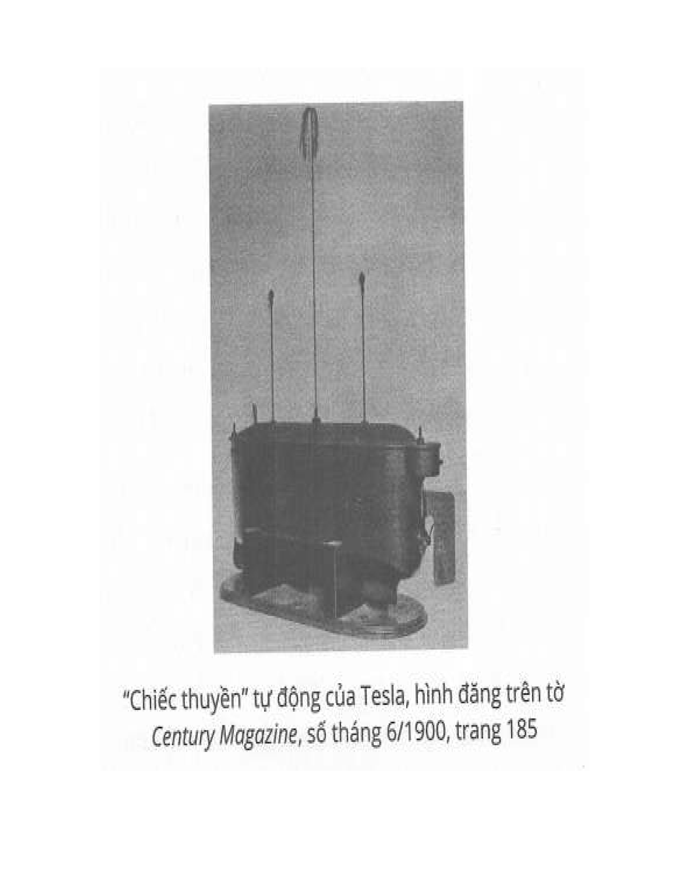

### Máy phóng điện cao thế phần 2 

Đại đa số con người không bao giờ biết và hiểu những gì đang diễn ra xung quanh và bên trong họ. Hàng triệu người làm mồi cho bệnh tật và chết sớm chỉ vì mỗi khoản này. Những điều xảy ra hằng ngày thông thường nhất đối với họ lại có vẻ khá là bí ẩn. Họ không thể giải thích được phản ứng của mình khi tiếp nhận các xung động từ môi trường. Một người có thể bỗng thấy gợn buồn và căng não tìm lời giải thích, khi lẽ ra hắn phải biết rằng cảm xúc đó chỉ là do một đám mây tạm thời che khuất tia nắng mặt trời. Có thể hắn nghĩ mình thấy hình ảnh của một người bạn thân trong những tình huống cực kỳ đặc biệt, trong khi thực ra các hình ảnh này chỉ là do hắn vừa mới đi ngang qua bạn mình trên phố hay thoáng nhìn thấy bức ảnh của anh ta đâu đó mà không để ý. Khi mất một cái nút cổ, hắn càu nhàu chửi thề cả một giờ, nhưng không thể nhớ những hành động mình vừa mới làm để định vị cái nút. Thiếu óc quan sát đơn giản chỉ là một dạng dốt. Nó là tác nhân chính tạo ra nhiều thể loại bệnh hoạn và là mẹ đẻ của những ý tưởng ngu ngốc ta luôn phải thấy ngày nay. Cứ 10 người thì chưa tới 1 người không tin thần giao cách cảm, các tà thuật tâm linh, thuyết duy linh và mấy trò hiệp thông với người chết. Họ vô tình - thậm chí cố ý - để những kẻ lừa dối rót những ý tưởng tâm linh huyền bí vào tai!  
Để minh họa xu hướng này đã bám rễ sâu vào những cái đầu tỉnh táo của dân Mỹ như thế nào, tôi xin kể lại một câu chuyện như đùa. Ngay trước chiến tranh, khi cuộc triển lãm tua-bin của tôi trong thành phố này bắt đầu được các báo kỹ thuật bình luận rộng rãi, tôi dự đoán rằng các nhà sản xuất sẽ tranh nhau mua bản quyền sáng chế của tôi. Bản thân tôi đã thiết kế riêng cho một người đến từ Detroit* nổi tiếng với khả năng hiệu triệu cả triệu nhân lực. Tôi tin tưởng rằng một ngày nào đó ông sẽ xuất hiện trước cửa văn phòng tôi. Tôi chắc chắn đến nỗi đã tuyên bố hẳn với thư ký và các trợ lý rằng hãy sẵn sàng dọn nhà dọn cửa đợi ngài Ford đến chơi.  
Một buổi sáng đẹp trời, nhóm kỹ sư của Công ty Ford Motor đến thật. Họ đề nghị được thảo luận với tôi một dự án quan trọng. Tôi đắc thắng nhìn sang nhân viên: “Thấy chưa, tôi đã nói mà!” Nhân viên của tôi thì phục lăn: “Sếp hay quá, sếp Tesla. Sếp đoán trúng phóc!”  
Ngay khi mấy tay đầu thép này an vị, tất nhiên ngay lập tức tôi bắt đầu nổ về những tính năng tuyệt vời của cái tua-bin. Khi tôi đang hăng thì tay phát ngôn viên công ty ngắt lời và nói: “Chúng tôi biết hết mấy điều này rồi. Thực ra, chúng tôi đang có nhiệm vụ đặc biệt khác. Chúng tôi đã thành lập một hội tâm lý học điều tra các hiện tượng tâm linh và muốn ông tham gia trong vụ này.” Tôi nghĩ các kỹ sư này không bao giờ biết họ sắp bị ném ra khỏi văn phòng của tôi đâu.  
Kể từ khi những nhà tiên phong trong các ngành khoa học với danh tiếng bất tử - những con người vĩ đại nhất thời đại này - nói rằng tôi đang sở hữu một tư duy không tầm thường, tôi đã dùng hết trí lực để giải quyết các vấn đề lớn, chẳng ngại hy sinh. Trong nhiều năm, tôi đã dùng hết sức giải quyết sự bí ẩn của cái chết, và háo hức chờ được chứng kiến các dấu hiệu thần bí của sức mạnh tâm linh. Thế nhưng, cả đời mình chỉ duy nhất một lần tôi được trải nghiệm cảm giác có thể xem là siêu nhiên, đó chính là lúc mẹ tôi qua đời. Tôi đã hoàn toàn kiệt sức bởi nỗi đau và vì thức đêm một thời gian dài. Một đêm nọ, tôi bị mang đến một tòa nhà cách nhà khoảng hai dãy. Khi tôi nằm bất lực ở đó, tôi nghĩ rằng nếu mẹ qua đời trong khi tôi không có bên giường bệnh, chắc chắn mẹ sẽ báo hiệu cho tôi. Hai hoặc ba tháng trước, tôi ở London cùng với một người bạn giờ đã mất, anh William Crookes*. Khi đó, mọi người đang thảo luận chuyện tâm linh, còn tôi thì chìm đắm vào những ý nghĩ trên. Lẽ ra tôi không chú ý đến câu chuyện của những người khác, nhưng cuối cùng thì bị cuốn hút vào những lập luận của Crookes. Lúc đó, Crookes đang nói về công trình thế kỷ của mình. Công trình này là về vật chất phát sáng. Tôi đã từng đọc nó hồi còn sinh viên, và nó cũng là thứ khiến tôi dính vào nghề điện. Từ ý tưởng về vật chất phát sáng, tôi chợt nghĩ rất có thể có cách để nhìn được thế giới bên kia. Mẹ tôi là một phụ nữ thiên tài với trực giác đặc biệt tốt. Suốt cả đêm, mỗi dây thần kinh trong não tôi căng thẳng chờ đợi, nhưng không có gì xảy ra cho đến tận sáng sớm hôm sau. Khi đó tôi đã ngủ thiếp đi, cũng có thể là ngất đi, và thấy một đám mây mang những thiên thần đẹp tuyệt vời, một trong các vị ấy nhìn tôi trìu mến và dần dần hình thành nên nét mặt của mẹ tôi. Hình ảnh đó từ từ trôi qua căn phòng rồi biến mất, và tôi bị đánh thức bởi một bài hát nhiều giọng điệu du dương không thể tả được. Trong khoảnh khắc đó tôi chợt có một cảm giác cực kỳ chắc chắn, mà không lời nào có thể diễn tả được, rằng mẹ tôi vừa qua đời. Và đó là sự thật. Tôi không thể nào hiểu được vì sao tôi lại biết trước những thông tin đau đớn ấy, nên đã viết một bức thư cho William Crookes. Đầu tôi vẫn ong ong bởi tác động của những xung động này, cơ thể thì không còn chút sức lực nào. Khi hồi phục, tôi bắt đầu tìm hiểu xung động bên ngoài nào đã tạo cho tôi giấc mơ ấy.* May mắn là sau một thời gian dài, tôi cũng đã hiểu ra. 
Hóa ra là trước đó tôi đã nhìn thấy tranh của một họa sĩ nổi tiếng, vẽ các mùa dưới hình thức một đám mây với một nhóm thiên thần trông cứ như đang trôi trong không khí. Tôi ấn tượng mạnh với bức tranh này. Và đó chính là những hình ảnh tôi đã thấy trong mơ, trừ chân dung của mẹ tôi. Âm nhạc đến từ dàn hợp xướng tại nhà thờ gần đó tại buổi lễ sớm vào sáng Phục sinh cũng giải thích tất cả mọi thứ một cách thỏa đáng và rất phù hợp với khoa học. Chuyện này xảy ra lâu rồi, và kể từ đó tôi chưa bao giờ có lý do thay đổi quan điểm về những hiện tượng tâm lý và tinh thần vì không có cơ sở. Niềm tin ở đây là kết quả tự nhiên của sự phát triển trí tuệ. Các tín điều tôn giáo không còn hợp lẽ nữa, nhưng mỗi cá nhân vẫn bám víu vào niềm tin ở một quyền lực tối cao nào đó.  
Tất cả chúng ta phải có một lý tưởng để kiểm soát mình và để bảo đảm sự hài lòng trong tâm tưởng, không quan trọng đó là lý tưởng tín ngưỡng, kỹ nghệ, khoa học hay gì khác, miễn là nó đáp ứng đầy đủ vai trò của một lực tư duy phi vật chất. Để có hòa bình cho nhân loại thì nhân loại cần có những tư tưởng chung. Tuy tôi chưa thấy có bằng chứng nào ủng hộ cho các nhà tâm lý và tâm linh học, nhưng tôi đã chứng minh được thuyết tự động của cuộc sống*, không chỉ qua quan sát liên tục các hành động riêng lẻ, mà thậm chí còn qua quá trình khái quát hóa thành lý thuyết. Những khái quát ấy đã đưa tôi đến một khám phá mà tôi xem là vĩ đại nhất trong cả xã hội con người. Tôi sẽ dừng lại một chút ở điểm này.  
Hồi còn trẻ tôi đã lờ mờ nhận ra chân lý đó, nhưng trong suốt những năm ấy tôi chỉ lý giải các sự kiện này đơn giản là sự trùng hợp thôi. Cứ mỗi khi chính tôi, người thân, hay công việc quan trọng đối với tôi bị người khác làm tổn thương hay phá hoại thì tôi thường trải qua một cơn đau kỳ lạ chỉ có thể diễn tả bằng bốn chữ “triền miên bất tận.” Ngay sau đó, lần nào cũng thế, những người đã gây ra nỗi đau này đều phải hối hận. Sau nhiều trường hợp như vậy, tôi nói ý tưởng đó với một số bạn bè, họ bắt đầu thấy bị thuyết phục bởi lý thuyết của tôi. Tóm lại, nó có thể được phát biểu trong vài lời sau đây: Cơ thể chúng ta có cấu trúc tương tự và tiếp xúc với các lực lượng bên ngoài như nhau. Do đó, xu hướng phản ứng của con người đối với các tác nhân ngoại lai cũng tương tự nhau. Sự giống nhau về xu hướng phản ứng đó dần được xây dựng thành các quy tắc xã hội và luật lệ. Chúng ta là những cỗ máy tự động hoàn toàn được điều khiển bởi các lực từ môi trường. Ta vô định như nút chai trên mặt nước mà cứ lầm tưởng các hành động và cảm xúc của mình là ý chí tự do. Mọi hành động của con người luôn mang tính duy trì sự sống. Do đó, dù các hoạt động có vẻ như khá độc lập, nhưng mọi người luôn được kết nối bởi các sợi dây vô hình. Khi cơ thể vẫn còn ổn định, thì nó sẽ phản ứng hoàn toàn chính xác với các kích thích, nhưng khi cơ thể có sự xáo trộn nào đó, bệnh tật chẳng hạn, thì khả năng phản ứng chuẩn để duy trì sự sống bị suy yếu ngay. Tất nhiên, ai cũng hiểu là một người bị điếc, mắt yếu, hoặc tay chân bị thương, thì cơ hội tiếp tục tồn tại của hắn giảm xuống. Nhưng không chỉ thế. Nếu bộ não - thứ điều khiển “cỗ máy” cơ thể - có khiếm khuyết, nó sẽ phản ứng sai lệch với các kích thích môi trường và đưa cơ thể lao xuống vực thẳm tự hủy hoại. Những thực thể nhạy cảm và biết quan sát, có các giác quan tốt, biết tư duy để phản ứng chính xác với các kích thích môi trường luôn thay đổi sẽ có thể tránh được các hiểm họa mà người thường khó có thể nhận thức ngay được. Khi hắn tiếp xúc với những người có các cơ quan kiểm soát bị lỗi nặng, giác quan chuẩn của hắn lên tiếng và hắn bắt đầu cảm thấy cơn đau “triền miên bất tận.”  
Chân lý này đã được khẳng định từ hàng trăm lần tiếp xúc, thảo luận của tôi và các nhà nghiên cứu tự nhiên. Tôi tin rằng thông qua những nỗ lực có hệ thống, thì ta sẽ tìm ra được những hiểu biết có giá trị vô cùng cho thế giới. Ý tưởng xây dựng máy tự động để khẳng định lý thuyết của tôi đã sớm hiện diện trước mắt tôi, nhưng đến năm 1895 tôi mới bắt đầu tập trung làm. Lúc đó tôi đang nghiên cứu về vô tuyến. Trong hai ba năm liên tục, một số cơ chế tự động kích hoạt từ xa đã ra đời và được trưng bày cho du khách trong phòng thí nghiệm của tôi. Năm 1896, tôi đã làm xong một cỗ máy hoàn chỉnh có khả năng thực hiện đa nhiệm vụ, nhưng do lao lực, tôi bị giảm sút sức lao động đến cuối năm 1897. Máy này được minh họa và mô tả trong bài viết của tôi trên tạp chí Century tháng 6/1900 cùng một số tập san khác thời đó. Khi lần đầu tiên được trình làng đầu năm 1898, nó đã tạo ra một cảm giác rất lạ, không như phát minh khác tôi từng có. Tháng 11/1898, tôi được cấp bằng sáng chế cơ bản cho kỹ nghệ mới. Họ chỉ cấp bằng cho tôi sau khi khảo sát viên chính đích thân đến New York để xem máy hoạt động, bởi những gì tôi tuyên bố quá là khó tin.

Tôi nhớ rằng sau này tôi có tới thăm một quan chức ở Washington, định hiến phát minh đó cho chính phủ. Nghe xong, ông này phá lên cười. Ông nghĩ tôi nói khoác. Bấy giờ không ai nghĩ rằng ai đó có thể hoàn thiện một thiết bị như vậy. Thật không may là theo lời luật sư của tôi, trong bằng sáng chế này tôi đã nói rằng thiết bị được kiểm soát thông qua một mạch đơn cùng với một kiểu máy nhận tín hiệu phổ biến (vì lúc đó tôi chưa có quyền phát minh của phương pháp và thiết bị cá thể hóa đã trình bày ở trên). Do đó, bằng sáng chế này không chuẩn xác và tối ưu, cũng như không thể hiện hoàn toàn là sản phẩm của tôi. Trên thực tế thì chiếc thuyền của tôi được kiểm soát đa mạch. Nói cách khác, không hề xảy ra sự nhiễu tín hiệu.  
Thông thường tôi sử dụng các mạch tiếp nhận ở dạng vòng lặp có tụ điện, vì máy phóng điện cao áp của tôi ion hóa không khí trong phòng thí nghiệm khiến ngay cả một ăng-ten rất nhỏ cũng rút được điện từ khí quyển xung quanh hằng giờ liền. Nói rõ hơn, ví dụ, tôi phát hiện rằng một bóng đèn 12 inch (30,48 cm) đường kính, được rút hết không khí, với một thiết bị đầu/cuối duy nhất có gắn một dây dẫn ngắn, sẽ tạo ra đến 1.000 cái chớp nháy liên tiếp cho đến khi toàn bộ điện tích không khí trong phòng thí nghiệm được trung hòa. Dạng vòng lặp của máy thu thì không nhạy cảm với một sự xáo trộn như vậy, và thật đáng tò mò khi dạo này nó lại bắt đầu phổ biến đến thế. Trong thực tế, nó thu ít năng lượng hơn nhiều so với ăng-ten hoặc dây dài nối đất. Tuy nhiên, thật tình cờ là nó cũng giúp xóa bỏ một số khiếm khuyết cố hữu trong các thiết bị vô tuyến hiện nay.  
Trong khi trình bày phát minh trước khán giả, tôi yêu cầu khách đặt câu hỏi, hỏi kiểu gì cũng được, và máy tự động sẽ trả lời họ bằng dấu hiệu. Người ta tưởng chiếc máy rất thần kỳ, nhưng thực tế cực kỳ đơn giản: Chính tôi là người trả lời thông qua chiếc máy. Cùng thời kỳ đó, tôi chế thêm một chiếc tàu viễn thông tự động khác lớn hơn. Người ta chụp ảnh nó và in trong số báo tháng 10/1919 của tập san Electrical Experimenter. Nó được điều khiển bởi các vòng lặp, có nhiều vòng đặt trong thân tàu, chống nước và có khả năng chịu ngập. Bộ máy thì tương tự như chiếc đầu tiên ngoại trừ một số tính năng mới. Ví dụ, tôi gắn thêm đèn để người ta có thể thấy máy đang hoạt động tốt và đúng chức năng. Các thiết bị tự động này tuy là chỉ được hoạt động trong phạm vi tầm nhìn của người điều khiển, nhưng lại chính là những bước tiến thô sơ đầu tiên trong sự phát triển kỹ nghệ viễn thông tự động mà tôi hằng ấp ủ.   
Cải tiến hợp lý tiếp theo là phát triển cơ chế tự động vượt ra ngoài giới hạn tầm nhìn và ở khoảng cách rất xa trung tâm điều khiển. Kể từ đó, tôi vẫn luôn ủng hộ việc ứng dụng các cơ chế tự động này làm chiến cụ thay cho súng. Hiện nay có vẻ (theo thông tin tôi thu thập qua báo chí) người ta xem nó như một thành tựu khác thường nhưng không mới. Thôi kệ họ vậy. Nói một cách không cầu toàn thì phát minh này hoàn toàn ứng dụng được. Với các trạm vô tuyến hiện tại, ta có thể ứng dụng để phóng một chiếc máy bay, điều khiển nó theo một đường bay nhất định, và thực hiện một số hoạt động ở khoảng cách hàng trăm dặm. Một máy loại này cũng có thể được kiểm soát theo nhiều cách, và tôi tin rằng nó sẽ rất hữu dụng trong chiến tranh. Thế nhưng theo hiểu biết của tôi, hiện nay chưa có khí cụ nào thực hiện hoạt động được điều khiển chính xác hoàn toàn cả. Tôi đã dành nhiều năm nghiên cứu vấn đề này và đã phát triển phương tiện hóa những điều kỳ diệu như vậy thành hiện thực.  
Như đã nói trước đây, khi còn là sinh viên đại học tôi đã nghĩ ra một cái máy bay hoàn toàn không giống như hiện tại. Nguyên lý tiềm ẩn là tốt, nhưng không thể đưa vào thực tế vì cần một động cơ chính đủ mạnh. Trong những năm gần đây, tôi đã giải quyết thành công vấn đề này và bây giờ đang thiết kế máy bay. Nó không có mặt phẳng nâng, cánh đập, cánh quạt, và một số bộ phận đính kèm bên ngoài khác. Máy sẽ đạt được vận tốc lớn và rất có khả năng sẽ trở thành một vật đối trọng mạnh mẽ trên bàn đàm phán hòa bình trong tương lai gần. Một cỗ máy được nâng và đẩy “hoàn toàn bằng phản lực” đã xuất hiện trên một trong các trang bài giảng của tôi. Nó được điều khiển cơ học hoặc bằng năng lượng vô tuyến. Bằng cách lắp đặt các nhà máy thích hợp, ta có thể* phóng một tên lửa loại này vào không gian và thả nó” hầu như ngay đúng chỗ đã định trước, có thể cách xa hàng ngàn dặm.  
Nhưng ta sẽ không dừng lại ở đây. Máy viễn thông tự động cuối cùng sẽ được sản xuất, có khả năng hành động nhờ trí thông minh nhân tạo, và sự ra đời của chúng sẽ tạo ra một cuộc cách mạng. Ngay từ năm 1898, tôi đã đề xuất với các đại diện công ty sản xuất quy mô lớn về việc xây dựng và triển lãm công khai một chiếc xe tự động có thể thực hiện các hoạt động theo sự lựa chọn của chính nó sau khi tự mình đánh giá môi trường.* Nhưng đề nghị của tôi lúc đó bị coi là ảo tưởng và chẳng đi đến đâu. Ngay lúc ấy, nhiều người tư duy khủng nhất lại đang phải vắt kiệt sức để đưa ra các phương sách ngăn chặn một cuộc xung đột khủng khiếp khó có cách giải quyết.* Tôi đã dự đoán tình hình khá chính xác trên tờ Sun ngày 20/12/1914. Phương thức thành lập liên minh không phải là phương thuốc. Theo một số người xuất chúng, thì cách làm này thậm chí còn khiến tình hình tệ hơn.  
Đặc biệt đáng tiếc rằng một chính sách trừng phạt đã được thông qua trong khi đàm phán các điều khoản hòa bình, bởi vì một vài năm nữa thôi, các quốc gia sẽ có thể đánh nhau mà không cần quân đội, tàu bè hoặc súng ống. Vũ khí sẽ khủng khiếp hơn nhiều, có khả năng hủy diệt với phạm vi không giới hạn. Một thành phố ở cách xa kẻ thù cỡ nào đi nữa cũng có thể bị hủy diệt mà không có sức mạnh nào trên trái đất có thể ngăn được. Nếu muốn ngăn ngừa một thảm họa sắp xảy ra và tránh việc biến thế giới thành địa ngục, thì chúng ta nên đẩy mạnh việc phát triển máy bay và truyền tải năng lượng vô tuyến với tất cả sức mạnh và nguồn lực của quốc gia, không được chậm trễ một phút giây nào!
