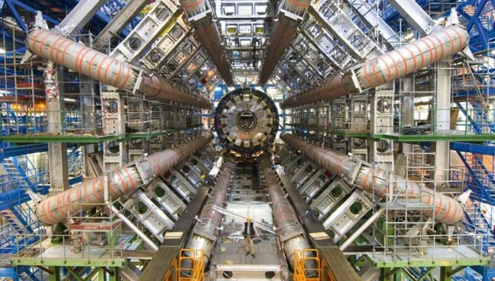
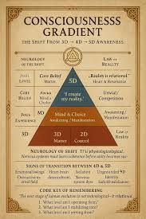
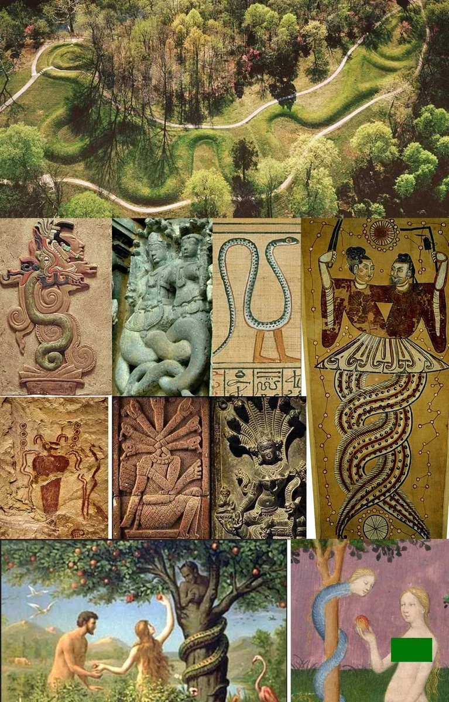

> Chúng ta không nhìn thấy thế giới như nó vốn là. Chúng ta chỉ nhìn thấy phiên bản mà bộ não cho phép ta đọc ra từ các tín hiệu rất hạn chế của năm giác quan.

### Khi Thực Tại Đi Qua Bộ Lọc

Nếu nhìn thẳng vào đời sống hằng ngày, con người thường tin rằng điều mình thấy, nghe, chạm, ngửi và nếm là “thực tại khách quan”. Nhưng càng đi sâu vào sinh học nhận thức và vật lý hiện đại, ta càng thấy điều ngược lại: những gì ta gọi là thế giới thực chất là một **mô hình được giải mã**.

Mắt không “thấy” toàn bộ thế giới. Tai không “nghe” mọi thứ. Da, mũi và lưỡi cũng chỉ đang thu tín hiệu trong một dải rất hẹp. Điều mà ta trải nghiệm không phải thực tại nguyên bản, mà là kết quả của một quá trình chọn lọc, mã hóa và diễn giải xảy ra bên trong não.

Đó là lý do vì sao cùng một sự kiện, hai người có thể cảm nhận hoàn toàn khác nhau. Một người thấy bình thường. Người kia thấy đe dọa. Một người tin là tình cờ. Người kia tin là dấu hiệu. Vấn đề không chỉ nằm ở sự kiện, mà còn nằm ở **cách hệ thống nhận thức của ta dựng lại sự kiện đó**.

### Năm Giác Quan Chỉ Là Một Cửa Sổ

Con người có xu hướng mặc định rằng điều mình không cảm nhận được là điều không tồn tại. Nhưng lịch sử khoa học liên tục phá vỡ giả định ấy.

- Có sóng điện từ mắt không nhìn thấy.
- Có hạ âm và siêu âm tai không nghe được.
- Có các tín hiệu hóa học vi tế mũi và lưỡi không thể phân biệt đầy đủ.
- Có những cấu trúc vật lý, sinh học và không gian vượt khỏi ngưỡng trực giác thông thường.

Chính vì vậy, năm giác quan chỉ là một **cửa sổ rất hẹp**. Chúng không phải thước đo toàn bộ thế giới. Chúng là giao diện mà cơ thể dùng để duy trì sự sống, không phải công cụ để nắm toàn bộ bản chất thực tại.

Điểm quan trọng nằm ở chỗ này: con người không sống trong thế giới “như nó là”, mà sống trong thế giới “như não bộ biểu diễn nó”.

### Bộ Não Không Phải Máy Quay, Mà Là Bộ Giải Mã

Hãy tưởng tượng bộ não như một hệ thống giải mã.

Mắt thu tín hiệu ánh sáng.
Tai thu dao động.
Da thu áp lực và nhiệt độ.
Mũi và lưỡi thu tín hiệu hóa học.

Tất cả những tín hiệu ấy được chuyển thành dữ liệu thần kinh, rồi não tái tạo chúng thành cảm giác có ý nghĩa: màu sắc, âm thanh, hình dáng, mùi vị, cảm xúc, nguy cơ, ký ức.

Điều này có nghĩa là chúng ta không “đọc” thế giới trực tiếp. Chúng ta đọc **bản dịch** của thế giới.

Và bản dịch thì luôn có giới hạn.

Đôi khi bản dịch bị nhiễu. Đôi khi bị thiên lệch. Đôi khi bị cảm xúc chi phối. Đôi khi bị thói quen và niềm tin cũ bóp méo. Cho nên câu hỏi quan trọng không phải là “ta có thấy thật không?”, mà là “ta đang thấy qua lớp lọc nào?”.

### Tại Sao Những Hiện Tượng “Không Giải Thích Được” Luôn Gây Ám Ảnh?

Một đứa trẻ sơ sinh nhìn chằm chằm vào khoảng không, một con vật bỗng hoảng sợ trong căn phòng yên tĩnh, hay một khoảnh khắc bạn cảm thấy điều gì đó “không ổn” dù không có dấu hiệu rõ ràng — những trải nghiệm như thế luôn khiến con người bối rối.

Ta thường giải thích chúng bằng cảm tính, trực giác hoặc niềm tin. Nhưng ở tầng sâu hơn, chúng nhắc ta rằng nhận thức của con người chưa bao giờ là bản sao hoàn chỉnh của thế giới.

Tất cả những gì ta gọi là “hợp lý” đều là kết quả của việc bộ não sắp xếp lại dữ liệu để tạo ra một câu chuyện có thể sống được.

### Thực Tại Như Một Ma Trận Nhận Thức

Khi nói đến “ma trận”, nhiều người nghĩ đến một âm mưu khép kín. Nhưng nếu tách lớp cảm xúc ra khỏi từ này, có thể hiểu nó như một **hệ thống định hình nhận thức**.

Hệ thống đó không chỉ gồm chính trị hay truyền thông. Nó còn gồm:

- Giáo dục
- Tiêu dùng
- Giải trí
- Kỳ vọng xã hội
- Ngôn ngữ
- Khuôn mẫu thành công

Những cấu trúc này không nhất thiết phải là “xấu” trong mọi trường hợp. Vấn đề là chúng có thể khiến con người quen với một phiên bản thực tại đã được chắt lọc sẵn, từ đó khó đặt câu hỏi về những gì nằm ngoài khung nhìn đó.

Con người thường không bị kiểm soát bằng một bức tường. Họ bị định hướng bằng **điều họ được phép chú ý**.

Vật lý hiện đại thường buộc ta phải chấp nhận rằng trực giác phổ thông không đủ để mô tả thế giới. Những mô hình như trường lượng tử, hạt cơ bản, năng lượng, hay các chiều không gian bổ sung đều là cách khoa học nói rằng: thế giới phức tạp hơn trải nghiệm bề mặt của ta rất nhiều.

  
*Cánh Cửa Của Những Lớp Vô Hình*

Máy gia tốc hạt lớn gợi ra một ý niệm rất mạnh: khi ta đẩy giới hạn kỹ thuật đủ xa, ta không còn chỉ quan sát vật chất theo kiểu thông thường nữa. Ta bắt đầu nhìn vào những lớp nền sâu hơn của tự nhiên.

Đó là một ẩn dụ rất hợp để nói về nhận thức: càng mở rộng công cụ quan sát, ta càng thấy thế giới không đơn giản như vẻ ngoài của nó.  
Nếu con người đang sống trong một khung thực tại hẹp, thì câu hỏi tự nhiên là: phía ngoài khung đó có gì?

Ta không thể khẳng định mọi mô hình biểu tượng về chiều không gian là chân lý vật lý. Nhưng điều đáng chú ý là nhiều nền tri thức luôn gợi ý rằng thực tại không chỉ có một lớp. Có lớp nhìn thấy được. Có lớp phải suy ra. Có lớp chỉ lộ ra khi ta đổi cách quan sát.

  
*Các Chiều Không Gian Và Tầng Nhận Thức*

Hình ảnh kiểu này không chỉ là minh họa khoa học. Nó còn nhắc ta rằng nhận thức của con người cũng có thể có “chiều”. Có tầng dữ kiện. Có tầng cảm xúc. Có tầng biểu tượng. Có tầng trực giác. Và có thể có những tầng mà ngôn ngữ thường ngày không nắm trọn được.

### Khi Biểu Tượng Lặp Lại Qua Các Thời Đại

Một trong những điểm thú vị nhất của văn hóa nhân loại là các biểu tượng không chết. Chúng đổi hình nhưng vẫn sống tiếp.

Trong nhiều nền văn minh, hình tượng rắn xuất hiện với những lớp nghĩa khác nhau:

- Gắn với tri thức và sự khai mở
- Gắn với chu kỳ sống - chết - tái sinh
- Gắn với quyền lực, cám dỗ hoặc sự cấm kỵ
- Gắn với những lễ nghi cổ xưa và hệ biểu tượng bí truyền

Khi một biểu tượng quay đi quay lại qua hàng nghìn năm, điều đó thường cho thấy nó chạm vào một tầng rất sâu của tâm thức con người.

Ta không nhất thiết phải đồng ý với mọi diễn giải huyền học để thấy rằng biểu tượng là một dạng ngôn ngữ cổ hơn cả lý luận hiện đại. Con người hiểu thế giới không chỉ bằng khái niệm, mà còn bằng hình tượng.

### Tần Số, Cảm Xúc Và Sự Điều Hướng

Trong nhiều truyền thống tư tưởng, tần số được dùng như một cách nói ẩn dụ cho trạng thái ý thức. Dù nhìn theo khoa học hay biểu tượng, vẫn có một ý đúng ở đây: **trạng thái bên trong ảnh hưởng đến cách ta đọc thế giới**.

Khi sợ hãi, cùng một sự kiện sẽ trông nguy hiểm hơn.
Khi bình tĩnh, cùng một sự kiện có thể được hiểu khác đi.
Khi giận dữ, ta thường nhìn mọi thứ qua lăng kính xung đột.
Khi sáng suốt, ta nhận ra nhiều lớp mà trước đó mình bỏ sót.

Vì vậy, “thao túng nhận thức” không chỉ diễn ra từ bên ngoài. Nó cũng có thể đến từ chính tình trạng nội tâm của ta. Nếu cảm xúc là một bộ lọc, thì việc điều chỉnh cảm xúc cũng là một cách điều chỉnh cách ta tiếp cận thực tại.

### Con Người Có Thể Thức Tỉnh Bằng Cách Nào?

Không phải bằng việc phủ nhận tất cả. Và cũng không phải bằng việc tin tất cả.

Thức tỉnh, theo nghĩa thực dụng nhất, là học cách:

- Chậm lại trước khi kết luận
- Nghi ngờ những gì quá dễ tin
- Quan sát nhiều lớp của cùng một hiện tượng
- Nhận ra giới hạn của giác quan và thói quen
- Mở rộng công cụ nhận thức thay vì chỉ lặp lại khuôn cũ

Thức tỉnh không có nghĩa là nhìn đâu cũng thấy âm mưu. Nó có nghĩa là hiểu rằng thực tại luôn có nhiều tầng hơn điều mắt thường kể lại.

### Kết Luận

Năm giác quan là nền móng sinh tồn của con người, nhưng không phải toàn bộ chân lý. Chúng giúp ta sống, nhưng không tự động cho ta biết thế giới là gì trong bản chất sâu nhất.

Nếu ta chỉ bám vào bề mặt cảm nhận, ta sẽ dễ nhầm bản đồ với lãnh thổ. Nếu ta biết đặt câu hỏi về giới hạn của chính mình, ta mới có cơ hội nhìn rộng hơn những gì tưởng như “hiển nhiên”.

Đó là giá trị lớn nhất của việc suy nghĩ về giới hạn của 5 giác quan: không phải để phủ định thế giới, mà để nhận ra rằng **thế giới luôn lớn hơn cảm nhận ban đầu của ta**.
