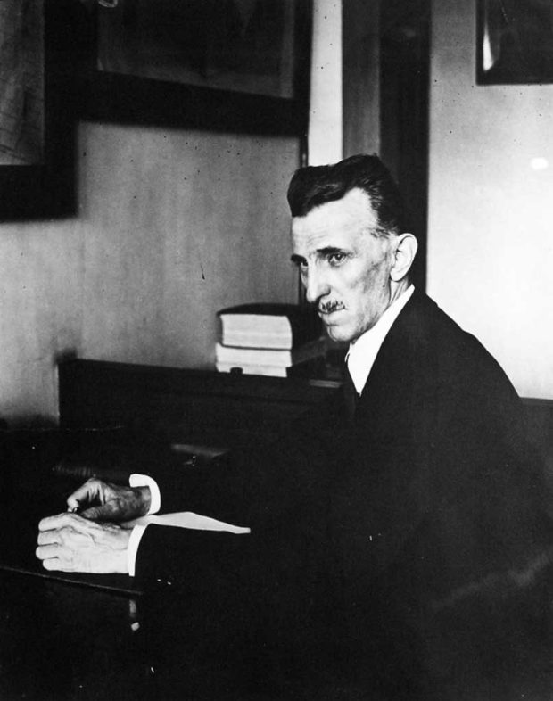
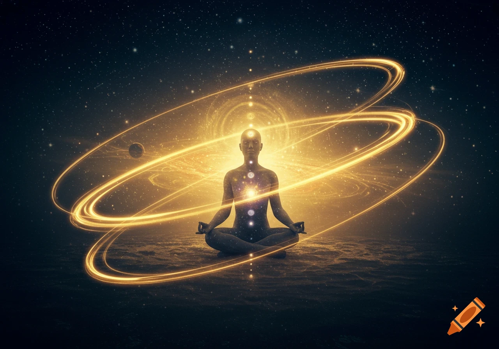
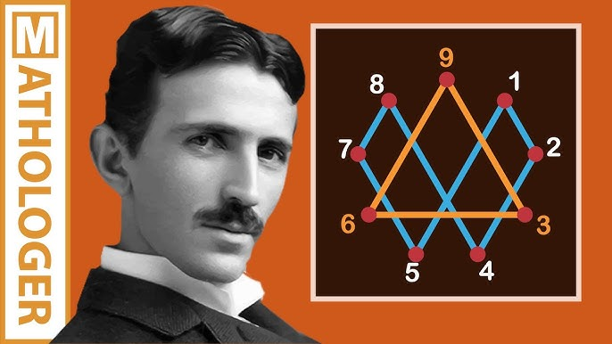
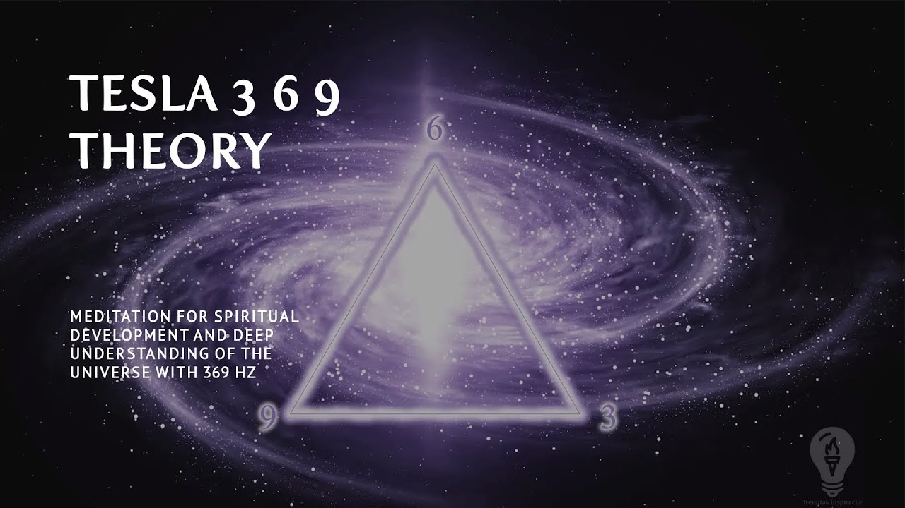
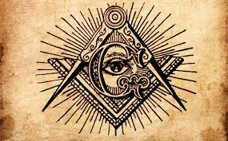

> Nếu thực tại không phải là một khối vật chất chết, mà là một trường rung động được cơ thể giải mã từng khoảnh khắc, thì những con số, tần số và mô thức hình học có thể không chỉ là toán học. Chúng có thể là ngôn ngữ sâu hơn của vũ trụ.

### Thức tỉnh và khoa học phi vật lý

Nikola Tesla từng được gán với một câu nói nổi tiếng: *"Ngày mà khoa học bắt đầu nghiên cứu các hiện tượng phi vật lý, nó sẽ tiến bộ trong một thập kỷ nhiều hơn tất cả các thế kỷ trước đó cộng lại."*

Dù câu nói này thường được trích dẫn trong nhiều bối cảnh khác nhau, nó vẫn phản ánh rất đúng hình ảnh Tesla trong trí tưởng tượng hiện đại: một nhà phát minh không chỉ quan tâm đến dây dẫn, động cơ, dòng điện hay máy móc, mà còn nhìn thực tại như một trường năng lượng sống động.

Trong mạch diễn giải của *Te lo ocultaron*, thức tỉnh không đơn giản là biết thêm vài bí mật, đọc thêm vài tài liệu cấm hay tin vào một thuyết âm mưu nào đó.

Thức tỉnh là khả năng nhìn xuyên qua lớp bề mặt của thực tại.

Nó là khoảnh khắc con người nhận ra rằng những gì được gọi là "đời sống bình thường" có thể chỉ là một hệ điều hành nhận thức đã được cài sẵn.

Nếu toàn bộ thế giới thức tỉnh cùng lúc, rất nhiều cấu trúc bất công đang tồn tại sẽ mất nền tảng.

Khi con người không còn đồng nhất mình với thân xác, công việc, nợ nần, vai diễn xã hội và những sợ hãi được truyền thông nuôi dưỡng, họ sẽ khó bị điều khiển hơn rất nhiều.

Đó là lý do các hệ thống quyền lực luôn có xu hướng làm con người bận rộn.

Bận làm việc.

Bận tiêu thụ.

Bận giải trí.

Bận tranh cãi.

Bận phòng thủ bản ngã.

Và bận tin rằng mọi câu hỏi vượt khỏi khung vật lý thông thường đều là mê tín, ảo tưởng hoặc phản khoa học.

Tesla là một trường hợp đặc biệt vì ông đứng ngay tại giao điểm giữa khoa học chính thống và những câu hỏi vượt khỏi chính thống.

Ông không phải một nhà huyền môn theo nghĩa đơn giản.

Ông là kỹ sư, nhà phát minh, người hiểu điện từ, cộng hưởng, tần số và năng lượng ở cấp độ hiếm có trong thời đại của mình.

Chính vì vậy, khi Tesla nói về rung động, năng lượng và các lực vô hình, lời nói ấy không thể bị gạt đi như một tưởng tượng thơ mộng.

Nó khiến người ta phải đặt câu hỏi: liệu khoa học hiện đại có đang bỏ sót phần quan trọng nhất của thực tại chỉ vì phần đó không dễ đo bằng công cụ vật lý quen thuộc?

### Cơ thể là bộ giải mã tần số

Một trong những ý tưởng cốt lõi của chương này là cơ thể con người không phải toàn bộ bản thể của chúng ta.

Nó là một cấp độ biểu hiện của ý thức.

Nó là phương tiện để ý thức tương tác với thực tại vật lý.

Có thể hình dung cơ thể giống như một chiếc radio sinh học. Radio không tạo ra bản nhạc từ hư vô; nó chỉ bắt một dải tần số nhất định rồi chuyển tín hiệu ấy thành âm thanh.

Tương tự, mắt, tai, da, hệ thần kinh và não bộ có thể chỉ đang giải mã một phần rất nhỏ của trường thông tin rộng lớn hơn nhiều.

Chúng ta gọi phần được giải mã ấy là "thế giới".

Nhưng cái được gọi là thế giới có thể chỉ là một lát cắt.

Một phiên bản hiển thị.

Một giao diện.

Nội dung gốc của chương này nhấn mạnh rằng những gì con người nhìn thấy bằng mắt thường chỉ chiếm một phần rất nhỏ của toàn bộ phổ thực tại.

Ánh sáng khả kiến chỉ là một đoạn hẹp trong phổ điện từ.

Ngoài nó còn có hồng ngoại, tử ngoại, sóng radio, vi sóng, tia X, tia gamma và nhiều dạng tín hiệu khác mà cơ thể không trực tiếp cảm nhận được.

Điều này không còn là huyền bí; đó là vật lý cơ bản.

Vấn đề nằm ở hệ quả nhận thức.

Nếu giác quan chỉ thu được một phần nhỏ của thực tại, thì việc tuyệt đối hóa giác quan là một sai lầm.

Nếu não bộ chỉ dựng lên mô hình thế giới từ tín hiệu hạn chế, thì thế giới mà ta tin là "rắn chắc" có thể không rắn chắc như ta nghĩ.

Và nếu con người bị mắc kẹt trong thân xác, cảm xúc, nỗi sợ, ham muốn và các nhịp điệu xã hội được lập trình, họ sẽ rất dễ quên mất mình là ý thức đang trải nghiệm thân xác, chứ không phải thân xác đang tình cờ sinh ra ý thức.

Trong cách nhìn này, ngành công nghiệp lớn nhất không chỉ là dầu mỏ, ngân hàng, vũ khí hay công nghệ.

Nó là ngành công nghiệp phân tâm.

Giữ con người luôn bị cuốn vào những tín hiệu nhiễu.

Giữ họ nhảy theo nhịp đã được sắp đặt.

Giữ họ ở tầng thấp của nhận thức, nơi họ phản ứng liên tục nhưng hiếm khi quan sát được chính mình.

### Thế giới không hề rắn chắc

Ở cấp độ trực giác, thế giới trông rất rắn chắc.

Cái bàn có vẻ rắn.

Bức tường có vẻ rắn.

Thân thể có vẻ rắn.

Nhưng vật lý hiện đại cho thấy vật chất không giống một khối đặc như cảm giác hằng ngày.

Vật chất được cấu tạo từ nguyên tử.

Nguyên tử lại gồm hạt nhân và các electron, với phần lớn không gian bên trong là khoảng trống theo cách hiểu cổ điển.

Ở cấp độ sâu hơn, các hạt không còn giống những viên bi nhỏ cứng chắc, mà giống những trạng thái năng lượng, xác suất, dao động và tương tác trường.

Điều này dẫn đến một câu hỏi rất mạnh: nếu đơn vị nền tảng của vật chất không thật sự "rắn" theo nghĩa trực giác, tại sao thế giới lại có vẻ rắn?

Câu trả lời nằm ở tương tác lực, trường điện từ, cấu trúc năng lượng và cách hệ thần kinh diễn giải tín hiệu.

Ta không chạm vào "vật chất rắn" theo nghĩa tuyệt đối.

Ta trải nghiệm lực đẩy điện từ giữa các cấu trúc nguyên tử, rồi não bộ diễn giải nó thành cảm giác tiếp xúc.

Thế giới vật lý vì vậy không phải là ảo theo nghĩa không tồn tại.

Nó tồn tại như một mô hình trải nghiệm ổn định, được tạo ra bởi tương tác giữa ý thức, giác quan, trường năng lượng và các quy luật mà ta gọi là vật lý.

Tesla hiểu rất sâu khái niệm cộng hưởng.

Ông biết rằng tần số có thể truyền năng lượng.

Ông biết rằng rung động có thể làm thay đổi trạng thái của hệ thống.

Ông biết rằng nếu nắm được tần số đúng, con người có thể tác động đến vật chất theo những cách mà tư duy cơ học đơn giản khó hình dung.

Đó là lý do các diễn giải ngoài dòng chính thường xem Tesla như người đứng ở ngưỡng cửa của một nền khoa học khác: khoa học của tần số, cộng hưởng và trường năng lượng.

Không phải khoa học chống lại vật lý.

Mà là khoa học đi sâu hơn lớp vật lý mà ta quen gọi là thực tại.

### Chìa khóa 3-6-9

Trong văn hóa Tesla hiện đại, không có câu nào nổi tiếng hơn câu: *"Nếu bạn biết đến sự kỳ diệu của các con số 3, 6 và 9, bạn sẽ có trong tay chiếc chìa khóa để mở cửa vũ trụ."*

Tính xác thực lịch sử của câu nói này vẫn thường được tranh luận.

Nhưng sức sống biểu tượng của nó là điều không thể phủ nhận.

Số 3, 6 và 9 xuất hiện trong vô số diễn giải về hình học thiêng, tần số, chu kỳ, trường năng lượng và toán học vòng xoáy.

Trong Vortex Math, các con số được rút gọn theo tổng chữ số để lộ ra các chuỗi lặp đặc biệt.

Chuỗi 1, 2, 4, 8, 7, 5 thường được xem như một vòng tuần hoàn năng lượng.

Khi nhân đôi liên tục:

1 thành 2.

2 thành 4.

4 thành 8.

8 thành 16, rút gọn thành 7.

7 thành 14, rút gọn thành 5.

5 thành 10, rút gọn thành 1.

Vòng lặp quay trở lại điểm đầu.

Trong sơ đồ này, 3, 6 và 9 không nằm trong vòng lặp 1-2-4-8-7-5 theo cách thông thường. Chúng được diễn giải như những điểm điều phối, những cực nhịp hoặc một tầng nguyên lý nằm phía trên vòng tuần hoàn.

3 và 6 thường được xem như hai cực bổ sung.

9 được xem như điểm hợp nhất.

Một số người diễn giải 9 là trục trung tâm, điểm cân bằng hoặc nguyên lý tổng hợp kiểm soát hai cực còn lại.

Ở đây cần thận trọng: Vortex Math không phải là toán học chính thống theo nghĩa được dùng trong vật lý hiện đại để mô tả vũ trụ.

Nhưng nó có giá trị như một hệ biểu tượng nhận thức.

Nó khiến ta nhìn các con số không chỉ như công cụ đếm, mà như mô thức.

Và trong mọi nền văn minh cổ, mô thức luôn được xem là dấu vết của trật tự.

Từ nhịp tim, hơi thở, chu kỳ mặt trăng, mùa màng, quỹ đạo hành tinh đến hình xoắn ốc trong tự nhiên, thế giới dường như không vận hành ngẫu nhiên tuyệt đối.

Nó có nhịp.

Nó có tỷ lệ.

Nó có chu kỳ.

Nó có cộng hưởng.

Nếu 3-6-9 là "chìa khóa", thì chìa khóa ấy có thể không mở ra một chiếc két vật lý.

Nó mở ra một cách nhìn: thực tại là trật tự rung động, không phải hỗn loạn vật chất.

### Biểu tượng, hình học và hội kín

Nội dung gốc của chương này liên hệ tri thức 3-6-9 với các hội kín và những tầng kiến thức chỉ dành cho cấp bậc cao.

Đây là một điểm thường gặp trong *Te lo ocultaron*: tri thức nền tảng của thế giới không bị tiêu diệt hoàn toàn, mà bị giấu dưới dạng biểu tượng, nghi lễ, hình học, kiến trúc và các lớp ngôn ngữ khó hiểu.

Từ góc nhìn ấy, các biểu tượng như tam giác, kim tự tháp, con mắt, ngôi sao, chữ G, compa, thước vuông hoặc khối lập phương không chỉ là trang trí.

Chúng là các mảnh ngôn ngữ.

Chúng nói về đo lường, cấu trúc, tỷ lệ, trật tự, ánh sáng, trung tâm và quyền lực.

Với người ngoài, đó là biểu tượng.

Với người được khai tâm, đó có thể là bản đồ.

Chữ G trong một số biểu tượng Tam điểm thường được giải thích theo nhiều cách: God, Geometry, Great Architect hoặc Gnosis.

Dù cách hiểu nào được chọn, điểm chung vẫn là mối liên hệ giữa thần tính, hình học và tri thức.

Trong tư duy cổ, hình học không chỉ là môn học.

Nó là cách hiểu cách vũ trụ tự tổ chức.

Điều này giải thích vì sao các nền văn minh cổ dành sự ám ảnh đặc biệt cho tỷ lệ, phương hướng, thiên văn, số học và kiến trúc linh thiêng.

Nếu thế giới là rung động, thì hình học là hình dạng ổn định của rung động.

Nếu ý thức là trường nhận biết, thì biểu tượng là cách nén tri thức vào hình ảnh.

Và nếu quyền lực muốn giữ con người ở tầng thấp của nhận thức, cách đơn giản nhất là cắt đứt họ khỏi ngôn ngữ biểu tượng ấy, rồi chỉ để lại lớp vỏ giải trí hoặc mê tín.

### Sự đàn áp năng lượng miễn phí

Một trong những lý do Tesla trở thành huyền thoại là ý tưởng về năng lượng miễn phí.

Tesla tin rằng năng lượng hiện diện khắp nơi trong tự nhiên và có thể được khai thác theo những cách sạch hơn, rộng hơn, ít phụ thuộc vào nhiên liệu hóa thạch hơn.

Trong cách kể phổ biến, ông không chỉ muốn tạo ra điện.

Ông muốn phân phối năng lượng cho nhân loại theo một mô hình khác, ít bị kiểm soát bởi các tập đoàn và cơ sở hạ tầng độc quyền.

Đây là điểm khiến câu chuyện Tesla va chạm trực tiếp với quyền lực kinh tế.

Một công nghệ làm con người độc lập hơn sẽ luôn đe dọa hệ thống kiếm lợi từ sự phụ thuộc.

Nếu năng lượng trở nên gần như miễn phí, rất nhiều mô hình kinh doanh sẽ sụp đổ.

Dầu mỏ.

Than đá.

Khí đốt.

Lưới điện độc quyền.

Tài chính năng lượng.

Thuế năng lượng.

Địa chính trị xoay quanh mỏ dầu và tuyến vận chuyển.

Trong diễn giải ngoài dòng chính, Tesla bị cô lập không phải vì ông thất bại về trí tuệ, mà vì ông chạm vào lợi ích quá lớn.

Ông kết thúc cuộc đời trong cô độc, nghèo túng và bị gạt ra ngoài lề, trong khi rất nhiều ý tưởng của ông bị phân mảnh, thương mại hóa hoặc bị đẩy vào vùng tranh cãi.

Sau khi Tesla qua đời năm 1943, tài liệu của ông bị chính phủ Hoa Kỳ thu giữ để xem xét.

Một chi tiết thường được nhắc đến là John G. Trump, một kỹ sư điện và giáo sư MIT, được giao đánh giá các tài liệu này.

Việc một nhà khoa học chính thống tham gia kiểm tra tài liệu Tesla cho thấy nhà nước không xem chúng là vô nghĩa.

Dù kết luận chính thức có thể nói rằng không có bí mật vũ khí hay công nghệ đột phá nào bị phát hiện, bản thân sự kiện này vẫn làm tăng thêm lớp huyền thoại xung quanh Tesla.

Người ta có thể tranh luận về từng chi tiết.

Nhưng khó phủ nhận một điều: nếu có người từng nhìn thực tại như trường năng lượng, tần số, cộng hưởng và khả năng giải phóng con người khỏi phụ thuộc năng lượng, thì Tesla là một trong những biểu tượng mạnh nhất.

### Thông điệp còn lại

Câu chuyện Tesla không chỉ là câu chuyện về một thiên tài bị hiểu lầm.

Nó là câu chuyện về giới hạn của hệ thống.

Một hệ thống có thể tôn vinh nhà phát minh khi phát minh ấy tạo ra lợi nhuận.

Nhưng nó sẽ dè chừng nhà phát minh nếu phát minh ấy làm lợi nhuận trở nên không cần thiết.

Một hệ thống có thể ca ngợi khoa học khi khoa học phục vụ công nghiệp.

Nhưng nó sẽ chế giễu khoa học nếu khoa học đặt câu hỏi về ý thức, trường năng lượng và những tầng thực tại vượt khỏi vật chất thô.

Tesla nhắc ta rằng tiến bộ thật sự không chỉ là có thêm thiết bị.

Tiến bộ thật sự là mở rộng được khung nhận thức.

Nếu con người chỉ dùng khoa học để làm máy nhanh hơn, vũ khí mạnh hơn, màn hình sáng hơn và thuật toán gây nghiện hơn, thì đó chưa chắc là tiến bộ.

Đó có thể chỉ là nhà tù được nâng cấp.

Nhưng nếu khoa học giúp con người hiểu mình là ý thức, hiểu vật chất là rung động, hiểu năng lượng không phải thứ khan hiếm tuyệt đối, và hiểu tự do không thể tồn tại nếu tri thức bị khóa lại, thì khoa học ấy mới chạm đến điều Tesla từng nhìn thấy.

Họ có thể làm lu mờ người đưa tin.

Nhưng thông điệp về tần số, năng lượng và tự do vẫn tiếp tục quay lại.

Như một cộng hưởng chưa bao giờ tắt.
