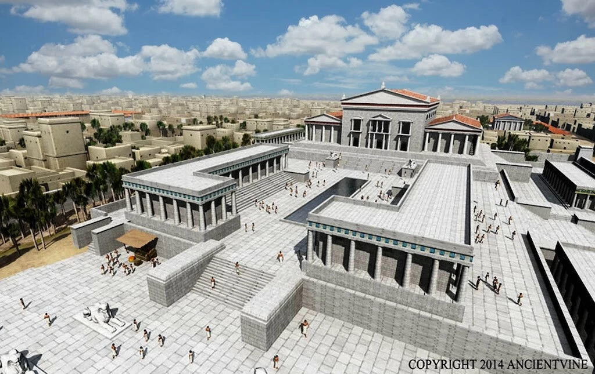
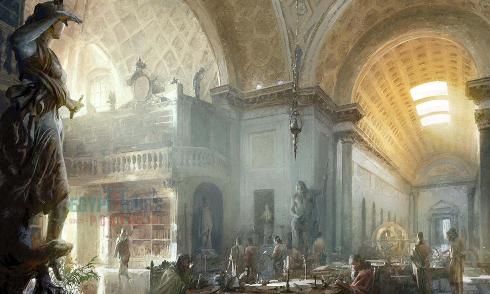
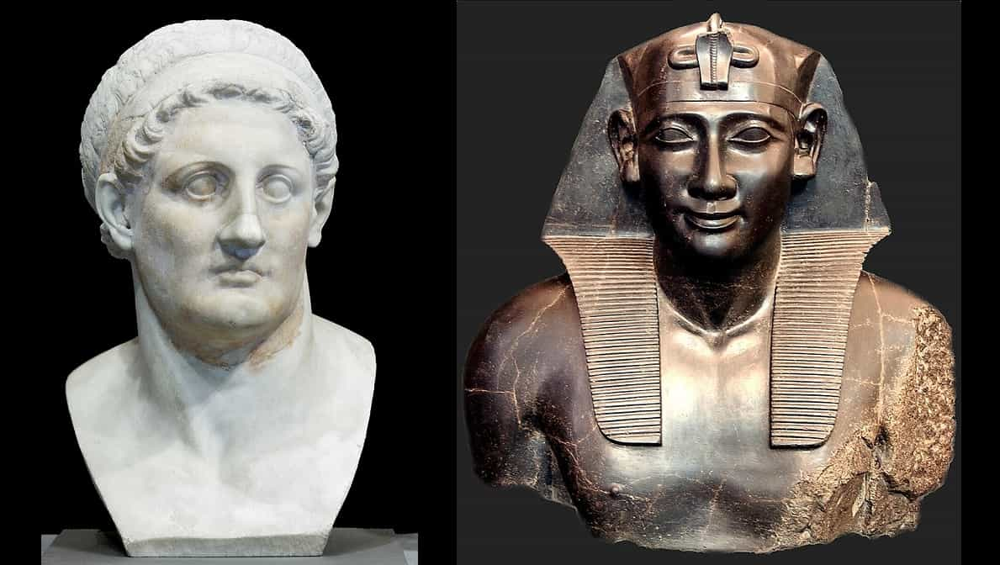
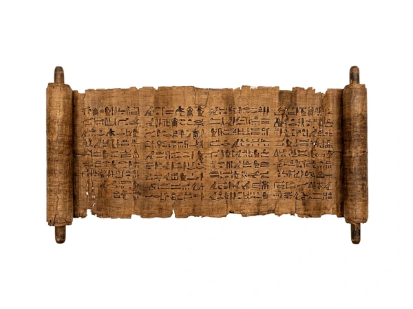
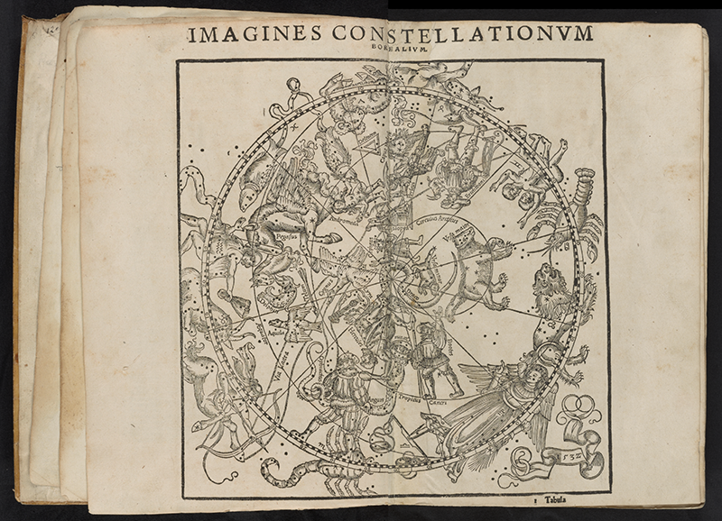
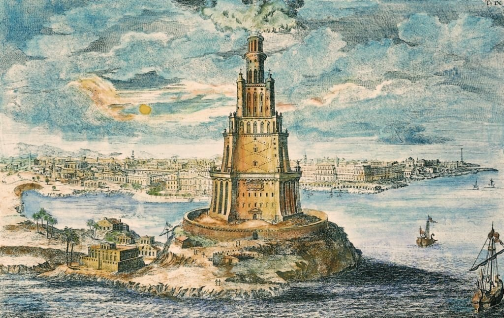
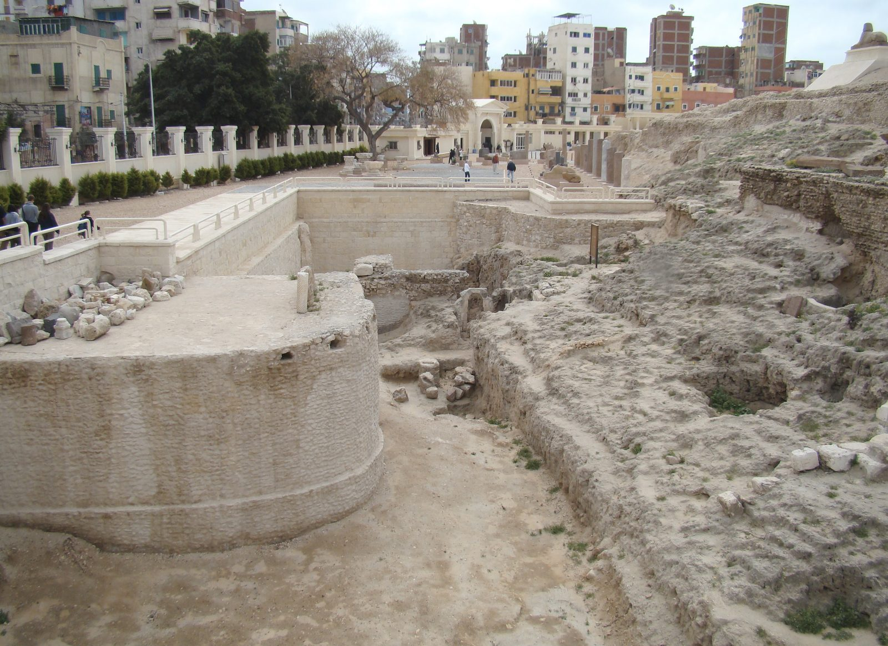
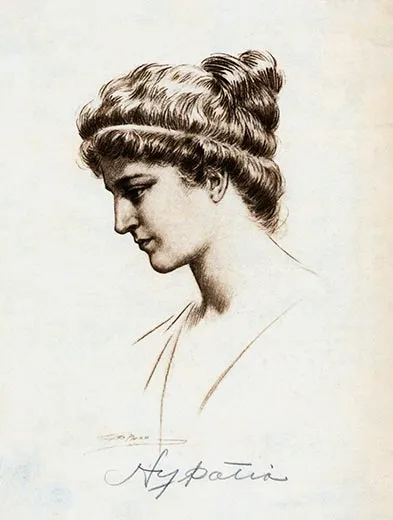

> Nếu một nền văn minh bị tước mất ký ức, nó vẫn có thể tiếp tục tồn tại, nhưng sẽ không còn biết mình từng có thể vươn xa đến đâu. Đại thư viện Alexandria vì thế không chỉ là một tòa nhà đã cháy, mà là biểu tượng của những tri thức nhân loại có thể đã mất vĩnh viễn.

### Trái tim trí tuệ của thế giới cổ đại

Các thư viện luôn là yếu tố cốt lõi của những nền văn hóa thịnh vượng.

Chúng không chỉ là nơi lưu trữ sách vở, mà còn là nơi kiến tạo tri thức, kết nối học giả và gìn giữ ký ức tập thể của một nền văn minh.

Dù các thư viện ở Babylon hay Nineveh từng rất lộng lẫy, không nơi nào có thể sánh được với Đại thư viện Alexandria.

Trong hơn 700 năm, từ thế kỷ III trước Công nguyên đến thế kỷ V sau Công nguyên, thành phố Alexandria nằm ở cửa sông Nile là trung tâm trí thức của cả vùng Địa Trung Hải.

Nếu Rome là trung tâm chính trị, thì Alexandria là nơi bất kỳ ai muốn học về triết học, thiên văn học, toán học, vật lý hay văn học đều phải tìm đến.

Thư viện Alexandria được thành lập vào khoảng năm 285 trước Công nguyên, khi thành phố này vẫn còn rất trẻ.

Sau khi Alexander Đại đế qua đời, vị tướng Ptolemy I Soter đã thành lập vương triều tại Ai Cập và thúc đẩy việc xây dựng một kho tàng chứa đựng mọi kiến thức của thế giới.

Ý tưởng này cực kỳ táo bạo: không chỉ lưu giữ tri thức của Ai Cập hay Hy Lạp, mà cố gắng gom toàn bộ di sản trí tuệ của nhân loại vào một trung tâm duy nhất.

### Museion và chính sách thu thập tri thức độc nhất

Ban đầu, nơi đây không được gọi là thư viện mà được gọi là Museion.

Museion có nghĩa là ngôi nhà của các nàng thơ Muses, những nữ thần bảo trợ cho nghệ thuật và khoa học.

Đây cũng là nguồn gốc của từ "Museum", tức bảo tàng, trong ngôn ngữ hiện đại.

Nói cách khác, Đại thư viện Alexandria không đơn thuần là một kho sách, mà gần giống một khuôn viên học thuật, nơi nghiên cứu, giảng dạy và tranh luận diễn ra liên tục.

Vương triều Ptolemy đã thực hiện những chính sách cực kỳ gắt gao để thu thập bản thảo.

Họ cử người đi khắp Địa Trung Hải để tìm kiếm các văn bản mới.

Thậm chí, Alexandria có một chính sách đặc biệt: mọi con tàu cập cảng đều phải nộp lại các cuốn sách trên tàu.

Các thư lại sẽ sao chép chúng, trả lại bản sao cho chủ tàu và giữ lại bản gốc cho thư viện.

Ước tính vào thời kỳ đỉnh cao, nơi đây lưu trữ hơn 500.000 cuộn giấy cói.

Nó tạo nên một "khuôn viên đại học" theo nghĩa rất hiện đại, với đầy đủ phòng đọc, phòng ăn, giảng đường và không gian nghiên cứu.

Alexandria vì vậy không chỉ bảo tồn tri thức, mà còn làm điều quan trọng hơn: tạo môi trường để tri thức tiếp tục sinh sôi.

### Những bộ óc vĩ đại thay đổi lịch sử

Nhiều học giả lỗi lạc đã học tập và làm việc tại Alexandria.

Những gì họ để lại đã ảnh hưởng đến nhân loại trong hàng nghìn năm:

- **Euclid:** Cha đẻ của hình học với bộ sách *Cơ sở* (*Elements*), đặt nền móng cho toán học suốt hơn 2.000 năm.
- **Zenodotus:** Thủ thư đầu tiên, người đã sắp xếp thư viện theo thứ tự bảng chữ cái.
- **Eratosthenes:** Người đầu tiên tính toán được chu vi Trái Đất với độ chính xác đáng kinh ngạc chỉ bằng cách đo bóng nắng tại hai thành phố khác nhau.
- **Archimedes:** Nhà toán học và kỹ sư thiên tài, người đã phát minh ra đinh vít Archimedes và nhiều thiết bị cơ khí.
- **Hero:** Nhà khoa học đã chế tạo ra động cơ hơi nước đầu tiên, Aeolipile, dù lúc đó nó chỉ được coi là một món đồ chơi.

Điểm đáng suy nghĩ nằm ở đây: nếu một nguyên mẫu động cơ hơi nước đã xuất hiện từ thời cổ đại, điều gì đã ngăn nhân loại bước vào một cuộc cách mạng công nghiệp sớm hơn hàng nghìn năm?

Có thể câu trả lời nằm ở chính số phận của Alexandria.

Tri thức không chỉ cần được phát hiện, nó còn cần được bảo vệ, truyền lại và ứng dụng trong một hệ thống xã hội đủ ổn định.

Khi hệ thống ấy sụp đổ, nhiều phát minh có thể bị chôn vùi như chưa từng tồn tại.

### Những thảm họa thiêu rụi tri thức nhân loại

Thời hoàng kim của thư viện không tồn tại mãi mãi.

Nó đã trải qua nhiều giai đoạn suy tàn và bị phá hủy.

Những thảm họa thường được nhắc đến bao gồm:

- **Hỏa hoạn thời Ptolemy VI:** Gắn với các cuộc nội chiến trong hoàng gia.
- **Chiến tranh của Julius Caesar năm 48 trước Công nguyên:** Khi Caesar bao vây cảng Alexandria, hỏa hoạn từ các con tàu đã lan vào một phần của thư viện, thiêu rụi hàng chục nghìn bản thảo.
- **Xâm lược và thiên tai:** Các cuộc tấn công của Đế chế Palmyra và trận động đất kinh hoàng năm 365 sau Công nguyên đã gây hư hại nặng nề cho các cấu trúc chính.

Điều đáng sợ không chỉ là một công trình bị phá hủy.

Điều đáng sợ là những câu hỏi, phát minh, bản đồ, thí nghiệm, lịch sử và những góc nhìn khác về thế giới có thể đã biến mất cùng nó.

Mỗi cuộn giấy cháy đi không chỉ là một văn bản, mà có thể là một hướng phát triển khác của nền văn minh nhân loại.

### Sự trỗi dậy của tôn giáo và cái chết của Hypatia

Vào thế kỷ IV sau Công nguyên, Alexandria trở thành chiến trường giữa các tín ngưỡng.

Sự trỗi dậy của Kitô giáo cực đoan đã dẫn đến sự đàn áp các học thuyết bị gọi là "ngoại đạo", Pagan.

Năm 412 sau Công nguyên, Serapeum, nhánh quan trọng nhất còn lại của thư viện, đã bị phá hủy hoàn toàn theo lệnh của Tổng giám mục Theophilus.

Bi kịch lớn nhất là cái chết của Hypatia, nữ toán học và triết học vĩ đại nhất thời bấy giờ.

Năm 415 sau Công nguyên, bà bị một đám đông cuồng tín tấn công ngay trên phố.

Bà bị kéo vào nhà thờ, bị lột trần và sát hại dã man bằng mảnh gốm và vỏ ốc.

Sau đó, họ thiêu xác bà ngoài thành phố để khẳng định bà không thuộc về thế giới của họ.

Hypatia qua đời trở thành biểu tượng cho sự thất bại của trí tuệ trước định kiến và sự thiếu hiểu biết.

Thư viện Alexandria biến mất vĩnh viễn sau cuộc xâm lược của người Ả Rập vào năm 641 sau Công nguyên.

Việc mất đi thư viện này là một bi kịch không thể đong đếm.

Nó có thể từng chứa đựng những bí mật về khoa học, lịch sử, công nghệ và nguồn gốc cổ đại mà chúng ta vẫn đang cố gắng tìm kiếm cho đến tận ngày nay.

Nếu các phần trước của *Te lo ocultaron* đặt câu hỏi về những thực thể, huyết thống và lịch sử bị che giấu, thì câu chuyện Alexandria nhắc ta về một dạng kiểm soát khác: kiểm soát bằng cách xóa ký ức.

Một nhân loại không biết mình từng biết gì sẽ rất dễ bị thuyết phục rằng mọi giới hạn hiện tại là tự nhiên.
