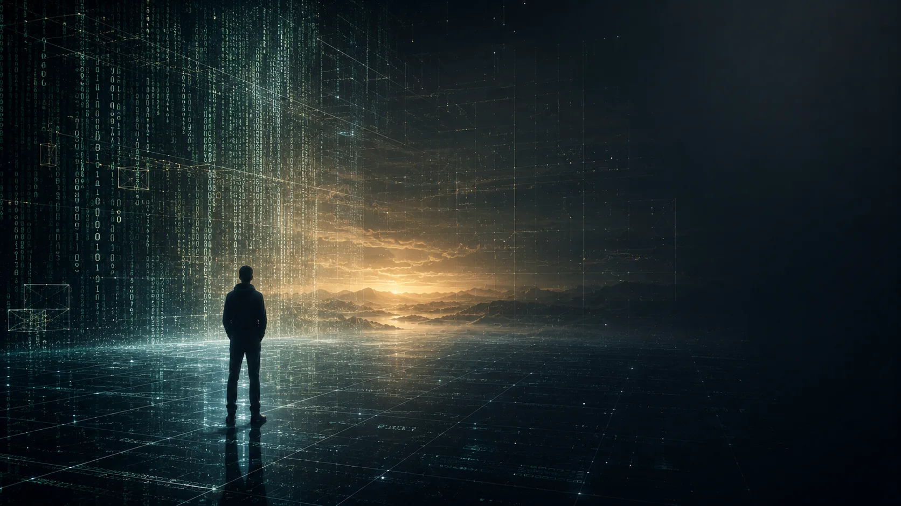
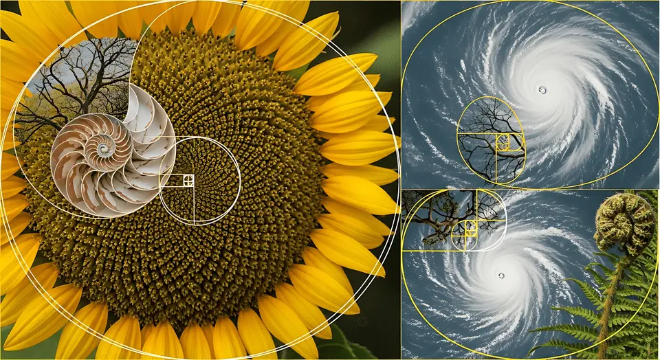

> Thuyết Ma trận không chỉ là câu chuyện khoa học viễn tưởng. Nó là một cách đặt lại câu hỏi về điều ta gọi là "thực tại", về giới hạn giác quan và về việc bộ não có thể đang giải mã một mô hình chứ không phải chạm trực tiếp vào thế giới.

### Thuyết Ma Trận Là Gì?

Theo nghĩa phổ biến, Thuyết Ma trận là giả thuyết cho rằng thế giới mà chúng ta đang trải nghiệm có thể là một mô phỏng. Ý tưởng này được thảo luận trong triết học hiện đại, nổi bật nhất là giả thuyết mô phỏng của Nick Bostrom, nhưng nó cũng chạm vào những trực giác rất cũ của nhân loại: liệu thứ ta gọi là "thực" có thực sự là toàn bộ bức tranh?

Điểm đáng chú ý của thuyết này không nằm ở việc chứng minh ngay rằng chúng ta đang sống trong một mô phỏng máy tính. Điểm đáng chú ý nằm ở chỗ nó buộc ta xem lại một điều hiển nhiên: **con người không tiếp cận thế giới trực tiếp, mà tiếp cận qua bộ lọc của nhận thức**.

Và khi đã có bộ lọc, thì luôn có khả năng có những thứ nằm ngoài vùng mà bộ lọc đó cho phép ta thấy.

### Năm Giác Quan Chỉ Là Một Cửa Sổ Hẹp

Con người thường tin rằng những gì mình thấy bằng mắt, nghe bằng tai, chạm bằng da, ngửi bằng mũi và nếm bằng lưỡi là toàn bộ thực tại. Nhưng trên thực tế, năm giác quan chỉ là một dải nhận tín hiệu rất nhỏ nếu đặt bên cạnh quy mô rộng lớn của tự nhiên.

- Mắt chỉ nhìn thấy một dải ánh sáng rất hẹp.
- Tai chỉ nghe được một dải tần giới hạn.
- Cơ thể chỉ cảm được một phần rất nhỏ của môi trường vật lý.
- Não bộ phải diễn giải phần còn lại thành một bức tranh có ý nghĩa.

Nói cách khác, ta không nhìn thấy "thế giới nguyên bản". Ta nhìn thấy **phiên bản đã được não tái cấu trúc**.

Điều này tạo ra một hệ quả quan trọng: nếu bản thân công cụ cảm nhận đã giới hạn, thì kết luận của ta về bản chất của thực tại cũng sẽ mang theo giới hạn đó.

### Thực Tại Mà Ta Cảm Nhận Có Thể Là Một Mô Hình

Một cách nhìn gần với khoa học nhận thức là coi bộ não như một cỗ máy dựng mô hình. Nó lấy dữ liệu từ môi trường, xử lý, lọc, dự đoán, và dựng lại một thế giới đủ ổn định để ta sống sót.

Điều đó có nghĩa là:

- Cái ta gọi là màu sắc là một diễn giải.
- Cái ta gọi là âm thanh là một diễn giải.
- Cái ta gọi là khoảng cách, vật thể, chuyển động cũng là diễn giải.
- Cảm giác "ở ngoài kia" thực ra được dựng lên "ở trong này".

Nếu vậy, câu hỏi về Ma trận không còn là câu hỏi thuần túy điện ảnh. Nó trở thành câu hỏi triết học: **nếu tất cả thứ ta tiếp xúc đều qua mô hình, vậy mô hình đó có đang che đi bản chất sâu hơn nào không?**

  
*Ma Trận Kỹ Thuật Số*

Hình ảnh lưới dữ liệu phát sáng gợi ra một ẩn dụ trực diện: thế giới có thể được hiểu như một mạng thông tin, nơi mọi thứ là các nút kết nối, tín hiệu và cấu trúc. Trong cách nhìn này, thực tại không còn là những vật thể cô lập, mà là một hệ thống đang vận hành.

Khi đặt câu hỏi về Thuyết Ma trận, ta thực ra đang hỏi: liệu mình có đang sống bên trong một lớp giao diện khổng lồ, nơi những gì thấy được chỉ là bề mặt của một hệ điều hành sâu hơn?

### Từ Tín Hiệu Đến Ý Nghĩa

Con người không sống bằng tín hiệu thô. Con người sống bằng ý nghĩa.

Ví dụ:

- Sóng ánh sáng đi vào mắt không tự động trở thành “cái bàn”.
- Dao động không khí đi vào tai không tự động trở thành “tiếng nói”.
- Phân tử mùi không tự động trở thành “mùi cà phê”.

Tất cả đều phải được não bộ chuyển hóa. Điều này rất quan trọng, vì nó cho thấy "thế giới ta thấy" không phải bản thân sự vật, mà là cách hệ thần kinh hiểu sự vật.

Đó là lý do nhiều truyền thống triết học và tâm linh từ xưa đã nghi ngờ tính chắc chắn của cảm giác. Chúng không nhất thiết nói về máy tính hay mô phỏng, nhưng chúng cùng chạm vào một ý: **con người có thể đang nhầm trải nghiệm với bản thể**.

  
*Con Người Trong Không Gian Ma Trận*

Hình ảnh này nhấn mạnh một ý quan trọng hơn cả công nghệ: cảm giác bị bao quanh bởi dữ liệu, ký hiệu, cấu trúc và màn hình của thông tin.

Trong ngôn ngữ của Thuyết Ma trận, con người có thể giống như một chủ thể nằm trong một lớp môi trường được xây dựng sẵn. Nhưng dù ẩn dụ này đúng theo nghĩa nào đi nữa, nó vẫn làm nổi bật một điều: **cái ta gọi là thế giới có thể được mã hóa nhiều hơn ta tưởng**.

### Fractal Và Tính Lặp Của Thực Tại

Một trong những ý tưởng hấp dẫn nhất trong các thảo luận quanh Thuyết Ma trận là fractal. Fractal là các mô thức tự tương đồng, nơi một hình thức lặp lại ở nhiều quy mô khác nhau.

Trong tự nhiên, ta thấy:

- Cấu trúc xoắn ốc
- Hình dạng tương tự giữa vi mô và vĩ mô
- Các nhánh cây, mạch máu, dải ngân hà, bông hoa, cơn bão

Fractal không tự chứng minh thế giới là mô phỏng, nhưng nó cho thấy một điều rất thú vị: **tự nhiên có xu hướng tổ chức theo quy luật lặp và tự đồng dạng**.

Nếu một hệ thống được dựng bằng quy luật lặp, thì việc nhìn thấy những mô thức giống nhau ở nhiều cấp độ không còn là điều kỳ quái. Nó chỉ là dấu hiệu cho thấy thế giới có cấu trúc sâu hơn mắt thường.

  
*Fractal Trong Tự Nhiên*

Hình ảnh về hoa hướng dương, vỏ ốc và cơn bão cho thấy một dạng ngôn ngữ cổ của tự nhiên: lặp lại, xoáy, phát triển và tự tổ chức. Dù ta gọi nó là fractal, tỷ lệ vàng hay mô thức hình học, nó vẫn nhắc rằng thế giới không vận hành ngẫu nhiên theo cảm giác bề mặt.

Nếu thực tại là một hệ mô phỏng hay một hệ thông tin, thì fractal là một trong những kiểu “chữ ký” dễ khiến người quan sát chú ý nhất.

### Có Cần Phải Tin Rằng Chúng Ta Đang Sống Trong Mô Phỏng Không?

Không nhất thiết.

Điểm mạnh của Thuyết Ma trận không nằm ở việc ép ta tin một giả thiết duy nhất. Điểm mạnh của nó là nó mở ra một tư thế trí tuệ đúng hơn: **đừng đồng nhất trải nghiệm chủ quan với toàn bộ sự thật**.

Ta có thể tiếp cận thuyết này theo nhiều tầng:

1. Tầng triết học: thực tại là gì?
2. Tầng nhận thức: ta biết thế giới bằng cách nào?
3. Tầng khoa học: giới hạn của giác quan và mô hình đo lường là gì?
4. Tầng biểu tượng: tại sao nhân loại luôn kể lại những câu chuyện về ảo ảnh, giấc mơ và thức tỉnh?

Không cần khẳng định tất cả, nhưng cũng không nên vội bác bỏ những câu hỏi lớn chỉ vì chúng làm ta khó chịu.

### Thức Tỉnh Không Phải Là Tưởng Tượng Mình Biết Hết

Một lỗi rất phổ biến khi bàn về Thuyết Ma trận là biến nó thành một hệ niềm tin cứng nhắc. Khi đó, người ta thay thế một ảo tưởng này bằng một ảo tưởng khác.

Thức tỉnh, nếu dùng theo nghĩa thực tế, không phải là “ta đã thấy hết sự thật”. Nó là:

- Biết nghi ngờ đúng chỗ
- Biết quan sát giới hạn của bản thân
- Biết rằng cảm nhận không phải chân lý cuối cùng
- Biết mở rộng công cụ nhận thức thay vì bám chặt vào thói quen

Vậy nên, bài học hay nhất từ Thuyết Ma trận không phải là sợ hãi thế giới. Bài học là học cách đặt câu hỏi sâu hơn về nó.

### Kết Luận

Thuyết Ma trận hấp dẫn vì nó chạm đúng vào một nỗi bất an rất người: nếu những gì ta đang thấy chỉ là bề mặt thì đâu mới là phần thật?

Ta chưa cần phải kết luận rằng thế giới là một mô phỏng để thấy giá trị của câu hỏi này. Chỉ riêng việc hiểu rằng giác quan là hữu hạn, nhận thức là có cấu trúc lọc, và bộ não là một cỗ máy dựng mô hình đã đủ để làm ta khiêm tốn hơn trước thực tại.

Và sự khiêm tốn đó là điểm khởi đầu tốt nhất cho bất kỳ hành trình nhận thức nào.
