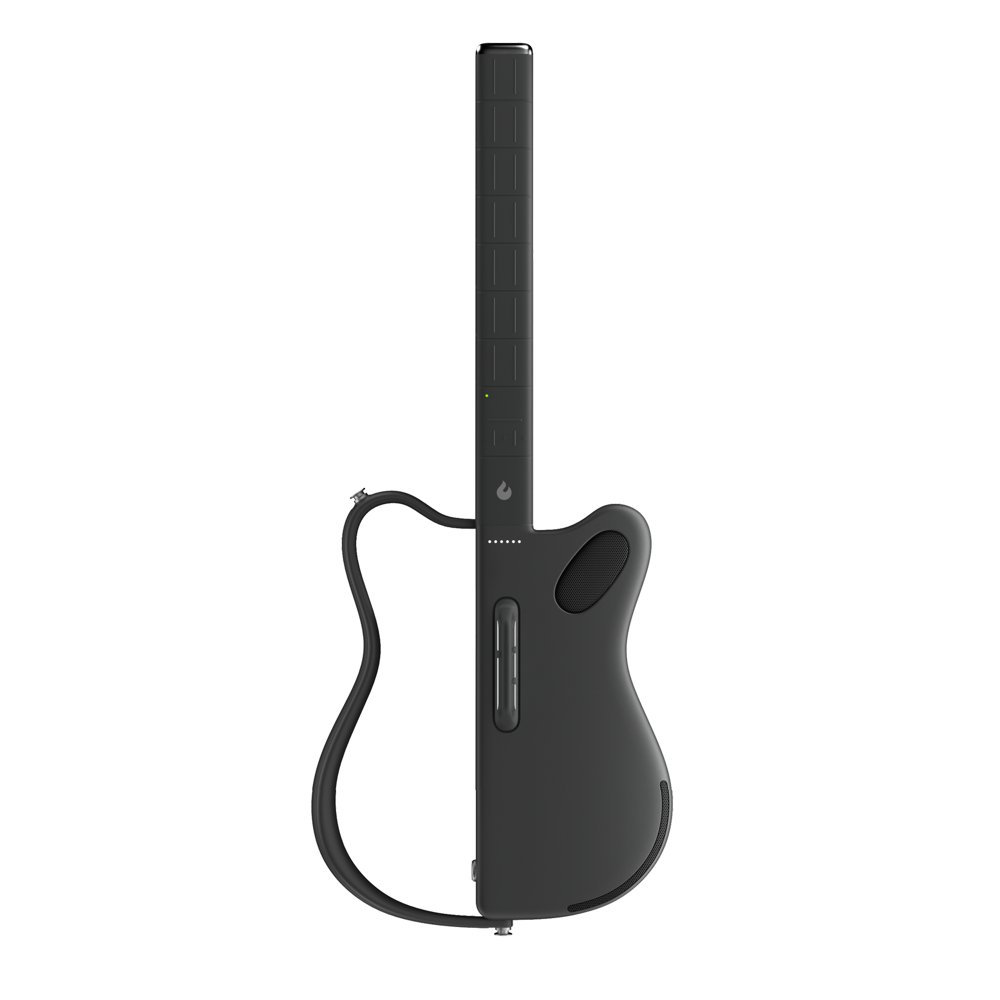

> **LAVA GENIE** là kiểu thiết bị khiến người ta phải hỏi lại: đây là một cây đàn, một sampler, một controller hay một món đồ chơi âm nhạc thông minh? Câu trả lời hợp lý nhất có lẽ là: nó nằm ở giữa tất cả những thứ đó.

  <iframe
    src="https://www.youtube.com/embed/1dRWZOuMrO4"
    title="Introducing Dark GENIE"
    allow="accelerometer; autoplay; clipboard-write; encrypted-media; gyroscope; picture-in-picture; web-share"
    allowfullscreen
    style="position: absolute; inset: 0; width: 100%; height: 100%; border: 0;"
  ></iframe>

### Một cây đàn không có dây

Ấn tượng đầu tiên về LAVA GENIE rất lạ: hình dáng gợi nhớ đến guitar, nhưng thứ quen thuộc nhất của guitar lại biến mất - **dây đàn**.

- Không dây để bấm.
- Không dây để gảy.
- Không cần lên dây.
- Không có tiếng rè dây.
- Không có chuyện đầu ngón tay đau rát sau vài ngày tập hợp âm.

LAVA gọi đây là **stringless smart guitar**. Nhưng nếu chỉ dịch thẳng là “đàn guitar thông minh không dây” thì vẫn chưa đủ. Nó không phải cây guitar acoustic bị bỏ dây rồi gắn loa vào. Nó là một thiết bị điện tử được thiết kế theo tinh thần guitar, dùng cảm ứng, preset, app và loa tích hợp để giúp người dùng tạo nhạc nhanh hơn.

Vì vậy, cách tiếp cận đúng ngay từ đầu là: **đừng hỏi nó có thay thế guitar truyền thống không**.

Câu hỏi đúng hơn là: **nó có giúp một người bình thường chạm vào âm nhạc nhanh hơn không?**

 

### LAVA GENIE là đàn, sampler hay đồ chơi?

Nó là cả ba, nhưng không trọn vẹn theo nghĩa truyền thống của từng món.

Là **đàn**, vì người dùng vẫn cầm nó như một nhạc cụ, chọn hợp âm, tạo nhịp, chơi theo bài và biểu diễn trước người khác.

Là **sampler/controller**, vì âm thanh không đến từ dây rung tự nhiên, mà đến từ hệ thống điện tử, preset, sample, hiệu ứng và loa.

Là **đồ chơi âm nhạc thông minh**, vì nó cố tình hạ thấp rào cản kỹ thuật: người mới không cần biết quá nhiều nhạc lý vẫn có thể tạo ra thứ nghe giống một màn trình diễn.

Điểm thú vị nằm ở chỗ đó.

Nếu nhìn bằng con mắt guitarist truyền thống, LAVA GENIE có thể bị xem là “không thật”. Nhưng nếu nhìn bằng con mắt của một creator, một người mới tập nhạc, hoặc một người chỉ muốn cầm lên chơi ngay, nó lại rất hợp thời.

### Cách chơi: chạm, tap và glide thay cho bấm dây

Theo các trang bán lẻ lớn như Guitar Center, Music & Arts và Wellbots, LAVA GENIE dùng **fretboard silicone**. Người dùng tương tác bằng các thao tác như **touch**, **tap** và **glide** thay vì bấm dây thật.

Điểm này làm thay đổi toàn bộ trải nghiệm.

Với guitar truyền thống, rào cản đầu tiên là bàn tay trái: bấm hợp âm sao cho sạch, không tịt dây, không rè, chuyển hợp âm đủ nhanh. Sau đó mới đến tay phải, nhịp, tiết tấu và cảm xúc.

Với LAVA GENIE, phần đau đầu ban đầu được rút ngắn. Bạn không phải vật lộn với thế bấm dây kim loại. Bạn tương tác với một bề mặt cảm ứng, chọn chế độ hợp âm và để thiết bị xử lý phần âm thanh.

Thiết bị được giới thiệu có các chế độ như **7-chord mode** và **21-chord mode**.

Nói đơn giản:

- 7-chord mode hợp với người mới, người muốn chơi nhanh những vòng hợp âm cơ bản.
- 21-chord mode mở rộng hơn, phù hợp khi muốn có nhiều màu hòa âm hơn.
- Fingerboard có thể tùy chỉnh, giúp người dùng tạo bố cục phù hợp với cách chơi của mình.

Đây là triết lý rất khác guitar cổ điển.

Guitar truyền thống buộc người học đi qua đau tay, sai hợp âm, luyện lực ngón, luyện cảm giác dây. LAVA GENIE chọn hướng khác: để người dùng có cảm giác “tôi đã chơi được nhạc” sớm hơn.

### Người mới sẽ thích điều gì?

Người mới thường bỏ cuộc với guitar vì ba lý do:

- Đau tay.
- Chuyển hợp âm chậm.
- Tập lâu mà vẫn nghe không giống bài hát.

LAVA GENIE đánh thẳng vào ba điểm đó.

Không dây đàn nghĩa là ít đau tay hơn. Chế độ hợp âm đơn giản giúp người mới vào bài nhanh hơn. Hệ thống preset, sample và loa tích hợp khiến âm thanh nghe “đã” hơn so với một người mới gảy guitar acoustic rè dây trong tuần đầu.

Nếu chỉ xét mục tiêu **khơi cảm hứng**, đây là lợi thế lớn.

Một người chưa từng học nhạc có thể cầm LAVA GENIE, mở app, chọn bài, nhìn hướng dẫn, chạm theo hợp âm và tạo ra một đoạn nhạc có cấu trúc. Cảm giác “mình làm được rồi” xuất hiện sớm hơn rất nhiều.

Với người mới, cảm giác thành công ban đầu rất quan trọng. Nó quyết định họ có tiếp tục học hay không.

### LAVA+ app: học nhạc kiểu có người dẫn đường

LAVA GENIE không chỉ là phần cứng. Nó đi cùng hệ sinh thái **LAVA+ app**.

Theo thông tin công bố từ các trang bán lẻ, app có các tính năng như **Guiding Lights** và **Interactive ChordChart**.

Điều này biến quá trình học nhạc thành một trải nghiệm gần giống game:

- App hiển thị hợp âm.
- Đèn/hướng dẫn chỉ vị trí cần chơi.
- Người dùng làm theo từng bước.
- Bài hát trở nên dễ tiếp cận hơn.

Đây là kiểu học rất hợp với thế hệ quen YouTube, TikTok, app học đàn và bài hướng dẫn ngắn. Thay vì mở sách nhạc lý rồi học từng thế bấm, người dùng đi thẳng vào bài hát.

Tuy nhiên, mặt trái cũng rõ.

Nếu phụ thuộc quá nhiều vào app, người học có thể chơi được vài bài nhưng không hiểu sâu cấu trúc âm nhạc. Họ biết bấm theo đèn, nhưng chưa chắc hiểu vì sao hợp âm đó nằm ở đó.

Vì vậy, LAVA GENIE rất tốt để **bắt đầu**, nhưng nếu muốn đi xa hơn, người dùng vẫn nên học thêm nhịp, hòa âm, cấu trúc bài hát và tai nghe.

### Âm thanh: không phải tiếng guitar gỗ, mà là một hệ preset

Đây là điểm cần nói thẳng.

LAVA GENIE không tạo âm thanh như guitar acoustic.

Nó không có dây rung, không có thùng gỗ cộng hưởng, không có dynamic tự nhiên từ móng tay, pick, lực bấm dây hay vibrato truyền thống.

Âm thanh của nó đến từ hệ thống điện tử: preset, sample, hiệu ứng và loa tích hợp.

Theo Wellbots, thiết bị có hơn **500 presets**, có **lavaAI sound effects**, có **HD recording samples**. Các trang bán lẻ cũng mô tả hệ thống loa tích hợp gồm bass và dual-driver full-range audio system.

Vậy nó có “hay” không?

Câu trả lời phụ thuộc vào kỳ vọng.

Nếu bạn kỳ vọng âm thanh như một cây Taylor, Martin hay Gibson acoustic, bạn sẽ thất vọng.

Nếu bạn kỳ vọng một thiết bị nhỏ gọn có thể phát ra nhiều texture âm thanh, hợp âm, loop, hiệu ứng và ý tưởng nhanh, bạn sẽ thấy nó thú vị.

LAVA GENIE không nên bị hỏi: “nó có giống guitar thật không?”

Nó nên được hỏi: “nó có giúp tôi tạo nhạc nhanh, vui và đủ dùng trong bối cảnh của tôi không?”

### Sampler cho creator: chạm vào là có ý tưởng

Phần hấp dẫn nhất của LAVA GENIE có lẽ không nằm ở việc nó giống guitar bao nhiêu, mà nằm ở việc nó giống một **idea machine**.

Một creator có thể dùng nó để:

- Tạo nhạc nền ngắn.
- Phác vòng hợp âm.
- Thử mood cho video.
- Biểu diễn trước camera.
- Quay nội dung social vì hình dáng thiết bị rất lạ.
- Tạo cảm giác “futuristic musician” mà một cây guitar thường khó đem lại.

Đây là lý do tôi nghiêng về cách gọi LAVA GENIE là **sampler dạng guitar** hơn là guitar thay thế.

Nó có thể không làm hài lòng người chơi guitar chuyên nghiệp đang tìm nuance của dây thật. Nhưng nó có thể rất hợp với người làm Reels, Shorts, TikTok, vlog, demo nhạc, hoặc chỉ muốn một thiết bị âm nhạc “cầm lên là có vibe”.

### Loa, pin và tính di động

Một điểm đáng giá của LAVA GENIE là nó không cần setup phức tạp.

Theo thông tin từ Music & Arts và Wellbots, thiết bị có:

- Loa tích hợp.
- USB-C.
- Output 6.35mm.
- Input 3.5mm.
- Pin khoảng 6 giờ khi dùng loa trong.
- Pin khoảng 8 giờ khi dùng loa ngoài.
- Trọng lượng khoảng 1.9kg.
- Thiết kế có thể gập/tháo và đi kèm travel case.

Điều này khiến LAVA GENIE giống một thiết bị “mang đi chơi” hơn là một cây đàn phải chuẩn bị nhiều thứ.

Bạn có thể mang nó đến phòng bạn bè, studio nhỏ, chuyến du lịch, lớp học, buổi brainstorming hoặc góc quay video. Không cần amp, không cần dây đàn dự phòng, không cần tuner.

Nhưng cũng phải nhớ: đây là thiết bị điện tử. Nó cần pin, cần sạc, cần app, cần firmware ổn định. Guitar gỗ có thể để mười năm vẫn gảy được nếu bảo quản tốt. Một smart guitar thì phụ thuộc nhiều hơn vào phần mềm và hệ sinh thái.

### Ai nên mua LAVA GENIE?

LAVA GENIE phù hợp nhất với các nhóm sau.

**Người mới học nhạc:** muốn vào bài nhanh, không muốn bị chặn bởi đau tay và thế bấm khó.

**Content creator:** cần một nhạc cụ nhìn lạ, lên hình đẹp, dễ tạo mood cho video.

**Người thích công nghệ:** muốn thử cảm giác chơi nhạc cụ thông minh, app-connected, preset-driven.

**Producer nghiệp dư:** cần một công cụ phác ý tưởng nhanh mà không cần mở cả setup laptop, MIDI keyboard, interface.

**Người hay di chuyển:** muốn một thiết bị có loa, pin, case và ít bảo trì hơn guitar thường.

**Phụ huynh mua cho con làm quen âm nhạc:** nếu mục tiêu là khơi cảm hứng, LAVA GENIE có thể dễ tiếp cận hơn guitar dây thật.

### Ai không nên mua?

Nếu bạn muốn học guitar bài bản, LAVA GENIE không thay thế được guitar truyền thống.

Nó không dạy bạn cảm giác dây, lực bấm, picking, bending, vibrato, muting, dynamics hay tone từ tay phải. Đây là những thứ cốt lõi của guitar thật.

Nếu bạn là guitarist đã chơi lâu, bạn có thể thấy nó thiếu phản hồi vật lý.

Nếu bạn làm nhạc chuyên nghiệp, bạn cần kiểm tra kỹ:

- Độ trễ.
- Chất lượng output.
- Độ ổn định app.
- Preset có dùng được trong sản phẩm thật không.
- Có xuất MIDI/audio tiện không.
- Có bị giới hạn bởi hệ sinh thái LAVA không.

Nếu bạn ghét thiết bị phải sạc pin, ghét app, ghét firmware, ghét phụ thuộc cloud, thì guitar truyền thống vẫn là lựa chọn bền vững hơn.

### So với guitar truyền thống

Guitar truyền thống có một lợi thế không gì thay thế được: **cảm giác thật**.

Dây rung thật, tay bấm thật, gỗ cộng hưởng thật, sai đúng nghe thấy ngay. Học guitar thật khó hơn, nhưng chính cái khó đó tạo nền tảng kỹ thuật và cảm xúc.

LAVA GENIE thì khác.

Nó hy sinh một phần cảm giác thật để đổi lấy tốc độ tiếp cận, sự tiện lợi và khả năng tạo âm thanh nhanh.

Nếu guitar truyền thống giống học viết tay, thì LAVA GENIE giống dùng một bàn phím thông minh có gợi ý câu. Bạn vẫn có thể tạo nội dung, thậm chí rất nhanh, nhưng trải nghiệm cơ thể và kỹ năng nền là hai thứ khác nhau.

Vì vậy, không nên đặt chúng vào cuộc chiến “cái nào hơn”.

Chúng phục vụ hai nhu cầu khác nhau.

### So với MIDI controller và app làm nhạc

Một MIDI controller rẻ hơn có thể làm nhiều việc hơn nếu bạn đã có laptop, DAW và plugin.

Một app làm nhạc trên iPad cũng có thể mạnh hơn về sản xuất chuyên sâu.

Nhưng LAVA GENIE có một lợi thế mà MIDI controller thường thiếu: **hình dáng biểu diễn**.

Bạn cầm nó như một cây đàn. Bạn có thể đứng chơi. Bạn có thể quay video. Bạn có thể tạo cảm giác sân khấu. Nó không chỉ là thiết bị nhập dữ liệu âm nhạc, mà còn là một vật thể có tính trình diễn.

Đó là điểm ăn tiền với creator.

### Điểm cần kiểm chứng nếu có máy thật

Trước khi kết luận nó “đáng mua” hay không, có một số thứ bắt buộc phải test trực tiếp:

- Fretboard silicone có nhạy và chính xác không?
- Touch/tap/glide có bị trễ không?
- Chuyển hợp âm có mượt không?
- Guiding Lights có thật sự giúp học nhanh hơn không?
- App LAVA+ có ổn định không?
- Preset có chất lượng hay chỉ vui lúc demo?
- Loa trong có đủ lực không?
- Output ra loa/interface có sạch không?
- Pin thực tế có gần với thông số công bố không?
- Có dùng tốt khi không có internet không?
- Sau một tuần còn muốn chơi tiếp không?

Đây là những câu hỏi quyết định giá trị thật.

Một thiết bị âm nhạc thông minh rất dễ gây ấn tượng trong 15 phút đầu. Nhưng thứ quan trọng là: sau vài ngày, nó còn khiến bạn muốn cầm lên chơi nữa không?

### Kết luận: món đồ chơi nghiêm túc

LAVA GENIE không phải guitar truyền thống.

Nó cũng không chỉ là đồ chơi.

Cách gọi công bằng nhất có lẽ là: **một món đồ chơi âm nhạc nghiêm túc**.

Nó nghiêm túc vì có phần cứng riêng, app riêng, preset, loa, pin, output và một triết lý chơi nhạc rõ ràng.

Nó giống đồ chơi vì mục tiêu đầu tiên không phải đào tạo guitarist chuyên nghiệp, mà là khiến người dùng thấy vui, thấy dễ, thấy muốn tạo nhạc ngay.

Và đôi khi, đó chính là thứ âm nhạc cần.

Không phải ai cũng muốn trở thành nghệ sĩ sân khấu.

Nhiều người chỉ muốn một thiết bị giúp họ chạm vào cảm hứng nhanh hơn, ít rào cản hơn, vui hơn và hiện đại hơn.

Nếu nhìn theo hướng đó, LAVA GENIE là một sản phẩm rất đáng quan tâm.

Không phải vì nó thay thế cây đàn guitar.

Mà vì nó đặt ra một câu hỏi thú vị hơn:

**Nếu việc chơi nhạc không còn bắt đầu bằng đau tay và nản lòng, sẽ có thêm bao nhiêu người dám bắt đầu?**

### Nguồn tham khảo

- Guitar Center - [LAVA GENIE Stringless Smart Guitar With Custom Travel Case](https://www.guitarcenter.com/LAVA-MUSIC/LAVA-GENIE-Stringless-Smart-Guitar-With-Custom-Travel-Case-Black-1500000462374.gc)
- Music & Arts - [LAVA GENIE Stringless Smart Guitar With Custom Travel Case](https://www.musicarts.com/lava-music-lava-genie-stringless-smart-guitar-with-custom-travel-case-main0550147)
- Wellbots - [LAVA GENIE Guitar](https://www.wellbots.com/products/lava-genie-guitar)
- Wallpaper - [LAVA Studio review: smart guitar ecosystem context](https://www.wallpaper.com/tech/lava-studio-review)