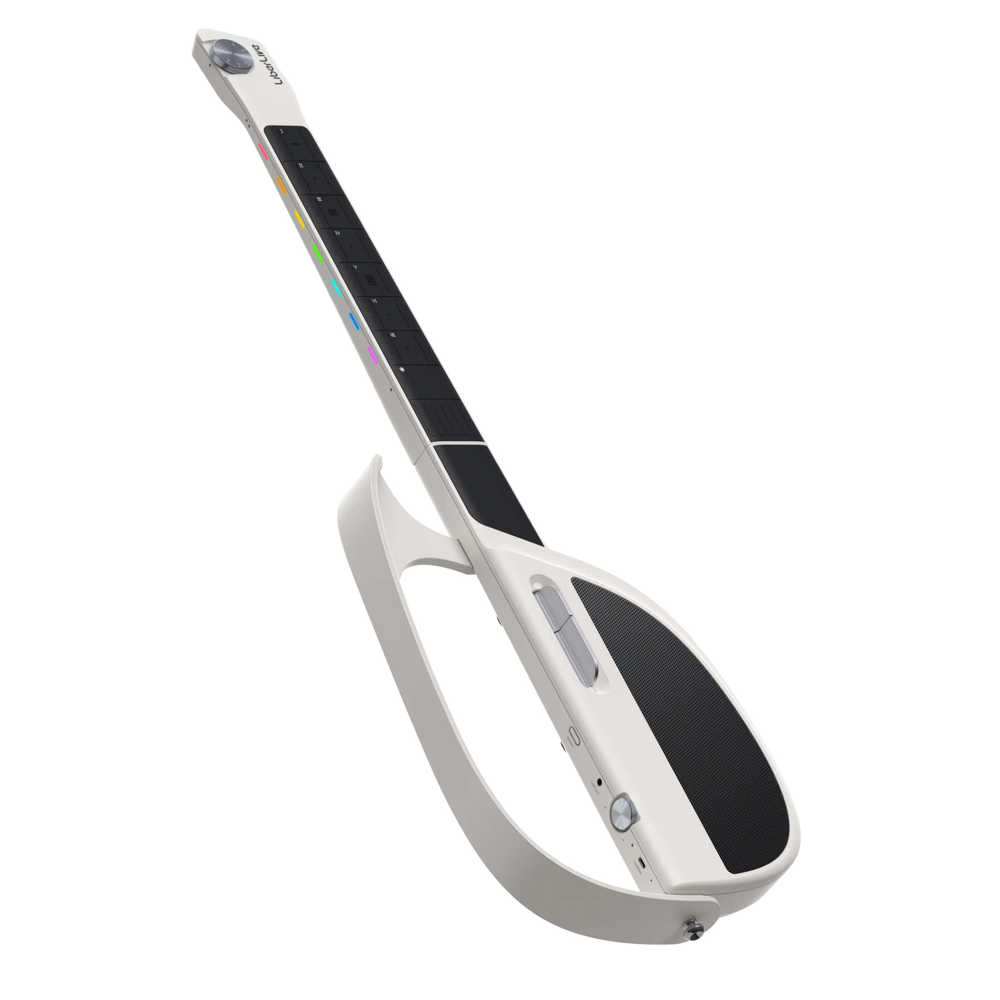

> Nếu LAVA GENIE khiến người ta hỏi “đây là đàn hay sampler?”, thì **LiberLive C1** lại đặt ra một câu hỏi khác: một cây guitar có cần dây, thế bấm khó và nhiều tháng đau tay mới được gọi là nhạc cụ không?

<video controls playsinline preload="metadata" src="https://liberlive.com/cdn/shop/videos/c/vp/32590e2636f3447da7c7497fa4079eb1/32590e2636f3447da7c7497fa4079eb1.HD-720p-3.0Mbps-84371444.mp4" style="width: 100%; border-radius: 18px; margin: 0 0 2rem; box-shadow: 0 20px 60px rgba(15, 23, 42, 0.18); background: #0f172a;">Trinh duyet cua ban khong ho tro video HTML5.</video>
### Guitar không dây, nhưng không phải guitar truyền thống

LiberLive C1 được hãng gọi là **stringless smart guitar** - một cây guitar thông minh không dây đàn.

Nhìn từ xa, nó vẫn giữ dáng dấp của guitar: có thân đàn, cần đàn, vùng gảy, vùng điều khiển, dây đeo, túi đựng, tư thế cầm tương đối quen thuộc.

- Nhưng khi nhìn gần, mọi thứ thay đổi.
- Không còn sáu dây kim loại.
- Không còn thế bấm F đau tay.
- Không còn cảnh bấm hợp âm bị tịt tiếng.

Không còn việc phải học đủ lâu mới đệm được một bài hát đơn giản.

LiberLive C1 thay dây đàn bằng **chord pad**, **touch fretboard**, **strum paddle**, app hướng dẫn và hệ thống âm thanh tích hợp. Ý tưởng rất rõ: giảm rào cản đầu vào để người mới có thể hát và đệm nhạc nhanh hơn.

Vì vậy, cách hiểu đúng nhất là: LiberLive C1 không cố trở thành cây guitar thay thế guitar truyền thống. Nó giống một **thiết bị đệm hát thông minh** lấy hình dáng guitar làm giao diện chơi nhạc.

### Cách chơi: press, strum, sing

Official site của LiberLive mô tả cách chơi bằng ba bước rất ngắn: **Press. Strum. Sing.**

Nói dễ hiểu:

- **Press a chord:** chạm hoặc bấm vào chord pad để chọn hợp âm.
- **Strum with the paddle:** gảy bằng paddle để tạo cảm giác strumming.
- **Follow the app:** nhìn app để theo hợp âm, lời bài hát và hướng dẫn theo thời gian thực.

Điểm khác biệt lớn nhất so với guitar thật nằm ở tay trái.

Trên guitar truyền thống, tay trái phải bấm chính xác từng ngón để tạo hợp âm. Với LiberLive C1, người chơi chọn hợp âm qua pad. Việc này làm mất đi một phần kỹ thuật guitar, nhưng đổi lại người mới có thể đệm hát rất nhanh.

Nếu mục tiêu của bạn là trở thành guitarist nghiêm túc, đây không phải con đường thay thế.

Nhưng nếu mục tiêu là: “tôi muốn hát và tự đệm một bài trong vài phút”, LiberLive C1 đánh rất đúng điểm đau.

### Vì sao người mới dễ thích LiberLive C1?

Người mới học guitar thường vỡ mộng ở giai đoạn đầu.

Họ mua đàn về vì muốn chơi những bài mình thích. Nhưng thực tế tuần đầu thường là đau tay, dây rè, hợp âm sai, nhịp loạn và cảm giác “sao nghe chẳng giống video hướng dẫn”.

LiberLive C1 đảo ngược trải nghiệm đó.

Thay vì bắt bạn học kỹ thuật trước rồi mới được chơi bài, nó cho bạn **chơi bài trước**, rồi sau đó mới dần hiểu nhịp, hợp âm, tông giọng, cấu trúc bài hát.

Theo trang official, C1 có app với **10.000+ bài hát**, real-time chord sheets, lyrics, guiding lights, và không yêu cầu subscription. Đây là điểm rất quan trọng: nó biến cây đàn thành một hệ thống karaoke/đệm hát tương tác.

Người dùng không phải hỏi “bài này hợp âm gì?”.

Họ mở app, tìm bài, nhìn hướng dẫn, bấm theo và hát.

Đó là cách tiếp cận cực kỳ hợp với người mới, người thích hát, người làm nội dung ngắn hoặc người muốn có một nhạc cụ trong nhà để chơi vui.

 

### Một người, một ban nhạc

LiberLive không chỉ muốn C1 là cây đàn đệm hợp âm. Hãng định vị nó như một công cụ “one person, one band”.

Theo official site, C1 có thể thêm **drum styles**, **real-time bass backing**, style packs qua nhiều thể loại, và các sound mode như **guitar**, **bass**, **piano**.

Điều này biến trải nghiệm từ “tôi đang gảy vài hợp âm” thành “tôi đang có backing band tối giản”.

Đây là điểm rất khác guitar truyền thống.

Guitar thật có chiều sâu biểu cảm, nhưng nếu chơi một mình thì phần âm thanh vẫn khá đơn giản trừ khi bạn dùng loop station, pedal, backing track hoặc kỹ thuật fingerstyle tốt.

LiberLive C1 chọn hướng ngược lại: kỹ thuật tay đơn giản hơn, nhưng hệ thống bên trong giúp âm thanh đầy hơn.

Với người hát cover, đây là lợi thế thực tế.

Bạn không cần setup DAW, không cần loop pedal, không cần track đệm tải sẵn. Chỉ cần mở app, chọn bài, chọn style, điều chỉnh tempo/tông và chơi.

### App là trung tâm trải nghiệm

LiberLive C1 phụ thuộc nhiều vào app, nhưng không phải theo kiểu bất tiện. App chính là thứ làm sản phẩm có ý nghĩa.

Theo official site, app hỗ trợ:

- Thư viện hơn 10.000 bài hát.
- Real-time chord sheets và lyrics.
- Guiding lights.
- 72 custom chords.
- 12-key transposition.
- Upload chart.
- Piano/bass sound options.
- Tips và tutorial.
- Không tính phí subscription cho các tính năng chính được công bố.

Điểm đáng chú ý là **12-key transposition**.

Với người hát, không phải bài nào cũng hợp tông. Guitar truyền thống có capo, có chuyển hợp âm, có nhiều cách xử lý, nhưng người mới thường không biết làm. LiberLive đưa việc đổi tông vào app, giúp người dùng tìm tông hát phù hợp nhanh hơn.

Đây là tính năng nhỏ nhưng thực dụng.

Nếu bạn hát được bài ở tông G nhưng bài gốc ở D, app và hệ thống chuyển tông sẽ giúp bạn dễ vào bài hơn.

### Cảm giác chơi: dễ bắt đầu, nhưng sẽ khác guitar thật

- Điểm cần nói thẳng: LiberLive C1 không cho cảm giác dây thật.
- Không có lực kéo dây.
- Không có bending.
- Không có vibrato theo kiểu guitar.
- Không có picking nuance như acoustic hay electric guitar.
- Không có cảm giác đầu ngón tay chạm dây và thân đàn cộng hưởng tự nhiên.

Đổi lại, nó cho một kiểu cảm giác khác: **bấm hợp âm nhanh, gảy bằng paddle, nghe backing đủ đầy, hát theo app**.

- Nếu bạn là guitarist lâu năm, bạn có thể thấy nó giống một controller hơn là guitar.
- Nếu bạn là người mới, điều đó không quan trọng lắm. Bạn không đến với C1 để luyện alternate picking hay jazz voicing. Bạn đến vì muốn hát, muốn đệm, muốn vui và muốn có nhạc ngay.
- Nó không tái tạo guitar.
- Nó tái tạo cảm giác “tôi đang tự chơi nhạc”.

### Thiết kế gập: từ phòng ngủ đến cắm trại

Một điểm rất đáng chú ý của LiberLive C1 là thiết kế **foldable**.

Theo official specs:

- Khi gập: **416 x 164 x 81 mm**.
- Khi mở: **808 x 264 x 81 mm**.
- Trọng lượng: **1788g**.
- Chất liệu shell: **ABS + PC spray-free composite materials**.
- Phần kim loại: **anodized sandblasted aluminum alloy**.

Đây là dạng thiết kế rất rõ ràng cho người di chuyển.

Bạn không cần túi guitar full-size. Bạn gập đàn lại, cho vào bag, mang đi phòng khách, phòng ngủ, công viên, chuyến du lịch hoặc buổi tụ tập nhỏ.

Với người sống trong căn hộ nhỏ, ký túc xá, hoặc thường xuyên di chuyển, điểm này có giá trị thật.

Guitar acoustic truyền thống đẹp và bền, nhưng cồng kềnh. LiberLive C1 hy sinh cảm giác gỗ và dây để đổi lấy tính cơ động.

### Loa, pin và kết nối

Theo official specs, C1 dùng hệ loa gồm:

- **5W tweeter x1**.
- **20W subwoofer x1**.

Pin:

- Dùng loa tích hợp: **tối đa 6 giờ**.
- Dùng thiết bị ngoài: **khoảng 12 giờ**.
- Sạc USB Type-C.
- Thời gian sạc khoảng **2 giờ**.
- Pin 3.7V 2000mAh x 2 lithium polymer.

Kết nối:

- Audio output 3.5mm.
- Có thể dùng tai nghe, loa ngoài hoặc thiết bị ngoại vi/DAW qua cáp audio 3.5mm theo mô tả từ Việt Music.

Điểm này làm C1 giống một nhạc cụ “all-in-one”. Bạn không cần amplifier chỉ để chơi ở nhà. Nhưng nếu muốn thu âm hoặc biểu diễn nghiêm túc, vẫn cần kiểm tra chất lượng output, độ trễ và cách nó đi vào workflow phòng thu.

### Giá bán và vị trí thị trường

Trên official site, LiberLive C1 niêm yết **399 USD**.

Tại Việt Music, sản phẩm đang được niêm yết **13.500.000đ** với các màu Black, White, Pink, Green.

Mức giá này đặt C1 vào một vùng khá thú vị.

Nó không rẻ như đồ chơi âm nhạc.

Nhưng cũng không quá xa nếu so với một cây guitar entry-level tốt cộng thêm loa, app học đàn, backing track, thiết bị thu nhỏ và phụ kiện.

Vấn đề nằm ở cách bạn định dùng nó.

Nếu mua với kỳ vọng “đây là cây guitar thật để học lâu dài”, mức giá này cần cân nhắc kỹ.

Nếu mua với kỳ vọng “đây là thiết bị đệm hát thông minh, portable, vui, dễ chơi, có app và có backing band”, nó hợp lý hơn.

### Ai nên mua LiberLive C1?

LiberLive C1 phù hợp với:

- Người mới muốn tự đệm hát nhanh.
- Người thích hát cover nhưng chưa học guitar.
- Người làm TikTok, Reels, YouTube Shorts.
- Người cần một nhạc cụ gọn để đi du lịch.
- Người thích công nghệ âm nhạc.
- Phụ huynh muốn con làm quen âm nhạc mà không quá nản lúc đầu.
- Người đã bỏ guitar vì đau tay hoặc thấy hợp âm quá khó.

Nó đặc biệt hợp với nhóm **singer-first**: người muốn hát là chính, nhạc cụ là phần đệm.

Guitar truyền thống thường yêu cầu bạn trở thành người chơi đàn trước, rồi mới đệm hát tốt.

LiberLive C1 cho phép bạn đi từ hướng ngược lại: hát trước, đệm sau, kỹ thuật tính sau.

### Ai không nên mua?

- Không nên mua nếu bạn muốn học guitar thật nghiêm túc.
- Bạn sẽ không học được cảm giác dây, lực bấm, kỹ thuật tay phải, muting, picking, bending, vibrato, dynamics và hàng loạt kỹ năng nền của guitar.
- Không nên mua nếu bạn ghét app, ghét pin, ghét thiết bị điện tử cần cập nhật.
- Không nên mua nếu bạn cần một nhạc cụ sân khấu chuyên nghiệp với khả năng biểu cảm như guitar acoustic/electric thật.
- Không nên mua nếu bạn nghĩ “stringless” nghĩa là “dễ hơn nhưng vẫn y hệt guitar”.
- Nó không y hệt guitar
- Nó là một loại nhạc cụ/gadget riêng.

### Điểm cần kiểm chứng khi có máy thật

Trên giấy, LiberLive C1 rất hấp dẫn. Nhưng một bài trải nghiệm thật sự cần kiểm tra các điểm sau:

- Paddle gảy có cho cảm giác tự nhiên không?
- Chord pad có nhạy và ít nhầm không?
- Guiding lights có giúp chơi bài nhanh thật không?
- App có nhiều bài quen thuộc với người Việt không?
- Chuyển tông có nhanh và chính xác không?
- Drum/bass backing có nghe tự nhiên không?
- Loa trong đủ lực cho phòng nhỏ không?
- Dùng headphone/loa ngoài có noise không?
- Pin thực tế có gần 6 giờ không?
- Sau một tuần còn muốn chơi tiếp không?

Đặc biệt, cần test với bài hát Việt.

Vì một thiết bị đệm hát sống chết ở thư viện bài hát và khả năng theo hợp âm. Nếu app có nhiều bài quốc tế nhưng thiếu bài Việt, trải nghiệm tại Việt Nam sẽ giảm đáng kể.

### So sánh nhanh: LiberLive C1 và LAVA GENIE

  <iframe
    src="https://www.youtube.com/embed/JI14YcNyFmc?start=737"
    title="Watch This Before You Buy a Smart Guitar - Lava Genie VS LiberLive"
    allow="accelerometer; autoplay; clipboard-write; encrypted-media; gyroscope; picture-in-picture; web-share"
    allowfullscreen
    style="position: absolute; inset: 0; width: 100%; height: 100%; border: 0;"
  ></iframe>

**LiberLive C1** và **LAVA GENIE** cùng nằm trong vùng “smart/stringless guitar”, nhưng cách tiếp cận không hoàn toàn giống nhau.

**LiberLive C1** thiên về người mới muốn **đệm hát thật nhanh**.

Nó có chord pad, strum paddle, app bài hát, lyrics, guiding lights, drum/bass backing, 12-key transposition và thiết kế gập. Cảm giác sản phẩm giống một cây “guitar karaoke thông minh” cho người thích hát, thích cover, thích chơi bài có sẵn.

**LAVA GENIE** thiên về cảm giác **sampler/gadget âm nhạc tương lai**.

Nó giống một thiết bị tạo ý tưởng, dùng preset, hiệu ứng, touch/tap/glide, âm thanh lạ và thiết kế rất futuristic. Nó hợp creator muốn có một nhạc cụ nhìn độc, chơi nhanh, tạo vibe, tạo nội dung video.

Nếu phải chọn theo nhu cầu:

- Muốn hát và đệm bài quen thuộc: **LiberLive C1** hợp hơn.
- Muốn vọc âm thanh, preset, cảm giác gadget/sampler: **LAVA GENIE** hợp hơn.
- Muốn học guitar thật: cả hai đều không thay được guitar truyền thống.
- Muốn làm content ngắn: cả hai đều có đất diễn, nhưng LAVA GENIE nhìn “sci-fi” hơn, LiberLive C1 thực dụng hơn.
- Muốn chơi cùng app bài hát có lời và hợp âm: **LiberLive C1** có lợi thế rõ.
- Muốn một món đồ công nghệ âm nhạc gây tò mò: **LAVA GENIE** có cá tính mạnh hơn.

Video của kênh guitarstreet cũng đặt đúng câu hỏi này: trước khi mua smart guitar, nên hiểu mình cần **đàn để học guitar**, **thiết bị để đệm hát**, hay **gadget để tạo nhạc nhanh**.

### Kết luận: cây đàn cho người muốn hát trước, học sau

LiberLive C1 là một sản phẩm rất dễ bị hiểu nhầm nếu nhìn nó bằng tiêu chuẩn guitar truyền thống.
- Nó không phải cây đàn dành cho người muốn luyện kỹ thuật guitar thật.
- Nó cũng không phải món đồ chơi rẻ tiền để bấm vài hôm rồi bỏ.
- Nó là một thiết bị âm nhạc thông minh được thiết kế xoay quanh một nhu cầu rất thật: **tôi muốn tự đệm hát mà không phải học guitar quá lâu**.

Với người mới, người thích hát, người làm nội dung, người hay di chuyển, hoặc người từng bỏ guitar vì đau tay, LiberLive C1 có thể là một cánh cửa dễ bước vào hơn.

- Không phải cánh cửa dẫn thẳng tới guitar truyền thống.
- Mà là cánh cửa dẫn tới cảm giác: mình có thể chơi nhạc ngay hôm nay.
- Và với rất nhiều người, cảm giác đó mới là điểm bắt đầu quan trọng nhất.

### Nguồn tham khảo

- LiberLive Official - [LiberLive C1 Stringless Smart Guitar](https://liberlive.com/products/liberlive-c1-stringless-smart-guitar)
- LiberLive Official - [LiberLive homepage](https://liberlive.com/)
- Việt Music - [Đàn Guitar LiberLive C1](https://vietmusic.vn/products/dan-guitar-silent-liberlive-c1)
- YouTube/guitarstreet - [Watch This Before You Buy a Smart Guitar || Lava Genie VS LiberLive](https://www.youtube.com/watch?v=JI14YcNyFmc&t=737s)
