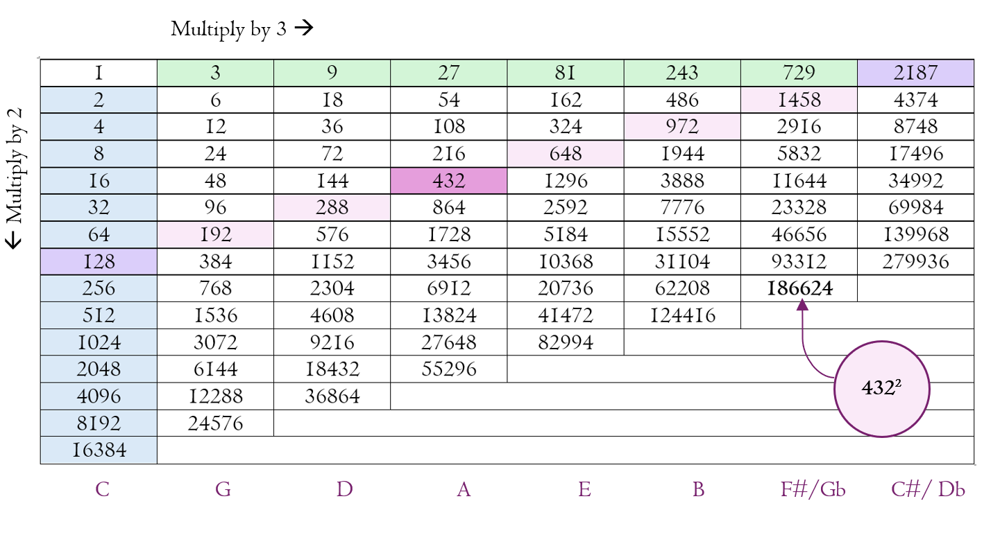
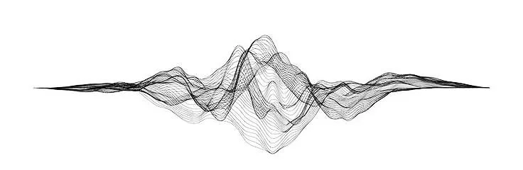

---
title: '440Hz và 432Hz'
excerpt: 'Cuộc điều tra ngắn gọn về tranh luận 440Hz và 432Hz: lịch sử chuẩn hóa cao độ, huyền học Pythagoras, hệ bình quân luật và câu hỏi liệu tần số có thật sự tác động đến cơ thể.'
category: 'news'
tags: ['432hz', '440hz', 'music', 'frequency', 'sound-healing']
author: 'Minh Khang'
publishDate: 2026-06-03T17:00:00.000Z
image: '~/assets/images/440hz-va-432hz.webp'
---

### Vì sao 440Hz và 432Hz lại gây tranh luận?

> Âm thanh về bản chất là dao động. Một giọng nói, tiếng đàn, tiếng chim hay tiếng máy đều được tạo nên từ các tần số cơ bản và các họa âm đi kèm. 

 Với nhạc sĩ, tần số trước hết là công cụ để chỉnh dây, phối hợp dàn nhạc và giữ cho các nhạc cụ chơi cùng nhau không bị lệch cao độ. Nhưng trong các cộng đồng tâm linh, thiền định và trị liệu âm thanh, tần số thường được nhìn như một thứ có khả năng tác động đến cảm xúc, năng lượng và trạng thái nhận thức.
<figure>
  <figcaption><strong>Mẫu âm thanh 440Hz</strong></figcaption>
  <audio controls preload="metadata" style="width: 100%; margin: 1rem 0 1.5rem;">
    <source src="/audio/440hz.mp3" type="audio/mpeg" />
    Trình duyệt của bạn không hỗ trợ phát âm thanh.
  </audio>
</figure>

Từ đó nảy sinh cuộc tranh luận quen thuộc: nên chỉnh nốt La trung tâm A4 ở 440Hz như chuẩn hiện đại, hay nên dùng 432Hz như một lựa chọn được cho là tự nhiên, hài hòa và dễ chịu hơn?
<figure>
  <figcaption><strong>Mẫu âm thanh 432Hz</strong></figcaption>
  <audio controls preload="metadata" style="width: 100%; margin: 1rem 0 1.5rem;">
    <source src="/audio/432hz.mp3" type="audio/mpeg" />
    Trình duyệt của bạn không hỗ trợ phát âm thanh.
  </audio>
</figure>
Điểm cần phân biệt ngay từ đầu là: đây không chỉ là câu chuyện kỹ thuật âm nhạc, mà còn là cuộc va chạm giữa ba lớp tư duy khác nhau: lịch sử chuẩn hóa, toán học/huyền học về hòa âm, và trải nghiệm chủ quan khi nghe nhạc. 

### 440Hz: chuẩn hiện đại được hình thành như thế nào?

440Hz là tần số tương ứng với nốt A4, tức nốt La phía trên Đô trung tâm trên đàn piano. Khi nhiều nhạc cụ cùng biểu diễn, họ cần một điểm quy chiếu chung. Trong âm nhạc hiện đại, điểm quy chiếu đó phần lớn là A4 = 440Hz.

Trước khi có chuẩn này, các quốc gia và dàn nhạc không thống nhất hoàn toàn. Pháp từng dùng 435Hz, Anh có thời kỳ dùng khoảng 439Hz, còn các vùng khác lại có chuẩn riêng. Điều đó không quá lạ, vì trong nhiều thế kỷ, âm nhạc chủ yếu được biểu diễn trong bối cảnh địa phương. Khi công nghệ ghi âm, phát thanh và biểu diễn quy mô lớn phát triển, nhu cầu chuẩn hóa mới trở nên cấp thiết.

Theo bài gốc, 440Hz từng được đề xuất trong thế kỷ 19, được các tổ chức tiêu chuẩn Hoa Kỳ khuyến nghị vào năm 1936, rồi về sau được ISO chính thức hóa thành chuẩn quốc tế ISO 16. Lý do sâu xa không nhất thiết nằm ở âm mưu kiểm soát đại chúng như một số thuyết lan truyền trên mạng, mà thực dụng hơn: phát thanh, thu âm và biểu diễn quốc tế cần một hệ quy chiếu chung.

Điều này không có nghĩa 440Hz là "tần số tốt nhất". Nó chỉ có nghĩa đây là tần số thuận tiện để cả thế giới âm nhạc hiện đại vận hành cùng nhau.

### 432Hz: biểu tượng của hòa âm vũ trụ?

432Hz thường được gọi là lựa chọn thay thế cho A4. Những người ủng hộ 432Hz cho rằng nó gần với các tỷ lệ hòa âm tự nhiên, dễ nghe hơn, mềm hơn và có khả năng tạo cảm giác thư giãn.  

**Harmonic Ratios Chart- 432hz**

*Source: [Ask.Video](https://ask.video/article/audio-hardware/music-theory-exploring-the-432hz-tuning-debate)*

Một phần sức hút của 432Hz đến từ truyền thống Pythagoras. Pythagoras không chỉ là nhà toán học, mà còn là người gắn âm nhạc với tỷ lệ số học. Với đàn một dây monochord, ông quan sát rằng các tỷ lệ như 2:1 tạo thành quãng tám, 3:2 tạo thành quãng năm, và từ đó hình thành ý tưởng rằng vũ trụ có thể được hiểu như một trật tự hài hòa bằng số.

Trong lịch sử tư tưởng cổ đại, âm nhạc, toán học và thiên văn học từng được xem là các mặt khác nhau của cùng một cấu trúc. Kepler và nhiều nhà tư tưởng sau này cũng từng nói về "hòa âm của các thiên cầu", tức giả thuyết rằng chuyển động vũ trụ có thể được hiểu như một dạng nhạc tính.

Nhưng khi chuyển từ biểu tượng triết học sang âm nhạc thực tế, câu chuyện phức tạp hơn nhiều.

### Vấn đề nằm ở hệ bình quân luật

Ngay cả khi chọn A4 = 432Hz, phần lớn nhạc cụ phương Tây hiện đại vẫn chơi theo hệ bình quân luật 12 âm, tức 12-TET. Hệ này chia quãng tám thành 12 phần bằng nhau theo logarit, giúp nhạc cụ chơi được nhiều giọng, nhiều hợp âm và chuyển điệu linh hoạt hơn.

Đổi từ 440Hz sang 432Hz chỉ dịch toàn bộ hệ thống cao độ xuống một chút. Nó không tự động biến âm nhạc hiện đại thành "thuần Pythagoras" hay "hòa âm vũ trụ" theo nghĩa cổ đại. Những khoảng cách giữa các nốt vẫn được điều chỉnh theo bình quân luật, chứ không hoàn toàn theo các tỷ lệ nguyên sơ.

Đây là lý do tranh luận 432Hz thường bị hiểu sai. Nếu nói 432Hz "gần với tỷ lệ tự nhiên" thì cần nói rõ: gần theo hệ quy chiếu nào, dùng thang âm nào, chơi bằng nhạc cụ nào, và có giữ nguyên bình quân luật hay không.

### 432Hz có khiến cơ thể dễ chịu hơn không?

Một điểm đáng chú ý trong bài gốc là nghiên cứu thí điểm so sánh nhạc chỉnh ở 440Hz và 432Hz. Nghiên cứu này ghi nhận người nghe nhạc 432Hz có xu hướng giảm nhẹ nhịp tim và cảm thấy hài lòng hơn sau phiên nghe, nhưng quy mô nghiên cứu nhỏ và kết quả chưa đủ để kết luận tuyệt đối.

Điều này nên được đọc một cách thận trọng. Có thể 432Hz thật sự tạo cảm giác mềm và dễ chịu hơn với một số người. Cũng có thể sự khác biệt đến từ kỳ vọng, bối cảnh nghe, loại nhạc, chất lượng bản thu hoặc trạng thái tâm lý sẵn có của người nghe.

Với âm nhạc, trải nghiệm cá nhân là dữ liệu quan trọng, nhưng không nên biến trải nghiệm cá nhân thành chân lý phổ quát. Một người có thể thấy 432Hz thư giãn hơn, người khác có thể không nhận ra khác biệt, và cả hai phản ứng đó đều hợp lý.

### Cái bẫy của "tần số thần kỳ"

Điều cần tránh là biến 432Hz thành một loại thần chú kỹ thuật. Không có bằng chứng mạnh cho thấy chỉ cần chỉnh nhạc xuống 432Hz thì mọi vấn đề lo âu, lệch năng lượng hay mất cân bằng tinh thần sẽ được giải quyết.

Ngược lại, cũng không nên vội bác bỏ mọi trải nghiệm với 432Hz là mê tín. Âm thanh có tác động thật đến hệ thần kinh: tiết tấu, âm lượng, hòa âm, không gian nghe và thói quen nghe đều có thể làm thay đổi cảm xúc. Vấn đề là không nên gom tất cả hiệu ứng đó vào một con số duy nhất.

Một bản nhạc 432Hz nhưng phối khí kém, nén âm quá mạnh hoặc nghe trong môi trường ồn ào vẫn có thể gây khó chịu. Một bản nhạc 440Hz được thu âm tốt, tiết tấu chậm, hòa âm tinh tế và nghe đúng hoàn cảnh vẫn có thể rất thư giãn.

### Nên thử nghe như thế nào?

Nếu tò mò, cách tốt nhất là tự kiểm tra bằng tai và cơ thể của mình. Chọn cùng một bản nhạc có hai phiên bản 440Hz và 432Hz, nghe bằng cùng tai nghe hoặc loa, cùng âm lượng, cùng thời điểm trong ngày. Đừng nhìn nhãn trước khi nghe nếu có thể. Sau đó ghi lại cảm giác: nhịp thở, mức căng thẳng, độ tập trung, cảm xúc và mức dễ chịu.

Làm vài lần trong nhiều ngày khác nhau, bạn sẽ có dữ liệu cá nhân đáng tin hơn việc chỉ đọc một tuyên bố trên mạng.

  
[*Futuristic Sound Wave*](https://www.pinterest.com/pin/create/button/?guid=JzzEp3DkimxP&url=https%3A%2F%2Fwww.sylviavillamusic.com%2Fblog%2F440hz-432hz-an-investigation&media=https%3A%2F%2Fimages.squarespace-cdn.com%2Fcontent%2Fv1%2F60563271d2b82d6bb184d855%2Fa0226221-cd91-4d5f-b0d7-4c340bcc7586%2FFuturistic%2BHud%252C%2BUi%2BVector%2BGrid_%2BMusic%2BSound%2BWaves%2BSet%2BStock%2BVector%2B-%2BIllustration%2Bof%2Bobject%252C%2Beffect_%2B78157701.jpg&description=The%20440hz%20v.%20432hz%20Debate%20%7C%20Frequency%20Fascinations%20%E2%80%94%20SYLVIA%20VILLA)

Điểm thú vị của tranh luận 440Hz và 432Hz không nằm ở việc chọn phe, mà ở việc nó buộc ta nghe kỹ hơn. Khi bắt đầu chú ý đến cao độ, tần số, độ rung và cảm giác cơ thể, ta cũng bắt đầu nhận ra âm nhạc không chỉ là nền âm thanh chạy sau lưng đời sống. Nó là một môi trường tác động trực tiếp đến nhận thức.

### Kết luận

440Hz là chuẩn hiện đại vì lý do lịch sử, kỹ thuật và công nghiệp. 432Hz là một lựa chọn thay thế giàu sức gợi, được bao quanh bởi toán học, huyền học và trải nghiệm chủ quan. Chưa có đủ bằng chứng để nói 432Hz "tốt hơn" một cách tuyệt đối, nhưng cũng có đủ lý do để thử nghe và quan sát phản ứng của chính mình.

Nếu âm nhạc là một công cụ định hình trạng thái tinh thần, thì câu hỏi quan trọng không chỉ là "tần số nào đúng", mà là: âm thanh nào khiến ta tỉnh táo hơn, bình an hơn và hiện diện hơn?

### Nguồn tham khảo

- Bài gốc của Sylvia Villa: [432hz vs. 440hz: An Investigation](https://www.sylviavillamusic.com/blog/440hz-432hz-an-investigation)
- ISO: [ISO 16 - Acoustics, standard tuning frequency](https://www.iso.org/standard/3601.html)
- PubMed: [Music Tuned to 440 Hz Versus 432 Hz and the Health Effects](https://pubmed.ncbi.nlm.nih.gov/31031095/)
- Ask.Video: [Music Theory: Exploring The 432 Hz Tuning Debate](https://ask.video/article/music-theory/music-theory-exploring-the-432-hz-tuning-debate)
- Whipple Museum: [Monochord](https://www.whipplemuseum.cam.ac.uk/explore-whipple-collections/models/monochord)
- Britannica: [Classic tuning systems](https://www.britannica.com/art/tuning-and-temperament/Classic-tuning-systems)
