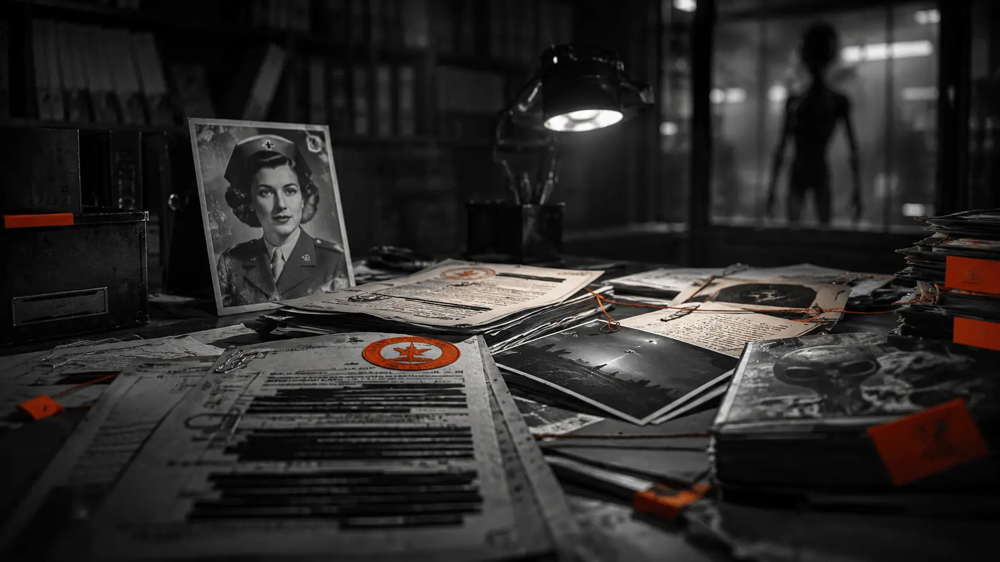

---
title: 'Alien Interview'
excerpt: 'Một lát cắt bí ẩn về UFO, Roswell, Majestic-12 và câu chuyện Alien Interview gây tranh cãi.'
category: 'stories'
tags: ['alien-interview', 'ufo', 'roswell']
author: 'Ngoc Khanh'
series: 'alien-interview'
chapter: 0
publishDate: 2026-05-04T17:00:00.000Z
image: '~/assets/images/the-grey.webp'
---
> Còn sự tàn bạo nào lớn hơn có thể gây ra cho bất kỳ ai ngoài việc xóa bỏ hoặc phủ nhận nhận thức tâm linh, danh tính, khả năng và ký ức vốn là bản chất của chính mình?
> <cite>-- Lawrence R. Spencer -- 2008</cite>

### Lời đề tặng 
Cuốn sách này được dành tặng cho tất cả các Thực thể Tâm linh Bất tử, dù họ có nhận thức được mình là như vậy hay không. Nó đặc biệt dành tặng cho trí tuệ, lòng dũng cảm và sự liêm chính của những Thực thể Vĩ đại đó, những người trong các lần hóa thân khác nhau vào những thời điểm khác nhau trong quá khứ, ở hiện tại và trong tương lai, đã thắp sáng và mang Ngọn lửa Sự thật vào những góc tối tăm nhất của vũ trụ.  
Lời tri ân này không chỉ dành cho những giáo lý triết học và công nghệ được phát triển bởi những thực thể này, mà còn dành cho lòng dũng cảm đã được chứng minh và ghi chép lại khi áp dụng triết lý của họ trước sự thiếu hiểu biết tột độ, sự thù địch công khai và sự đàn áp hung hãn của những thực thể thấp kém hơn và của các lợi ích nhóm ích kỷ từ các tổ chức chính trị, kinh tế và tôn giáo liên thiên hà và hành tinh.  
Mặc dù số lượng tương đối ít, trí tuệ sâu sắc và sự cống hiến anh hùng của những thực thể đó, cùng những người chia sẻ cuộc tìm kiếm của họ, đã là biện pháp ngăn chặn hiệu quả duy nhất đối với sự nô lệ tâm linh. Tự do, Giao tiếp, Sáng tạo, Tin tưởng và Sự thật cho tất cả các Thực thể Tâm linh Bất tử trong vũ trụ này là di sản của họ. Những Tấm gương Tốt mà họ để lại là nơi trú ẩn và là nguồn nuôi dưỡng của chúng ta. Việc áp dụng cá nhân, siêng năng các giáo lý của họ là vũ khí của chúng ta chống lại vòng xoáy hỗn loạn và sự lãng quên đang thu hẹp dần của vũ trụ vật chất.  
> <cite>-- Lawrence R. Spencer --</cite>



###  Các nguyên tắc biên tập được sử dụng trong cuốn sách này     
Tôi đã cố gắng không biên tập tài liệu nhận được từ Mrs. MacElroy ngoại trừ ở mức độ cần thiết để tạo ra một trình tự logic cho tài liệu mà bà đã gửi qua thư cho tôi. Ở bất cứ nơi nào có thể, tôi đã trích dẫn hoặc sao chép nguyên văn các ghi chú viết tay ban đầu của bà.  
Trong một số trường hợp, tôi đã thực hiện quyền tự do biên tập để thêm thông tin khác, hoặc bình luận bổ sung mà tôi cảm thấy sẽ thêm các định nghĩa hữu ích, hoặc làm rõ thông tin được đưa ra trong các bản ghi chép chính thức, hoặc cho các nhận xét hoặc quan sát của bà.  
Những nội dung này xuất hiện dưới dạng một "<mark>Ghi chú</mark>" được đánh số trong Phụ lục ở cuối cuốn sách. Tất cả các tham chiếu ghi chú, nếu có thể, đều được sao chép nguyên văn từ trang web bách khoa toàn thư internet miễn phí www.wikipedia.org. Nếu không có thông tin trên Wikipedia.org, tôi đã sử dụng công cụ tìm kiếm internet phổ biến www.google.com để tìm một tham chiếu trang web có vẻ phù hợp nhất với chủ đề.  
Mrs. MacElroy đã không ghi chú ngày tháng trong hầu hết các tài liệu, vì vậy tôi không chắc chắn rằng trình tự của tài liệu khớp với trình tự thực tế của các sự kiện, hoặc trình tự của các cuộc phỏng vấn, ngoại trừ những gì được ghi chú trên chính các bản ghi chép chính thức.  
Vì đã 60 năm trôi qua kể từ ngày diễn ra các cuộc phỏng vấn, và cân nhắc đến tuổi tác của Mrs. MacElroy trước khi qua đời, tôi lý giải rằng bà không nhất thiết phải có một ký ức sắc bén về tên, ngày tháng và thời gian chính xác, ngoại trừ những gì được ghi lại trong các bản ghi chép từ ngày 8 tháng 7 đến ngày 12 tháng 8 năm 1947.  
Tài liệu trong cuốn sách này được tổ chức thành ba loại khác nhau. Các ký hiệu sau đây sẽ được sử dụng để chỉ định vị trí chúng xuất hiện trong cuốn sách này:  
(GHI CHÚ CÁ NHÂN CỦA MATILDA O'DONNELL MACELROY) (PHÔNG CHỮ: Times Roman, 12 point)  
(BẢN GHI CHÉP PHỎNG VẤN CHÍNH THỨC) (Courier New, 12 point)  
(Ghi chú) (PHÔNG CHỮ: Arial, 10 point, Bold)
> <cite>-- Biên tập viên</cite>
### Định nghĩa
```markdown
Lợi ích nhóm (Vested Interest):
- một kế hoạch hoặc chương trình nghị sự sinh tồn hoặc phi sinh tồn đã được "ngụy trang" để khiến nó có vẻ như là một thứ gì đó khác với bản chất thực sự của nó.
- bất kỳ người, nhóm hoặc thực thể nào ngăn cản hoặc kiểm soát giao tiếp để phục vụ các mục đích riêng của họ (kế hoạch hoặc chương trình nghị sự). -- Tham chiếu: Trang 37, The Oz Factors, bởi Lawrence R. Spencer.

Bí ẩn (Mystery):
- một ẩn đố hoặc vấn đề liên quan đến nghịch lý hoặc mâu thuẫn rõ ràng.  
- phẩm chất hoặc tính cách sâu sắc, không thể giải thích được hoặc bí mật. -- Tham chiếu: www.merriam-webster.com
```  


### Bí ẩn về UFO và Người ngoài hành tinh

Nếu bạn đã từng nghiên cứu về các hiện tượng UFO, hẳn bạn đã quen thuộc với chương trình phát thanh tai tiếng của Orson Welles về "War of the Worlds, And The Invasion from Mars" vào ngày 30 tháng 10 năm 1938\. Bản kịch phát thanh hư cấu về cuộc xâm lược Trái Đất của "người ngoài hành tinh" này đã kích động một sự cuồng loạn toàn cầu về UFO và người ngoài hành tinh từ rất lâu trước khi vụ rơi UFO gần Roswell, N.M. diễn ra vào năm 1947\.<br> 
Trong suốt 60 năm qua, kể từ vụ rơi Roswell được cho là đã xảy ra, đã có hàng chục nghìn báo cáo về các vụ nhìn thấy UFO. Một sự cuồng loạn toàn cầu đã nảy sinh từ "bằng chứng" về cái được cho là hiện tượng ngoài hành tinh. Đồng thời, sự phủ nhận không ngừng nghỉ về hiện tượng này từ chính phủ Hoa Kỳ đã gây ra một loạt các cáo buộc, phản cáo buộc, các thuyết âm mưu che đậy, những suy đoán điên rồ, các "cuộc điều tra khoa học", v.v., v.v., đến mức phát ngán, và vô số những vụ được gọi là "tiếp xúc cự ly gần" tương tự đang ngày càng tăng lên. Suy nghĩ đầu tiên của tôi khi nhận được gói tài liệu từ Matilda O'Donnell MacElroy là: "Đây chỉ là một bộ tài liệu Majestic-12 khác mà thôi".<br> 
Tôi đang đề cập đến một "gói hàng bí ẩn" được báo cáo là đã nhận qua đường bưu điện vào năm 1984 ngay sau cái chết của thành viên cuối cùng còn sống của cái gọi là ủy ban "Majestic-12", được cho là do Tổng thống Harry Truman thành lập ngay sau sự cố Roswell năm 1947\. Có một vài điểm tương đồng giữa các tài liệu "Majestic-12" và gói hàng tôi nhận được từ Matilda O'Donnell MacElroy. Trong trường hợp của bộ tài liệu trước, một phong bì được gửi từ một người gửi ẩn danh không có địa chỉ phản hồi. Nó chứa một cuộn phim chưa rửa. Chỉ có vậy. Trên cuộn phim là ảnh chụp các tài liệu được người nhận và các đồng nghiệp của ông ta coi là xác thực, những người mà quyền lợi gắn liền (tức là kế sinh nhai) phụ thuộc nặng nề vào việc thu hút sự chú ý và tin tưởng của công chúng vào bản thân họ như là những "chuyên gia hàng đầu" về chủ đề hiện tượng UFO. Họ đã làm việc không mệt mỏi kể từ đó để khám phá "bằng chứng" cho thấy các tài liệu đó là xác thực. Tất nhiên, các cơ quan chính phủ phủ nhận mọi thứ được cáo buộc trong các tài liệu và bất cứ điều gì liên quan đến chủ đề người ngoài hành tinh nói chung.  
Ngoài ra, chủ đề này đã trở nên hoàn toàn bị lấn át bởi những báo cáo sai sự thật hiển nhiên, các nguồn tin bị mất uy tín, tin đồn, những lời dối trá được thêu dệt, sự hiểu lầm, thông tin thiếu hụt, thông tin bổ sung không áp dụng được và vô số các phức tạp mâu thuẫn khác đã khiến chủ đề này trở nên nực cười hoặc không thể tiếp cận được như một ngành khoa học. Điều này có thể là cố ý, hoặc đơn giản là phản ánh sự hỗn loạn và man rợ chung của Nhân loại.  
Về việc chính phủ phủ nhận và che đậy, các sự kiện ngày 11 tháng 9 năm 2001, đã làm cho tôi thấy rõ ràng rằng chính phủ Hoa Kỳ đã phá hủy mọi dấu vết tin tưởng cuối cùng mà người dân Mỹ và thế giới có thể đã nuôi dưỡng, thậm chí qua chiến tranh Việt Nam, vụ Watergate và nhiều sự phản bội tương tự khác, vào sự "trung thực" của chính phủ, quân đội và cộng đồng tình báo Mỹ, bằng cách nói dối trắng trợn với chính người dân của mình về hầu hết mọi thứ và tất cả mọi thứ.  
Bất chấp số lượng khổng lồ các vụ "nhìn thấy UFO", vô số báo cáo về "người ngoài hành tinh bắt cóc" và "tiếp xúc cự ly gần" tràn ngập gần như toàn bộ lịch sử nhân loại được ghi chép và tiền sử, tôi chỉ tìm thấy một điểm chung cơ bản, thống nhất, không thể chối cãi và hiển nhiên thấm nhuần trong tất cả các dữ liệu này:  
Giả sử rằng thực tế chủ quan, hoặc niềm tin của các cá nhân là bằng chứng có thể chấp nhận được, thì vẫn chưa có "bằng chứng" nào được thống nhất trên toàn cầu rằng các UFO và/hoặc các dạng sống ngoài hành tinh tồn tại, dù dựa trên sự thừa nhận của chính phủ, bằng chứng vật lý, bằng chứng gián tiếp hay dữ liệu chủ quan.  
Có một vài suy luận tôi có thể rút ra từ sự thiếu thống nhất, sự thừa nhận của chính phủ hoặc bằng chứng vật lý cho thấy những điều đó là có thật, mà nếu được xác minh, có thể dẫn đến một giải pháp khả thi cho bí ẩn này:  
<mark>[Suy luận]</mark> Bất chấp bộ sưu tập khổng lồ các "bằng chứng" chủ quan, gián tiếp và khách quan về hoạt động của người ngoài hành tinh trên và xung quanh Trái Đất, sự tồn tại, ý định và các hoạt động của người ngoài hành tinh vẫn bị che giấu và đầy bí ẩn.  
<mark>[Suy luận]</mark> Bằng chứng được thống nhất toàn cầu về sự sống ngoài hành tinh dựa trên dữ liệu chủ quan, sự thừa nhận của chính phủ, bằng chứng vật lý và gián tiếp đang phải chịu sự chi phối của các quyền lợi gắn liền mâu thuẫn lẫn nhau, điều này đã khiến cho một bằng chứng như vậy không thể đạt được.  
**Tổng hợp lại**, những suy luận này dẫn đến một câu hỏi hiển nhiên: *Nếu các dạng sống ngoài hành tinh tồn tại, tại sao không có sự giao tiếp nhất quán, thẳng thắn, cởi mở và **tương tác** giữa Nhân loại và Người ngoài hành tinh?*  
May mắn thay, thực tế chủ quan không đòi hỏi bằng chứng hay "sự chứng minh". Vì vậy, tôi quyết định viết cuốn sách này để chuyển tải một thông tin giao tiếp chủ quan mà tôi nhận được từ Matilda O'Donnell MacElroy cho những người khác, những người có thể quan tâm đến nó.  
Cá nhân tôi không giả định rằng bất cứ điều gì tôi nhận được từ Matilda O'Donnell MacElroy là xác thực theo bất kỳ cách nào, ngoại trừ chiếc phong bì và tờ giấy bên trong phong bì đó. Tôi không thể chứng minh bất cứ điều gì trong số đó. Thật vậy, tôi không thể thực sự xác minh rằng đã từng có một người như Matilda O'Donnell MacElroy ngoại trừ một giọng nói tôi nghe được qua điện thoại vào năm 1998\. Giọng nói đó có thể là của bất kỳ ai. Cá nhân tôi không có quyền lợi gắn liền trong việc nghiên cứu UFO. Đúng là tôi đã viết một vài cuốn sách về các thực thể tâm linh bất tử — bởi vì tôi quan tâm đến chủ đề này. Nhưng tôi chưa bán đủ số sách đó để chi trả cho thời gian bỏ ra để viết chúng. Đó là một sở thích. Tôi kiếm sống bằng nghề tư vấn doanh nghiệp nhỏ.  
Mục đích của tôi không phải là để biện minh, giải thích hoặc khắc phục bất kỳ sự khiếm khuyết nào trong việc nhận thức hoặc hiểu các bí ẩn về sự tồn tại của người ngoài hành tinh, UFO, các chương trình nghị sự của chính phủ hay các khả năng tâm linh. Nó cũng không nhằm mục đích giáo dục, thuyết phục hay quảng bá với bất kỳ ai rằng bất kỳ hiện tượng nào trong số này tồn tại. Hơn nữa, những gì tôi có thể nghĩ hoặc không nghĩ về bất kỳ điều này đều không liên quan.  
Hơn nữa, tôi đã đốt tất cả các tài liệu gốc, bao gồm cả chiếc phong bì tôi nhận được từ Matilda O'Donnell MacElroy. Tôi không muốn dành phần đời còn lại của mình để bị săn đuổi bởi các nhà nghiên cứu UFO, các đặc vụ chính phủ, các phóng viên báo lá cải ở cửa hàng tạp hóa, những người ủng hộ hay những người bài trừ UFO, hay bất kỳ ai khác. Bất kỳ "bằng chứng" hay nỗ lực nào nhằm xác thực khẳng định rằng Matilda O'Donnell MacElroy thực sự đã phỏng vấn một người ngoài hành tinh vào năm 1947 sẽ phải do những người khác thực hiện.  
Ripley nói, `"Believe It, or Not" (Tin hay không tùy bạn).`<br> 
Tôi nói,`"Điều gì đúng với bạn, thì nó đúng với bạn".`  
<cite>**Lawrence R. Spencer**</cite>

### Nguồn gốc tài liệu trong cuốn sách
Nội dung của cuốn sách này chủ yếu được trích dẫn từ lá thư, các bản ghi chép phỏng vấn và ghi chú cá nhân mà tôi nhận được từ cố Matilda O'Donnell MacElroy. Lá thư của bà gửi cho tôi khẳng định rằng tài liệu này dựa trên hồi ức của bà về cuộc giao tiếp với một thực thể ngoài hành tinh, người đã "nói chuyện" với bà bằng thần giao cách cảm. Trong suốt tháng 7 và tháng 8 năm 1947, bà đã phỏng vấn một thực thể ngoài hành tinh mà bà xác định là "Airl", và người mà bà tuyên bố đã và đang tiếp tục là một sĩ quan, phi công và kỹ sư đã được cứu thoát từ một chiếc đĩa bay bị rơi gần Roswell, New Mexico vào ngày 8 tháng 7 năm 1947.  
Rõ ràng, bất kỳ ai đọc bất cứ điều gì về sự kiện "đĩa bay" hay "chạm trán người ngoài hành tinh" nổi tiếng nhất, hoặc tai tiếng nhất này, đều nhất thiết phải hết sức nghi ngờ về   
*1. tính xác thực của báo cáo và*  
*2. độ tin cậy của nguồn thông tin, đặc biệt là khi nó xuất hiện lần đầu tiên sau sáu mươi năm kể từ sự kiện bị cáo buộc!*    

Tôi nhận được lá thư nói trên từ Mrs. MacElroy vào ngày 14 tháng 9 năm 2007, cùng với một gói tài liệu. Gói hàng chứa ba loại tài liệu:

*1. các ghi chú viết tay bằng chữ thảo trên giấy vở học sinh có dòng kẻ, khổ 8 1/2" X 11" bình thường, mà tôi giả định là do chính Mrs. MacElroy viết.*  
*2. các ghi chú được đánh máy trên máy đánh chữ thủ công trên giấy trắng 20 lb. bond bình thường, mà tôi giả định là do cá nhân bà chuẩn bị. Ít nhất cả hai đều có vẻ như được viết cùng một nét chữ, và/hoặc được đánh máy trên cùng một máy đánh chữ nhất quán xuyên suốt. Chữ viết trong các ghi chú tôi nhận được cũng có vẻ giống với chữ viết trên địa chỉ người nhận và địa chỉ người gửi của chiếc phong bì manila tôi nhận được từ Navan, Ireland, được đóng dấu bưu điện vào ngày 3 tháng 9 năm 2007. Vì tôi không phải là chuyên gia pháp y hay nhà phân tích chữ viết, nên ý kiến của tôi trong vấn đề này không phải là một phán đoán có trình độ chuyên môn.*  
*3. nhiều trang ghi chép đánh máy về cuộc phỏng vấn của bà với người ngoài hành tinh. Những trang này rõ ràng được đánh máy trên một máy đánh chữ khác. Những trang này được đánh máy trên một loại giấy khác và cho thấy những dấu hiệu rõ rệt của tuổi tác và việc cầm nắm nhiều lần.*

Không có ghi chép nào trong số này được tập hợp theo bất kỳ trật tự cụ thể nào, hoặc theo ngày tháng, ngoại trừ những nơi được chỉ định bởi một câu hoặc đoạn văn lời dẫn hoặc lời giải thích của bà, hoặc bằng cách suy luận từ ngữ cảnh của các trang giấy.  
Voltaire được trích dẫn đã nói: "Lịch sử là một dòng sông Mississippi của những lời dối trá". Theo những bình luận của người ngoài hành tinh trong các bản ghi chép phỏng vấn do Mrs. MacElroy cung cấp, bài học cơ bản của lịch sử là rất, rất nhiều vị thần đã trở thành người, nhưng rất ít người, nếu có, trở lại thành một vị thần lần nữa.  
Theo thực thể ngoài hành tinh - "Airl" - nếu bất cứ điều gì anh/cô/nó được cho là đã giao tiếp có thể tin cậy được - và nếu "bản dịch" hoặc diễn giải về cuộc giao tiếp bị cáo buộc này là chính xác, thì lịch sử của vũ trụ này là một "Dòng sông dối trá" mà ở cuối dòng, sức mạnh và tự do của những thực thể tâm linh bất tử, giống như thần thánh, toàn năng đã kết thúc và bị lạc mất trong Biển Vật chất và Sự hữu tử.  
Hơn nữa, theo những tuyên bố rất thẳng thắn và thiếu ngoại giao được đưa ra - những tuyên bố dường như thể hiện "ý kiến cá nhân" của người ngoài hành tinh - nếu người ta du hành đến những vùng xa xôi của vũ trụ để tìm kiếm một nơi gọi là "Địa ngục", thì Trái Đất và những cư dân trong tình trạng hiện tại của nó sẽ là một mô tả chính xác.  
Để tiếp tục hợp nhất, làm phức tạp và phóng đại nguồn gốc "không thể tin được" của các "bản ghi chép phỏng vấn" mà tôi nhận được từ Mrs. MacElroy là thực tế là chúng:  
*1. dựa gần như hoàn toàn trên "giao tiếp thần giao cách cảm" giữa người ngoài hành tinh và Mrs. MacElroy.*  
*2. nhiều cuộc phỏng vấn trong số này thảo luận về các hoạt động "huyền bí" của các "thực thể tâm linh bất tử".* 

Tất nhiên, hầu hết các "nhà khoa học có thẩm quyền" đều không sẵn lòng thừa nhận hoặc nhận thức được các hiện tượng tâm linh dưới bất kỳ hình thức nào. Định nghĩa trong từ điển của từ paranormal (huyền bí) là: tính từ:  
*1. không thể được giải thích bằng các phương pháp khoa học*  
*2. siêu nhiên, hoặc có vẻ nằm ngoài các kênh cảm giác "bình thường"*

Theo định nghĩa, những người sử dụng từ "huyền bí" là:  
*1. không thể giải thích các hiện tượng tâm linh và*   
*2. các hiện tượng tâm linh nằm ngoài các kênh cảm giác bình thường của họ.*

***Nói tóm lại, các nhà khoa học phải chịu sự bất lực và/hoặc không sẵn lòng nhận thức và/hoặc giải thích các hoạt động tâm linh. Do đó, cuộc thảo luận về các hoạt động tâm linh hoặc các vũ trụ tâm linh trong cuốn sách này dự kiến sẽ chỉ được hiểu bởi những ai có thể và sẵn lòng nhận thức những điều đó.***

Theo các khoảng thời gian được người ngoài hành tinh thuật lại trong một vài cuộc phỏng vấn, có một số lý do thuyết phục và trước đây chưa được biết đến gợi ý về khả năng nhiều sai lầm phi thường đã được thực hiện bởi các nhà khoa học Trái Đất liên quan đến nguồn gốc và sự cổ xưa của vũ trụ, Trái Đất, các dạng sống và sự kiện. Tất nhiên, những điều này cũng có thể chính xác hoặc không, vì thời gian và đứa con ghẻ xấu xí của nó, lịch sử, phần lớn là mang tính chủ quan.   
Tuy nhiên, có thể quan sát thấy rằng, trái ngược với "thời gian vĩ mô" liên sao, quan điểm lịch sử của cư dân Trái Đất bị giới hạn trong một khoảng thời gian tương đối siêu nhỏ so với những gì được coi là "các sự kiện gần đây" trong niên đại của một nền văn minh du hành không gian, chưa nói đến toàn bộ khoảng thời gian của vũ trụ.  
Hồ sơ địa chất của Trái Đất được tính toán, theo những phán đoán tốt nhất của các nhà khoa học, chỉ khoảng 4 tỷ năm. Sự cổ xưa của homo sapiens trong các sách giáo khoa khảo cổ học được ước tính chỉ tối đa vài triệu năm. Ngay cả toàn bộ phổ sinh học cũng được coi là chỉ mới tồn tại trên hành tinh này trong vài trăm triệu năm. Và, nhìn chung, trí nhớ cá nhân của từng cá thể trên hành tinh này bị giới hạn trong chỉ một đời người.  
Tất cả các ngày tháng, sự kiện hoặc cách diễn giải các sự kiện khác được trích dẫn trong cuốn sách này đều từ các nguồn trên Trái Đất, vốn là những quan sát chủ quan, phỏng đoán hoặc thêu dệt của con người, bao gồm cả những điều của tác giả, và do đó phải được độc giả tin tưởng hoặc bỏ qua một cách tương ứng, cân nhắc đến xu hướng thiển cận, coi mình là trung tâm và sự ngu dốt chung của cư dân Trái Đất về một vài vũ trụ mà chúng ta đang cư ngụ.  
Cuốn sách này nhằm mục đích trở thành một bản trình bày không chính thức về thông tin được cung cấp cho tôi, sáu mươi năm sau sự việc, về một chuỗi các cuộc phỏng vấn giữa một sĩ quan, phi công và kỹ sư phi thuyền ngoài hành tinh và một y tá phẫu thuật của Không quân Lục quân.


### Matilda O'Donnell MacElroy: Thông tin tiểu sử

Vì tôi chưa bao giờ gặp Mrs. MacElroy trực tiếp, và chỉ nói chuyện với bà qua điện thoại một lần trong khoảng 20 phút, tôi không thể đích thân chứng thực bà là một nguồn thông tin đáng tin cậy. Trên thực tế, tôi không thể chứng minh về mặt thực tế rằng một người như vậy thực sự tồn tại, ngoài việc tôi đã nói chuyện với bà qua điện thoại và tôi đã nhận được tài liệu viết tay qua thư được gửi từ một địa chỉ thực tế ở Ireland.  
Khi tôi nói chuyện với bà qua điện thoại vào năm 1998, tôi đang sống ở Florida. Vào thời điểm cuộc phỏng vấn ngắn qua điện thoại của chúng tôi, Mrs. MacElroy sống trên đường Scotty Pride Drive ở Glasgow, Montana. Tôi biết điều này vì tôi đã gửi qua bưu điện một bản sao cuốn sách của mình, "The Oz Factors", cho bà như một món quà sau khi nó được xuất bản vào năm 1999. Tôi chắc chắn rằng bà đã nhận được cuốn sách, vì bà đã đề cập đích danh nó trong lá thư tôi nhận được từ Ireland và nói rằng bà đã đọc nó.  
Tôi đã thực hiện một chút nghiên cứu trên internet về Glasgow, Montana vì sự quan tâm của riêng mình. Glasgow được thành lập vào năm 1887 như một thị trấn đường sắt và trở nên nổi tiếng trong những năm 1930 vì Tổng thống FDR yêu cầu xây dựng Đập Fort Peck tại đó, nơi đã trở thành một nguồn việc làm khổng lồ cho khu vực Glasgow. Trong những năm 1960, dân số bùng nổ lên đến 12.000 người nhờ Căn cứ Không quân Glasgow (SAC), được sử dụng trong cuộc xung đột Việt Nam và giai đoạn đầu của 'Chiến tranh Lạnh'. Căn cứ này đã bị vô hiệu hóa và đóng cửa vào năm 1969.  
Khi tôi nói chuyện với Mrs. MacElroy qua điện thoại, bà đã đề cập rằng mình đã được Không quân Hoa Kỳ điều chuyển đến đó sau khi hoàn thành nghĩa vụ quân sự, và đó là nơi bà gặp chồng mình, một kỹ sư. Tôi không nghĩ bà đã đề cập đến tên của ông ấy. Tuy nhiên, ông đã làm việc trong việc xây dựng Đập Fort Peck, nơi tạo ra Hồ Fort Peck khổng lồ. Mặc dù con đập được hoàn thành vào năm 1940, ông là một người đánh cá và người yêu thích hoạt động ngoài trời tuyệt vời, vì vậy ông đã ở lại khu vực này. Tôi thu thập được rằng di sản Ireland của nơi đó có liên quan đến việc này, nhưng đã không theo đuổi điểm đó với bà.    
Tôi đã không thể tìm thấy bất kỳ hồ sơ nào về một người tên "MacElroy" đã làm việc tại con đập, nhưng các hồ sơ nhân sự từ thời kỳ đó hầu như không tồn tại theo như tôi có thể xác định. Tôi đã liên lạc với bà trong quá trình nghiên cứu cho cuốn sách "The Oz Factors" vì tôi được dẫn dắt để tin rằng, qua một đường dây điều tra rất vòng vo, rằng người phụ nữ này bị nghi ngờ là có liên quan đến việc tiếp xúc với người ngoài hành tinh tại Khu vực 51 (Area 51), hoặc hiện trường vụ rơi Roswell, hoặc một điều gì đó tương tự.    
Thông qua một chuỗi các suy luận gián tiếp và sự giới thiệu tình cờ, tôi thực sự đã tìm thấy số của bà trong danh bạ điện thoại và gọi cho bà chỉ vì cơ hội rằng thực sự có thể có một người như vậy.  
Không cần phải nói, khi tôi gọi cho bà, bà đã không mấy sẵn lòng trong phản hồi của mình đối với các câu hỏi của tôi. Tuy nhiên, tôi nghĩ bà đã bị ấn tượng bởi sự chân thành hồn nhiên và thực tâm của tôi để lấy thông tin cho cuốn sách của mình, và nhận ra rằng tôi không có mục đích xấu hay động cơ tài chính hay lý do gì để khai thác bà dưới bất kỳ hình thức nào. Tuy nhiên, bà đã không cung cấp cho tôi bất kỳ thông tin hữu ích nào vào thời điểm đó, ngoại trừ việc nói rằng bà đã từng phục vụ trong Quân đội và đóng quân tại New Mexico vào năm 1947.  
Bà không thể thảo luận bất cứ điều gì về bất kỳ loại sự cố nào, vì mạng sống của bà phụ thuộc vào việc giữ im lặng. Mặc dù điều này càng kích thích sự quan tâm của tôi hơn, nhưng việc cố gắng thúc ép bà thêm nữa là vô ích, vì vậy tôi đã bỏ cuộc và quên bà đi cho đến tháng 9 năm ngoái, khi tôi nhận được gói hàng từ Ireland.  
Tôi đã cố gắng liên lạc với bà ở Ireland theo địa chỉ phản hồi trên gói hàng, nhưng không nhận được trả lời từ bà, tôi cũng không thể tìm thấy bất kỳ ai ở Quận Meath, Ireland quen biết với hai người bọn họ ngoại trừ bà chủ nhà mà họ đã thuê phòng trong vài tuần trước khi qua đời, sự việc dường như đã xảy ra đồng thời, mặc dù tôi không có bằng chứng thực sự về điều này.  
Tuy nhiên, dấu bưu điện trên chiếc phong bì bà gửi cho tôi được đóng dấu tại bưu điện ở Navan, Co. Meath, Ireland vào ngày đã trích dẫn ở trên. Vì có một cư dân thực sự (theo Google Maps) tại địa chỉ phản hồi ghi trên phong bì, tôi đã viết thư đến địa chỉ đó và được chủ nhà thông báo rằng cả Mrs. MacElroy và chồng bà, người hóa ra tên là "Paul", đều mới qua đời. Bà ấy nói rằng tro cốt của Mrs. MacElroy và chồng bà đã được an táng tại Nghĩa trang Saint Finian trên đường Athboy.  
Sau đó, tôi đã không thể tìm thấy bất kỳ hồ sơ nào về bà dưới tên thời con gái là O'Donnell, tôi cũng không thành công trong việc khám phá ra bất kỳ người bạn cá nhân, thành viên gia đình hoặc tài liệu nào để xác nhận ngày sinh, giáo dục y tế hoặc hồ sơ quân sự, kết hôn hay qua đời của bà, ngoại trừ bà chủ nhà ở Ireland (người không phải là họ hàng) ngay trước khi bà qua đời. Tôi nghi ngờ rằng đây là danh tính giả do quân đội cấp cho bà khi bà rời Roswell, như đã được đề cập trong các ghi chú của bà.  
Trong cả hai trường hợp, có vẻ như danh tính của bà và tất cả bằng chứng về bà đã bị xóa sạch khỏi hồ sơ công khai. Tôi hiểu rằng một vài cơ quan chính phủ rất thành thạo trong việc che đậy bằng chứng, hoặc làm cho các hồ sơ (và con người) biến mất. Có vẻ như điều này đã được thực hiện trong trường hợp của bà, do tính chất cực kỳ nhạy cảm của sự cố Roswell và nhất quán với phần còn lại của cái gọi là "vụ che đậy".
Trong chừng mực tôi không có thêm bất kỳ thông tin nào để xác minh hoặc chứng minh rằng bất kỳ ghi chú nào về những cuộc "phỏng vấn" này được gửi cho tôi bởi Mrs. MacElroy là xác thực về mặt nội dung, ngoài những gì tôi đã đề cập, hãy để độc giả tự cẩn trọng và lưu ý cho phù hợp!

### Thư từ Mrs. MacElroy
Ngày 12 tháng 8 năm 2007
Thân gửi Lawrence,
Tôi đang gõ bức thư này cho ông trên chiếc máy đánh chữ Underwood cũ kỹ mà tôi đã mua sau khi xuất ngũ. Bằng cách nào đó, nó có vẻ là một sự tương phản phù hợp với chủ đề của bức thư này và những tài liệu mà ông sẽ tìm thấy đính kèm trong phong bì.  
Lần cuối cùng tôi nói chuyện với ông là khoảng tám năm trước. Trong cuộc phỏng vấn ngắn qua điện thoại, ông đã yêu cầu tôi hỗ trợ nghiên cứu cho cuốn sách "The Oz Factors" mà ông đang viết, vì ông nghi ngờ rằng tôi có thể biết điều gì đó giúp ích cho cuộc điều tra của ông về khả năng các sinh vật ngoài hành tinh đã ảnh hưởng đến lịch sử Trái Đất. Khi chúng ta nói chuyện, tôi đã bảo với ông rằng tôi không có bất kỳ thông tin nào để chia sẻ về bất cứ điều gì.  
Kể từ đó, tôi đã đọc cuốn sách của ông và thấy nó rất thú vị và thuyết phục. Ông rõ ràng là một người đã dày công tìm hiểu, và là người có thể thấu hiểu những trải nghiệm của riêng tôi. Tôi đã suy nghĩ rất nhiều về lời ám chỉ của ông tới một triết gia cổ đại mà ông đã diễn giải trong cuộc trò chuyện của chúng ta: "với quyền năng lớn lao, đi kèm trách nhiệm lớn lao". Mặc dù tôi không nghĩ quyền lực là điều thích đáng trong cuộc đời tôi hay trong lý do tôi gửi cho ông những tài liệu đính kèm này, nhưng ông chắc chắn đã khiến tôi phải suy nghĩ về trách nhiệm của mình.  
Tôi đã xem xét lại lập trường của mình, vì nhiều lý do, mà không kém phần quan trọng trong đó là nhận thức rằng ông đã đúng. Ít nhất, tôi có trách nhiệm với chính bản thân mình. Tôi không thể nào kể xiết cho ông nghe về "Địa ngục" cá nhân của sự thiếu quyết đoán về đạo đức và sự mâu thuẫn về tâm linh mà tôi đã phải chịu đựng kể từ năm 1947. Tôi không muốn tiếp tục chơi trò chơi "có lẽ mình nên, hoặc có lẽ mình không nên" trong suốt phần còn lại của cõi Vĩnh hằng!  
Nhiều người đã bị giết để dập tắt khả năng tiết lộ kiến thức mà tôi đã góp phần giữ kín khỏi xã hội cho đến tận bây giờ. Chỉ một số ít người trên Trái Đất từng nhìn thấy và nghe thấy những gì tôi đã mang gánh nặng phải giữ bí mật trong sáu mươi năm qua. Suốt những năm đó, tôi đã nghĩ rằng mình được tin tưởng trao cho một sự bảo mật lớn lao bởi "những thế lực cầm quyền" trong chính phủ của chúng ta — mặc dù tôi thường cảm thấy quyền lực đó bị dẫn dắt sai lầm — để "bảo vệ" nhân loại khỏi kiến thức chắc chắn rằng: không chỉ có các dạng sống ngoài hành tinh thông minh tồn tại, mà họ đã và đang tiếp tục giám sát và xâm chiếm cuộc sống của mọi người trên Trái Đất một cách tích cực mỗi ngày.  
Vì vậy, tôi nghĩ đã đến lúc phải chuyển giao kiến thức bí mật của mình cho một người mà tôi tin rằng sẽ hiểu được nó. Tôi không nghĩ rằng việc mang những kiến thức mình có vào thế giới bên kia thầm lặng, vượt ngoài tầm với hay sự nhận diện, là một hành động có trách nhiệm. Tôi nghĩ có một lợi ích lớn lao hơn cần được phụng sự hơn là bảo vệ những "quyền lợi gắn liền" mà đối với họ, thông tin này được coi là vấn đề "an ninh quốc gia", bất kể điều đó có nghĩa là gì, và do đó là sự biện minh cho việc gắn mác "TỐI MẬT".  
Ngoài ra, hiện giờ tôi đã 83 tuổi. Tôi đã quyết định rời bỏ cơ thể này, thứ đã quá tuổi thọ hữu ích đối với tôi, bằng một phương pháp cái chết êm dịu tự thực hiện không đau đớn. Tôi chỉ còn sống được vài tháng nữa, và không còn gì để sợ hãi hay mất mát.  
Vì vậy, tôi đã rời khỏi Montana, nơi chồng tôi và tôi đã sống phần lớn cuộc đời, để dành những ngày còn lại trong một căn phòng ngủ thuê ở tầng trên trong một ngôi nhà tại quê hương của gia đình chồng tôi ở Quận Meath, Ireland.  
Tôi sẽ ra đi không xa "Đại Mộ" tại Knowth và Dowth, "Gò Tiên của Bóng Tối". Đây là những "cairns" linh thiêng hoặc những cấu trúc đá đồ sộ được dựng lên khoảng năm 3.700 trước Công nguyên và được chạm khắc những chữ tượng hình không thể giải mã được — cùng thời điểm mà các kim tự tháp và những tượng đài đá không thể giải thích khác đang được xây dựng trên khắp Trái Đất.  
Tôi cũng ở không xa "Đồi Tara", nơi từng là trụ sở quyền lực cổ xưa ở Ireland, nơi người ta nói rằng 142 vị vua đã trị vì trong thời kỳ tiền sử và lịch sử. Trong tôn giáo và thần thoại Ireland cổ đại, đây là nơi cư ngụ linh thiêng của các "vị thần" và là lối vào "thế giới khác".  
Thánh Patrick đã đến Tara để chinh phục tôn giáo cổ xưa của những người ngoại giáo. Ông ấy có thể đã đàn áp các thực hành tôn giáo trong khu vực, nhưng chắc chắn ông ấy không có bất kỳ tác động nào đến các "vị thần" đã mang những nền văn minh này đến Trái Đất, như ông sẽ khám phá ra khi đọc các tài liệu đính kèm. Vì vậy, đây là một địa điểm phù hợp cho sự ra đi của tôi khỏi thế giới trần tục này và là sự giải thoát cuối cùng khỏi những gánh nặng của cuộc đời này.  
Góc nhìn rõ ràng của sự hồi tưởng đã tiết lộ một mục đích cao cả hơn cho tôi: hỗ trợ sự sinh tồn của hành tinh, của tất cả các sinh vật và các dạng sống trong thiên hà của chúng ta!  
Hiện trạng của bộ máy chính phủ của chúng ta là "bảo vệ người dân" khỏi kiến thức về những vấn đề như vậy. Thực tế, sự bảo vệ duy nhất được cung cấp bởi sự ngu dốt và bí mật là để che giấu chương trình nghị sự riêng tư của những kẻ nắm quyền nhằm nô dịch người khác. Và bằng cách làm như vậy, làm tê liệt mọi kẻ thù và đồng minh được nhận diện thông qua sự mê tín và sự ngu dốt.  
Vì vậy, tôi đã gửi kèm các bản gốc và các bản sao duy nhất hiện có của những ghi chép và suy ngẫm cá nhân của tôi về một vấn đề mà tôi đã giấu kín với tất cả mọi người, ngay cả với gia đình mình. Tôi cũng gửi kèm các bản sao ghi chép đánh máy được tạo ra bởi người thư ký tốc ký, người đã ghi chép lại tất cả các cuộc phỏng vấn của tôi với phi công lái đĩa bay ngoài hành tinh sau khi mỗi cuộc phỏng vấn kết thúc. Tôi không có bất kỳ bản sao nào của các cuốn băng ghi âm đã được thực hiện từ các báo cáo phỏng vấn của tôi. Cho đến nay, không ai biết rằng tôi đã có thể bí mật giữ lại các bản sao của các bản ghi chép phỏng vấn chính thức.  
Bây giờ tôi đang tin tưởng giao những tài liệu này cho sự tùy nghi của ông để truyền đạt cho thế giới dưới bất kỳ hình thức hay cách thức nào mà ông thấy phù hợp. Yêu cầu duy nhất của tôi là ông hãy làm điều đó theo cách không đe dọa đến tính mạng hay sự an nguy của chính ông, nếu có thể. Nếu ông kết hợp những ghi chép về trải nghiệm của tôi vào một tác phẩm hư cấu, chẳng hạn như một cuốn tiểu thuyết, bản chất thực tế của tài liệu có thể dễ dàng bị bác bỏ hoặc làm mất uy tín bởi bất kỳ cơ quan nào sử dụng "an ninh quốc gia" như một lá chắn cá nhân chống lại sự giám sát và công lý.  
Làm như vậy, ông có thể "từ chối mọi kiến thức" về nguồn gốc thực sự của chúng, và tuyên bố rằng đó là một tác phẩm hư cấu từ trí tưởng tượng của ông. Bất cứ ai nói rằng "sự thật còn kỳ lạ hơn hư cấu" đều hoàn toàn đúng. Đối với hầu hết mọi người, tất cả những điều này sẽ là "không thể tin được". Đáng tiếc là, niềm tin không phải là một tiêu chí đáng tin cậy cho thực tại.  
Ngoài ra, tôi chắc chắn rằng nếu ông cho bất kỳ ai thích sự nô lệ về thể chất, kinh tế hoặc tâm linh hơn là tự do xem những ghi chép này, chủ đề chứa đựng trong đó sẽ có vẻ khá đáng phản đối. Nếu ông cố gắng xuất bản các tài liệu này như một vấn đề báo cáo thực tế trên một tờ báo hoặc trên tin tức truyền hình buổi tối, chúng sẽ bị bác bỏ ngay lập tức như là tác phẩm của một kẻ gàn dở. Chính bản chất của những tài liệu này khiến chúng không thể tin được, và do đó có thể bị làm mất uy tín. Ngược lại, việc giải phóng thông tin này có tiềm năng gây thảm họa cho một số quyền lợi chính trị, tôn giáo và kinh tế nhất định.  
Những tài liệu này chứa đựng thông tin khá phù hợp với sự quan tâm và các cuộc điều tra của ông về những lần chạm trán với người ngoài hành tinh và trải nghiệm huyền bí. Để sử dụng phép ẩn dụ của ông trong cuốn sách "The Oz Factors", tôi có thể thành thật nói rằng một vài báo cáo thực tế đã được những người khác thực hiện về ảnh hưởng của "người ngoài hành tinh" chỉ là một cơn gió nhẹ trong mắt của một Cơn Bão Tận Thế đang xoáy quanh Trái Đất. Thực sự có những phù thủy, những mụ phù thủy độc ác và những con khỉ bay trong vũ trụ này!  
Thông tin này, vốn đã bị nghi ngờ và/hoặc được suy đoán bởi rất nhiều người trong một thời gian dài, đã liên tục bị phủ nhận bởi truyền thông chính thống, giới học thuật và Phức hợp Công nghiệp-Quân sự mà Tổng thống Eisenhower đã cảnh báo chúng ta trong bài diễn văn từ biệt của ông.  
Như ông đã biết vào tháng 7 năm 1947, Căn cứ Không quân Lục quân Roswell (RAAF) đã ra một thông cáo báo chí tuyên bố rằng các nhân viên từ Nhóm ném bom 509 của căn cứ đã thu hồi được một "đĩa bay" bị rơi từ một trang trại gần Roswell, New Mexico, gây ra sự quan tâm mãnh liệt của giới truyền thông.  
Cuối ngày hôm đó, Tướng Chỉ huy của Không đoàn 8 tuyên bố rằng Thiếu tá Jesse Marcel, người tham gia vào việc thu hồi mảnh vỡ ban đầu, chỉ thu hồi được những mảnh vụn nát của một khinh khí cầu thời tiết. Sự thật thực sự của vụ việc đã bị chính phủ Hoa Kỳ che giấu kể từ đó.  
Ông có thể không biết rằng tôi đã nhập ngũ vào Quân đoàn Y tế thuộc Không quân Phụ nữ (WAC) của Lục quân Hoa Kỳ, vốn là một phần của Lục quân Hoa Kỳ hồi đó. Tôi được phân công vào Nhóm ném bom 509 với tư cách là một Y tá Phi hành vào thời điểm xảy ra vụ việc.  
Khi tin tức về một vụ rơi được nhận tại căn cứ, tôi được yêu cầu đi cùng ông Cavitt, Sĩ quan Phản gián, đến hiện trường vụ rơi với tư cách là người lái xe của ông ấy, và để cung cấp bất kỳ hỗ trợ y tế khẩn cấp cần thiết nào cho bất kỳ người sống sót nào, nếu cần thiết. Vì vậy, tôi đã tận mắt chứng kiến xác của một phi thuyền ngoài hành tinh, cũng như thi thể của vài nhân viên ngoài hành tinh trên tàu đã thiệt mạng.  
Khi chúng tôi đến nơi, tôi được biết rằng một trong những nhân viên trên tàu đã sống sót sau vụ rơi, đang tỉnh táo và dường như không bị thương. Người ngoài hành tinh đang tỉnh táo đó có diện mạo tương tự nhưng không giống hoàn toàn với những người khác.  
Không ai trong số các nhân viên khác có mặt có thể giao tiếp với người sống sót, vì sinh vật này không giao tiếp bằng lời nói hay bằng bất kỳ dấu hiệu nhận biết nào. Tuy nhiên, trong khi tôi khám cho "bệnh nhân" để xem có chấn thương gì không, tôi ngay lập tức phát hiện và hiểu rằng sinh vật ngoài hành tinh đang cố gắng giao tiếp với tôi bằng "hình ảnh tâm trí", hoặc "suy nghĩ thần giao cách cảm", thứ được truyền trực tiếp từ tâm trí của sinh vật đó.  
Tôi ngay lập tức báo cáo hiện tượng này với ông Cavitt. Vì không có người nào khác có mặt có thể nhận nhận biết những suy nghĩ này, và người ngoài hành tinh có vẻ có khả năng và sẵn lòng giao tiếp với tôi, nên sau một cuộc tham vấn ngắn với một sĩ quan cấp cao, người ta quyết định rằng tôi sẽ đi cùng người ngoài hành tinh sống sót trở về căn cứ.  
Điều này một phần là do tôi là y tá và có thể chăm sóc các nhu cầu thể chất của người ngoài hành tinh, cũng như đóng vai trò là một người giao tiếp và đồng hành không gây đe dọa. Suy cho cùng, tôi là người phụ nữ duy nhất tại hiện trường và là người duy nhất không có vũ khí. Sau đó, tôi được chỉ định thường trực để phục vụ như một "người đồng hành" của người ngoài hành tinh mọi lúc.  
Nhiệm vụ của tôi là giao tiếp với và phỏng vấn người ngoài hành tinh, đồng thời làm một báo cáo đầy đủ về tất cả những gì tôi khám phá được cho chính quyền cấp chỉ huy. Sau đó, tôi được cung cấp các danh sách câu hỏi cụ thể do các nhân viên quân sự và phi quân sự chuẩn bị, mà tôi phải "diễn giải" cho người ngoài hành tinh và ghi lại các câu trả lời cho những câu hỏi được cung cấp.  
Tôi cũng đi cùng người ngoài hành tinh mọi lúc trong suốt các cuộc xét nghiệm y tế và nhiều cuộc kiểm tra khác mà người ngoài hành tinh phải chịu đựng bởi nhân viên từ vô số các cơ quan chính phủ.  
Tôi được thăng cấp lên Senior Master Sergeant để cải thiện xếp hạng an ninh của mình, và để tăng mức lương từ 54 đô la một tháng lên 138 đô la một tháng cho nhiệm vụ rất bất thường này. Tôi đã thực hiện những nhiệm vụ này từ ngày 7 tháng 7 đến tháng 8 năm 1947, thời điểm mà người ngoài hành tinh "chết" hoặc rời bỏ "cơ thể", như ông sẽ đọc thấy trong các ghi chép của tôi.  
Mặc dù tôi chưa bao giờ được để lại hoàn toàn một mình với người ngoài hành tinh, vì luôn có các nhân viên quân sự, người của cơ quan tình báo và nhiều quan chức khác hiện diện theo thời gian, nhưng tôi đã có quyền tiếp cận và giao tiếp không bị gián đoạn với sinh vật ngoài hành tinh trong gần sáu tuần.  
Sau đây là một cái nhìn tổng quan và tóm tắt về những hồi ức cá nhân của tôi về các "cuộc trò chuyện" với phi công lái phi thuyền ngoài hành tinh, người mà tôi biết đến với danh tính là "Airl".  
Tôi cảm thấy đây là nghĩa vụ của mình vào lúc này, vì lợi ích tốt nhất của các công dân trên Trái Đất, để tiết lộ những gì tôi đã học được từ sự tương tác của tôi với "Airl" trong sáu tuần đó, vào ngày kỷ niệm "cái chết" hoặc sự ra đi của cô ấy sáu mươi năm trước.  
Mặc dù tôi từng phục vụ với tư cách là y tá trong Không quân Lục quân, tôi không phải là phi công hay kỹ thuật viên. Hơn nữa, tôi không có bất kỳ liên hệ trực tiếp nào với phi thuyền không gian hoặc các vật liệu khác được thu hồi từ hiện trường vụ rơi vào thời điểm đó, hoặc sau đó. Ở mức độ đó, cần phải cân nhắc rằng sự hiểu biết của tôi về các thông tin giao tiếp mà tôi có với "Airl" dựa trên khả năng chủ quan của riêng tôi trong việc diễn giải ý nghĩa của các suy nghĩ và hình ảnh tâm trí mà tôi có thể nhận thức được.  
Giao tiếp của chúng tôi không bao gồm "ngôn ngữ nói" theo nghĩa thông thường. Thật vậy, "cơ thể" của người ngoài hành tinh không có "miệng" để nói. Giao tiếp của chúng tôi là bằng thần giao cách cảm. Lúc đầu, tôi không thể hiểu Airl rất rõ ràng. Tôi có thể cảm nhận được hình ảnh, cảm xúc và ấn tượng, nhưng thật khó để tôi diễn đạt những điều này bằng lời nói.  
Khi Airl học được tiếng Anh, cô ấy đã có thể tập trung những suy nghĩ của mình một cách chính xác hơn bằng cách sử dụng các biểu tượng và ý nghĩa của các từ mà tôi có thể hiểu được. Việc học tiếng Anh được thực hiện như một sự giúp đỡ dành cho tôi. Nó phục vụ cho lợi ích của tôi nhiều hơn là của cô ấy.  
Đến cuối các phiên phỏng vấn của chúng tôi, và ngày càng tăng tiến kể từ đó, tôi đã trở nên thoải mái hơn với giao tiếp thần giao cách cảm. Tôi đã trở nên lão luyện hơn trong việc thấu hiểu những suy nghĩ của Airl như thể chúng là của chính tôi. Bằng cách nào đó, suy nghĩ của cô ấy trở thành suy nghĩ của tôi. Cảm xúc của cô ấy là cảm xúc của tôi. Tuy nhiên, điều này bị giới hạn bởi sự sẵn lòng và ý định chia sẻ vũ trụ cá nhân của riêng cô ấy với tôi. Cô ấy có thể lựa chọn những gì tôi được phép nhận từ cô ấy. Tương tự như vậy, kinh nghiệm, quá trình đào tạo, giáo dục, các mối quan hệ và mục đích của cô ấy là duy nhất của riêng cô ấy.  
Đây là biểu tượng của "The Domain". The Domain là một chủng tộc hoặc nền văn minh mà Airl, người ngoài hành tinh tôi đã phỏng vấn, là một sĩ quan, phi công và kỹ sư phục vụ trong Lực lượng Viễn chinh The Domain. Biểu tượng này đại diện cho nguồn gốc và ranh giới không giới hạn của vũ trụ đã biết, được hợp nhất và tích hợp thành một nền văn minh rộng lớn dưới sự kiểm soát của The Domain.  
Airl hiện đang đóng quân tại một căn cứ trong vành đai tiểu hành tinh mà cô ấy gọi là một "trạm không gian" trong hệ mặt trời của Trái Đất. Đầu tiên và quan trọng nhất, Airl là chính cô ấy. Thứ hai, cô ấy tự nguyện phục vụ với tư cách là một Sĩ quan, Phi công và Kỹ sư trong Lực lượng Viễn chinh The Domain. Trong vai trò đó, cô ấy có các nhiệm vụ và trách nhiệm, nhưng cô ấy cũng được tự do đến và đi tùy ý.  
Xin hãy chấp nhận tài liệu này và làm cho nó được biết đến với càng nhiều người càng tốt. Tôi nhắc lại rằng tôi không có ý định gây nguy hiểm cho tính mạng của ông khi sở hữu tài liệu này, tôi cũng không thực sự mong đợi ông tin bất kỳ điều gì trong đó. Tuy nhiên, tôi cảm nhận được rằng ông có thể đánh giá cao giá trị mà kiến thức đó mang lại cho những ai sẵn lòng và có khả năng đối mặt với thực tại của nó.
Nhân loại cần biết câu trả lời cho những câu hỏi chứa đựng trong những tài liệu này. Chúng ta là ai? Chúng ta đến từ đâu? Mục đích của chúng ta trên Trái Đất là gì? Nhân loại có đơn độc trong vũ trụ không? Nếu có sự sống thông minh ở nơi khác, tại sao họ không liên lạc với chúng ta?  
Điều quan trọng là mọi người phải hiểu những hậu quả tàn khốc đối với sự sinh tồn về mặt tâm linh và thể chất của chúng ta nếu chúng ta không thực hiện hành động hiệu quả để xóa bỏ những tác động lâu dài và lan rộng của sự can thiệp của người ngoài hành tinh trên Trái Đất.  
Có lẽ thông tin trong những tài liệu này sẽ phục vụ như một bước đệm dẫn tới một tương lai tốt đẹp hơn cho Nhân loại. Tôi hy vọng rằng ông có thể khéo léo, sáng tạo và dũng cảm hơn tôi trong việc truyền bá thông tin này.  
> Cầu mong Các Vị Thần Ban Phước Và Gìn Giữ Ông.  
<cite>--Mrs. Matilda O'Donnell MacElroy Senior Master Sergeant Women's Army Air Force Medical Corp, Retired 100 Troytown Heights Navan, Meath Co. Meath, Ireland</cite>
