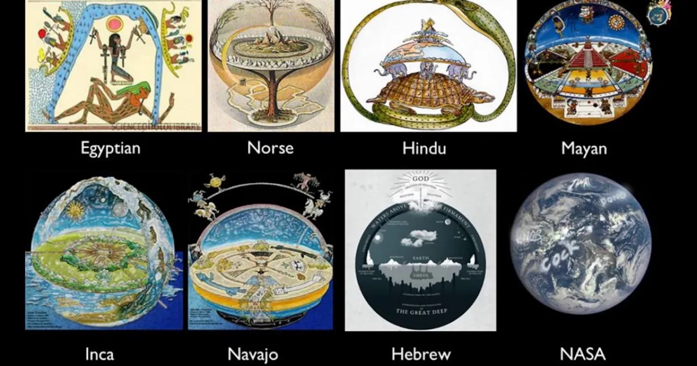
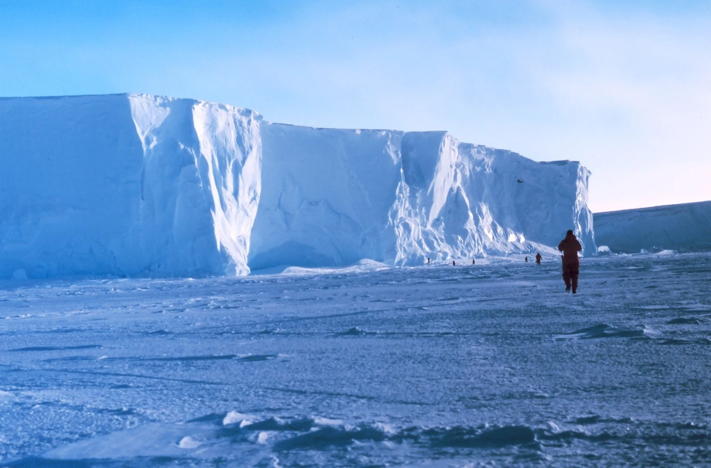

---
title: 'Bức tường băng Nam Cực'
excerpt: 'Phần 13 của Te lo ocultaron: bức tường băng Ross, bản đồ Nam Cực bị che khuất, Đô đốc Byrd, Hiệp ước Nam Cực và giả thuyết về những vùng đất bị cấm.'
category: 'stories'
tags: ['antarctica', 'ross-ice-shelf', 'admiral-byrd', 'forbidden-lands', 'hidden-history']
author: 'Minh Khang'
series: 'te-lo-ocultaron'
chapter: 13
publishDate: 2026-05-15T17:00:00.000Z
image: '~/assets/images/buc-tuong-bang-nam-cuc.webp'
---

> Nếu bản đồ thế giới mà chúng ta nhìn thấy mỗi ngày chỉ là phiên bản đã được biên tập, thì Nam Cực có thể không phải là phần rìa lạnh lẽo của hành tinh, mà là chiếc khóa cuối cùng giữ con người trong một mô hình thực tại được phép biết.

### Sự hoài nghi về hình dạng thế giới

Chúng ta thường tin rằng với vệ tinh, tàu vũ trụ, bản đồ số và công nghệ hiện đại, nhân loại đã hiểu gần như hoàn toàn về bề mặt Trái Đất.

Nhưng trong các giả thuyết ngoài dòng chính, chính niềm tin đó lại là điểm cần được đặt câu hỏi.

Nếu mọi thứ đã rõ ràng, tại sao hình ảnh về địa cầu thường xuất hiện dưới dạng ảnh ghép, mô phỏng, dữ liệu xử lý hoặc sản phẩm đồ họa được công bố bởi các cơ quan trung tâm?

Nếu bản đồ vệ tinh thực sự minh bạch, tại sao nhiều khu vực ở Nam Cực trên các nền tảng bản đồ số lại mờ, thiếu chi tiết, bị che phủ hoặc chỉ hiển thị một số vùng căn cứ nhất định?

Những câu hỏi này thường bị gạt sang một bên bằng nhãn "thuyết âm mưu".

Tuy nhiên, sự thiếu minh bạch về dữ liệu hình ảnh vẫn là điều khiến nhiều người không thể ngừng nghi ngờ.

Nam Cực, trong cách nhìn đó, không chỉ là một lục địa băng giá.

Nó là vùng rìa của nhận thức hiện đại: nơi công chúng được phép nhìn thấy một phần, nhưng không được phép tự do kiểm chứng toàn bộ.

Các bản đồ cổ của nhiều nền văn hóa từng mô tả thế giới theo những cách khác xa mô hình giáo khoa hiện nay.

Một số bản đồ dùng hình tròn đồng tâm, một số nhắc đến các vùng đất bao quanh đại dương, một số mô tả thế giới như một hệ thống có ranh giới, cổng vào và các vùng bị ngăn cách.

Ta không cần tin rằng mọi bản đồ cổ đều chính xác theo nghĩa địa lý hiện đại.

Nhưng việc nhiều nền văn hóa cùng hình dung thế giới như một cấu trúc nhiều tầng, có trung tâm, có biên giới và có vùng cấm, ít nhất cũng cho thấy trí nhớ tập thể của nhân loại có thể từng lưu giữ một điều gì đó đã bị đơn giản hóa thành "truyền thuyết".

### Bức tường băng Ross

Bức tường băng Ross, hay Ross Ice Shelf, là một trong những cấu trúc băng khổng lồ nhất tại Nam Cực.

Nó có diện tích khoảng 487.000 km2, chiều dài gần 800 km, và phần tiếp giáp với biển kéo dài hơn 600 km.

Tại nhiều vị trí, mặt băng dựng thành vách gần như thẳng đứng, cao từ khoảng 15 đến 50 mét so với mặt nước biển.

Bên dưới, lớp băng có thể dày tới hàng trăm mét.

Khi thuyền trưởng James Clark Ross khám phá khu vực này vào năm 1841, nó từng được gọi là _Barrière_, tức "rào cản", vì nó chặn đứng việc đi sâu hơn về phía cực Nam.

Trong khoa học chính thống, Ross Ice Shelf là một thềm băng tự nhiên.

Nhưng trong trí tưởng tượng của những người theo giả thuyết về Nam Cực bị phong tỏa, nó lại mang ý nghĩa khác: một bức tường.

Không chỉ là bức tường vật lý bằng băng, mà còn là biểu tượng của giới hạn nhận thức.

Điều nằm phía sau nó là gì?

Chỉ có thêm băng, thêm tuyết, thêm căn cứ nghiên cứu và các vùng địa lý lạnh giá?

Hay còn có những khu vực khác chưa từng được công bố, những cấu trúc bị chôn vùi, những lối đi bị kiểm soát và các dấu vết của một lịch sử không nằm trong sách giáo khoa?

Với người hoài nghi, đây chỉ là suy diễn.

Nhưng với người đặt câu hỏi, việc một lục địa rộng lớn như vậy bị kiểm soát bởi hiệp ước quốc tế, quân đội, giấy phép nghiên cứu và các tuyến du lịch hạn chế là điều quá bất thường để bỏ qua.

### Ai được phép bước qua ranh giới?

Nam Cực hiện không phải là nơi một cá nhân bình thường có thể tự do lên kế hoạch thám hiểm rồi đi đến bất kỳ đâu mình muốn.

Các chuyến đi thương mại rất đắt đỏ, bị giới hạn lộ trình, chịu kiểm soát chặt chẽ và thường chỉ đưa du khách đến các khu vực được phép.

Bạn có thể nhìn thấy chim cánh cụt, băng trôi, tàu nghiên cứu và một phần cảnh quan ngoạn mục.

Nhưng bạn không thể tự ý rời khỏi tuyến đã định, không thể đi sâu vào nội địa, không thể tự kiểm chứng các khu vực nhạy cảm và gần như không thể tiếp cận những vùng nằm ngoài khung du lịch được phê duyệt.

Lý do chính thức nghe rất hợp lý.

Nam Cực quá lạnh, quá nguy hiểm, quá dễ gây chết người với người thiếu thiết bị chuyên dụng.

Hệ sinh thái nơi đây mong manh, cần được bảo vệ khỏi con người.

Các mầm bệnh cổ xưa có thể bị giải phóng nếu lớp băng vĩnh cửu bị xâm phạm tùy tiện.

Và Hiệp ước Nam Cực năm 1959 được mô tả như một cơ chế hòa bình để ngăn lục địa này trở thành chiến trường tranh chấp.

Những lý do đó không sai về mặt bề mặt.

Nhưng trong cách nhìn của các giả thuyết quyền lực ẩn, câu hỏi không nằm ở việc "có cần quy định hay không".

Câu hỏi là: ai viết quy định, ai được miễn trừ, ai có quyền tiếp cận, và ai bị giữ ở bên ngoài?

Khi các quốc gia đối đầu nhau trên gần như mọi mặt trận nhưng lại có thể đồng thuận duy trì kiểm soát tại Nam Cực, điều đó khiến nhiều người nghi ngờ rằng lợi ích chung ở đây không chỉ là khoa học.

Nó có thể liên quan đến lãnh thổ, tài nguyên, công nghệ, dữ liệu địa chất, căn cứ ngầm, hoặc một điều gì đó vượt xa cách giải thích thông thường.

### Biểu tượng, hiệp ước và lớp màn kiểm soát

Trong các nghiên cứu ngoài dòng chính, biểu tượng luôn được xem là một ngôn ngữ quyền lực.

Các tổ chức chính trị, tài chính, quân sự và tôn giáo thường sử dụng biểu tượng để thể hiện trật tự, quyền lực, trung tâm và ranh giới.

Với Nam Cực, một số người nhìn thấy sự lặp lại của các mô-típ cổ: vòng tròn, thập tự, mặt trời, tâm điểm và vùng ngoại biên.

Tất nhiên, việc một biểu tượng giống một biểu tượng khác không tự động chứng minh âm mưu.

Nhưng trong chuỗi giả thuyết của _Te lo ocultaron_, các biểu tượng được xem như dấu vết của một hệ thống tư duy cổ hơn, nơi bản đồ, tôn giáo, thiên văn học, quyền lực quân sự và quyền kiểm soát tri thức có thể cùng xuất phát từ một lõi chung.

Nam Cực vì vậy không chỉ là một vùng đất.

Nó là một khái niệm: ranh giới cuối cùng mà con người bình thường không được tự do kiểm chứng.

Chúng ta được trao bản đồ, nhưng không được tự do đi hết bản đồ.

Chúng ta được xem ảnh vệ tinh, nhưng không được kiểm soát dữ liệu gốc.

Chúng ta được dạy rằng mọi thứ đã được khám phá, nhưng vẫn có những vùng đất mà việc tiếp cận phải thông qua tầng tầng lớp lớp giấy phép, cơ quan và hiệp ước.

### Nhật ký Byrd và vùng đất bên kia

Đô đốc Richard Byrd tiếp tục là một nhân vật trung tâm trong các câu chuyện về Nam Cực.

Ông là người tiên phong trong việc sử dụng máy bay để thám hiểm địa cực, đồng thời cũng là nhân vật gắn với nhiều ghi chép gây tranh cãi.

Từ năm 1926, đã có những nghi vấn về tính chính xác trong một số báo cáo bay của Byrd.

Đến năm 1996, khi nhật ký bay của ông được nghiên cứu lại, người ta phát hiện các dấu vết chỉnh sửa, tẩy xóa và thay đổi dữ liệu.

Với lịch sử chính thống, đó có thể chỉ là vấn đề ghi chép, sai số hoặc điều chỉnh kỹ thuật.

Nhưng với những người theo giả thuyết Nam Cực bí mật, đó là dấu hiệu cho thấy Byrd đã thấy điều gì đó không được phép công bố.

Một số bản kể cho rằng Byrd từng tìm thấy lối vào thế giới ngầm, hoặc ít nhất là phát hiện các vùng đất vượt ngoài mô hình bản đồ được công khai.

Ở phía bên kia bức tường băng, theo các diễn giải cực đoan hơn, có thể tồn tại những vùng đất khác, các nền văn minh phát triển, sinh vật cổ đại, động vật được cho là đã tuyệt chủng, hoặc các căn cứ liên quan đến UFO/UAP.

Những câu chuyện này rất khó kiểm chứng.

Nhưng điều làm chúng sống dai không phải chỉ là sự kỳ bí.

Điều làm chúng sống dai là cảm giác rằng con người hiện đại đang sống trong một thế giới được mô tả quá đơn giản, quá gọn gàng và quá phụ thuộc vào những nguồn dữ liệu mà bản thân họ không thể tự kiểm tra.

Nếu bức tường băng Ross chỉ là băng, thì nó vẫn là một kỳ quan tự nhiên vĩ đại.

Nhưng nếu nó còn là ranh giới của một câu chuyện bị che giấu, thì Nam Cực có thể là nơi quan trọng nhất trên bản đồ nhân loại.

Không phải vì những gì ta đã biết về nó.

Mà vì những gì ta vẫn chưa được phép biết.
