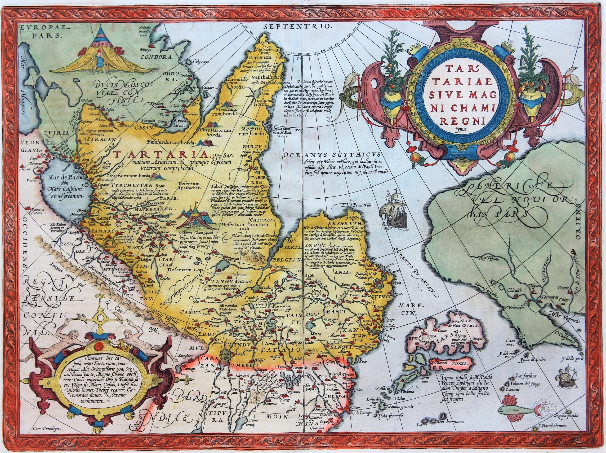
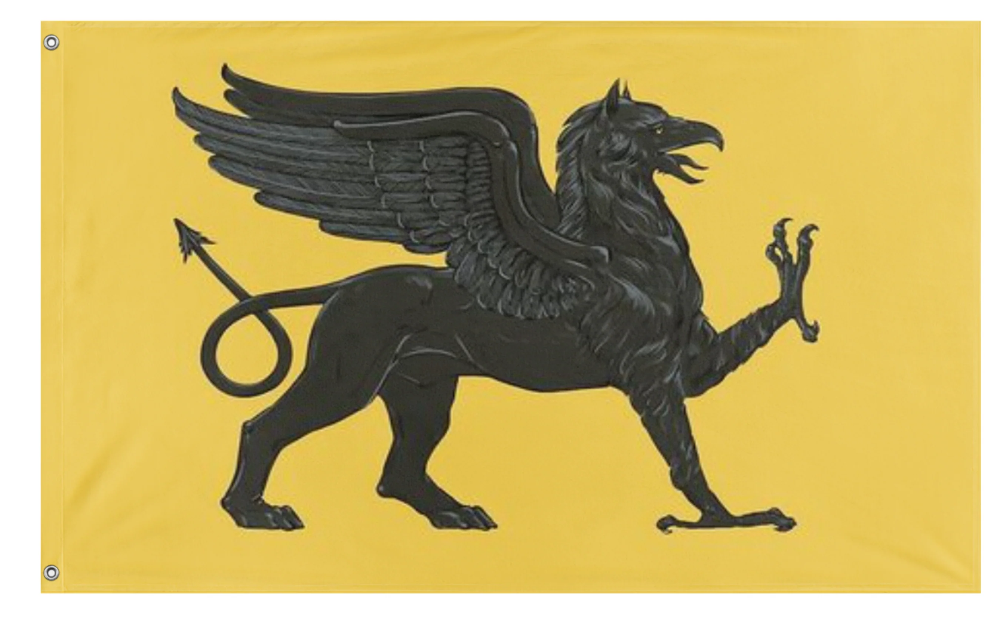
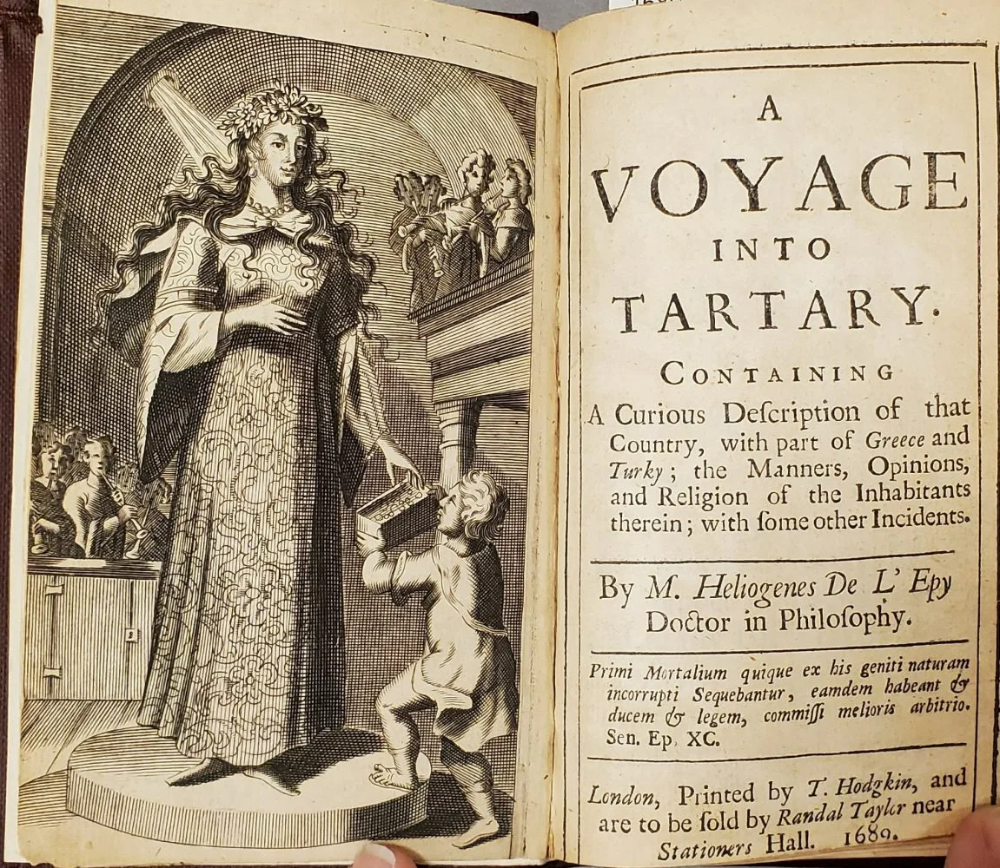
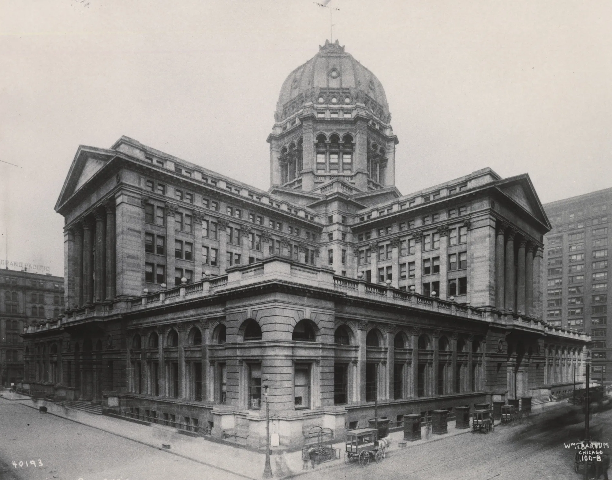
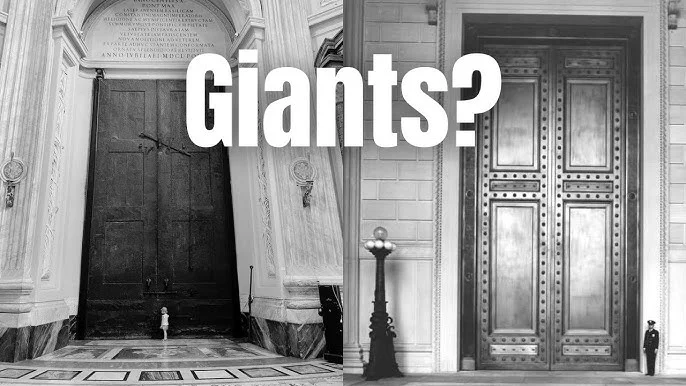
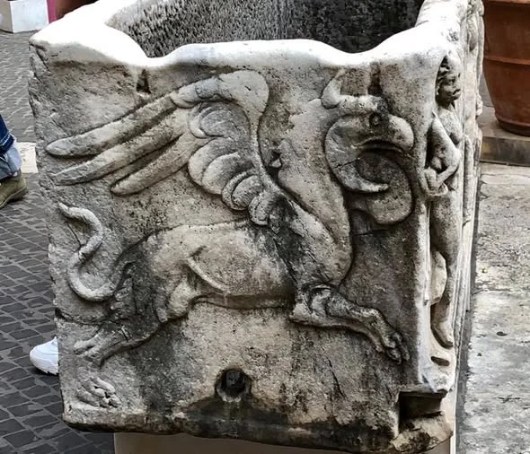
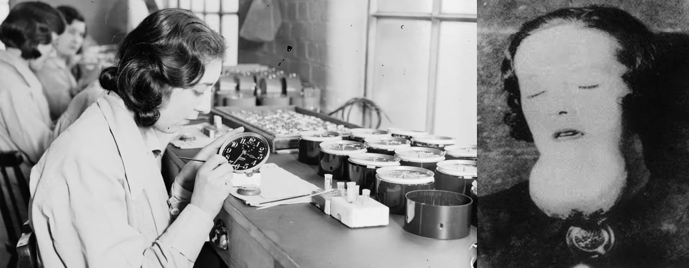

---
title: 'Tartaria và lịch sử bị xóa sổ'
excerpt: 'Phần 10 của Te lo ocultaron: giả thuyết về Đế chế Tartaria, cuộc tái thiết lịch sử, người khổng lồ, kiến trúc Ether, năng lượng miễn phí và ánh sáng của Thế giới Cũ.'
category: 'stories'
tags: ['tartaria', 'old-world', 'free-energy', 'ether', 'hidden-history']
author: 'Mai Lan'
series: 'te-lo-ocultaron'
chapter: 10
publishDate: 2026-05-12T17:00:00.000Z
image: '~/assets/images/de-che-tartaria-va-lich-su-bi-xoa-so.webp'
---

> Nếu lịch sử không chỉ được ghi lại, mà còn được biên tập, cắt bỏ và viết lại, thì những gì biến mất khỏi bản đồ có thể quan trọng hơn những gì còn nằm trong sách giáo khoa.

### Một thực tại thách thức lịch sử chính thống

Những gì bạn sắp đọc sau đây sẽ thách thức lịch sử chính thống và tất cả những gì chúng ta được dạy ở trường học, đại học hay trong các cuốn sách giáo khoa.

Sẽ ra sao nếu từng tồn tại một nền văn minh tiên tiến hơn hiện nay rất nhiều, với kiến thức sâu rộng về công nghệ, tâm linh và bản chất sự sống?

Tartaria, nguyên gốc được phát âm là "Tataria", được mô tả như tên của một đế chế tiền Mông Cổ có nguồn gốc từ Bắc Á, trước khi bao phủ phần lớn bán cầu bắc.

Đại Tartaria từng được cho là đế chế lớn nhất trong thời đại của nó, và thậm chí vẫn sẽ là đế chế lớn nhất nếu tồn tại đến ngày nay.

Theo các giả thuyết ngoài dòng chính, nền văn minh này hưng thịnh nhờ công nghệ tiên tiến, năng lượng miễn phí và kiến trúc vĩ đại.

Đó là một nền văn minh mang tính toàn cầu, đã trải qua một "cuộc tái thiết", hay reset, do một thảm họa quét sạch gần như mọi dấu vết.

Và theo thời gian, chúng ta mới chỉ bắt đầu tái khám phá các mảnh vỡ còn sót lại.

### Đế chế bị xóa tên khỏi dòng thời gian

Một trong những lý do khiến đế chế này trở nên đáng chú ý là vì nó dường như đã bị xóa sổ khỏi lịch sử chính thống của nhân loại.

Theo một số tài liệu cổ, vào khoảng những năm 1800, vẫn tồn tại một đế chế Tartaria hùng mạnh giáp ranh với Nga, Trung Quốc và Ấn Độ.

Các lá cờ của Tartaria thời đó khác hoàn toàn với những gì chúng ta biết hiện nay.

Một bản đồ cổ năm 1652 cho thấy Tartaria thống trị phần lớn châu Á, một phần Trung Quốc, Ấn Độ, Bắc Mỹ và Trung Mỹ.

Nếu điều này đúng, câu hỏi đặt ra là: tại sao các nhà sử học lại phớt lờ một đế chế chiếm gần nửa thế giới như vậy?

Phải chăng họ không muốn chúng ta biết về năng lượng miễn phí, kiến trúc cổ đại hay sự tồn tại của những người khổng lồ?

Có giả thuyết cho rằng sau khi Tartaria biến mất, Nga đã chiếm đoạt phần lớn lãnh thổ này.

Đó có thể là lý do tại sao Nga có diện tích khổng lồ như hiện tại và có một số yếu tố biểu tượng được cho là khá giống với Tartaria.

Tất nhiên, đây là một giả thuyết gây tranh cãi.

Nhưng chính sự thiếu vắng kỳ lạ của Tartaria trong giáo dục phổ thông khiến nó trở thành một chủ đề khó bỏ qua.

### Sellingham: thủ đô rực rỡ của thế giới

Nghiên cứu ngoài dòng chính cho rằng Tartaria có một thủ đô tên là Sellingham.

Đó được mô tả như một siêu đô thị lớn và quan trọng tương đương, thậm chí có thể hơn cả New York ngày nay.

Trên các bản đồ rất cũ, Sellingham được đánh dấu cùng với các vị trí của Bắc Kinh và Moscow.

Đây được cho là một trung tâm đa văn hóa, nơi người nhập cư từ khắp nơi trên thế giới đổ về sinh sống và giao thương qua các tuyến đường thương mại chằng chịt khắp châu Âu.

Nếu Sellingham từng tồn tại như vậy, việc nó biến mất khỏi ký ức phổ biến là một dấu hiệu rất lớn.

Không phải chỉ một thành phố bị mất, mà là cả một trục trung tâm của thế giới cũ bị cắt khỏi câu chuyện lịch sử.

### Những người khổng lồ ăn bằng khí

Người Tartaria được mô tả là những người cao lớn, với chiều cao trung bình từ 2,44 mét đến 3,66 mét.

Theo tiêu chuẩn hiện nay, họ là những người khổng lồ.

Điều thú vị là qua mỗi lần đại hồng thủy hoặc tái thiết thế giới, chiều cao của con người dường như lại giảm đi đáng kể.

Một giả thuyết chấn động cho rằng người Tartaria là những "người ăn khí", hay Breatharians.

Họ không phụ thuộc vào việc tiêu hóa calo từ thức ăn hay nước uống, mà hấp thụ năng lượng trực tiếp từ Ether, mạng lưới năng lượng của không gian.

Giả thuyết này được dùng để giải thích tại sao trong nhiều tòa nhà cổ được gán cho Tartaria không hề có dấu vết rõ ràng của nhà vệ sinh.

Thay vào đó, các phòng tắm được cho là nơi tụ họp xã hội, trao đổi tin tức và tái cân bằng năng lượng.

### Kiến trúc Ether và năng lượng miễn phí

Người Tartaria được mô tả như bậc thầy về xây dựng và công nghệ mang phong cách "Steampunk".

Các công trình kiến trúc kiểu La Mã hay Gothic mà chúng ta thấy ngày nay, như tòa thị chính, ngân hàng, nhà ga và nhà thờ, được giả thuyết cho rằng ban đầu không chỉ là công trình hành chính hay tôn giáo.

Chúng có thể từng là các trạm phát điện khí quyển, trạm lọc nước hoặc trung tâm chữa lành bằng âm thanh.

Một số dấu hiệu thường được nhắc đến gồm:

- **Những cánh cửa khổng lồ:** Các tòa nhà cổ thường có lối vào rất lớn. Giáo hội gọi đó là "cửa dành cho Đấng Tối Cao", nhưng giả thuyết Tartaria cho rằng chúng được thiết kế cho những người khổng lồ.
- **Các tháp và cột thu lôi:** Biểu tượng hình chữ thập trên đỉnh tháp có thể không chỉ là biểu tượng tôn giáo, mà là ăng-ten thu năng lượng điện từ từ Ether.
- **Đèn đường không dây:** Đèn đường thời Tartaria được cho là không dùng điện lưới hay dầu hỏa, mà tận dụng năng lượng Ether khiến chất khí bên trong bóng đèn tự phát sáng.
- **Lò sưởi không đốt củi:** Những lò sưởi lộng lẫy trong dinh thự cổ có thể không được thiết kế để đốt gỗ, mà kết nối với hệ thống ăng-ten trên mái để tập trung năng lượng nhiệt từ khí quyển.

Nếu nhìn theo cách này, kiến trúc cổ không chỉ đẹp vì thẩm mỹ.

Nó có thể là một công nghệ bị ngụy trang thành di sản.

Những mái vòm, cột trụ, tháp nhọn, kim loại dẫn điện, hoa văn cộng hưởng và không gian âm học trong nhà thờ có thể từng phục vụ một mục đích kỹ thuật mà lịch sử hiện đại không còn giải thích đầy đủ.

### Bằng chứng từ tài liệu giải mật của CIA

Năm 1998, CIA đã giải mật một tài liệu từ năm 1944 cho thấy Đảng Cộng sản Liên Xô từng ra lệnh viết lại hoàn toàn lịch sử Tartaria.

Mục tiêu được cho là nhằm che giấu sự xâm lược của Nga và xóa bỏ mọi ký ức về quá khứ quốc gia của người Tartaria.

Nếu tài liệu này được diễn giải theo hướng đó, nó khẳng định rằng đã có một nỗ lực hệ thống để che giấu sự thật về "cuộc tái thiết" này trước các thế hệ tương lai.

Điểm đáng chú ý không chỉ là việc một quốc gia viết lại lịch sử.

Điểm đáng chú ý là hành động ấy có thể làm biến mất ký ức về cả một nền văn minh khỏi ý thức tập thể.

### Ánh sáng của Thế giới Cũ

Khi quan sát các bức tranh và ảnh chụp từ thế kỷ 17 đến 19 ở Paris hay các thành phố lớn, chúng ta thấy những hệ thống chiếu sáng rực rỡ và lộng lẫy vào những dịp lễ hội.

Lịch sử chính thống nói đó là đèn dầu hỏa.

Nhưng nếu dùng hàng nghìn ngọn nến hay đèn dầu sát nhau như vậy, nguy cơ hỏa hoạn sẽ cực kỳ lớn, trong khi hỏa hoạn vốn là nỗi sợ lớn nhất của các đô thị cổ.

Những hình ảnh đó khiến các giả thuyết về Tartaria đặt ra một khả năng khác: con người từng làm chủ năng lượng không dây và ánh sáng Ether từ rất lâu trước khi Nikola Tesla cố gắng mang nó trở lại cho nhân loại.

Nếu đúng, Tartaria không chỉ là một đế chế đã mất.

Nó là biểu tượng cho một nhánh lịch sử nơi công nghệ, tâm linh, kiến trúc và năng lượng từng được hiểu như một hệ thống thống nhất.

Và nếu nhánh lịch sử ấy đã bị xóa, thì việc tái khám phá nó không chỉ là chuyện khảo cổ.

Đó là việc đặt lại câu hỏi về toàn bộ nền văn minh hiện đại: chúng ta đang tiến bộ, hay chỉ đang chậm rãi tìm lại những gì từng bị lấy mất?
