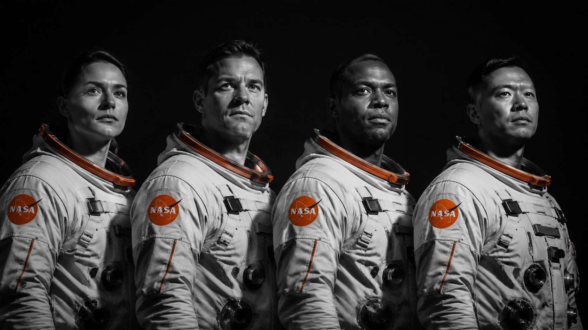

Hơn 50 năm kể từ sứ mệnh Apollo cuối cùng, nhân loại một lần nữa vươn mình khỏi quỹ đạo Trái Đất để chạm đến vùng lân cận của Mặt Trăng. Sứ mệnh Artemis II đã hoàn thành xuất sắc chuyến bay ngang qua Mặt Trăng trên tàu vũ trụ Orion (được phi hành đoàn ưu ái đặt tên là _Integrity_ - Sự Chính Trực), đánh dấu bước ngoặt vĩ đại nhất của thế kỷ 21 trong nỗ lực chinh phục vũ trụ.

Nhưng Artemis II không chỉ là một chuyến bay thử nghiệm hệ thống. Đó là hiện thân của một ước mơ vĩ đại hơn, mang theo thông điệp của cả một hành tinh gửi vào không gian sâu thẳm.

### Thông điệp tới vũ trụ và nhân loại

Artemis II mang theo một thông điệp rõ ràng: **"Chúng ta đi cùng nhau."** Khác với cuộc chạy đua vũ trụ trong thời kỳ Chiến tranh Lạnh vốn bị thúc đẩy bởi sự cạnh tranh địa chính trị, chương trình Artemis là minh chứng cho sự hợp tác quốc tế sâu rộng. Nó cho thấy rằng khi đối mặt với những thử thách vượt ngoài ranh giới của bầu khí quyển, nhân loại có thể gạt bỏ những khác biệt để cùng hướng tới một mục tiêu chung. Sứ mệnh này là bước đệm thiết yếu để con người thiết lập sự hiện diện lâu dài trên Mặt Trăng và xa hơn nữa là vươn tới Sao Hỏa.

### Bốn nhân vật chính: Những người hùng của thế hệ mới

Phi hành đoàn Artemis II không chỉ xuất sắc về mặt chuyên môn mà còn đại diện cho sự đa dạng của nhân loại hiện đại. Bốn cái tên đã đi vào lịch sử bao gồm:

1. **Reid Wiseman (Chỉ huy - Mỹ):** Một phi công bay thử nghiệm hải quân dạn dày kinh nghiệm, người chịu trách nhiệm lèo lái sứ mệnh và đảm bảo an toàn tuyệt đối cho cả đội.
2. **Victor Glover (Phi công - Mỹ):** Người da màu đầu tiên thực hiện một sứ mệnh không gian sâu. Anh phụ trách điều khiển các hệ thống dẫn đường và bay của tàu Orion.
3. **Christina Koch (Chuyên gia sứ mạng - Mỹ):** Người phụ nữ đầu tiên du hành vượt ra ngoài Trái Đất thấp. Cô vốn đã nắm giữ kỷ lục chuyến bay không gian liên tục dài nhất của một phụ nữ và tiếp tục phá vỡ các rào cản giới tính trong ngành hàng không vũ trụ.
4. **Jeremy Hansen (Chuyên gia sứ mạng - Canada):** Phi hành gia đầu tiên không mang quốc tịch Mỹ bay tới vùng lân cận Mặt Trăng, đại diện cho sự đóng góp của Cơ quan Vũ trụ Canada (CSA) vào chương trình.

### Những khối óc phía sau hậu trường: Đội ngũ kỹ sư hàng không vũ trụ

Nếu bốn phi hành gia là những người đứng dưới ánh đèn sân khấu, thì hàng ngàn kỹ sư hàng không vũ trụ chính là những người thắp sáng sân khấu đó. Sự thành công của Artemis II là hệ quả của hàng triệu giờ làm việc không mệt mỏi từ các trung tâm kiểm soát của NASA và các đối tác quốc tế (như ESA - Cơ quan Vũ trụ Châu Âu).

Họ là những người đã chế tạo ra Hệ thống Phóng Không gian (SLS) – tên lửa mạnh nhất thế giới. Họ là những kỹ sư đã phân tích từng milimet của lá chắn nhiệt trên tàu Orion để đảm bảo nó chịu được nhiệt độ gần 3.000 độ C khi lao trở lại bầu khí quyển. Họ làm việc ngày đêm với Mô-đun Dịch vụ Châu Âu (ESM) để cung cấp lực đẩy, năng lượng, nước và oxy – những huyết mạch duy trì sự sống cho phi hành đoàn. Mỗi một dữ liệu truyền về Trái Đất đều được phân tích theo thời gian thực để đưa ra các quyết định sinh tử chỉ trong chớp mắt.

### Bóng đen của thuyết âm mưu: Tại sao sự thật vẫn bị hoài nghi?

Có một nghịch lý đáng buồn: Dù Artemis II được truyền hình trực tiếp với độ phân giải cao, hệ thống dữ liệu mở và thông tin hoàn toàn minh bạch, các thuyết âm mưu vẫn bùng nổ. Trên các nền tảng mạng xã hội, không ít người vẫn rêu rao rằng mọi thứ chỉ là "dàn dựng" tại phim trường với phông xanh, hay thậm chí là sản phẩm của trí tuệ nhân tạo (AI deepfake). Tại sao lại như vậy?

- **Sự phát triển của công nghệ giả mạo (Deepfake):** Công nghệ AI tạo video và hình ảnh giả ngày nay quá chân thực, khiến nhiều người mất niềm tin vào những gì họ nhìn thấy trên màn hình. Họ tự mặc định rằng "nhìn thấy chưa chắc đã là sự thật".
- **Thiên kiến xác nhận (Confirmation Bias):** Một bộ phận công chúng có xu hướng chỉ tìm kiếm và tin vào những thông tin củng cố cho sự hoài nghi sẵn có của họ về các cơ quan chính phủ. Những thuật toán của mạng xã hội càng làm trầm trọng thêm điều này khi liên tục gợi ý các video âm mưu cho người xem.
- **Khoảng cách về kiến thức khoa học:** Những hệ thống vật lý và kỹ thuật phức tạp của tàu vũ trụ đôi khi đi ngược lại với trực giác thông thường (ví dụ: cách ánh sáng hoạt động trong môi trường không có khí quyển). Thay vì tìm hiểu khoa học, việc tin vào một câu chuyện "dàn dựng" thường dễ dàng và có tính giải trí cao hơn.

Mặc cho những tiếng ồn ào từ các thuyết âm mưu, con tàu _Integrity_ và bốn phi hành gia của Artemis II đã hoàn thành sứ mệnh của mình. Chuyến bay lịch sử này không chỉ là sự tái khẳng định sức mạnh công nghệ của con người, mà còn thắp lên ngọn lửa khao khát khám phá những chân trời mới chưa từng được biết tới trong vũ trụ bao la.
