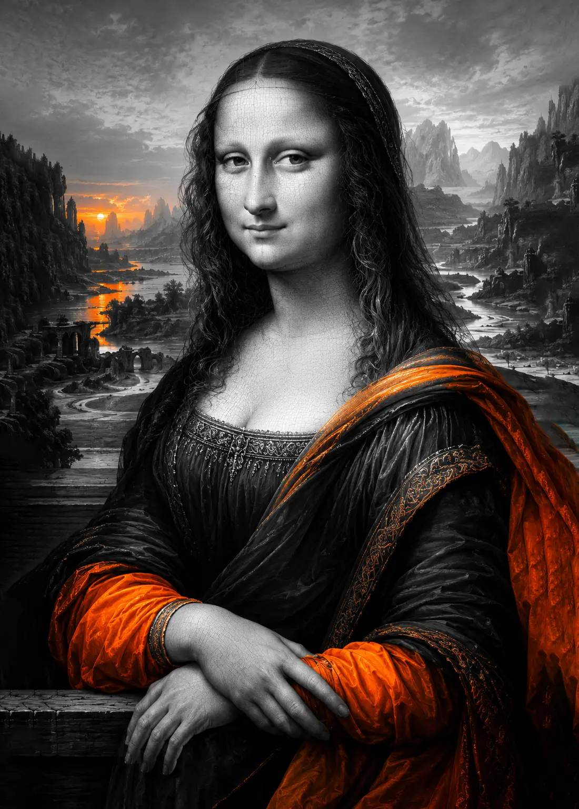

> "Nét cười ấy không phải là ẩn dụ. Đó là một câu chuyện được giữ lại cho người biết đọc." Leonardo thầm thì khi quan sát Mona Lisa.

### 1. Mona Lisa: nụ cười qua thời gian

Leonardo mất gần bốn năm để hoàn thiện bức Mona Lisa. Ông không vẽ nhanh. Ông xếp từng lớp màu mảnh, dùng kỹ thuật sfumato để làm mờ ranh giới giữa da và bóng tối. Nhờ vậy, gương mặt ấy không bao giờ cứng. Đôi mắt dường như nhìn ra ngoài khung tranh, và nụ cười cũng không phải một cử chỉ tĩnh mà là một chuyển động tâm lý.

*Note: Hình tạo bởi AI - không có giá trị nghệ thuật*

Mona Lisa là một thử nghiệm về trạng thái. Leonardo đã đặt bà vào một khung cảnh mơ hồ, nửa như trong mơ, nửa như hiện thực. Đôi mắt của bà theo dõi người xem, nhưng cũng có vẻ như đang hướng vào một nội tâm riêng. Ông mở ra một câu chuyện không lời.

### 2. Bữa ăn cuối cùng: bức tranh như một vở kịch

Trong tu viện Santa Maria delle Grazie, Leonardo thực hiện "Bữa ăn cuối cùng" với cái nhìn của một đạo diễn. Ông chia bức tranh thành bốn nhóm, mỗi nhóm gồm ba môn đồ. Jesus ở vị trí trung tâm, ánh sáng chiếu thẳng vào ông như một tiêu điểm. Khoảnh khắc được giữ lại là lúc thông báo "Trong số các ngươi, một người sẽ phản bội ta."

Từng cử chỉ, từng khuôn mặt phản ứng khác nhau: có người ngạc nhiên, có người nghi ngờ, có người đau đớn. Ông không vẽ một cảnh tĩnh; ông vẽ một chuỗi cảm xúc đang chuyển động. Đây là nghệ thuật tự sự: hình ảnh kể một câu chuyện, chứ không chỉ miêu tả một biểu tượng.

### 3. Sfumato và cấu trúc kể chuyện

Kỹ thuật sfumato là bí quyết then chốt. Leonardo không dùng đường viền đen, ông tạo ra các chuyển tiếp mềm giữa vùng sáng và tối. Điều này khiến khuôn mặt trở nên sống động, màu da bật ra như một bề mặt mỏng manh. Trong Mona Lisa, kỹ thuật này làm giảm độ cứng của đường nét; trong Bữa ăn cuối cùng, nó giúp hòa trộn biểu cảm và khoảng không gian xung quanh.

Ngoài ra, ông dùng ánh sáng để chỉ ra cấu trúc tâm lý. Với Mona Lisa, ánh sáng tập trung quanh gương mặt; với Bữa ăn cuối cùng, ánh sáng tạo ra trục đối xứng, chia nhân vật thành hai bên đối đầu nhưng vẫn liên kết.

### 4. Nét văn hóa đương đại trong tranh

Mona Lisa và Bữa ăn cuối cùng không chỉ là nghệ thuật cổ điển. Chúng là hai cách kể chuyện đương đại của Leonardo. Ông cho người xem cảm giác như đang đứng trong cùng một căn phòng, nghe tiếng thì thầm và cảm nhận mùi nến.

Bức chân dung tạo ra sự gần gũi thầm lặng, còn bức tranh tường tạo ra sự căng thẳng một cách tinh tế. Người xem không chỉ nhìn hình ảnh, mà còn cảm thấy một hành trình cảm xúc.

### 5. Di sản của hai kiệt tác

Khi nhìn lại hai tác phẩm này, ta thấy Leonardo không chỉ là một họa sĩ tài năng. Ông là một nhà kể chuyện, một nhà khoa học biểu cảm, và một người hiểu rõ cách mê hoặc cảm nhận. Ông dùng bút vẽ để gợi mở tâm lý, và dùng màu sắc để làm sống lại cả một xã hội, nghệ thuật của ông không dừng lại ở độ chính xác. Nó mở ra một dạng tư duy kết hợp giữa kỹ thuật, biểu cảm và khả năng kể câu chuyện bằng hình ảnh.
