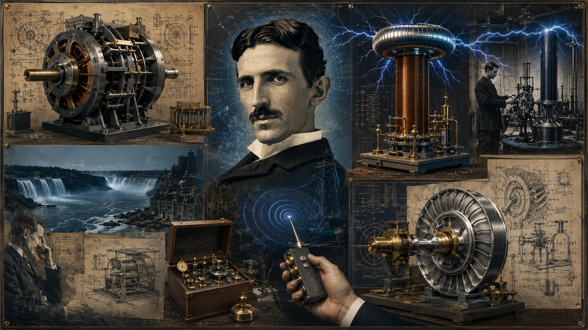
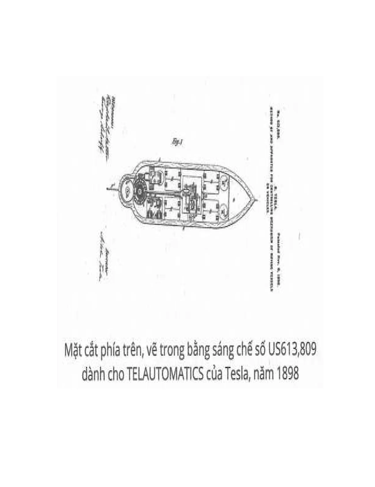

---
title: 'Tesla - Máy phóng điện cao thế P1'
excerpt: 'Vô tuyến, chống nhiễu, truyền thông và những ý tưởng quy mô lớn.'
category: 'stories'
author: 'Bao Ngoc'
series: 'cuoc-doi-ky-la-cua-nikola-tesla'
chapter: 6
publishDate: 2026-06-05T17:00:00.000Z
image: '~/assets/images/nikola-tesla-chuong-6-may-phong-dien-cao-the-phan-1.webp'
---

### Chương 6: Máy phóng điện cao thế

Trong tất cả những chủ đề mà tôi cống hiến cả đời mình, không có chủ đề nào đòi hỏi sự tập trung tâm trí và làm căng thẳng các dây thần kinh loại thượng hạng của bộ não tới mức độ nguy hiểm như hệ thống mà trong đó máy phóng điện cao thế là nền tảng. Tôi đã từng đặt tất cả sức mạnh của tuổi trẻ vào phát triển trường xoay. Tuy vậy, những nỗ lực thuở ban đầu đó có đặc tính khác hoàn toàn. Tuy vất vả đến cùng cực, nhưng những nỗ lực đó không gian nan đến độ tôi phải vắt kiệt sức mình. Không nhẹ nhàng như trường xoay, mọi trí lực đều phải được huy động mới có thể giải quyết các bài toán phức tạp của chủ đề vô tuyến.  
Dù lúc đó tôi có sức chịu đựng rất bền bỉ, nhưng các dây thần kinh bị sử dụng quá độ cuối cùng đã nổi loạn, khiến tôi sụp đổ hoàn toàn, ngay khi sắp phải thực thi một nhiệm vụ khó khăn và lâu dài. Lẽ ra sau đó tôi đã bị sa lầy nặng hơn, và rất có thể sự nghiệp cũng sớm chấm dứt, nếu trời đất không trang bị cho tôi một cái “cầu chì.” Nó hoạt động ngày càng tốt theo năm tháng. Mỗi khi tôi sắp hết năng lượng, nó bắt đầu ra tay ngắt mạch. Chừng nào nó còn hoạt động, chừng đó tôi sẽ không bao giờ bị nguy hiểm do làm việc quá sức, trong khi các nhà phát minh khác rất hay bị lao lực. Cũng ngẫu nhiên thôi, tôi không cần những kỳ nghỉ mà hầu hết mọi người ai cũng cần. Khi sắp hết sức, tôi chỉ đơn giản làm như những anh da đen: “Nằm xuống ngủ khò, kệ cho mấy anh da trắng lo lo lắng lắng.”\*  
Mạo hiểm nói lý thuyết ngoài chuyên môn một tí. Cơ thể tích lũy các tác nhân độc hại từng chút, từng chút một. Khi đạt tới một ngưỡng nhất định, tôi chìm vào trạng thái gần như hôn mê kéo dài đúng nửa giờ. Khi tỉnh dậy, tôi có cảm giác các sự kiện vừa mới đây như thể đã xảy ra cách đây lâu lắm rồi, và nếu cố gắng tiếp tục dòng suy nghĩ bị gián đoạn, tôi sẽ bắt đầu buồn nôn. Miễn cưỡng, tôi quay sang suy nghĩ chuyện khác rồi ngạc nhiên về sự tươi mới của tâm trí và dễ dàng vượt qua những trở ngại đã làm tôi phải vò đầu bứt tai trước đó.  

Sau nhiều tuần nhiều tháng, niềm đam mê phát minh tạm thời bị bỏ rơi nay trở lại, và tôi luôn tìm ra câu trả lời cho tất cả những câu hỏi hóc búa mà hầu như chẳng cần cố gắng suy nghĩ gì cả.  
Liên quan đến chuyện này, tôi muốn kể về một trải nghiệm lạ thường có thể có ích đối với các nhà nghiên cứu tâm lý học. Lúc đó, tôi đã tạo ra một hiện tượng đáng chú ý với bộ truyền phát nối đất, và đang liên hệ ứng dụng đến việc dẫn truyền thông qua trái đất. Ý tưởng này có vẻ như vô vọng, hơn một năm trời kiên trì làm việc chả đi đến đâu cả. Cuộc nghiên cứu này quá cuốn hút tôi, đến độ tôi quên hết mọi thứ khác, ngay cả sức khỏe đang suy yếu của mình. Cuối cùng, khi tôi đang ở thời điểm sụp đổ, thì thiên nhiên đã áp dụng phương án bảo tồn cơ thể hiệu quả cực độ bằng giấc ngủ chết người. Khi tỉnh lại, tôi sợ hãi nhận ra rằng tôi không thể hình dung các cảnh vật từ cuộc sống của mình nữa, ngoại trừ những hình ảnh thời thơ ấu – những hình ảnh đầu tiên đi vào ý thức của tôi. Khá là kỳ lạ, những hình ảnh này xuất hiện trước mắt rõ mồn một và làm cho tôi cảm thấy rất nhẹ nhõm. Hằng đêm, khi đang ngủ, tôi thường nghĩ về những hình ảnh đó và càng ngày sự tồn tại trước đây của tôi càng lộ rõ. Mẹ tôi luôn là nhân vật chính trong cảnh tượng từ từ mở ra đó, và một mong muốn khát khao được gặp lại mẹ dần dần chiếm lấy tôi. Cảm giác này quá mạnh đến nỗi tôi quyết bỏ hết tất cả công việc để đáp ứng khát khao của mình. Nhưng khổ nỗi, tôi thấy quá khó không thể thoát khỏi phòng thí nghiệm được. Nhiều tháng trôi qua, thời gian đó tôi đã thành công trong việc làm sống lại tất cả những ấn tượng về cuộc đời quá khứ của mình cho đến mùa xuân 1892. Hình ảnh kế tiếp hiện ra từ màn sương quên lãng, tôi thấy mình tại khách sạn Hotel de la Paix ở Paris. Hình ảnh này đến từ một cơn ngủ sau đợt gắng sức kéo dài của bộ não. Hãy tưởng tượng sự đau đớn khổ sở của tôi khi trong đầu chợt lóe lên hình ảnh một bức điện buồn: Mẹ tôi đang hấp hối. Tôi nhớ mình đã thực hiện cuộc hành trình dài không nghỉ để về nhà như thế nào và mẹ đã qua đời sau nhiều tuần đau đớn ra sao. Đặc biệt đáng chú ý là trong suốt giai đoạn ký ức bị xóa một phần này, tôi hoàn toàn ý thức rõ mọi thứ đụng chạm đến chủ đề nghiên cứu của tôi. Tôi có thể nhớ lại những chi tiết nhỏ nhất, những quan sát ít ý nghĩa nhất trong các thí nghiệm và thậm chí có thể đọc lại không sai một từ các trang văn bản cũng như các công thức toán học phức tạp đã từng xem qua.  
Tôi hoàn toàn tin tưởng quy luật đền bù. Các phần thưởng thực sự bao giờ cũng tỷ lệ thuận với sức lao động và sự hy sinh. Đây là một trong những lý do tại sao tôi cảm thấy chắc chắn rằng trong tất cả các phát minh của tôi, máy phóng điện cao thế sẽ chứng tỏ tầm quan trọng và giá trị của mình cho các thế hệ tương lai. Tôi đi đến dự đoán này không phải vì những tiến bộ mang tính cách mạng trong thương mại và công nghiệp mà nó chắc chắn sẽ mang lại, mà dựa trên những hệ quả của các thành tựu mà cỗ máy mang lại đối với loài người. Những giá trị mang tính công năng đơn thuần nhẹ ký hơn nhiều so với những lợi ích mà chiếc máy mang lại cho cả nền văn minh. Chúng ta đang phải đối mặt với những vấn đề khó, không thể được giải quyết chỉ bằng các phương pháp thuần về vật chất, dù có dồi dào và hữu hiệu cách mấy đi nữa. Trái lại, sự tiến bộ theo hướng thuần vật chất đầy những hiểm nguy, đe dọa chúng ta không kém gì tai ương đến từ đói khổ. Nếu con người sử dụng năng lượng nguyên tử hoặc khám phá một cách nào khác để phát triển năng lượng giá rẻ không giới hạn ở bất kỳ điểm nào trên địa cầu, thì thành tựu này, thay vì là một phước lành, có thể mang lại tai họa cho nhân loại vì sinh ra bất đồng và tình trạng hỗn loạn, cuối cùng dẫn đến sự đăng quang của chế độ bạo quyền. Những điều tốt đẹp nhất chỉ đến từ những cải tiến kỹ thuật hướng tới sự thống nhất và hài hòa, mà máy phát vô tuyến của tôi là ví dụ. Bằng phương tiện đó, tiếng nói con người và các thứ tương tự sẽ được tạo ra khắp mọi nơi; các nhà máy được điều khiển xa hàng ngàn dặm từ những thác nước cung cấp điện năng. Các máy trên không sẽ bay xung quanh trái đất không nghỉ và năng lượng mặt trời được kiểm soát để tạo ra sông hồ cho mục đích năng lượng, chuyển đổi các sa mạc khô cằn thành đất đai màu mỡ. Ứng dụng của nó trong điện báo, điện thoại và những thứ tương tự sẽ tự động loại bỏ sự nhiễu do tĩnh điện hay bất kỳ nguyên nhân nào khác mà hiện nay con người chưa thể tháo gỡ. Đây là một chủ đề mới mẻ, vài lời không thể nói hết.  
Suốt thập niên qua, một số người ngạo mạn tuyên bố rằng họ đã tháo gỡ trở ngại này thành công. Tôi đã cẩn thận kiểm tra tất cả những phương án đó trước cả khi họ công bố, nhưng chẳng có phương án nào ổn. Tuyên bố chính thức gần đây từ Hải quân Hoa Kỳ có lẽ đã dạy cho một số biên tập viên báo chí vớ vẩn biết cách thẩm định thông tin. Các phương án mà nhiều người công bố dựa trên những lý thuyết nguy khoa học khiến tôi bắt đầu khó chịu mỗi khi nghe thấy. Gần đây thôi, một phát hiện mới vừa được công bố, thổi kèn đánh trống đinh tai nhức óc, nhưng nó hóa ra lại là một trường hợp chuột nhắt giả voi.  
Điều này chợt nhắc tôi nhớ một sự việc thú vị xảy ra cách đây một năm, khi tôi đang tiến hành thí nghiệm với các dòng điện cao tần. Lúc ấy, Steve Brodie vừa nhảy cầu Brooklyn. Trò mạo hiểm này giờ đã trở nên phổ biến kể từ đó do những người bắt chước, nhưng hồi đó bài tường thuật đầu tiên đã khiến cả New York giật mình. Bấy giờ tôi cũng rất ấn tượng và thường xuyên nói về người thợ in táo bạo đó. Vào một chiều nóng bức, tôi cảm thấy cần phải làm mới mình một tí và bước vào một trong 30.000 quán xá nổi tiếng của thành phố tuyệt vời này. Ở đó phục vụ nước giải khát 12 độ cồn rất ngon, mà bây giờ ta phải đến các nước nghèo tan nát ở châu Âu mới có. Ở quán khá đông, mọi người không có ai quá nổi trội. Chủ đề đang được thảo luận khiến tôi cao hứng mở đầu bằng câu nói thiếu suy nghĩ sau: “Anh biết không, đây là câu tôi sẽ nói khi nhảy cầu…”_ Ngay khi vừa dứt lời, tôi thấy mình giống người bạn đồng hành của Timotheus trong bài thơ của Schiller_ vậy._  
Trong chớp mắt cả quán loạn lên. Cả chục giọng nói vang lên: “Brodie đấy!” Tôi ném ly nước uống dở và tiền lên quầy, phóng ra cửa, nhưng đám đông bám theo sát gót và hét lớn: “Đứng lại, Steve!” Chắc hẳn là bị hiểu lầm, vì nhiều người cố giữ tôi lại khi tôi chạy điên cuồng tìm nơi ẩn náu. Bằng cách lao như tên bắn quanh các góc nhà, lẻn qua đường thoát hiểm, tôi may mắn tới được phòng thí nghiệm. Tôi vội cởi áo khoác, nguy trang thành một người thợ rèn chăm chỉ và bắt đầu giả bộ làm việc. Nhưng biện pháp ngụy trang này là không cần thiết, vì tôi đã tránh được những người hâm mộ cuồng nhiệt đuổi theo. Nhiều năm sau đó, vào ban đêm, khi tưởng tượng đến những rắc rối vụn vặt trong ngày, tôi thường nghĩ lại, không biết số phận của tôi sẽ như thế nào nếu đám đông ngày đó bắt được và phát hiện ra rằng tôi chẳng phải là Steve Brodie!  
Có vẻ như anh kỹ sư dám trình bày trước một hội đồng kỹ thuật về một phương thuốc mới chống lại tĩnh điện dựa trên một quy luật tự nhiên trước đây chưa được biết đến” cũng nói liều như tôi ngày trước. Anh chàng dám nói các nhiễu loạn này tăng giảm theo chu kỳ, trong khi nhiễu loạn của máy phát thì đều đều cùng trái đất. Điều đó có nghĩa là địa cầu là một tụ điện với lớp khí bao quanh, có thể được sạc và xả điện theo cách hoàn toàn trái ngược với những giáo lý cơ bản trong mọi sách giáo khoa vật lý sơ cấp. Một giả thuyết như vậy sẽ bị lên án là sai lầm, ngay cả trong thời Franklin (Thế kỷ XVIII), vì các đặc điểm của điện khí quyển - cũng như máy móc - đều đã được khám phá với đầy đủ bằng chứng. Rõ ràng, nhiễu loạn tự nhiên và nhân tạo truyền qua đất hay không khí đều theo một cách giống y như nhau, cả hai tạo ra sức điện động cả chiều ngang lẫn chiều thẳng đứng. Sự nhiễu loạn không thể được khắc phục bằng bất kỳ phương pháp nào như đã được đề xuất cả. Sự thật là thế này: Trong không khí, hiệu điện thế tăng lên với tỷ lệ khoảng 50 Volt mỗi ft độ cao, do đó có thể có một sự khác biệt về áp suất lên tới 20.000, hoặc thậm chí 40.000 Volt giữa hai đầu trên và dưới của hệ thống ăng-ten. Các khối không khí tích điện không ngừng chuyển động và chuyển điện cho dây dẫn, không liên tục mà ngắt quãng, tạo ra tiếng ồn lạo xạo trong bộ phận thu khá nhạy cảm của điện thoại. Thiết bị đầu cuối càng cao và không gian phủ dây càng lớn, thì kết quả càng rõ, nhưng phải hiểu rằng điều đó hoàn toàn mang tính cục bộ và không liên quan lắm đến vấn đề thực sự.  
Năm 1900, tôi hoàn thiện hệ thống vô tuyến của mình, một bộ máy nén 4 ăng-ten. Chúng được hiệu chỉnh cẩn thận theo cùng một tần số và kết nối song song với bộ phận phóng đại hoạt động tiếp nhận từ bất kỳ hướng nào. Khi tôi muốn xác định nguồn gốc của xung động được truyền đi, mỗi cặp nằm theo đường chéo được mắc nối tiếp với một cuộn dây sơ cấp tiếp năng lượng cho mạch dò. Trong trường hợp trước, âm thanh trong điện thoại khá lớn, trong trường hợp sau nó ngừng lại như kỳ vọng do 2 ăng-ten trung hòa nhau. Tuy nhiên, nhiễu điện xuất hiện rõ nét trong cả hai trường hợp. Tôi đã phải tìm mọi cách dựa trên mọi nguyên lý để loại trừ nhiễu. Bằng cách sử dụng máy thu kết nối với hai điểm mặt đất, theo đề nghị của tôi từ lâu, rắc rối gây ra bởi không khí tích điện (mà hiện nay đang rất nghiêm trọng trong các cấu trúc xây dựng) đã được triệt tiêu. Bên cạnh đó, khả năng bị nhiễu tất cả các loại thiết bị giảm xuống còn khoảng một nửa vì tính chất có hướng của mạch điện. Hiện tượng này là hoàn toàn hiển nhiên, nhưng đối với những người nghiên cứu vô tuyến đầu óc đơn giản với kinh nghiệm chỉ xoay quanh các loại máy có thể cải tiến bằng búa bổ củi thì nó lớn lao kỳ bí lắm. Họ tính toán tới việc xử lý bộ da gấu trước khi giết được gấu. Nếu sự thật rằng tĩnh điện chỉ là những trò mèo như vậy, thì loại bỏ nhiễu là dễ ẹc, chỉ cần thu tín hiệu không dùng ăng-ten là xong. Theo quan điểm này, dây chôn dưới đất sẽ hoàn toàn không bị nhiễu; nhưng thực tế thì nó dễ bị ảnh hưởng đối với các xung động nào đó bên ngoài hơn một dây đặt thẳng đứng trong không khí. Công bằng mà nói, đến nay đã có một chút tiến bộ, nhưng không phải nhờ vào một phương pháp hoặc thiết bị cụ thể nào. Tiến bộ đạt được đơn giản bằng cách hiểu rõ các cấu trúc khổng lồ (đủ để thực hiện chức năng truyền dẫn nhưng hoàn toàn không thích hợp để tiếp nhận) và áp dụng một loại thiết bị tiếp nhận thích hợp hơn. Như tôi đã nói, để xử lý dứt điểm khó khăn này, phải có một sự thay đổi căn bản hệ thống càng sớm càng tốt.  
Nếu ngay lúc này, khi mà kỹ nghệ chống nhiễu vẫn còn non trẻ (thậm chí cả chuyên gia vẫn không biết hết tiềm năng thực sự) mà chính phủ đã vội vã thông qua các chính sách biến nó thành hàng độc quyền nhà nước, thì hẳn kết quả sẽ chẳng mấy tốt đẹp. Bộ trưởng Daniel đã đề xuất ý tưởng này vài tuần trước, và rõ ràng là vị quan chức xuất chúng này đã kêu gọi Thượng viện và Hạ viện với niềm tin hoàn toàn chân thành. Thế nhưng bằng chứng phổ quát cho thấy rõ rằng kết quả tốt nhất luôn luôn được tạo ra trong cạnh tranh thương mại lành mạnh. Tuy nhiên, ngoài lý do trên, vẫn có những lý do đặc biệt tại sao chủ đề vô tuyến nên được hoàn toàn tự do phát triển. Trước hết, nó cho thấy triển vọng tuyệt vời trong việc cải thiện đời sống con người, tuyệt vời hơn bất cứ phát minh hoặc khám phá nào khác trong lịch sử nhân loại. Một lần nữa, phải hiểu rằng kỹ nghệ tuyệt vời này đã được phát triển toàn diện ở đây, ngay tại đất Mỹ, có thể được gọi là “hàng Mỹ” với ý nghĩa chính xác hơn so với điện thoại, đèn sợi đốt hay máy bay.  
Những tờ báo doanh nhân và những tay buôn cổ phiếu đã rất thành công trong việc truyền bá thông tin sai lạc, đến nỗi ngay cả một tập san xuất sắc như Scientific American cũng cho rằng phát minh này của tôi chủ yếu là nhờ công lao các nước khác. Tất nhiên, người Đức đã cho chúng ta sóng Hertz_ và các chuyên gia Nga, Anh, Pháp, Ý đã nhanh chóng ứng dụng cho mục đích truyền tin. Ứng dụng này rõ ràng chỉ là đưa một nhân tố mới vào cách làm cũ (bình mới rượu cũ), và được thực hiện với cuộn dây cảm ứng cổ điển, không được cải tiến, hầu như không hơn gì một loại truyền tin quang báo. Bán kính dẫn truyền rất hạn chế, kết quả đạt được ít có giá trị, và các dao động Hertz (được dùng như phương tiện truyền tải thông tin) lẽ ra có thể được thay thế (thậm chí còn tốt hơn) bằng sóng âm thanh, cách mà tôi đã ủng hộ từ năm 1891. Hơn nữa, tất cả những ứng dụng này chỉ được thực hiện 3 năm sau khi các nguyên lý cơ bản của hệ thống vô tuyến (mà ngày nay ứng dụng rất nhiều) và các công cụ cực mạnh của hệ thống này đã được mô tả rõ ràng và phát triển ở Mỹ.  
Ngày nay các thiết bị và phương pháp Hertz hầu như đã biến mất. Chúng ta phát minh hệ thống truyền tải vô tuyến theo hướng hoàn toàn trái ngược, và những gì đã được thực hiện là sản phẩm tạo ra bởi bộ não và những nỗ lực của công dân đất nước này. Các bằng sáng chế cơ bản đã hết hạn và cơ hội đang mở ra cho tất cả. Lập luận chính của Bộ trưởng dựa vào vấn đề nhiễu điện. Theo phát biểu của ông, được tường thuật trong báo New York Herald ngày 29/7, tín hiệu từ một trạm phát mạnh có thể bị can thiệp ở mọi làng xã trên thế giới. Nếu xét đến thực tế này (đã được trình bày trong các thí nghiệm của tôi năm 1900), thì cấm cản riêng tại Hoa Kỳ sẽ không mấy tác dụng.  
Để thấy rõ tầm quan trọng của phát minh chống nhiễu của mình, tôi xin đề cập một sự kiện. Chỉ mới đây thôi, một quý ông dáng vẻ kỳ quái ghé thăm tôi với mục đích mời tôi xây dựng máy phát quy mô thế giới tại một vùng đất cực kỳ xa xôi hẻo lánh. “Chúng tôi không có tiền,” ông nói, “nhưng có hàng xe vàng ròng, ông thích lấy bao nhiêu thì lấy.” Tôi nói với ông ấy rằng tôi muốn xem thử tương lai phát minh của mình ở đất Mỹ đã, thế là câu chuyện kết thúc. Tuy nhiên, tôi rất vui vì một số thế lực đen tối đã bắt tay vào hành động. Trong thời gian tới, việc duy trì liên lạc liên tục không gián đoạn sẽ trở nên khó khăn hơn rất nhiều. Phương thuốc duy nhất là một hệ thống không bị gián đoạn. Nó đã được hoàn thiện, nó tồn tại, và tất cả những gì cần làm bây giờ là đưa nó vào sử dụng.  
Mọi người vẫn không quên khả năng xảy ra một cuộc xung đột khủng khiếp giữa các thế lực, và có lẽ khi đó chính máy phóng điện cao thế là một trong những cỗ máy đóng vai trò trung tâm trong tấn công và phòng thủ, nhất là khi được ứng dụng vào máy tự vận hành TELAUTOMATICS. Phát minh này là một kết quả logic của các quan sát bắt đầu trong thời niên thiếu của tôi và tiếp tục suốt cả cuộc đời còn lại.

Khi kết quả đầu tiên được công bố, biên tập tạp chí Electrical Reviews nói rằng nó sẽ trở thành một trong những “nhân tố tiềm năng nhất trong sự tiến bộ của nền văn minh nhân loại.” Thời điểm dự đoán này thành sự thật không còn xa nữa đâu. Năm 1898 và 1900, tôi đã gởi kế hoạch đó lên chính phủ và lẽ ra đã
được thông qua nếu tôi là người biết lo lót, nhờ vả! Lúc đó tôi thực sự nghĩ rằng chiếc máy của mình sẽ xóa bỏ chiến tranh, vì nó có khả năng hủy diệt không giới hạn mà không cần con người trực tiếp đánh trận. Tuy nhiên, theo thời gian, dùvẫn tin tưởng vào tiềm năng của nó, nhưng quan điểm của tôi đã thay đổi. Chiến tranh là không thể tránh khỏi cho đến khi nguyên nhân vật chất khiến nó xảy ra được loại bỏ. Xét cho cùng, trái đất này quá rộng lớn. Chỉ khi khoảng cách được loại bỏ nhờ truyền đạt thông tin không giới hạn, một ngày nào đó mối quan hệ hữu nghị bền vững giữa các bên sẽ được thiết lập trong mọi phương diện, như chuyển tải trí tuệ, vận chuyển hành khách, hàng hóa và truyền tải năng lượng. Giờ thì điều mỗi người trong chúng ta muốn nhất chính là có cơ hội gần gũi nhau hơn. Khi các cá nhân và cộng đồng trên khắp trái đất hiểu về nhau hơn, thì các niềm tin mê muội cống hiến cho các lý tưởng dân tộc ích kỷ khiến thế giới rơi vào sự man rợ và hỗn loạn thời nguyên thủy sẽ bị diệt trừ. Không có tổ chức hay nghị quyết của bất kỳ quốc hội nào có thể ngăn chặn một thảm họa như vậy cả. Con người bây giờ thì chỉ sáng chế ra các thiết bị mới để kẻ yếu bị nghiền nát dưới bàn tay kẻ mạnh mà thôi.  
Tôi đã bày tỏ quan điểm của mình về vấn đề này 14 năm trước. Khi đó, Andrew Carnegiel* quá cố - người có thể được coi là cha đẻ của ý tưởng này - đã ủng hộ thành lập một liên minh các chính phủ hàng đầu, một loại liên minh thần thánh để quảng bá và thúc đẩy ý tưởng tự động hóa điều khiển từ xa. Dù xét về một số phương diện, lợi ích của các ý tưởng đối với một số dân tộc là không thể chối bỏ, nhưng nhìn chung thì nó không thể đạt mục tiêu quan trọng nhất: hòa bình. Hòa bình chỉ có thể đến một cách tự nhiên như là hệ quả của sự giác ngộ chung, xuất hiện khi các chủng tộc hòa nhập lại với nhau. Chúng ta còn lâu mới đạt tới trình độ nhận thức hạnh phúc này. Thực tế là ít ai thừa nhận rằng Chúa làm ra con người trong hình ảnh của Ngài, do đó tất cả mọi người trên trái đất là như nhau. Thực tế chỉ có một chủng tộc mang nhiều màu da mà thôi. Kitô chỉ là một người, nhưng là của tất cả mọi người, vậy tại sao một số người nghĩ rằng mình tốt hơn người khác?  
Khi nhìn thế giới hôm nay, dưới ánh sáng của cuộc đấu tranh khổng lồ mà chúng ta đã chứng kiến, tôi tràn đầy niềm tin rằng các lợi ích của nhân loại sẽ được phục vụ tốt nhất nếu nước Mỹ vẫn trung thực với truyền thống của mình, trung thực với Chúa mà nó giả vờ tin, và tránh xa “các liên minh rối rắm.” Với vị trí địa lý hiện tại, xa cách các tụ điểm xung đột sắp xảy ra, không có động cơ mở rộng thêm lãnh thổ, với nguồn tài nguyên vô tận và dân số lớn, triệt để thấm nhuần tinh thần tự do và nhân quyền, đất nước này đang nằm ở một vị trí đầy đặc quyền, có một không hai. Như vậy, nó có thể độc lập phát huy sức mạnh vĩ đại đồng thời với lương tâm vì lợi ích của cả thế giới, công minh và hiệu quả hơn là làm thành viên của một liên minh nào đó.  
Tôi đã nhấn mạnh những hoàn cảnh thời niên thiếu của mình và kể về một loại bệnh trạng buộc tôi phải luyện tập không ngừng óc tưởng tượng và sự quan sát. Hoạt động tinh thần này, lúc đầu là không tự nguyện dưới áp lực của bệnh, dần dần trở thành bản chất thứ hai, cuối cùng dẫn tôi đến chỗ nhận ra rằng mình chỉ là một cỗ máy tự động không có ý chí tự do trong tư tưởng và hành động, chỉ chịu trách nhiệm phản ứng các tác động từ môi trường.* Cơ thể chúng ta phức tạp về cấu trúc, những chuyển động của con người quá nhiều, quá liên quan lẫn nhau, tác động của những ấn tượng bên ngoài vào các giác quan quá tinh tế và khó hiểu, cho nên những người bình thường rất khó thấu hiểu sự thật này. Tuy nhiên, không có thứ bằng chứng nào thuyết phục hơn là lý thuyết cơ học về sự sống đã được Descartes* hiểu và nêu ra 300 năm trước. Ở thời ông, nhiều chức năng quan trọng của cơ thể vẫn là điều kỳ bí, đặc biệt là các vấn đề liên quan đến bản chất ánh sáng và cấu trúc cũng như hoạt động của mắt. Các triết gia, khoa học gia thời đó vẫn đang mò mẫm trong bóng tối.  
Những năm gần đây, tiến bộ nghiên cứu khoa học trong các lĩnh vực kể trên đã xóa bỏ hết các nghi ngờ liên quan đến quan điểm này. Từ đó, nhiều công trình đã được công bố. Người có khả năng nhất có lẽ là Felix le Dantec*, trợ lý trước đây của Pasteur._ Giáo sư Jacques Loeb_ cũng đã thực hiện các thí nghiệm đáng chú ý về thuyết hướng dương, khẳng định rõ tác động của ánh sáng đối với các dạng sinh vật bậc thấp. Ông đã trình bày rất rõ điều này trong quyển Forced Movements. Tuy giới khoa học tiếp nhận thuyết này với thái độ bình thường, đơn giản vì với họ thuyết này cũng như bất kỳ thuyết nào khác, nhưng với tôi nó quan trọng hơn nhiều: Đó là chân lý mà tôi luôn chứng minh hằng giờ qua mỗi hành vi và suy nghĩ của mình. Mỗi ấn tượng từ bên ngoài đều tạo ra các phản ứng cả về thể chất lẫn tinh thần, và toàn bộ các phản ứng đã từng xuất hiện trong tâm trí tôi đều là tác phẩm của các ấn tượng này. Chỉ một số trường hợp đặc biệt hiếm hoi, khi tôi ở trong trạng thái chú tâm đặc biệt, thì tôi mới không thể xác định được ấn tượng, xung động ban đầu nào tạo ra phản ứng của mình. [_(Đọc tiếp)_](https://news.info.vn/news/nikola-tesla-chuong-6-may-phong-dien-cao-the-phan-2/)
