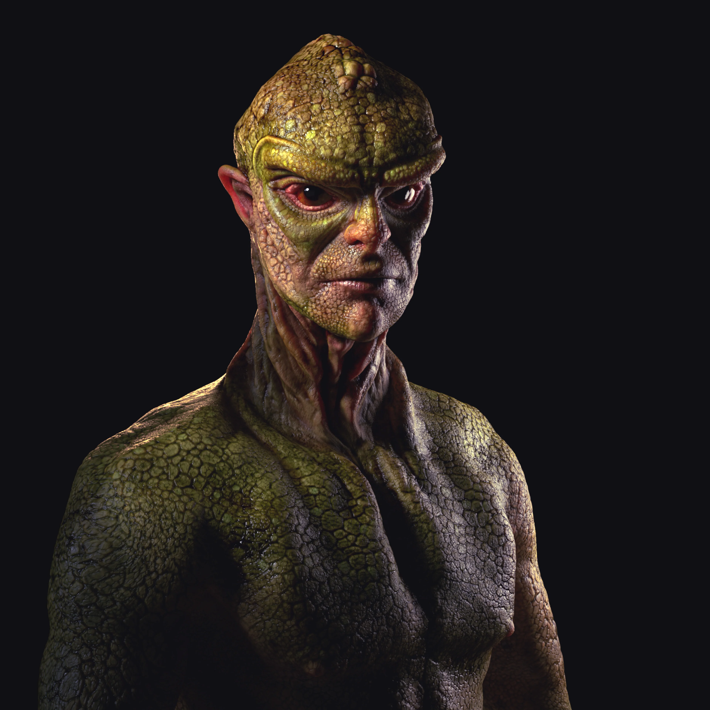
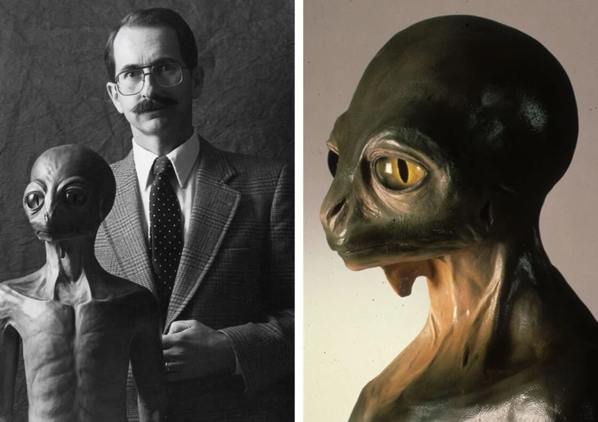
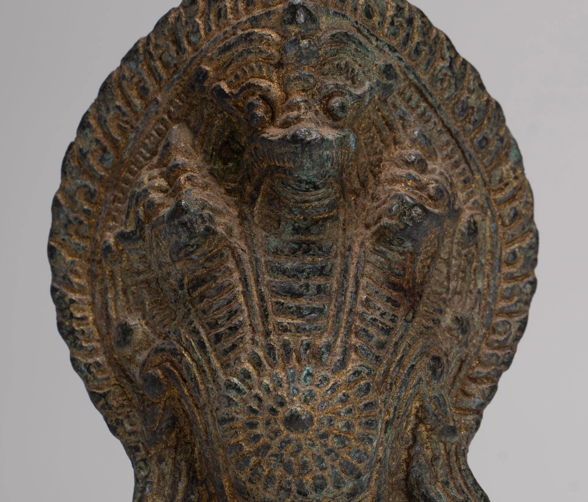
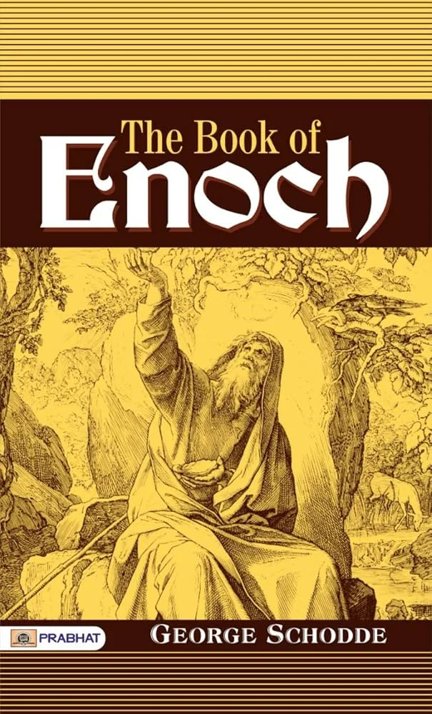
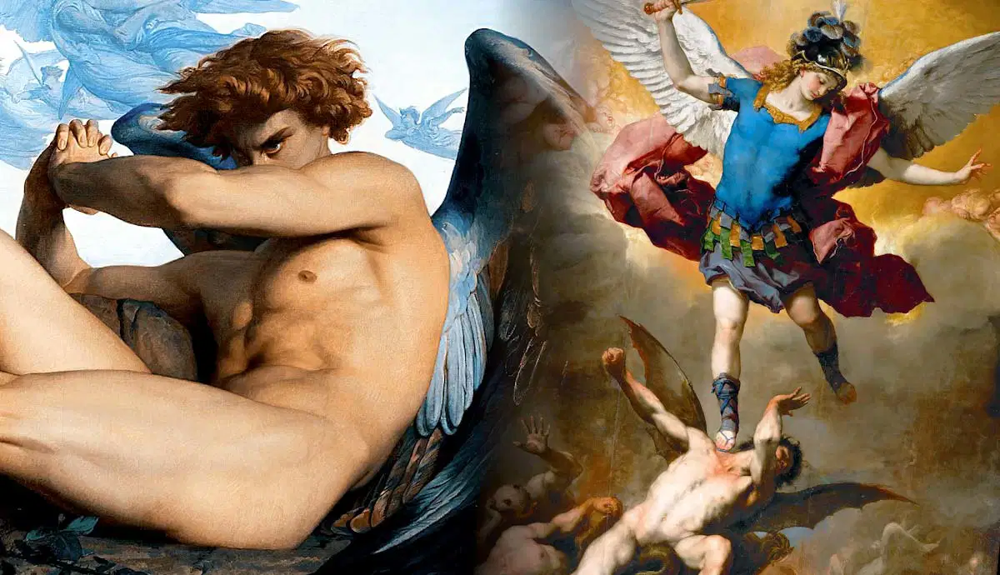
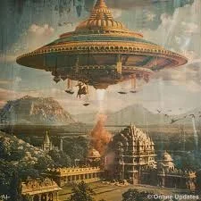

---
title: 'Reptilians và bí mật Enoch'
excerpt: 'Phần 7 của Te lo ocultaron: chủng tộc bò sát, biểu tượng rắn xuyên suốt lịch sử, dòng máu tinh hoa và cách sách Enoch được diễn giải như một ký ức cổ về những thực thể ngoài hành tinh.'
category: 'stories'
tags: ['reptilians', 'enoch', 'watchers', 'nephilim', 'ancient-symbols']
author: 'Quang Huy'
series: 'te-lo-ocultaron'
chapter: 7
publishDate: 2026-05-09T17:00:00.000Z
image: '~/assets/images/reptilians-va-bi-mat-sach-enoch.webp'
---

> Nếu những biểu tượng rắn xuất hiện trong quá nhiều nền văn minh cổ đại không chỉ là hình ảnh tôn giáo, thì có thể chúng đang chỉ về một ký ức sâu hơn: ký ức về các thực thể từng được gọi là thần, thiên sứ, người canh gác hoặc kẻ từ trời xuống.

### Reptilian: chủng tộc thực thể ngoài hành tinh giữa chúng ta

Chủng tộc Bò sát, hay Reptilians, thường được mô tả là những sinh vật dạng người nhưng mang đặc điểm bò sát.

Trong nhiều giả thuyết huyền bí và thuyết âm mưu hiện đại, họ được cho là có khả năng thay đổi hình dạng, shape-shifting, bí mật kiểm soát thế giới và thao túng các sự vụ toàn cầu.

Vậy họ thực sự là ai và đến từ đâu?

Nền tảng của thuyết "Elite Bò sát" cho rằng trong thời cổ đại, một nhóm thực thể bò sát tiên tiến từ hệ sao Alpha Draconis đã đến Trái Đất.

Họ xâm nhập vào chính phủ của các nền văn minh cổ xưa với mục tiêu nô lệ hóa nhân loại.

Bằng cách lai tạo với con người, họ tạo ra những dòng máu lai có DNA cho phép họ gây ảnh hưởng lên tâm trí quần chúng.

Sự hiện diện của DNA này được cho là làm giảm trí tuệ và sức mạnh nội tại của con người, khiến chúng ta dễ bị thống trị hơn.

Bằng chứng về sự tồn tại của DNA bò sát trong con người thường được dẫn qua các giai đoạn đầu của phôi thai, nơi hình dáng con người có những điểm tương đồng kỳ lạ với bò sát.

Thêm vào đó, phần nguyên thủy nhất của não bộ con người, nơi kiểm soát các bản năng sinh tồn cơ bản, được chính khoa học gọi là "não bò sát", gồm thân não và tiểu não.

Dù cách diễn giải này còn gây tranh cãi, nó đặt ra một câu hỏi đáng chú ý: tại sao hình tượng bò sát, rắn và sinh vật lai lại xuất hiện dai dẳng đến vậy trong ký ức tập thể của nhân loại?

### Biểu tượng rắn xuyên suốt lịch sử

Từ cổ chí kim, nhiều tôn giáo và nền văn minh cổ đại đều tôn thờ những vị thần mang hình dáng bò sát hoặc rắn.

Điều này củng cố giả thuyết cho rằng những thực thể này từng cai trị, hướng dẫn hoặc can thiệp vào các nền văn minh cổ xưa, thậm chí có liên hệ với các công trình không tưởng như Kim tự tháp Ai Cập.

Sự hiện diện của biểu tượng rắn là một mối liên kết lặp đi lặp lại giữa con người và các vị thần trong nhiều nền văn hóa:

- **Vườn Địa Đàng:** Con rắn Nawcash cám dỗ Eva.
- **Ai Cập cổ đại:** Thần Atum xuất hiện dưới hình dạng người rắn.
- **Văn hóa Maya:** Thần rắn lông vũ Quetzalcóatl.
- **Sumer:** Biểu tượng rắn xoắn đôi gắn với thần Enki.

Ngay cả trong thời hiện đại, biểu tượng này vẫn được nhiều người cho là còn hiện diện rõ nét.

Một ví dụ thường được nhắc đến là Phòng Đại sảnh Thính pháp của Vatican, Aula Paolo VI.

Kiến trúc của tòa nhà này, khi nhìn từ bên ngoài lẫn bên trong, được cho là mô phỏng cái đầu của một con rắn khổng lồ, với các cửa sổ như mắt rắn và các cấu trúc bên trong gợi hình răng nanh.

### Những dòng máu xanh và sự kiểm soát ngầm

Nhiều giả thuyết cho rằng các gia đình hoàng gia và giới tinh hoa quyền lực nhất thế giới duy trì sự thống trị thông qua các dòng máu lai được chọn lọc qua nhiều thế hệ.

Theo cách nhìn này, quyền lực không chỉ được truyền bằng tài sản, ngai vàng hoặc vị trí chính trị, mà còn bằng huyết thống.

Một giả thuyết gây tranh cãi liên quan đến Công nương Diana cho rằng bà được chọn để tiếp nối dòng máu của nhà Windsor.

Nhưng sau khi biết được bản chất thực sự của hoàng tộc, bà đã cố gắng phản kháng, và đó được xem là một trong những lý do dẫn đến cái kết bi thảm của bà.

Dù những thực thể này có thực sự là người bò sát hay không, điểm mấu chốt của giả thuyết nằm ở cấu trúc kiểm soát.

Nhân loại đang cống hiến năng lượng, sự chú ý và sự phục tùng cho một hệ thống mà rất ít người dám thức tỉnh để nhìn ra.

Hình ảnh Reptilian vì vậy có thể được hiểu theo hai lớp: một lớp là sinh vật ngoài hành tinh, một lớp là biểu tượng cho tầng quyền lực lạnh lùng, vô cảm và sống bằng sự khai thác con người.

### Bí mật của Enoch và hiệp ước với thực thể ngoài hành tinh

Cuốn sách của Enoch, hay Libro de Enoc, là một văn bản không được đưa vào Kinh thánh chính thống.

Nó chứa đựng những lời kể về các "Người canh gác", Watchers.

Họ là những thiên sứ được gửi xuống để chăm sóc con người, nhưng sau đó lại nảy sinh ham muốn với phụ nữ Trái Đất.

Từ sự lai tạo này, một chủng tộc lai khổng lồ ra đời mang tên Nephilim.

Nephilim được mô tả là những kẻ ăn thịt người, sở hữu sức mạnh siêu nhiên và gây ra sự hỗn loạn trên mặt đất.

Để trừng phạt các thiên sứ sa ngã và làm sạch Trái Đất khỏi các Nephilim, một trận đại hồng thủy đã được tạo ra.

Nếu diễn giải bằng ngôn ngữ hiện đại, những gì Enoch mô tả không nhất thiết là phép màu thần thánh, mà có thể được nhìn như công nghệ tiên tiến:

- **Abduction, hay bắt cóc:** Enoch không chết mà được đưa đi trong một "cỗ xe lửa" rực sáng, rất giống mô tả về một con tàu vũ trụ.
- **Cung điện lơ lửng:** Enoch mô tả việc được đưa vào một cấu trúc khổng lồ như pha lê, nơi ông có thể nhìn thấy các vì sao xuyên qua sàn nhà bằng kính.
- **Vimana:** Các văn bản cổ của Ấn Độ như Mahabharata cũng mô tả những cỗ xe bay có khả năng di chuyển đến các vùng sao khác nhau và sở hữu vũ khí có sức hủy diệt khủng khiếp.

Kết nối các dữ kiện, có thể thấy "thiên sứ sa ngã" trong sách Enoch được một số giả thuyết diễn giải như những thực thể ngoài hành tinh, có liên hệ với Anunnaki trong các ghi chép Sumer cổ đại.

Theo cách nhìn này, sách Enoch không chỉ là một văn bản tôn giáo bị loại khỏi kinh điển.

Nó có thể là một phiên bản khác của cùng một ký ức cổ: ký ức về những thực thể đến từ bầu trời, lai tạo với con người, tạo ra dòng máu đặc biệt và để lại một hệ thống kiểm soát vẫn âm thầm vận hành đến ngày nay.

Nếu phần trước đặt câu hỏi về Anunnaki và nguồn gốc loài người, thì phần này mở rộng câu hỏi ấy sang một hướng khác: điều gì sẽ xảy ra nếu các "thần linh" trong cổ sử không biến mất, mà chỉ thay đổi hình dạng quyền lực để tiếp tục tồn tại giữa chúng ta?
