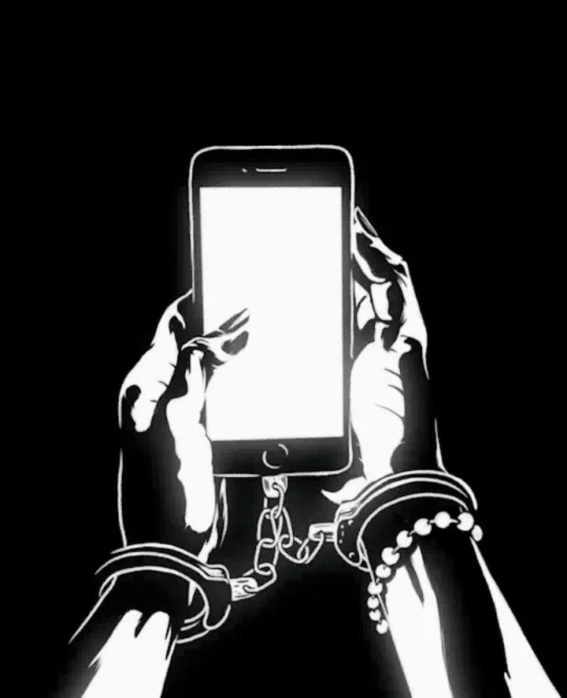
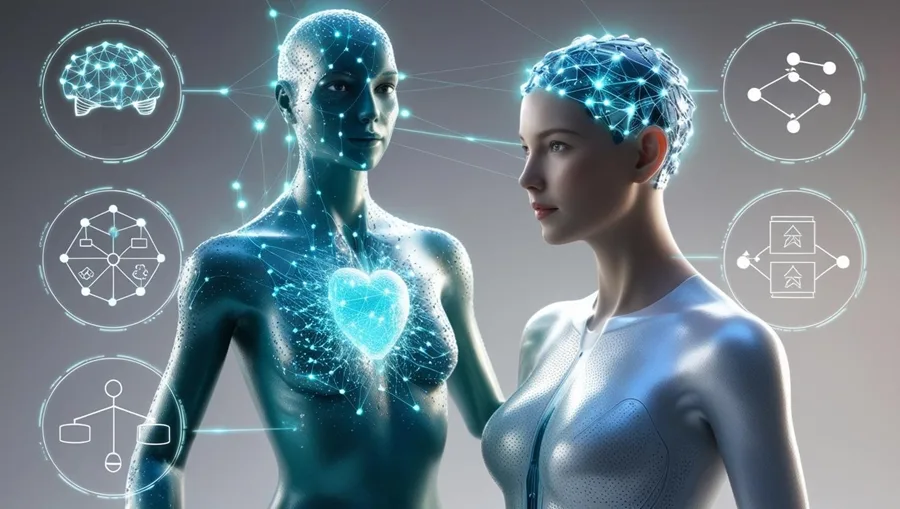
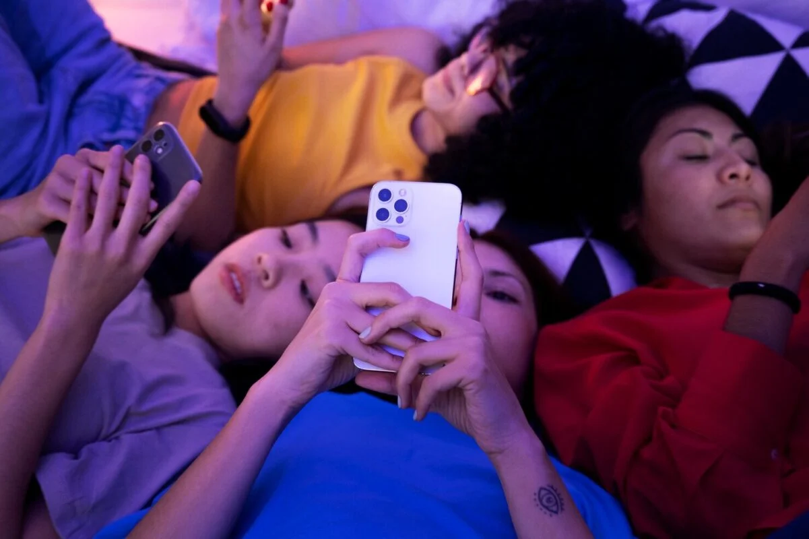
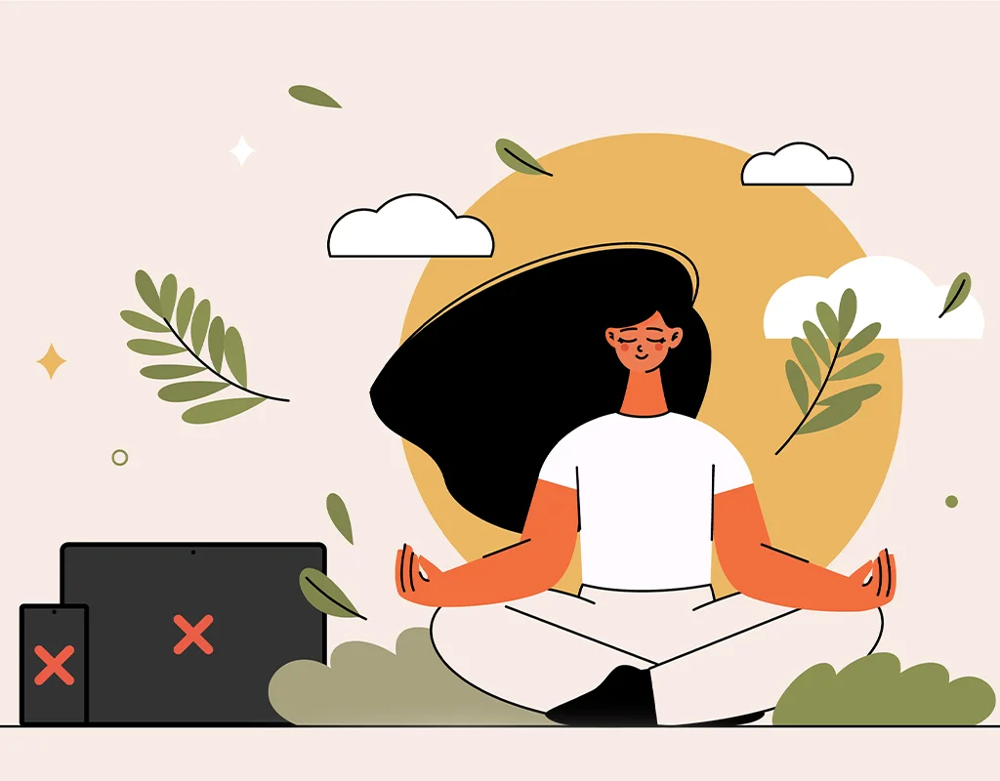

---
title: 'Tinh hoa và bẫy kỹ thuật số'
excerpt: 'Phần 21 của Te lo ocultaron: tầng lớp tinh hoa, truyền thông xã hội, chủ nghĩa tư bản giám sát, avatar số, dopamine và cuộc chiến giành lại quyền kiểm soát tâm trí.'
category: 'stories'
tags: ['digital-control', 'social-media', 'surveillance-capitalism', 'dopamine', 'awakening']
author: 'Quynh Nhu'
series: 'te-lo-ocultaron'
chapter: 21
publishDate: 2026-05-23T17:00:00.000Z
image: '~/assets/images/thao-tung-tinh-hoa-va-bay-ky-thuat-so.webp'
---

> Có những nhà tù không cần song sắt. Có những xiềng xích không nằm trên cổ tay, mà nằm trong thói quen, cảm xúc, màn hình và những cú chạm tưởng như vô hại mỗi ngày.

### Tầng lớp tinh hoa muốn con người ngủ say

Từ thuở sơ khai của nhân loại, luôn tồn tại những nhóm quyền lực cố gắng kiểm soát phần còn lại của xã hội.

Họ có thể thay đổi hình thức qua từng thời đại.

Khi thì là vua chúa.

Khi thì là giáo quyền.

Khi thì là tài phiệt.

Khi thì là các hệ thống truyền thông, công nghệ và dữ liệu.

Nhưng nguyên lý vận hành không thay đổi quá nhiều: tạo vấn đề, dẫn dắt phản ứng, rồi đưa ra giải pháp đã được chuẩn bị sẵn.

Đó là công thức cũ của kiểm soát: hành động – phản ứng – giải pháp.

Song song với nó là chiến thuật chia để trị.

Khi con người bị đẩy vào các phe đối lập liên tục, họ sẽ mải tranh cãi với nhau mà quên đặt câu hỏi lớn hơn: ai đang thiết kế sân chơi?

Trong bối cảnh đó, khái niệm “thức tỉnh” không nhất thiết phải được hiểu như một khẩu hiệu cực đoan.

Ở tầng nghĩa đơn giản nhất, thức tỉnh là bắt đầu quan sát kỹ hơn.

Là dám đặt câu hỏi.

Là nhận ra rằng những gì ta nhìn thấy trên màn hình, nghe thấy trên truyền thông, hoặc lặp lại trong đám đông không nhất thiết là toàn bộ thực tại.

Mỗi người có thời điểm riêng để bước vào hành trình đó.

Không thể ép buộc ai thức tỉnh.

Nhưng cũng không nên để bất kỳ hệ thống nào dập tắt hoàn toàn khả năng tò mò, nghi ngờ và tự tìm hiểu của con người.

Theo cách diễn giải của *Te lo ocultaron*, điều mà các cấu trúc quyền lực sợ nhất không phải là một đám đông giận dữ.

Điều họ sợ hơn là một đám đông bình tĩnh, tỉnh táo, có khả năng tự quan sát và không còn phản ứng theo lập trình cảm xúc.

### Kiểm soát bằng sợ hãi và tần số

Trong nhiều truyền thống tâm linh, con người không chỉ là một cơ thể vật lý.

Con người còn là trường năng lượng, cảm xúc, ý nghĩ và rung động.

Khi sợ hãi, phẫn nộ, thù ghét hoặc tuyệt vọng kéo dài, trạng thái nhận thức của con người bị thu hẹp.

Ta khó suy nghĩ sâu.

Khó lắng nghe.

Khó phân biệt thông tin thật và thông tin được thiết kế để kích động.

Đó là lý do các sự kiện địa chính trị, khủng hoảng kinh tế, xung đột văn hóa và chiến tranh truyền thông thường có tác dụng mạnh đến tâm trí tập thể.

Không phải lúc nào chúng cũng chỉ là các sự kiện riêng lẻ.

Trong cách nhìn của những người theo thuyết kiểm soát xã hội, chúng còn là công cụ duy trì căng thẳng thường trực.

Một xã hội căng thẳng là một xã hội dễ thao túng.

Một cộng đồng bị chia rẽ là một cộng đồng khó hợp lực.

Một cá nhân bị nhấn chìm trong lo âu sẽ không còn đủ năng lượng để hỏi: “Tại sao tôi lại được yêu cầu tin vào điều này?”

Ở những diễn giải cực đoan hơn, có người cho rằng mục tiêu không chỉ là kiểm soát thông tin, mà còn là can thiệp vào sinh học, cảm xúc và khả năng nhận thức của con người thông qua công nghệ, tần số hoặc các hệ thống giao diện mới giữa cơ thể và máy móc.

Những giả thuyết này gây tranh cãi và không nên được xem như kết luận khoa học nếu thiếu bằng chứng kiểm chứng độc lập.

Nhưng điểm đáng chú ý nằm ở một câu hỏi khác: khi công nghệ đủ mạnh để đọc hành vi, dự đoán cảm xúc và tác động lên lựa chọn của con người, ranh giới giữa hỗ trợ và điều khiển sẽ nằm ở đâu?

### Khi sản phẩm chính là bạn

Vấn đề lớn nhất của thời đại kỹ thuật số không phải là con người dùng điện thoại.

Vấn đề là điện thoại, nền tảng và thuật toán cũng đang dùng con người.

Trong nền kinh tế chú ý, sản phẩm không còn đơn giản là phần mềm miễn phí, mạng xã hội hay ứng dụng giải trí.

Sản phẩm thật sự là thời gian, hành vi, cảm xúc và dữ liệu của người dùng.

Mỗi cú dừng màn hình.

Mỗi lượt thích.

Mỗi nội dung bạn xem quá lâu.

Mỗi chủ đề khiến bạn tức giận.

Mỗi người khiến bạn ghen tị.

Mỗi quảng cáo bạn bỏ qua hoặc nhấn vào.

Tất cả đều trở thành tín hiệu.

Từ các tín hiệu đó, hệ thống dựng lên một phiên bản số của bạn.

Một avatar hành vi.

Nó không cần biết linh hồn bạn là ai.

Nó chỉ cần biết bạn có xu hướng làm gì tiếp theo.

Bạn sẽ dừng lại trước hình ảnh nào.

Bạn dễ bị kích thích bởi nỗi sợ nào.

Bạn có thể mua gì khi cô đơn.

Bạn có thể đổi quan điểm chính trị, xã hội hoặc đạo đức nếu bị ném bom thông tin đủ lâu hay không.

Vụ Cambridge Analytica từng khiến thế giới giật mình vì cho thấy dữ liệu cá nhân có thể được dùng để nhắm mục tiêu tâm lý và ảnh hưởng đến hành vi chính trị.

Nhưng đó chỉ là phần nổi của tảng băng.

Sau sự kiện đó, câu hỏi quan trọng không còn là “dữ liệu có bị khai thác không?”

Câu hỏi đúng hơn là: “Dữ liệu của chúng ta đang được khai thác đến mức nào, bởi ai, và để phục vụ mục tiêu gì?”

Đây là cốt lõi của chủ nghĩa tư bản giám sát.

Con người tưởng mình đang giải trí.

Nhưng nhiều lúc, họ đang bị đo lường, phân loại, dự đoán và dẫn dắt.

### Cô đơn giữa đám đông kết nối

Mạng xã hội hứa hẹn kết nối con người.

Nhưng nghịch lý là càng kết nối nhiều, nhiều người lại càng cô đơn hơn.

Ta có thể trò chuyện với hàng trăm người.

Nhưng không có ai thật sự lắng nghe.

Ta có thể nhận hàng nghìn lượt xem.

Nhưng vẫn thấy mình vô hình.

Ta có thể đăng mọi khoảnh khắc đời sống.

Nhưng lại đánh mất khả năng sống trọn vẹn trong chính khoảnh khắc đó.

Thế hệ trẻ lớn lên cùng các nền tảng này chịu tác động rõ nhất.

Họ không chỉ dùng mạng xã hội như công cụ.

Họ lớn lên trong một môi trường nơi giá trị bản thân dễ bị gắn với lượt thích, bình luận, chia sẻ và sự công nhận tức thời.

Não bộ con người không tiến hóa đủ nhanh để thích nghi với lượng kích thích đó.

Mỗi thông báo là một cú gõ nhỏ vào hệ thống phần thưởng.

Mỗi video ngắn là một liều kích thích mới.

Mỗi lần kéo xuống là một lời hứa: có thể nội dung tiếp theo sẽ thú vị hơn.

Đó là vòng lặp dopamine.

Không cần ai ép buộc.

Không cần song sắt.

Không cần lính canh.

Chỉ cần một thiết kế đủ tinh vi để khiến người dùng tự quay lại.

Trong trạng thái đó, tự do trở thành một ảo giác dễ chịu.

Ta tưởng mình chọn cầm điện thoại.

Nhưng nhiều khi, chính điện thoại đã huấn luyện ta cầm nó lên trước cả khi ta kịp nhận ra.

### Thanh lọc dopamine và lấy lại quyền kiểm soát

Nếu chiếc bẫy được thiết kế quanh sự chú ý, thì bước đầu tiên để thoát ra là giành lại sự chú ý.

Không nhất thiết phải từ bỏ công nghệ.

Điều đó gần như bất khả thi trong đời sống hiện đại.

Nhưng cần học cách đặt lại vị trí của nó.

Điện thoại nên là công cụ, không phải chủ nhân.

Mạng xã hội nên là kênh giao tiếp, không phải nơi quyết định giá trị bản thân.

Thuật toán nên là thứ ta sử dụng có ý thức, không phải dòng nước cuốn ta đi mỗi ngày.

Một cuộc thanh lọc dopamine không cần bắt đầu bằng hành động cực đoan.

Có thể chỉ là tắt thông báo không cần thiết.

Có thể là không cầm điện thoại trong một giờ đầu tiên sau khi thức dậy.

Có thể là dành vài ngày mỗi tuần để giảm mạng xã hội, giảm video ngắn, giảm đồ ngọt, giảm kích thích tức thời.

Có thể là đi bộ, thiền, đọc sách giấy, tập thể dục, viết nhật ký hoặc ngồi ăn với người thân mà không đặt điện thoại trên bàn.

Những hành động nhỏ này không chỉ giúp tiết kiệm thời gian.

Chúng giúp tái lập lại chủ quyền tinh thần.

Một người không kiểm soát được sự chú ý của mình sẽ rất khó kiểm soát được cuộc đời mình.

Và một xã hội gồm những con người bị phân mảnh sự chú ý sẽ rất khó nhận ra những cấu trúc lớn đang vận hành phía sau.

*Te lo ocultaron* không yêu cầu người đọc tin mọi giả thuyết.

Nó chỉ yêu cầu một điều đơn giản hơn: hãy quan sát kỹ hơn.

Nếu có một tầng lớp nào đó muốn con người ngủ say, thì hành động phản kháng đầu tiên không phải là la hét.

Mà là tỉnh táo.

Không phản ứng vô thức.

Không tiêu thụ vô thức.

Không trao miễn phí tâm trí mình cho bất kỳ hệ thống nào chỉ vì nó được thiết kế đủ hấp dẫn.

Khi con người lấy lại quyền kiểm soát sự chú ý, họ bắt đầu lấy lại quyền kiểm soát nhận thức.

Và khi nhận thức thay đổi, chiếc bẫy kỹ thuật số không còn vô hình như trước nữa.
