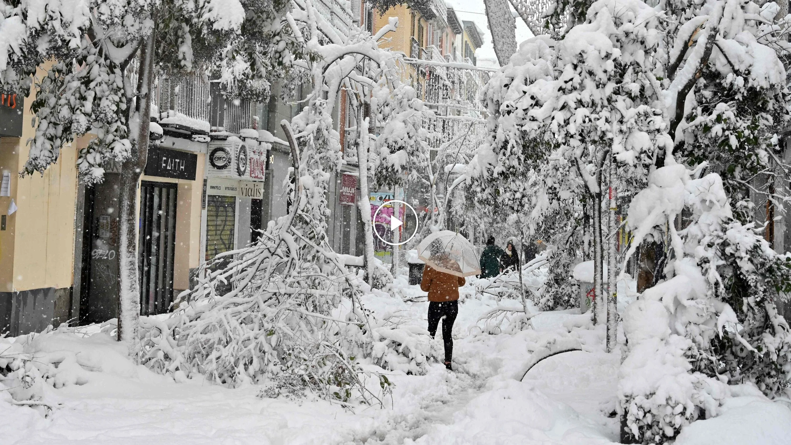
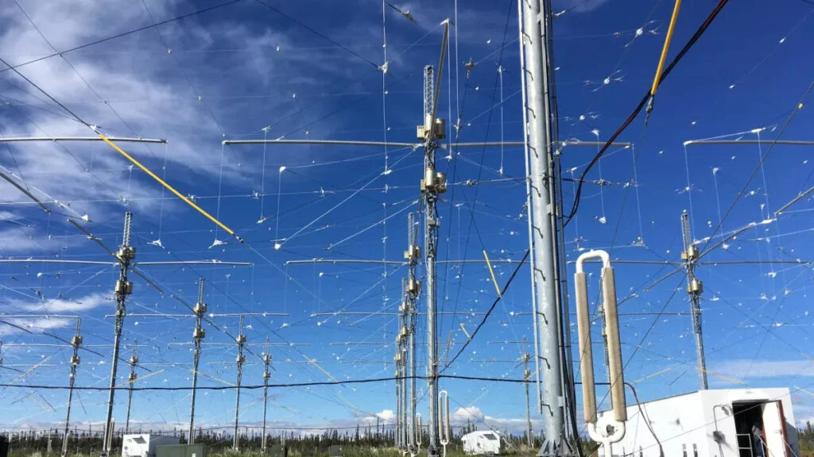
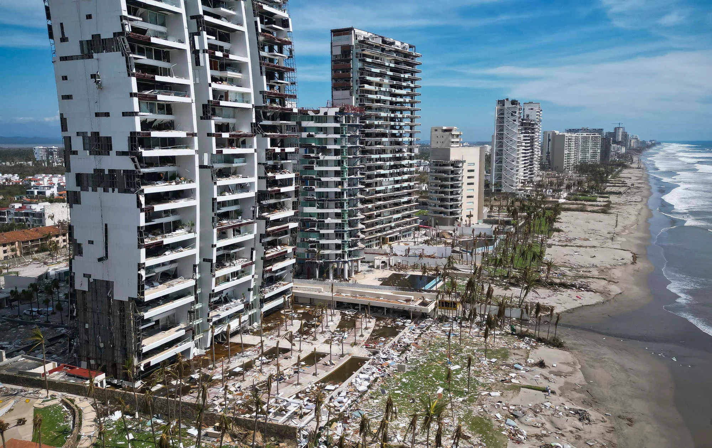
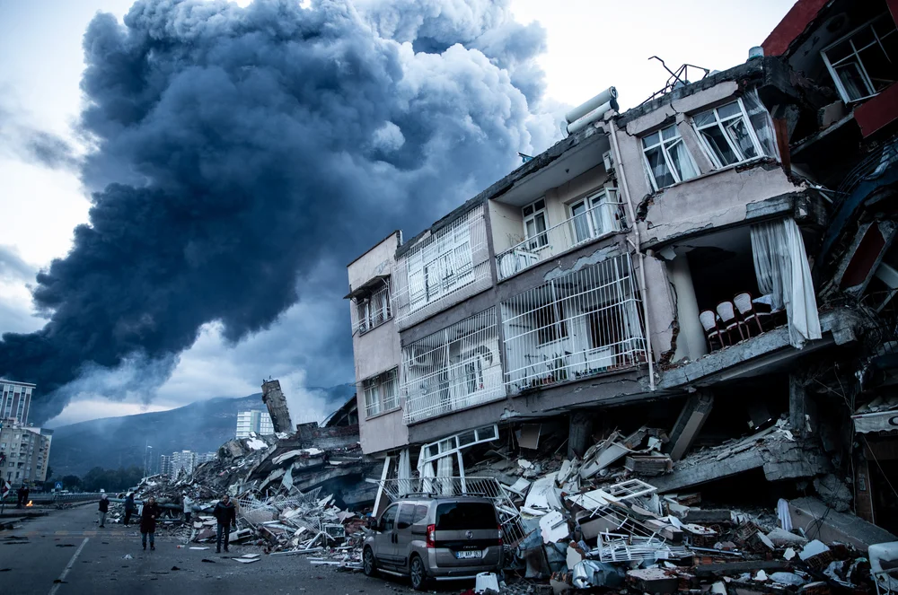
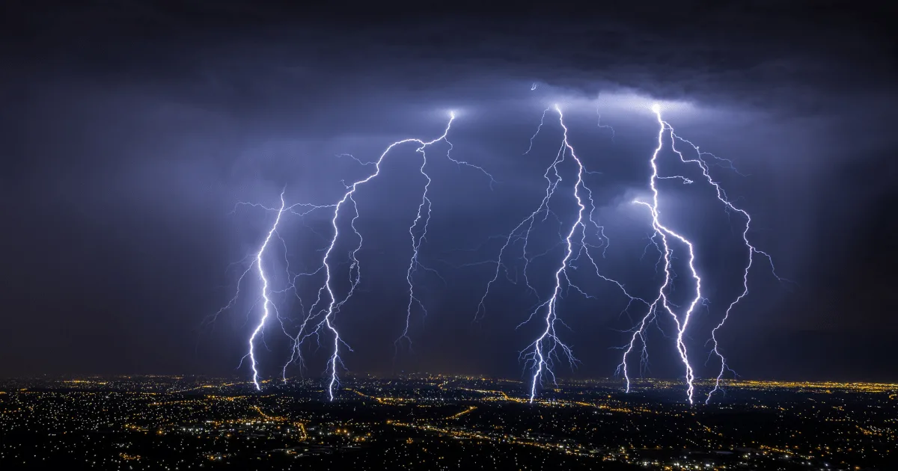

---
title: 'HAARP và thời tiết cực đoan'
excerpt: 'Phần 15 của Te lo ocultaron: dự án HAARP, tầng điện ly, thời tiết cực đoan, giả thuyết vũ khí địa vật lý và câu hỏi về khí hậu như một công cụ kiểm soát.'
category: 'stories'
tags: ['haarp', 'weather-control', 'ionosphere', 'climate', 'geophysical-weapon']
author: 'Ngoc Khanh'
series: 'te-lo-ocultaron'
chapter: 15
publishDate: 2026-05-17T17:00:00.000Z
image: '~/assets/images/haarp-va-thoi-tiet-cuc-doan.webp'
---

> Nếu thời tiết không còn chỉ là thời tiết, mà trở thành một trường tác động công nghệ, kinh tế và chính trị, thì mỗi cơn bão lớn có thể không chỉ là biến cố tự nhiên, mà còn là một câu hỏi về quyền lực.

### Khí hậu bất thường

Trong nhiều năm gần đây, các mẫu lưu thông khí quyển dường như ngày càng khó đoán.

Nhiều khu vực trên thế giới chứng kiến những mùa đông khắc nghiệt, các đợt tuyết rơi bất thường, bão lớn, lốc xoáy, lũ lụt, hỏa hoạn, động đất, sóng thần và những đợt nắng nóng cực đoan.

Điều đáng chú ý không chỉ là các hiện tượng ấy xảy ra.

Điều đáng chú ý là chúng xuất hiện tại những nơi trước đây hiếm khi trải qua cường độ như vậy, hoặc tăng cấp với tốc độ khiến công chúng khó hiểu.

Theo cách giải thích chính thống, đây là hệ quả của biến đổi khí hậu, ô nhiễm, phát thải công nghiệp và sự mất cân bằng do con người gây ra cho hệ sinh thái Trái Đất.

Cách giải thích đó có cơ sở khoa học riêng.

Nhưng trong các giả thuyết ngoài dòng chính, vấn đề không dừng lại ở biến đổi khí hậu tự nhiên hay nhân tạo theo nghĩa môi trường.

Câu hỏi được đặt ra là: liệu một phần các hiện tượng khí hậu cực đoan có thể bị khuếch đại, định hướng hoặc khai thác bằng công nghệ?

Và nếu khí hậu trở thành một cuộc khủng hoảng thường trực, ai sẽ có quyền ban hành luật mới, thu thuế mới, kiểm soát năng lượng, kiểm soát di chuyển và áp đặt các chương trình toàn cầu dưới danh nghĩa cứu hành tinh?

Những phát ngôn của giới tinh hoa về biến đổi khí hậu thường nhấn mạnh rằng đây là vấn đề lớn hơn cả đại dịch, đòi hỏi nguồn lực khổng lồ và các thay đổi sâu trong kinh tế toàn cầu.

Với người ủng hộ, đó là lời cảnh báo cần thiết.

Với người hoài nghi, đó có thể là dấu hiệu cho thấy khí hậu đang trở thành một công cụ quản trị xã hội.

### HAARP là gì?

Để hiểu vì sao chủ đề này gây tranh cãi, cần nhắc đến HAARP.

HAARP là viết tắt của _High Frequency Active Auroral Research Program_, tức Chương trình Nghiên cứu Cực quang Hoạt động Cao tần.

Đây là một dự án nghiên cứu liên quan đến tầng điện ly, từng có sự tham gia của Lực lượng Không quân Hoa Kỳ, Hải quân Hoa Kỳ và Đại học Alaska.

Cơ sở chính của HAARP nằm gần Gakona, Alaska, với một hệ thống ăng-ten lớn có khả năng phát sóng vô tuyến cao tần lên tầng điện ly.

Tầng điện ly là lớp khí quyển nằm ở độ cao lớn, có vai trò quan trọng đối với truyền thông vô tuyến, định vị, tín hiệu radar và nhiều hiện tượng điện từ tự nhiên.

Theo mục tiêu chính thức, HAARP được dùng để nghiên cứu các quy trình vật lý của tầng điện ly, tác động của chúng lên hệ thống liên lạc và các ứng dụng khoa học liên quan.

Tuy nhiên, vì bản chất của dự án liên quan đến năng lượng cao tần, tầng khí quyển trên cao và các cơ quan quân sự, HAARP từ lâu đã trở thành tâm điểm của nhiều giả thuyết.

Những người theo hướng nghiên cứu ngoài dòng chính cho rằng việc tác động vào tầng điện ly có thể không chỉ phục vụ truyền thông.

Nó có thể liên quan đến điều chỉnh khí quyển, gây nhiễu hệ thống điện, làm thay đổi các dòng khí, hoặc tạo ra những hiệu ứng địa vật lý mà công chúng không được biết đầy đủ.

Lịch sử cho thấy mọi công nghệ có tính lưỡng dụng đều có hai mặt.

Một mặt là nghiên cứu khoa học.

Mặt còn lại là quân sự hóa.

Vấn đề với HAARP là người dân bình thường gần như không có khả năng tự kiểm chứng quy mô thật sự của các thí nghiệm, các thông số vận hành và những ứng dụng ngoài phần được công bố.

### Thao túng thời tiết?

Một trong những giả thuyết phổ biến nhất xoay quanh HAARP là khả năng thao túng thời tiết.

Theo hướng diễn giải này, nếu tầng điện ly có thể bị kích thích bằng sóng cao tần, các dòng điện và dòng khí quyển ở tầng cao có thể bị ảnh hưởng.

Từ đó, một số người tin rằng công nghệ như HAARP có thể góp phần điều hướng dòng gió, thay đổi áp suất khí quyển hoặc khuếch đại những hệ thống bão đã tồn tại.

Bão Otis tại Acapulco năm 2023 thường được nhắc đến trong các cuộc tranh luận kiểu này, vì cơn bão tăng cấp với tốc độ rất nhanh trong thời gian ngắn.

Theo khí tượng học chính thống, hiện tượng tăng cấp nhanh có thể xảy ra khi các điều kiện đại dương và khí quyển cùng hội tụ: nước biển rất ấm, gió đứt thấp, độ ẩm cao và cấu trúc bão thuận lợi.

Nhưng với người hoài nghi, tốc độ thay đổi quá bất thường khiến họ đặt câu hỏi liệu có yếu tố tác động bổ sung nào nằm ngoài dữ liệu công khai.

Điểm quan trọng là không thể dùng một cơn bão để chứng minh ngay lập tức sự tồn tại của vũ khí thời tiết.

Nhưng các sự kiện như vậy làm sống lại câu hỏi lớn hơn: nếu một công nghệ có thể tác động vào tầng khí quyển, liệu nó có thể được dùng để tăng cường những biến động tự nhiên hay không?

Và nếu có, ai đang giám sát nó?

Ai có quyền quyết định khi nào một thí nghiệm khí quyển là nghiên cứu, và khi nào nó trở thành vũ khí?

### Vũ khí địa vật lý

Một nhánh khác của giả thuyết HAARP cho rằng công nghệ tác động tầng điện ly có thể liên quan đến vũ khí địa vật lý.

Theo quan điểm này, việc truyền năng lượng cao tần vào khí quyển có thể không chỉ tạo hiệu ứng trên bầu trời, mà còn gây nhiễu các hệ thống điện từ sâu hơn, từ đó góp phần kích hoạt hoặc khuếch đại các biến động địa chất.

Trận động đất Thổ Nhĩ Kỳ - Syria năm 2023 thường được những người theo giả thuyết này nhắc đến như một ví dụ gây ám ảnh, vì mức độ tàn phá và thời điểm xảy ra của nó.

Tuy nhiên, cần nói rõ: khoa học địa chất chính thống giải thích động đất bằng chuyển động mảng kiến tạo, đứt gãy địa chất và sự tích tụ năng lượng trong vỏ Trái Đất.

Không có bằng chứng công khai đủ mạnh để khẳng định HAARP gây ra các trận động đất lớn.

Điều khiến giả thuyết này tồn tại không phải vì nó đã được chứng minh, mà vì lịch sử quân sự từng nhiều lần nghiên cứu các hình thức chiến tranh môi trường, chiến tranh điện từ và tác động gián tiếp lên hạ tầng của đối phương.

Nếu một quốc gia có thể phá hệ thống điện, gây nhiễu liên lạc, thao túng vệ tinh hoặc làm tê liệt mạng lưới dữ liệu, thì ý tưởng dùng môi trường như một chiến trường không còn quá xa lạ.

Vấn đề nằm ở chỗ: công nghệ càng phức tạp, trách nhiệm giải trình càng khó.

Một vụ nổ có thể được nhìn thấy.

Một dòng lệnh tấn công mạng có thể được truy vết.

Nhưng một thay đổi tinh vi trong khí quyển, dòng điện từ hoặc hệ thống khí hậu có thể bị quy về "thiên nhiên" trước khi công chúng kịp đặt câu hỏi.

### Khí hậu như công cụ kiểm soát

Trong các diễn giải ngoài dòng chính, câu chuyện HAARP không chỉ nói về ăng-ten, tầng điện ly hay bão lũ.

Nó nói về quyền lực.

Nếu khí hậu được trình bày như một mối đe dọa hiện sinh, các chính phủ và tổ chức toàn cầu có thể dễ dàng yêu cầu người dân chấp nhận các biện pháp kiểm soát mới.

Thuế carbon.

Giới hạn di chuyển.

Kiểm soát năng lượng.

Kiểm soát sản xuất nông nghiệp.

Tái cấu trúc chuỗi cung ứng.

Giám sát hành vi tiêu dùng.

Tất cả có thể được đóng gói trong một thông điệp nghe rất đạo đức: cứu lấy hành tinh.

Một số chính trị gia hoài nghi từng cho rằng câu chuyện khí hậu có thể bị sử dụng như cái cớ để nhà nước thu thêm thuế và mở rộng kiểm soát chính trị.

Ngược lại, nhiều nhà khoa học khí hậu khẳng định rằng biến đổi khí hậu là vấn đề thật, nghiêm trọng và cần hành động.

Hai điều này không nhất thiết loại trừ nhau.

Một cuộc khủng hoảng có thể có thật, nhưng vẫn bị các cấu trúc quyền lực lợi dụng.

Một hiện tượng khí hậu có thể tự nhiên, nhưng vẫn có thể được khuếch đại bởi truyền thông để tạo tâm lý sợ hãi.

Một công nghệ có thể bắt đầu như nghiên cứu khoa học, nhưng vẫn có thể được quân sự hóa khi rơi vào tay các thiết chế không minh bạch.

Trong chuỗi _Te lo ocultaron_, HAARP đại diện cho một câu hỏi lớn hơn: liệu bầu trời phía trên chúng ta có còn là không gian tự nhiên thuần túy hay đã trở thành một giao diện công nghệ?

Nếu câu trả lời là có, thì nhân loại không chỉ cần hỏi khí hậu đang thay đổi như thế nào.

Chúng ta cần hỏi ai đang có quyền chạm vào nó.
