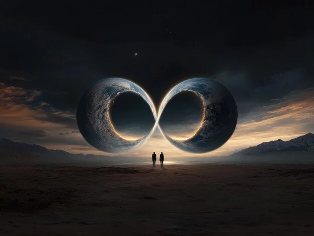
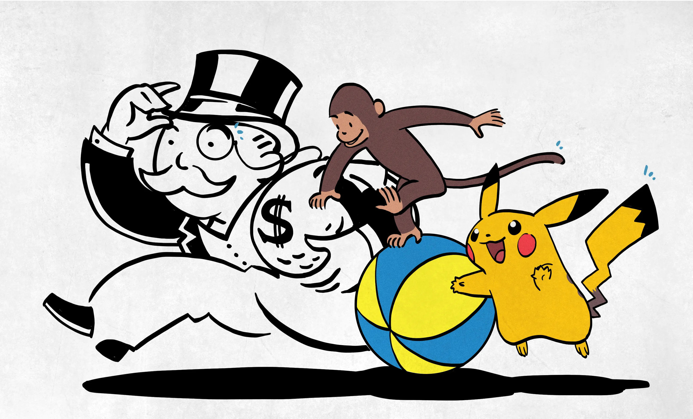

---
title: 'Lỗi sai trong Ma trận'
excerpt: 'Phần 4 của Te lo ocultaron: Glitches, NPC, déjà vu, synchronicity và Hiệu ứng Mandela như những dấu hiệu khiến ta nghi ngờ độ ổn định của thực tại.'
category: 'stories'
tags: ['matrix', 'glitch', 'mandela-effect', 'npc', 'reality']
author: 'Gia Han'
series: 'te-lo-ocultaron'
chapter: 4
publishDate: 2026-05-07T17:00:00.000Z
image: '~/assets/images/loi-sai-trong-ma-tran.webp'
---

> Nếu thực tại vận hành như một hệ mô phỏng, thì những khoảnh khắc bất thường có thể được nhìn như lỗi hiển thị, lỗi đồng bộ hoặc dấu vết của một tầng vận hành sâu hơn mà giác quan thường ngày không nhận ra.

### Những lỗi sai trong Ma trận (Glitches)

Giống như bất kỳ chương trình mô phỏng thực tế, trò chơi điện tử hay chương trình máy tính nào, Ma trận cũng tồn tại những lỗi được gọi là Glitch.

Từ rất lâu, đã có vô số sự kiện không thể giải thích được cùng những nhân chứng ghi lại được các hiện tượng bất thường bằng video, gợi ý rằng không phải mọi thứ đều vận hành trơn tru như chúng ta tưởng.

Mặc dù đối với nhiều người, đây chỉ là khoa học viễn tưởng, nhưng một số khác đã đối chiếu những khái niệm này vào đời thực để bày tỏ sự nghi ngờ về bản chất của thực tại.

Một số hiện tượng tiêu biểu liên quan đến các lỗi này bao gồm:

- **Déjà vu (Ký ức mơ hồ):** Cảm giác "đã từng nhìn thấy" được cho là một lỗi lặp lại trải nghiệm một cách bất thường trong mô phỏng. Đó là khi bạn cảm thấy một khoảnh khắc hiện tại đã được trải nghiệm trước đó, dù thực tế đây là lần đầu tiên nó xảy ra.
- **Sự đồng bộ (Synchronicity):** Những sự kiện có vẻ đầy ý nghĩa xảy ra cùng lúc dù không có mối liên hệ nhân quả nào. Nhiều người coi đây là bằng chứng của một thực tại được lập trình.
- **Lỗi hình ảnh và âm thanh:** Một số người khẳng định đã thấy thực tại hành xử kỳ lạ trong khoảnh khắc ngắn, chẳng hạn như hình phản chiếu trong gương, kính hoặc vũng nước không khớp với vật thể thực bên ngoài.
- **Trải nghiệm ngoài cơ thể:** Việc xuất hồn hoặc giấc mơ sáng suốt, lucid dream, được sử dụng làm ví dụ về việc con người có khả năng "nhìn ra sau bức màn" của chương trình mô phỏng.

### NPC (Nhân vật không thể điều khiển)

Trong văn hóa trò chơi điện tử, NPC, viết tắt của Non-Playable Character, là những nhân vật nền dùng để lấp đầy không gian.

Họ thường đi lại trên phố, lặp đi lặp lại những hành động vô nghĩa trong một vòng lặp. Với sự phổ biến của mạng xã hội và điện thoại thông minh, ngày càng nhiều người bắt gặp các sự kiện này ngoài đời thực: những nhóm người giống hệt nhau xuất hiện cùng lúc hoặc thực hiện cùng một động tác máy móc.

Có giả thuyết cho rằng NPC là những người không có linh hồn, chỉ đóng vai trò "lấp chỗ trống" trong thực tại này. Họ có quỹ đạo hoạt động rất hạn chế, chỉ có thể nói vài câu lập trình sẵn và không có quan điểm cá nhân.

Họ xuất hiện để chỉ đường, báo giờ, ngồi trên ghế công viên hoặc dắt thú cưng đi dạo. Nếu không chủ động quan sát, bạn sẽ thấy họ rất bình thường, nhưng nếu chú ý kỹ, những hành động của họ thường rất kỳ quặc và vô nghĩa.

### Hiệu ứng Mandela

Đây là thuật ngữ mô tả hiện tượng một nhóm lớn người nhớ về các sự kiện lịch sử hoặc chi tiết thực tại khác hẳn với những gì được ghi chép trong hồ sơ chính thức.

Cái tên này bắt nguồn từ việc rất nhiều người tin rằng Nelson Mandela đã chết trong tù vào những năm 1980, trong khi thực tế ông được thả tự do vào năm 1990 và trở thành Tổng thống Nam Phi.

Điều gây kinh ngạc là tại sao ký ức tập thể lại chỉ chia thành hai nhóm, đúng hoặc sai theo bản gốc, mà không có lựa chọn thứ ba?

Một số ví dụ điển hình bao gồm:

- **Pikachu:** Nhiều người nhớ đuôi của nó có vệt đen ở đầu, nhưng thực tế toàn bộ đuôi của nó là màu vàng.
- **Ông tỷ phú Monopoly:** Nhiều người đinh ninh ông ta đeo một chiếc kính một mắt, monocle, nhưng thực tế nhân vật này chưa từng đeo kính.
- **Mickey Mouse:** Người hâm mộ thường nhớ chú chuột này mặc quần có dây đeo vai, nhưng thực tế thì không.
- **Mona Lisa:** Nhiều người nhớ bà có thái độ nghiêm nghị, nhưng trong thực tại này, bà lại đang mỉm cười nhẹ.

Lý giải cho hiện tượng này, một số giả thuyết dựa trên vật lý lượng tử cho rằng có thể tồn tại các vũ trụ song song hoặc các dòng thời gian thay thế đang tương tác với dòng thời gian của chúng ta, làm ảnh hưởng đến cách chúng ta ghi nhớ các sự kiện.

Nếu nhìn từ góc độ Ma trận, Hiệu ứng Mandela không chỉ là lỗi trí nhớ. Nó trở thành một câu hỏi sâu hơn: liệu ký ức của con người có đang va chạm với những phiên bản thực tại khác nhau?
