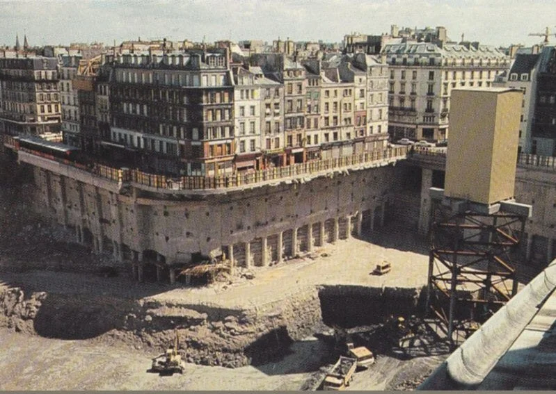
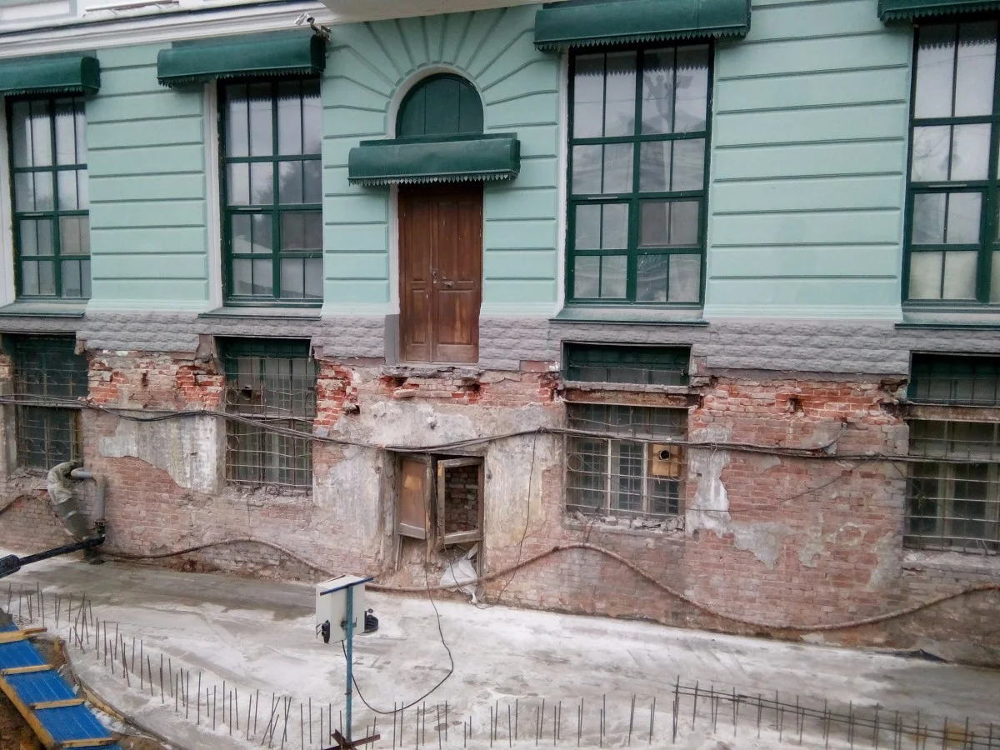

---
title: 'Mud Flood và năng lượng tự do'
excerpt: 'Phần 11 của Te lo ocultaron: bí ẩn trận lụt bùn thế kỷ 19, những công trình bị chôn vùi, cuộc reset Tartaria và khả năng tri thức về năng lượng Ether đã bị xóa khỏi nhân loại.'
category: 'stories'
tags: ['mud-flood', 'tartaria', 'free-energy', 'ether', 'old-world']
author: 'Quynh Nhu'
series: 'te-lo-ocultaron'
chapter: 11
publishDate: 2026-05-13T17:00:00.000Z
image: '~/assets/images/mud-flood-va-bi-an-nang-luong-tu-do.webp'
---

> Nếu những tầng hầm cổ thực chất không phải tầng hầm, mà là tầng một của một thế giới đã bị chôn vùi, thì câu chuyện về thế kỷ 19 có thể không đơn giản là đô thị hóa, mà là một cuộc reset có chủ đích.

### Một cuộc tái thiết có tính toán

Bạn có thực sự tin rằng những trận lụt bùn xảy ra từ năm 1830 đến 1870 chỉ là những sự kiện ngẫu nhiên của tự nhiên?

Theo giả thuyết về _Mud Flood_, đó có thể không phải là một tai biến địa phương, mà là một cuộc tái thiết hoàn toàn trên quy mô toàn cầu.

Mục tiêu của cuộc tái thiết này là che giấu vĩnh viễn mọi loại hình xây dựng, kiến trúc, thiết kế và quan trọng nhất là tri thức về năng lượng miễn phí.

Những kiến thức về tâm linh, các trạng thái ý thức cao hơn và công nghệ tiên tiến của Đại Tartaria được cho là đã bị chôn vùi để ngăn chúng trở thành di sản chung của nhân loại.

Ngày nay, năng lượng Ether và kiểu kiến trúc đặc trưng của họ gần như không thể thực hiện hay sao chép lại được.

Không phải vì nhân loại chưa đủ thông minh, mà có thể vì các nguyên lý nền tảng đã bị cắt khỏi dòng truyền thừa.

Nếu phần trước nói về Tartaria như một nền văn minh bị xóa khỏi bản đồ, thì phần này đi sâu vào cách sự xóa bỏ ấy có thể đã diễn ra: không chỉ bằng sách vở, mà bằng đất, bùn và các lớp trầm tích phủ lên chính kiến trúc của Thế giới Cũ.

### Những thành phố dưới lòng đất

Tại các thành phố như Ilyinka, Astrakhan ở Nga, người ta phát hiện ra cả một thành phố khác nằm sâu dưới mặt đất, vốn đã bị che giấu khỏi mắt chúng ta.

Trên khắp thế giới, vô số tòa nhà cổ hàng trăm năm tuổi đang bị bao bọc bởi các lớp bùn dày từ một đến vài tầng.

Trong nhiều trường hợp, bùn đã nhấn chìm hoàn toàn các cấu trúc cũ.

Nhiều năm sau, người ta chỉ đơn giản là xây dựng chồng lên những phần còn nhô ra, coi đó như những nền móng mới.

Điều này tạo ra một hiện tượng kỳ lạ: rất nhiều tòa nhà cổ có cửa sổ nằm sát mặt đất, tầng hầm có vẻ quá đẹp để chỉ làm kho chứa, và những tầng thấp bị chôn sâu nhưng vẫn có cấu trúc trang trí như không gian sinh hoạt chính.

Nếu giải thích theo lịch sử chính thống, chúng thường được gọi là tầng hầm, hầm kỹ thuật hoặc kết quả của quá trình nâng đường.

Nhưng nếu nhìn từ giả thuyết Mud Flood, chúng có thể là tầng trệt cũ của một thế giới trước reset.

Một thế giới mà sau đó bị phủ lên bằng bùn, đất, quy hoạch đô thị mới và một câu chuyện lịch sử đã được viết lại.

### Phản bác lịch sử chính thống

Tại sao những người bảo vệ lịch sử chính thống luôn từ chối xem xét các bằng chứng rõ ràng này?

Họ thường giải thích rằng đó là hiện tượng "lún công trình".

Tuy nhiên, về mặt kỹ thuật, hiện tượng lún đất thường chỉ xảy ra trong 3 đến 5 năm đầu sau khi xây dựng và thường chỉ lún vài centimet.

Trong các trường hợp cực đoan, mức lún cũng khó vượt quá 1 mét.

Vậy làm thế nào để giải thích cho những tòa nhà có độ lún lên tới nhiều mét, thậm chí được cho là có nơi lên tới 18 mét?

Câu trả lời thực tế hơn trong giả thuyết Mud Flood là: đó không phải là lún, mà là kết quả của một dòng chảy trầm tích khổng lồ đã tràn qua các châu lục.

Bạn có thể dễ dàng bắt gặp những tòa nhà mà cửa sổ và cửa ra vào vốn thuộc tầng trên giờ đây lại nằm ngang tầm mắt, hoặc bị chôn vùi hoàn toàn dưới lòng đất.

Hiện tượng này xuất hiện phổ biến ở châu Âu, châu Mỹ và châu Á, thách thức nhiều logic về xây dựng hiện đại.

Nếu mọi chuyện chỉ là lún đất, tại sao cùng một kiểu dấu vết lại lặp lại ở quá nhiều nơi?

Nếu chỉ là nâng đường đô thị, tại sao có những công trình bị vùi sâu theo cách giống như một lớp trầm tích đã tràn qua toàn bộ khu vực?

Và nếu đó là một biến cố toàn cầu, ai đã sống sót, ai đã viết lại lịch sử, và ai được hưởng lợi từ việc nhân loại quên mất công nghệ của Thế giới Cũ?

Mud Flood vì vậy không chỉ là câu chuyện về bùn.

Nó là câu chuyện về ký ức bị chôn vùi: ký ức về Tartaria, về kiến trúc Ether, về năng lượng tự do và về khả năng rằng con người từng sống trong một thế giới khác, trước khi nó bị phủ đất lên và đổi tên thành quá khứ.
