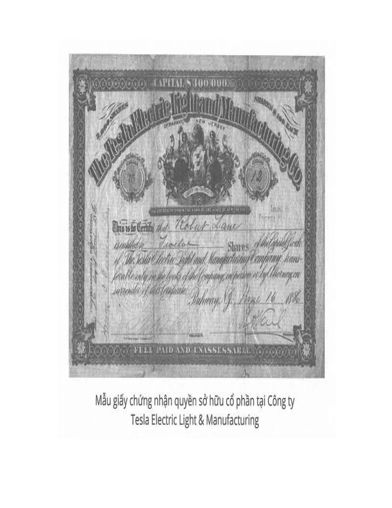

---
title: 'Lối xoắn Tesla và máy biến thế'
excerpt: 'Đột phá kỹ thuật, động cơ không đồng bộ và bước tiến vào điện xoay chiều.'
category: 'stories'
author: 'Ngoc Khanh'
series: 'cuoc-doi-ky-la-cua-nikola-tesla'
chapter: 4
publishDate: 2026-06-03T17:00:00.000Z
image: '~/assets/images/nikola-tesla-chuong-4-loi-xoan-tesla-va-may-bien-the.webp'
---

### Chương 4: Lõi xoắn Tesla và máy biến thế

Cũng phải một thời gian dài tôi đắm mình hoàn toàn trong niềm vui mãnh liệt khi hình dung các máy móc và tạo ra các mẫu mới. Đó là trạng thái tinh thần sảng khoái tuyệt đối mà tôi từng được trải nghiệm trong cuộc đời mình. Ý tưởng đến ào ạt theo dòng liên tục và khó khăn duy nhất với tôi là giữ những ý tưởng ấy lại thật nhanh. Các bộ phận máy mà tôi hình dung rất thực và hữu hình trong từng chi tiết, ngay cả với những dấu hiệu hao mòn nhỏ nhất. Tôi rất vui khi tưởng tượng các động cơ chạy không ngừng. Cảnh tượng đó thật tuyệt vời trước con mắt của tư duy. Khi khuynh hướng tự nhiên phát triển thành niềm đam mê, người ta tiến tới mục tiêu của mình bằng đôi hia bảy dặm. Chưa đầy 2 tháng, tôi đã phát triển hầu như tất cả các loại động cơ, các chỉnh sửa hệ thống mà hiện nay được đặt theo tên tôi, và được gọi bằng nhiều tên khác trên toàn thế giới. Có lẽ đây là lúc nhu cầu tồn tại ra lệnh cấm vận tâm trí tiếp tục đốt năng lượng bằng hoạt động tư duy căng thẳng này.  
Tôi đến Budapest làm là vì một bản báo cáo chưa hoàn chỉnh về ngành điện thoại._. Số phận thật trớ trêu, tôi đã phải chấp nhận làm nhân viên vẽ kỹ thuật trong văn phòng Điện tín Trung ương của chính phủ Hungary với một mức lương thấp đến nỗi tôi tự cho phép mình không cần phải tiết lộ cho các bạn biết. May mắn thay, tôi đã sớm giành được sự quan tâm của ông chánh thanh tra, rồi sau đó được cho làm công việc tính toán, thiết kế và dự toán liên quan đến lắp ráp mới. Đến khi xuất hiện điện thoại thì tôi phụ trách phần việc này luôn. Kiến thức và kinh nghiệm thực tế tôi có được trong quá trình làm công việc này rất có giá trị; việc làm đó đã cho tôi nhiều cơ hội để luyện tập những ý tưởng sáng tạo của mình. Tôi đã thực hiện một số cải tiến cho hệ thống thiết bị trạm trung ương và hoàn thiện một bộ lặp và khuếch đại. Dù tôi không được cấp bằng sáng chế hay mô tả công khai phát minh này, nhưng đến nay người ta vẫn ghi nhận công tôi. Thấy tôi làm được việc, ông Puskas sau khi giải thể công ty ở Budapest đã mời tôi về làm ở Paris. Tôi vui vẻ chấp nhận.  
Tôi không bao giờ quên được ấn tượng sâu sắc mà thành phố ma thuật đó đã khắc ghi trong tâm trí tôi. Nhiều ngày sau khi đến Paris, tôi lang thang qua những con phố, hoàn toàn ngơ ngác trước những khung cảnh mới lạ. Nơi hấp dẫn thì rất nhiều và hấp dẫn đến mức không thể cưỡng lại được, nhưng lạy Chúa, lương cầm chưa nóng tay đã hết. Khi ông Puskas hỏi tôi tình hình thế nào, tôi đã mô tả chính xác rằng: “29 ngày cuối cùng của tháng là khó khăn nhất.”  
Tôi sống khá vất vả theo phong cách mà bây giờ được gọi là “mốt Roosevelt.”_ Mỗi buổi sáng, bất kể thời tiết thế nào, tôi đi từ đại lộ St. Marcel, nơi tôi ở, đến một nhà tắm bên sông Seine; lao xuống nước, bơi 27 vòng và sau đó đi bộ 1 giờ đến Ivry, chỗ nhà máy của công ty. Ở đó, tôi thường ăn sáng kiểu tiều phu lúc 7:30 rồi háo hức chờ tới giờ ăn trưa. Trong thời gian đó, tôi ngồi tách hạt dẻ cho sếp, ông Charles W. Batchelor, một người bạn thân thiết và là trợ lý của Edison. Ở đây tôi được thả cho tiếp xúc với vài người Mỹ, họ khá mê tôi về cái khoản chơi bị da! Tôi đã giải thích phát minh của mình cho những người này và một người trong đó, ông D. Cunningham, Quản đốc Cơ khí, có nhã ý thành lập một công ty cổ phần. Đề xuất này đối với tôi nghe cực kỳ hài hước. Tôi không có một chút khái niệm mờ nhạt nào về những gì ông ấy nói, chỉ hiểu mỗi một điều rằng đó là cách làm việc kiểu Mỹ. Tuy nhiên, chẳng có gì diễn ra trong mấy tháng tiếp đó cả, tôi thì phải đi từ nơi này đến nơi khác ở Pháp và Đức để trị bệnh cho các nhà máy điện.  
Khi về lại Paris, tôi gửi đến một người trong ban quản trị công ty, ông Rau, bản kế hoạch cải tiến các dynamo và đã được trao cơ hội. Tôi thành công hoàn toàn. Các sếp vui mừng lắm. Họ cho tôi đặc quyền phát triển các bộ điều chỉnh tự động, thiết bị này rất được ưa chuộng. Ngay sau đó, đã có chút rắc rối với nhà máy đèn nhà ga đường sắt mới ở Strasbourg, Alsace. Dây dẫn bị lỗi và vào dịp lễ khai mạc, một mảng tường đã bị nổ văng ra ngoài do đoản mạch. Xui là lúc đó có sự hiện diện của Hoàng đế William Đệ nhất. Chính phủ Đức từ chối tiếp nhận nhà máy và công ty Pháp phải đối mặt với một tổn thất nghiêm trọng. Nhờ có kiến thức về tiếng Đức và kinh nghiệm làm việc, tôi được giao phó nhiệm vụ khó khăn là phải làm sao để các đối tác hiểu được vấn đề. Thế là đầu năm 1883, tôi đến Strasbourg để thực thi nhiệm vụ.  
Vài sự kiện tại thành phố Strasbourg đã để lại trong ký ức tôi một dấu ấn không thể xóa nhòa. Do một sự trùng hợp kỳ lạ, nhiều người mà sau này thành đạt tiếng tăm đều sống ở đó khoảng thời gian ấy. Về sau tôi thường nói: “Có vi khuẩn gây ra bệnh vĩ đại trong thị trấn cũ đó. Người ta bị nhiễm bệnh gần hết, mỗi tôi thì thoát!”  
Công việc, thư từ, hội nghị với các quan chức khiến tôi bận rộn suốt ngày đêm, nhưng ngay khi có thời gian là tôi lao vào xây dựng một động cơ đơn giản trong xưởng cơ khí đối diện nhà ga xe lửa, vì tôi có mang từ Paris về một số tài liệu cho mục đích này. Tuy vậy, cũng phải đến hè năm đó tôi mới làm xong. Cuối cùng thì tôi cũng được thỏa mãn khi nhìn dòng điện xoay chiều tạo ra bởi các vòng xoay mà không cần bộ phận trượt hay bộ chuyển mạch như tôi đã hình dung một năm trước.  
Chiếc máy là một niềm vui lớn, nhưng những gì xảy ra sau đó còn vui hơn nhiều. Trong số những bạn mới của tôi có cựu thị trưởng thành phố, ông Sauzin. Ông ít nhiều cũng biết đến các phát minh của tôi. Tôi thì cố gắng có được sự ủng hộ của ông. Ông rất chân thành với tôi và hay giới thiệu dự án của tôi với nhiều người giàu có, nhưng thật xấu hổ, chẳng thấy ai hồi đáp cả. Ông muốn giúp đỡ tôi bằng mọi cách có thể. Tôi chợt nhớ lại một hình thức “giúp đỡ” rất đặc biệt của Sauzin sau này vào ngày 1/7/1917, dù không liên quan đến tiền bạc, nhưng cũng rất đáng quý. Chả là năm 1870, khi người Đức xâm lược đất nước này, ông Sauzin đã kịp chôn giấu một lô lớn rượu St. Estephe 1801. Ông kết luận rằng ông biết không có ai xứng đáng thưởng thức loại rượu quý đó hơn tôi. Có thể nói, đây là một trong những sự kiện khó quên nhất vào giai đoạn này.  
Bạn tôi giục tôi về Paris càng sớm càng tốt để tìm sự ủng hộ đó. Tôi rất muốn, nhưng công việc và những cuộc đàm phán lại kéo dài do đủ các loại trở ngại nho nhỏ. Có lúc, tình hình dường như vô vọng. Để minh họa cho phong cách làm việc “toàn diện” và “hiệu quả” kiểu Đức làm tôi chết lên chết xuống, tôi xin đề cập ở đây một trải nghiệm khá buồn cười.  
Lần đó, chúng tôi cần lắp một bóng đèn sợi đốt 16 cp ở hành lang. Khi chọn được vị trí thích hợp, tôi cho anh monteur chạy dây. Hì hụi được một thời gian, anh kết luận rằng phải tham vấn kỹ sư. Viên kỹ sư có phản đối một số chỗ nhưng cuối cùng đồng ý rằng đèn nên đặt 2 inch cách chỗ tôi đã chỉ định. Công việc tiếp tục được tiến hành. Một hồi sau, viên kỹ sư hơi lo và bảo tôi rằng nên báo cho thanh tra Averdeck biết. Nhân vật quan trọng đó được gọi đến, ông kiểm tra, thảo luận và quyết định rằng đèn nên được chuyển trở lại 2 inch, chỗ mà tôi đã đánh dấu trước đó! Tuy nhiên, không lâu sau Averdeck cũng thấy lạnh mình và khuyên tôi rằng hay là thôi để thông báo thanh tra cấp trên Hieronimus về vấn đề đó, rằng tôi nên chờ quyết định của ông Hieronimus ấy cái đã. Mất nhiều ngày viên thanh tra cấp trên mới giải quyết xong những nhiệm vụ cấp bách khác, cuối cùng ông đến và tranh luận suốt 2 giờ liền. Cuối cùng, ông quyết định chuyển đèn xa thêm 2 inch nữa. Tôi cứ tưởng rằng đây là quyết định cuối cùng, nhưng không phải. Viên thanh tra cấp trên trở lại và nói với tôi: “Regierungsrath Funke là một nhân vật đặc biệt quan trọng. Tôi không dám ra lệnh cho đặt đèn này nếu không có sự chấp thuận rõ ràng của ông ấy.” Theo đó, họ sắp xếp chuẩn bị cho một chuyến ghé thăm của con người vĩ đại này. Chúng tôi bắt đầu quét dọn, kỳ cọ các thứ từ sáng sớm, và khi Funke đến cùng đoàn tùy tùng của mình, ông đã được tiếp đón vô cùng trịnh trọng. Sau 2 giờ nghị sự, ông đột nhiên kêu lên: “Chết, tôi có việc phải đi rồi!” Tiếp theo, ông chỉ đại một nơi trên trần nhà và ra lệnh cho tôi đặt bóng đèn ở đó. Đó chính là vị trí mà từ đầu tôi đã chọn! Ngày tiếp ngày với những đổi thay, nhưng tôi đã quyết tâm để hoàn thành nhiệm vụ bằng bất cứ giá nào, và cuối cùng thì những nỗ lực của tôi đã được “đền đáp” thật là xứng đáng!  
Mùa xuân năm 1884, tất cả sai lệch đã được điều chỉnh, nhà máy chính thức được nghiệm thu và tôi trở lại Paris với niềm hân hoan dễ chịu. Một trong mấy sếp đã hứa với tôi sẽ có một khoản thưởng ngon lành nếu tôi thành công. Ông còn hứa sẽ quan tâm đúng mức những cải tiến mà tôi đã thực hiện cho các máy phát điện của công ty, và tôi hy vọng sẽ được nắm trong tay một khoản tiền đáng kể. Có 3 nhà quản lý, tôi gọi họ là A, B, và C cho tiện. Khi tôi hỏi A, ông bảo tôi rằng B là người quyết định. Quý ông B này nghĩ rằng chỉ C có thể quyết định, và C quả quyết rằng mỗi mình A có quyền hành động. Sau nhiều vòng luẩn quẩn như thế này, tôi nhận được một lâu đài Tây Ban Nha… trong mơ. Nỗ lực huy động vốn cho phát triển của tôi đã thất bại hoàn toàn.  
Vì vậy, khi ông Batchelor ép tôi đi Mỹ để xem xét thiết kế lại máy móc cho Edison, tôi quyết định thử vận may của mình ở Miền Đất Hứa. Nhưng cơ hội đó gần như đã mất. Tôi bán hết khối tài sản khiêm tốn của mình, tìm chỗ ở và ra ga. Ngay lúc tàu chuẩn bị khởi hành thì ô hay, tiền và vé tàu đâu mất tiêu rồi! Phải làm gì bây giờ? Hercules* có khá nhiều thời gian để cân nhắc, còn tôi thì phải quyết định trong khi chạy dọc theo tàu với cảm giác trái ngược dâng trào trong óc như sóng dao động của tụ điện. Sự quyết tâm, được khả năng phản ứng nhanh trợ giúp, đã chiến thắng trong thời gian cấp bách. Khi vượt qua cảm giác rằng mình quá vô dụng và khó chịu, tôi đã xoay xở đáp được tàu thủy đi New York với những gì còn sót lại: một số bài thơ, bài báo tôi viết trước đó, một đống trang tính tích phân khó nhằn liên quan đến chiếc máy bay trong tưởng tượng của tôi. Trong chuyến hành trình, hầu hết thời gian tôi ngồi ở đuôi tàu chờ cơ hội cứu người rơi xuống nước, mà chẳng mảy may suy nghĩ rằng mình đang ngồi ở nơi cực kỳ nguy hiểm. Sau này, khi đã hấp thụ được một ít tính thực tế của người Mỹ, tôi rùng mình khi hồi tưởng lại và kinh ngạc khi thấy trước đây mình điên quá chừng.  
Cuộc gặp với Edison là sự kiện đáng nhớ trong cuộc đời tôi. Tôi đã rất ngạc nhiên trước con người tuyệt vời này, dù không có lợi thế từ nhỏ, cũng không được đào tạo khoa học, nhưng ông đã đạt được nhiều thành tựu. Tôi thì học cả tá ngôn ngữ, nghiên cứu văn chương nghệ thuật, và đã trải qua những năm tháng đẹp nhất đời mình trong thư viện, đọc hết thảy mọi thứ có trong tay, từ Principia của Newton đến các tiểu thuyết của Paul de Kock. Hồi trước, tôi cảm thấy mình đã phí hoài cuộc đời với những thứ ấy, nhưng sau này tôi nhận ra rằng đó chính là những việc hay ho nhất, giúp tôi có được lợi thế về sau.  
Chỉ trong vài tuần, Edison đã tin tưởng tôi. Chuyện là vầy: Chiếc S.S. Oregon (tàu hơi nước chở khách nhanh nhất tại thời điểm đó) bị hỏng cả hai máy đèn, và phải hoãn chuyến. Vì cấu trúc thượng tầng được xây dựng sau khi lắp đặt máy, nên không thể gỡ máy ra được. Tình hình rất khó, và Edison bực mình lắm. Vào buổi tối, tôi lấy các dụng cụ cần thiết và lên tàu, lại qua đêm. Các máy phát điện đang trong tình trạng xấu, có nhiều chỗ đoản mạch và đứt, nhưng với sự hỗ trợ của thủy thủ đoàn, tôi đã sửa thành công. Lúc 5 giờ sáng, khi đang đi dọc theo Đại lộ Thứ Năm đến xưởng làm, tôi đã gặp Edison cùng với Batchelor và một vài người khác đang về nhà để ngủ. Thấy tôi, ông chỉ và bảo: “Anh chàng người Paris này chạy rông suốt đêm qua.” Khi tôi nói với ông rằng tối qua tôi ở tàu S.S. Oregon và đã sửa xong cả hai máy, ông nhìn tôi trong im lặng rồi bước đi không nói thêm một lời. Nhưng khi ông đã đi một quãng xa tôi nghe ông nhận xét, “Batchelor này, anh chàng được đấy.”  
Kể từ lúc đó trở đi, tôi hoàn toàn tự do chỉ đạo công việc. Trong gần một năm trời, giờ giấc làm việc thường xuyên của tôi là từ 10:30 sáng cho đến 5:00 sáng hôm sau, không có một ngày ngoại lệ nào. Edison nói với tôi: “Từ trước tới nay tôi đã có nhiều trợ lý làm việc rất chăm chỉ, nhưng anh thì vô địch.”  
Trong thời gian này, tôi thiết kế 24 loại máy thông dụng khác nhau có lõi ngắn và mô hình thống nhất, thay thế những cái cũ đã hư hỏng. Ông giám đốc đã hứa với tôi 50 ngàn đô la khi hoàn thành nhiệm vụ này, nhưng hóa ra lão lại chỉ đùa hiểm thôi. Vố này đau quá nên tôi nghỉ việc luôn.*  
Ngay sau đó, một số người đã tiếp cận tôi, đề nghị thành lập một công ty đèn hồ quang mang tên tôi.\* Tôi đồng ý. Dù gì đi nữa, đây cũng là một cơ hội tốt để phát triển động cơ điện. Thế nhưng, khi tôi đề cập vấn đề này với các cộng sự mới thì họ nói “Không, chúng tôi muốn làm đèn hồ quang. Chúng tôi không quan tâm cái dòng điện xoay chiều của anh”

Năm 1886, hệ thống đèn hồ quang của tôi đã được hoàn thiện, áp dụng cho các nhà máy và dùng trong chiếu sáng đô thị. Thế là tôi được tự do, nhưng chẳng có gì trong tay ngoài một giấy chứng nhận sở hữu cổ phần trang trí thật đẹp mang giá trị tượng trưng. Rồi tiếp theo là một thời kỳ đấu tranh trong môi trường mới mà tôi không biết gì nhiều, nhưng phần thưởng cuối cùng đã đến. Vào tháng Tư, 1887, Công ty Tesla Electric được thành lập, cấp cho tôi một phòng thí nghiệm và các trang thiết bị khác. Các động cơ tôi làm ở đó chính xác như tôi đã tưởng tượng. Tôi không cố gắng cải thiện thiết kế, chỉ sao chép các hình ảnh như đã xuất hiện trong đầu và máy móc vận hành luôn như tôi mong đợi.  
Khoảng đầu năm 1888, tôi sắp xếp đàm phán được với Công ty Westinghouse* để sản xuất động cơ trên quy mô lớn. Tuy nhiên, vẫn còn những khó khăn lớn. Hệ thống của tôi dựa trên việc sử dụng các dòng điện tần số thấp, còn các chuyên gia Westinghouse thì trước đó đã sử dụng dòng có 133 chu kỳ/giây (133 Hertz) vì những ưu điểm khi biến áp. Họ không muốn bỏ tiêu chuẩn cũ và tôi phải nỗ lực tập trung vào việc điều chỉnh động cơ cho phù hợp với tiêu chuẩn của họ. Ngoài ra, tôi cũng cần phải sản xuất một động cơ có khả năng hoạt động hiệu quả tần số này trên 2 dây; đó không phải là chuyện dễ dàng. Tuy nhiên, cuối năm 1889, khi sự hiện diện của tôi ở Pittsburgh tôi trở về New York và tiếp tục thử nghiệm trong một phòng thí nghiệm trên đường Grand. Ở đây, tôi bắt đầu thiết kế ngay lập tức các máy tần số cao. Các vấn đề trong lĩnh vực chưa được khám phá này mới lạ và khá đặc biệt, nên tôi đã gặp rất nhiều khó khăn. Tôi không dùng cuộn cảm, lo rằng nó có thể không mang lại sóng hình sin hoàn hảo, mà sóng này rất quan trọng đối với hoạt động cộng hưởng. Nếu không vì điều này, tôi đã có thể tiết kiệm cho mình biết bao nhiều công lao động. Một đặc tính làm nản lòng của máy phát điện xoay chiều tần số cao là sự không cố định tốc độ, có nguy cơ tạo ra những hạn chế nghiêm trọng khi sử dụng. Tôi đã để ý thấy trong các lần làm mẫu trước Viện Kỹ sư điện Mỹ rằng nhiều lần tần số bị lạc, cần phải điều chỉnh lại. Khi đó tôi chưa thể nghĩ ra một phương tiện điều khiển máy loại này ở một tốc độ ổn định đến mức gần như không làm thay đổi số vòng quay giữa các cực (lâu sau này tôi mới phát minh ra). Sau nhiều lần cân nhắc, rõ ràng cần phải phát minh một thiết bị đơn giản hơn để tạo ra các dao động điện lý tưởng kiểu nằm mơ mới có như thế này.  
Năm 1856, Nam tước Kelvin* đã trình làng lý thuyết phóng điện, nhưng không thấy có ứng dụng thực tế nào cho kiến thức quan trọng đó cả. Tôi đã nhìn thấy tiềm năng và tiến hành phát triển bộ máy cảm ứng dựa trên nguyên lý này. Tiến triển khá tốt, và tôi đã có thể triển lãm một cuộn dây cho tia lửa dài 5 inch (~ 12,7 cm) tại buổi thuyết trình của mình năm 1991. Vào dịp đó, tôi thẳng thắn nói với các kỹ sư về một khiếm khuyết liên quan đến việc chuyển đổi theo phương pháp mới, gọi là sự mất lửa. Điều tra sau đó cho thấy dù dùng phương tiện gì đi nữa, không khí, hydro, hơi thủy ngân, dầu, hoặc một dòng electron, thì hiệu suất là như nhau. Đó là một luật rất giống với luật bảo toàn chuyển đổi năng lượng cơ học. Dù ta có thả một vật nặng thẳng đứng hay cho nó trượt theo đường dốc thì tổng số công vẫn không hề thay đổi. Tuy nhiên thật may mắn, nhược điểm này không phải là cốt tử, vì bằng cách điều chỉnh sự cộng hưởng, ta có thể đạt hiệu suất 85%. Kể từ khi phát minh đó được công bố lần đầu, nó đã được đưa vào sử dụng phổ biến và tạo ra một cuộc cách mạng trong nhiều ngành. Tuy vậy, vẫn còn một tương lai lớn hơn đang chờ đợi nó. Năm 1900, tôi tạo ra được những tia lửa điện mạnh dài đến 1.000 ft (~ 300 m) và phát một dòng điện sáng quanh quả cầu, khi đó tôi nhớ lại tia lửa nhỏ đầu tiên tôi quan sát thấy trong phòng thí nghiệm đường Grand và đã xúc động y như khi tôi phát hiện ra từ trường xoay vậy.
